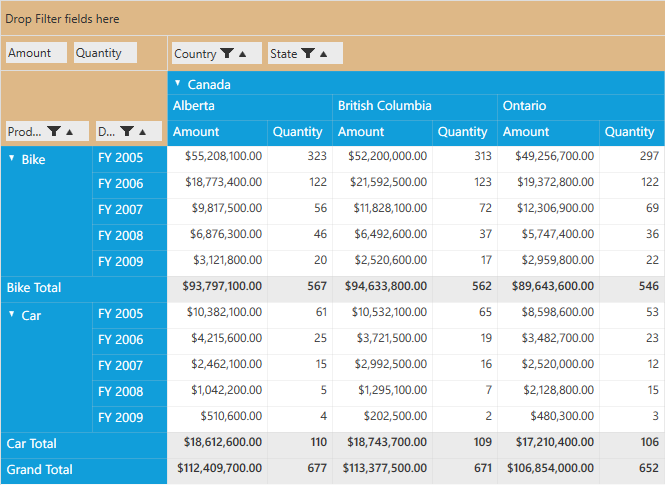

# Defining Grouping Bar Properties for Pivot Grid

The grouping bar allows you to perform sorting, filtering, and summarizing of data the way a user wants at runtime. Each item contains:

* A **caption** string that identifies the fields content.
* A **filter button** that is used to filter the field values.
* A **sort indicator** that identifies the sort order applied to the field's values.
* A **remove button** that is used for removing the corresponding item.

Limitation: Sorting and filtering operations for pivot calculation items are restricted. Similarly, you cannot perform sorting operations for filter items.

The following are the properties available in the grouping bar.

* **Background**: Gets or sets the background color of grouping bar.
* **ItemsBackground**: Gets or sets the background color of items.
* **AllowFiltering**: Gets or sets whether the filtering is enabled or not for the grouping bar.
* **AllowSorting**: Gets or sets whether the sorting of grouping bar is enabled.
* **AllowRemove**: Gets or sets whether deleting the items is enabled in the grouping bar.
* **AllowMultiFunctionalSortFilter**: Gets or sets whether Microsoft Excel like filtering on the grouping bar is enabled.

**Using the properties in pivot grid:**

**Background**

You can customize the background color of the grouping bar by defining the color in its `Background` property after the grouping bar is loaded.

Include the *System.Windows.Media* namespace in the MainWindow.xaml.cs file. After defining the pivot grid control, raise the loaded event of pivot grid. Inside the `PivotGrid_Loaded()` event, raise the loaded event for grouping bar. Inside the `GroupingBar_Loaded()` event, set the value for `Background` property of the grouping bar.



public partial class MainWindow: Window {
    PivotGridControl pivotGrid = new PivotGridControl();
    public MainWindow() {
        InitializeComponent();
        grid1.Children.Add(pivotGrid);
        pivotGrid.ItemSource = ProductSales.GetSalesData();
        PivotItem m_PivotItem = new PivotItem() {
            FieldHeader = "Product", FieldMappingName = "Product", TotalHeader = "Total"
        };
        PivotItem m_PivotItem1 = new PivotItem() {
            FieldHeader = "Date", FieldMappingName = "Date", TotalHeader = "Total"
        };
        PivotItem n_PivotItem = new PivotItem() {
            FieldHeader = "Country", FieldMappingName = "Country", TotalHeader = "Total"
        };
        PivotItem n_PivotItem1 = new PivotItem() {
            FieldHeader = "State", FieldMappingName = "State", TotalHeader = "Total"
        };
        // Adding PivotItem to PivotRows
        pivotGrid.PivotRows.Add(m_PivotItem);
        pivotGrid.PivotRows.Add(m_PivotItem1);
        // Adding PivotItem to PivotColumns
        pivotGrid.PivotColumns.Add(n_PivotItem);
        pivotGrid.PivotColumns.Add(n_PivotItem1);
        PivotComputationInfo m_PivotComputationInfo = new PivotComputationInfo() {
            CalculationName = "Amount", FieldName = "Amount", Format = "C", SummaryType = SummaryType.DoubleTotalSum
        };
        PivotComputationInfo m_PivotComputationInfo1 = new PivotComputationInfo() {
            CalculationName = "Quantity", FieldName = "Quantity", SummaryType = SummaryType.Count
        };
        pivotGrid.PivotCalculations.Add(m_PivotComputationInfo);
        pivotGrid.PivotCalculations.Add(m_PivotComputationInfo1);
        pivotGrid.Loaded += pivotGrid_Loaded;
    }

    void pivotGrid_Loaded(object sender, RoutedEventArgs e) {
        pivotGrid.GroupingBar.Loaded += GroupingBar_Loaded;
    }

    void GroupingBar_Loaded(object sender, RoutedEventArgs e) {
        pivotGrid.GroupingBar.Background = Brushes.BurlyWood;
    }
}



**ItemsBackground**

You can customize the background color of the grouping bar items by defining the color for `ItemsBackground` property after the grouping bar is loaded.

Include the *System.Windows.Media* namespace in the MainWindow.xaml.cs file. After defining the pivot grid control, raise the loaded event of the pivot grid. Inside the `PivotGrid_Loaded()` event, raise the loaded event for grouping bar. Inside the `GroupingBar_Loaded()` event, set the value for the `ItemsBackground` property.



public partial class MainWindow: Window {
    PivotGridControl pivotGrid = new PivotGridControl();
    public MainWindow() {
        InitializeComponent();
        grid1.Children.Add(pivotGrid);
        pivotGrid.ItemSource = ProductSales.GetSalesData();
        PivotItem m_PivotItem = new PivotItem() {
            FieldHeader = "Product", FieldMappingName = "Product", TotalHeader = "Total"
        };
        PivotItem m_PivotItem1 = new PivotItem() {
            FieldHeader = "Date", FieldMappingName = "Date", TotalHeader = "Total"
        };
        PivotItem n_PivotItem = new PivotItem() {
            FieldHeader = "Country", FieldMappingName = "Country", TotalHeader = "Total"
        };
        PivotItem n_PivotItem1 = new PivotItem() {
            FieldHeader = "State", FieldMappingName = "State", TotalHeader = "Total"
        };
        // Adding PivotItem to PivotRows
        pivotGrid.PivotRows.Add(m_PivotItem);
        pivotGrid.PivotRows.Add(m_PivotItem1);
        // Adding PivotItem to PivotColumns
        pivotGrid.PivotColumns.Add(n_PivotItem);
        pivotGrid.PivotColumns.Add(n_PivotItem1);
        PivotComputationInfo m_PivotComputationInfo = new PivotComputationInfo() {
            CalculationName = "Amount", FieldName = "Amount", Format = "C", SummaryType = SummaryType.DoubleTotalSum
        };
        PivotComputationInfo m_PivotComputationInfo1 = new PivotComputationInfo() {
            CalculationName = "Quantity", FieldName = "Quantity", SummaryType = SummaryType.Count
        };
        pivotGrid.PivotCalculations.Add(m_PivotComputationInfo);
        pivotGrid.PivotCalculations.Add(m_PivotComputationInfo1);
        pivotGrid.Loaded += pivotGrid_Loaded;
    }

    void pivotGrid_Loaded(object sender, RoutedEventArgs e) {
        pivotGrid.GroupingBar.Loaded += GroupingBar_Loaded;
    }

    void GroupingBar_Loaded(object sender, RoutedEventArgs e) {
        pivotGrid.GroupingBar.ItemsBackground = Brushes.BurlyWood;
    }
}



**AllowFiltering**

You can show or hide the filtering option in the pivot grid by setting the `AllowFiltering` property.

To do so, define the pivot grid control and raise the loaded event of pivot grid. Inside the `PivotGrid_Loaded()` event, raise the loaded event for grouping bar. Inside the `GroupingBar_Loaded()` event, set a value for the `AllowFiltering` property of the grouping bar.



public partial class MainWindow: Window {
    PivotGridControl pivotGrid = new PivotGridControl();
    public MainWindow() {
        InitializeComponent();
        grid1.Children.Add(pivotGrid);
        pivotGrid.ItemSource = ProductSales.GetSalesData();
        PivotItem m_PivotItem = new PivotItem() {
            FieldHeader = "Product", FieldMappingName = "Product", TotalHeader = "Total"
        };
        PivotItem m_PivotItem1 = new PivotItem() {
            FieldHeader = "Date", FieldMappingName = "Date", TotalHeader = "Total"
        };
        PivotItem n_PivotItem = new PivotItem() {
            FieldHeader = "Country", FieldMappingName = "Country", TotalHeader = "Total"
        };
        PivotItem n_PivotItem1 = new PivotItem() {
            FieldHeader = "State", FieldMappingName = "State", TotalHeader = "Total"
        };
        // Adding PivotItem to PivotRows
        pivotGrid.PivotRows.Add(m_PivotItem);
        pivotGrid.PivotRows.Add(m_PivotItem1);
        // Adding PivotItem to PivotColumns
        pivotGrid.PivotColumns.Add(n_PivotItem);
        pivotGrid.PivotColumns.Add(n_PivotItem1);
        PivotComputationInfo m_PivotComputationInfo = new PivotComputationInfo() {
            CalculationName = "Amount", FieldName = "Amount", Format = "C", SummaryType = SummaryType.DoubleTotalSum
        };
        PivotComputationInfo m_PivotComputationInfo1 = new PivotComputationInfo() {
            CalculationName = "Quantity", FieldName = "Quantity", SummaryType = SummaryType.Count
        };
        pivotGrid.PivotCalculations.Add(m_PivotComputationInfo);
        pivotGrid.PivotCalculations.Add(m_PivotComputationInfo1);
        pivotGrid.Loaded += pivotGrid_Loaded;
    }

    void pivotGrid_Loaded(object sender, RoutedEventArgs e) {
        pivotGrid.GroupingBar.Loaded += GroupingBar_Loaded;
    }

    void GroupingBar_Loaded(object sender, RoutedEventArgs e) {
        pivotGrid.GroupingBar.AllowFiltering = false;
    }
}



The following screenshot shows the pivot grid without the filtering icons.

**AllowSorting**

You can show or hide the sorting indicator in pivot grid by setting the `AllowSorting` property.

To do so, define the pivot grid control and raise the loaded event of pivot grid. Inside the `PivotGrid_Loaded()` event, raise the loaded event for grouping bar. Inside the `GroupingBar_Loaded()` event, set the value for `AllowSorting` property of the grouping bar.



public partial class MainWindow: Window {
    PivotGridControl pivotGrid = new PivotGridControl();
    public MainWindow() {
        InitializeComponent();
        grid1.Children.Add(pivotGrid);
        pivotGrid.ItemSource = ProductSales.GetSalesData();
        PivotItem m_PivotItem = new PivotItem() {
            FieldHeader = "Product", FieldMappingName = "Product", TotalHeader = "Total"
        };
        PivotItem m_PivotItem1 = new PivotItem() {
            FieldHeader = "Date", FieldMappingName = "Date", TotalHeader = "Total"
        };
        PivotItem n_PivotItem = new PivotItem() {
            FieldHeader = "Country", FieldMappingName = "Country", TotalHeader = "Total"
        };
        PivotItem n_PivotItem1 = new PivotItem() {
            FieldHeader = "State", FieldMappingName = "State", TotalHeader = "Total"
        };
        // Adding PivotItem to PivotRows
        pivotGrid.PivotRows.Add(m_PivotItem);
        pivotGrid.PivotRows.Add(m_PivotItem1);
        // Adding PivotItem to PivotColumns
        pivotGrid.PivotColumns.Add(n_PivotItem);
        pivotGrid.PivotColumns.Add(n_PivotItem1);
        PivotComputationInfo m_PivotComputationInfo = new PivotComputationInfo() {
            CalculationName = "Amount", FieldName = "Amount", Format = "C", SummaryType = SummaryType.DoubleTotalSum
        };
        PivotComputationInfo m_PivotComputationInfo1 = new PivotComputationInfo() {
            CalculationName = "Quantity", FieldName = "Quantity", SummaryType = SummaryType.Count
        };
        pivotGrid.PivotCalculations.Add(m_PivotComputationInfo);
        pivotGrid.PivotCalculations.Add(m_PivotComputationInfo1);
        pivotGrid.Loaded += pivotGrid_Loaded;
    }

    void pivotGrid_Loaded(object sender, RoutedEventArgs e) {
        pivotGrid.GroupingBar.Loaded += GroupingBar_Loaded;
    }

    void GroupingBar_Loaded(object sender, RoutedEventArgs e) {
        pivotGrid.GroupingBar.AllowSorting = false;
    }
}



The following screenshots shows the pivot grid without the sorting icons.

**AllowRemove**

You can show or hide the remove icon in pivot grid by setting the `AllowRemove` property.

To do so, define the pivot grid control and raise the loaded event of pivot grid. Inside the `PivotGrid_Loaded()` event, raise the loaded event for grouping bar. Inside the `GroupingBar_Loaded()` event, set a value for the `AllowRemove` property of the grouping bar.



public partial class MainWindow: Window {
    PivotGridControl pivotGrid = new PivotGridControl();
    public MainWindow() {
        InitializeComponent();
        grid1.Children.Add(pivotGrid);
        pivotGrid.ItemSource = ProductSales.GetSalesData();
        PivotItem m_PivotItem = new PivotItem() {
            FieldHeader = "Product", FieldMappingName = "Product", TotalHeader = "Total"
        };
        PivotItem m_PivotItem1 = new PivotItem() {
            FieldHeader = "Date", FieldMappingName = "Date", TotalHeader = "Total"
        };
        PivotItem n_PivotItem = new PivotItem() {
            FieldHeader = "Country", FieldMappingName = "Country", TotalHeader = "Total"
        };
        PivotItem n_PivotItem1 = new PivotItem() {
            FieldHeader = "State", FieldMappingName = "State", TotalHeader = "Total"
        };
        // Adding PivotItem to PivotRows
        pivotGrid.PivotRows.Add(m_PivotItem);
        pivotGrid.PivotRows.Add(m_PivotItem1);
        // Adding PivotItem to PivotColumns
        pivotGrid.PivotColumns.Add(n_PivotItem);
        pivotGrid.PivotColumns.Add(n_PivotItem1);
        PivotComputationInfo m_PivotComputationInfo = new PivotComputationInfo() {
            CalculationName = "Amount", FieldName = "Amount", Format = "C", SummaryType = SummaryType.DoubleTotalSum
        };
        PivotComputationInfo m_PivotComputationInfo1 = new PivotComputationInfo() {
            CalculationName = "Quantity", FieldName = "Quantity", SummaryType = SummaryType.Count
        };
        pivotGrid.PivotCalculations.Add(m_PivotComputationInfo);
        pivotGrid.PivotCalculations.Add(m_PivotComputationInfo1);
        pivotGrid.Loaded += pivotGrid_Loaded;
    }

    void pivotGrid_Loaded(object sender, RoutedEventArgs e) {
        pivotGrid.GroupingBar.Loaded += GroupingBar_Loaded;
    }

    void GroupingBar_Loaded(object sender, RoutedEventArgs e) {
        pivotGrid.GroupingBar.AllowRemove = false;
    }
}



The following screenshot shows the pivot grid with remove, filter, and sort icons.

