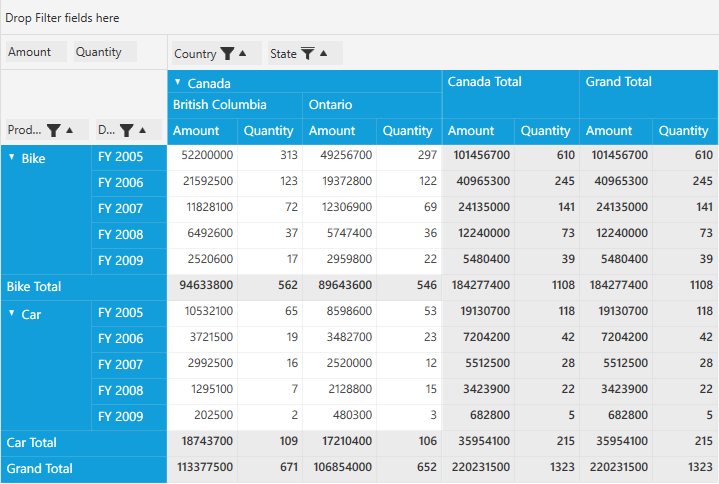

# Excel-Like Filtering in WPF Pivot Grid

The pivot grid control provides Excel-like sorting and filtering features applied to a pivot item. You can enable or disable the Excel-like sorting and filtering pop-up in the pivot grid by setting the `AllowMultiFunctionalSortFilter` property of grouping bar in the pivot grid control.

To do so, define the pivot grid control and raise the loaded event for pivot grid. Inside the `PivotGrid_Loaded()` event, raise the loaded event for the grouping bar. Inside the `GroupingBar_Loaded()` event, set the value of the `AllowMultiFunctionalSortFilter` property to "true".

Refer to the following code sample.



public partial class MainWindow: Window {
    PivotGridControl pivotGrid = new PivotGridControl();
    public MainWindow() {
        InitializeComponent();
        grid1.Children.Add(pivotGrid);
        pivotGrid.ItemSource = ProductSales.GetSalesData();
        PivotItem m_PivotItem = new PivotItem() {
            FieldHeader = "Product", FieldMappingName = "Product", TotalHeader = "Total"
        };
        PivotItem m_PivotItem1 = new PivotItem() {
            FieldHeader = "Date", FieldMappingName = "Date", TotalHeader = "Total"
        };
        PivotItem n_PivotItem = new PivotItem() {
            FieldHeader = "Country", FieldMappingName = "Country", TotalHeader = "Total"
        };
        PivotItem n_PivotItem1 = new PivotItem() {
            FieldHeader = "State", FieldMappingName = "State", TotalHeader = "Total"
        };
        // Adding PivotItem to PivotRows
        pivotGrid.PivotRows.Add(m_PivotItem);
        pivotGrid.PivotRows.Add(m_PivotItem1);
        // Adding PivotItem to PivotColumns
        pivotGrid.PivotColumns.Add(n_PivotItem);
        pivotGrid.PivotColumns.Add(n_PivotItem1);
        PivotComputationInfo m_PivotComputationInfo = new PivotComputationInfo() {
            CalculationName = "Amount", FieldName = "Amount", Format = "C", SummaryType = SummaryType.DoubleTotalSum
        };
        PivotComputationInfo m_PivotComputationInfo1 = new PivotComputationInfo() {
            CalculationName = "Quantity", FieldName = "Quantity", SummaryType = SummaryType.Count
        };
        pivotGrid.PivotCalculations.Add(m_PivotComputationInfo);
        pivotGrid.PivotCalculations.Add(m_PivotComputationInfo1);
        pivotGrid.Loaded += pivotGrid_Loaded;
    }

    void pivotGrid_Loaded(object sender, RoutedEventArgs e) {
        pivotGrid.GroupingBar.Loaded += GroupingBar_Loaded;
    }

    void GroupingBar_Loaded(object sender, RoutedEventArgs e) {
        pivotGrid.GroupingBar.AllowMultiFunctionalSortFilter = true;
    }
}



## Various features of MultiFunctional pop-up

**Sort A to Z**

It can be used to sort the corresponding pivot item in the ascending order.

**Sort Z to A**

It can be used to sort the corresponding pivot item in the descending order.

**Clear filters**

The clear filters are used to clear all filter changes applied to the corresponding pivot item and bring back the pivot grid to the normal state.

**Label filters**

The label filters are used to filter the pivot item filter labels of the pivot grid by using the following various options.

* Equals
* Does not equals
* Greater than
* Greater than or equal to
* Less than
* Less than or equal to
* Begins with
* Does not begins with
* Ends with
* Does not ends with
* Contains
* Does not contains
* Between
* Not between

_Label Filter window for filtering "Alberta" in State_

**Value filters**

The value filters are used to filter the pivot item field values of the pivot grid by using the following various options.

* Equals
* Does not equals
* Greater than
* Greater than or equal to
* Less than
* Less than or equal to
* Between
* Not between
* Top 10

_Value Filter window for filtering "Alberta" using its Quantity value "677" in State_

_PivotGrid with Label Filter or Value Filter applied_
