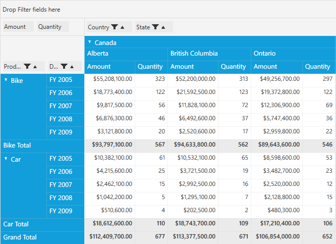

# Grouping Bar in WPF Pivot Grid

Grouping bar allows you to slice and dice the fields between column, row, value, and filter. This allows you to add, rearrange, or remove the fields to show data in the pivot grid as desired. It consists of the following areas:

* Filter header area: Holds the filter items of the pivot grid control.
* Data header area: Holds the pivot calculation items of the pivot grid control.
* Column header area: Holds the pivot column items of the pivot grid control.
* Row header area: Holds the pivot row items of the pivot grid control.

By default, the grouping bar is enabled in the pivot grid control. You can show or hide it by using the `ShowGroupingBar` property. It can be done both in XAML and code-behind.

For XAML, refer to the following code sample.



    <Window xmlns="http://schemas.microsoft.com/winfx/2006/xaml/presentation" xmlns:x="http://schemas.microsoft.com/winfx/2006/xaml" syncfusion:SkinStorage.VisualStyle="Metro" xmlns:syncfusion="http://schemas.syncfusion.com/wpf" x:Class="WpfApplication1.MainWindow" Title="MainWindow" Height="350" Width="525" xmlns:local="clr-namespace:WpfApplication1">
        <Window.Resources>
            <ResourceDictionary>
                <ObjectDataProvider x:Key="data" ObjectType="{x:Type local:ProductSales}" MethodName="GetSalesData" />
            </ResourceDictionary>
        </Window.Resources>
        <Grid Name="grid1">
            <syncfusion:PivotGridControl HorizontalAlignment="Left" Name="pivotGrid" VerticalAlignment="Top" ShowGroupingBar="True" ItemSource="{Binding   Source={StaticResource data}}">
            </syncfusion:PivotGridControl>
        </Grid>
    </Window>



For code-behind, refer to the following code sample.



public partial class MainWindow: Window {
    public MainWindow() {
        InitializeComponent();
        this.Loaded += MainWindow_Loaded;
    }

    void MainWindow_Loaded(object sender, RoutedEventArgs e) {
        PivotGridControl pivotGrid = new PivotGridControl();
        grid1.Children.Add(pivotGrid);
        pivotGrid.ItemSource = ProductSales.GetSalesData();
        pivotGrid.ShowGroupingBar = true;
    }
}



_PivotGrid with Grouping Bar_

_PivotGrid without Grouping Bar_
