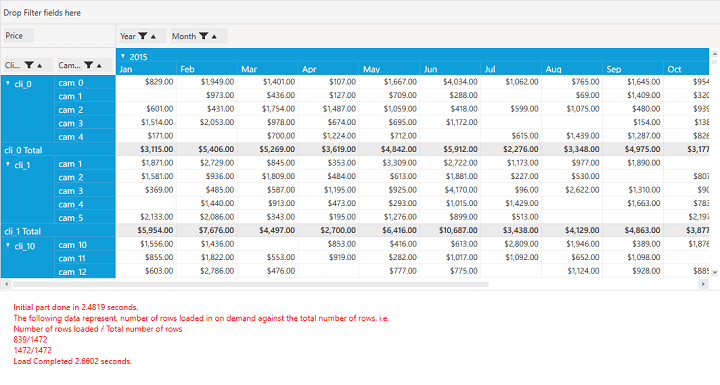

# Virtualized Binding (Performance Improvement) in WPF Pivot Grid

It provides high loading performance for a large set of records. This feature helps to load data in the pivot grid on-demand using the **Index Engine**.

* **UseIndexedEngine**: Gets or sets whether an optimized algorithm that relies on indexing the raw data should be used to compute the pivot information.
* **EnableOnDemandCalculations**: Gets or sets whether the calculations are postponed until the value is requested through the indexer in the PivotEngine.

To achieve this, after defining the pivot grid control, set the `EnableOnDemandCalculations` and `UseIndexedEngine` properties of PivotEngine to true. The values for IndexEngine can be obtained by using the `ItemObjectLookup()` method and the time span should be calculated by using the `Dispatcher.BeginInvoke()` method. Refer to the following code sample.



    public partial class MainWindow : Window
    {
        DateTime _startIndex = DateTime.Now;
        public MainWindow()
        {
            InitializeComponent();
            pivotGrid.PivotEngine.EnableOnDemandCalculations =
                    pivotGrid.PivotEngine.UseIndexedEngine = true;
                pivotGrid.PivotEngine.GetValue = ItemObjectLookup;
               ObservableCollection<ItemObject> itemsSourceObject =
                    (pivotGrid.DataContext as ViewModel.ViewModel).ItemObjectCollection;
                pivotGrid.PivotEngine.PivotSchemaChanged +=
                    PivotEngine_PivotSchemaChanged;
                pivotGrid.ItemSource = itemsSourceObject;
        }

        private void PivotEngine_PivotSchemaChanged(object sender, PivotSchemaChangedArgs e)
        {
            _startIndex = DateTime.Now;
           ScrollViewer _scrollViewer = e.OriginalSource as ScrollViewer;
            pivotGrid.Dispatcher.BeginInvoke(DispatcherPriority.SystemIdle, new Action(() =>
                {
                    if (!pivotGrid.IgnoreRefresh)
                    {
                        if ((_scrollViewer.Content as TextBlock) != null)
                            && (__scrollViewer.Content as TextBlock).Text = string.Empty);

                        CheckTime(_startIndex, "Initial part done in");
                        ContinueLoadingAsynchonolously(
                            pivotGrid.PivotEngine.IndexEngine, _startIndex);
                    }
                }));
        }

        private void ContinueLoadingAsynchonolously(IndexEngine engine, DateTime startIndex)
        {
            pivotGrid.Dispatcher.BeginInvoke(new Action(() =>
                {
                    if (engine != null && engine.HighRowLevel < engine.RowCount - 1)
                    {
                        int cutOff = Math.Min(engine.HighRowLevel + 800, engine.RowCount - 1);
                        object o = engine[cutOff, 0]; ////Gets 800 more rows from the pivot engine (on demand calculation).
                        if ((_scrollViewer.Content as TextBlock) != null)
                        {
                            (_scrollViewer.Content as TextBlock).Text +=
                                string.Format("\n{0}/{1}", engine.HighRowLevel, engine.RowCount - 1);
                            ContinueLoadingAsynchonolously(engine, startIndex); //Recursive call to update the rows of the PivotEngine until they reach high row level.
                        }
                    }
                    else
                    {
                        CheckTime(startIndex, "Load Completed");
                    }
                }), DispatcherPriority.SystemIdle);
        }

        private void CheckTime(DateTime start, string label)
        {
            if (_textBlock != null)
                _textBlock.Text += string.Format("\n{0} {1:0.0000} seconds.", label,
                                                 DateTime.Now.Subtract(start).TotalSeconds);
        }

        public IComparable ItemObjectLookup(object o, string name)
        {
            IComparable c = null;
            var io = o as ItemObject;
            if (io != null)
            {
                switch (name)
                {
                    case "Date":
                        c = io.Date;
                        break;
                    case "Client":
                        c = io.Client;
                        break;
                    case "Campaign":
                        c = io.Campaign;
                        break;
                    case "Color":
                        c = io.Color;
                        break;
                    case "Shape":
                        c = io.Shape;
                        break;
                    case "Price":
                        c = io.Price;
                        break;
                    case "Spend":
                        c = io.Spend;
                        break;
                    case "ColH":
                        c = io.ColH;
                        break;
                    case "ColI":
                        c = io.ColI;
                        break;
                    case "ColJ":
                        c = io.ColJ;
                        break;
                }
            }
            return c;
        }
    }



N> You can refer to our [WPF Pivot Grid](https://www.syncfusion.com/wpf-controls/pivot-grid) feature tour page for its groundbreaking feature representations. You can also explore our [WPF Pivot Grid example](https://github.com/syncfusion/wpf-demos) to knows how to organizes and summarizes business data and displays the result in a cross-table format.