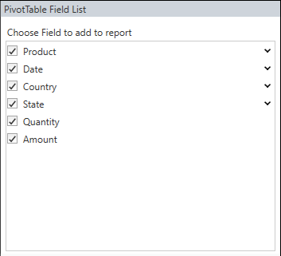
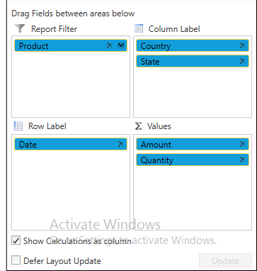
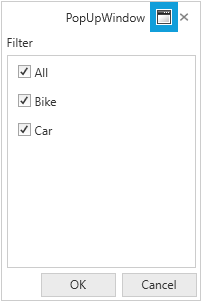

# About Syncfusion WPF PivotSchemaDesigner Control

The pivot schema designer can be supported in the Pivot Grid, so that it can be presented like an **ExcelPivotTable**. By using the pivot schema designer, you can add, rearrange, or remove fields to show data in the control exactly the way you want. It contains two sections, consisting of the following items:

* A **field section** at the top is used for adding and removing fields from the Pivot Grid.
* A **layout section** at the bottom is used for rearranging and repositioning the fields in the Pivot Grid.

## Fields section

The **Fields section** consists of a list of fields present in the Pivot Grid including row, column, and summary elements, which is called as **PivotTable Field List**. A field will be added to the control if it is checked, or it will be removed if it is unchecked. By default, fields will be added to the row label if checked, and added to the column label by simply dragging the field to the column label area. The filtering process is also supported in the pivot table field list. Filter pop-up will be opened while clicking the expander icon in the right-corner of each pivot table field list items.

## Layout section

The layout section is used to rearrange and reposition the fields in the Pivot Grid. It has the following areas:

* Report filter
* Column label
* Row label
* Values

### Report filter

The report filter is used to filter the entire report based on the selected item in the report filter. The report filter pop-up window can be launched by clicking the expander icon available in the right-corner of each filter item.

### Column label

The column label is used to display fields as columns at the top of a report. A column at the lower position is nested within another column positioned immediately above it in the Pivot Grid.

### Row label

Row label is used to display fields as rows at the top of a report. A row at the lower position is nested within another row positioned immediately above it in the Pivot Grid.

### Values

The values section is used to display the summary fields of the Pivot Grid.

N> You can refer to our [WPF Pivot Grid](https://www.syncfusion.com/wpf-controls/pivot-grid) feature tour page for its groundbreaking feature representations. You can also explore our [WPF Pivot Grid example](https://github.com/syncfusion/wpf-demos) to knows how to organizes and summarizes business data and displays the result in a cross-table format.