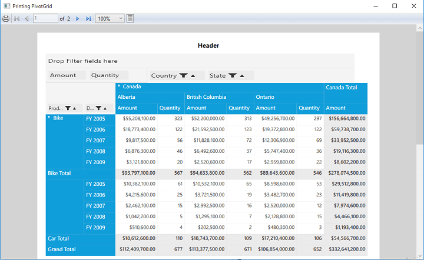

# Printing in WPF Pivot Grid

The printing support for pivot grid control is provided along with grouping bar. You can use the `ShowPrintPreview` method to preview the pivot grid control before printing. The `PrintHeader` and `PrintFooter` properties are used to add or remove the header and footer information while printing.

**Defining header and footer in XAML**

After defining the pivot grid control, define the DataTemplate for header and footer and set the `PrintHeader` and `PrintFooter` properties of the pivot grid control.

Refer to the following code sample to learn about the header template, footer template, and setting its properties in the pivot grid control.



    <Window.Resources>
        <ResourceDictionary>
            <ObjectDataProvider x:Key="data" ObjectType="{x:Type local:ProductSales}" MethodName="GetSalesData" />
            <!--Creating Template for Header -->
            <DataTemplate x:Key="HeaderTemplate">
                <Grid Height="30">
                    <TextBlock Text="Header" FontSize="15" FontWeight="Bold" HorizontalAlignment="Center"></TextBlock>
                </Grid>
            </DataTemplate>
            <!--Creating Template for Footer -->
            <DataTemplate x:Key="FooterTemplate">
                <Grid Height="30">
                    <TextBlock Text="Footer" FontSize="15" FontWeight="Bold" HorizontalAlignment="Center"></TextBlock>
                </Grid>
            </DataTemplate>
        </ResourceDictionary>
    </Window.Resources>
    <Grid Name="grid1">
        <syncfusion:PivotGridControl HorizontalAlignment="Left" Name="pivotGrid" VerticalAlignment="Top" VisualStyle="Metro" syncfusion:PrintSettings.PrintHeader="True" syncfusion:PrintSettings.PrintFooter="True" ItemSource="{Binding   Source={StaticResource data}}">

            <syncfusion:PivotGridControl.PivotRows>
                <syncfusion:PivotItem FieldHeader="Product" FieldMappingName="Product" TotalHeader="Total" />
                <syncfusion:PivotItem FieldHeader="Date" FieldMappingName="Date" TotalHeader="Total" />
            </syncfusion:PivotGridControl.PivotRows>
            <syncfusion:PivotGridControl.PivotColumns>
                <syncfusion:PivotItem FieldHeader="Country" FieldMappingName="Country" TotalHeader="Total" />
                <syncfusion:PivotItem FieldHeader="State" FieldMappingName="State" TotalHeader="Total" />
            </syncfusion:PivotGridControl.PivotColumns>
            <syncfusion:PivotGridControl.PivotCalculations>
                <syncfusion:PivotComputationInfo CalculationName="Total" FieldName="Amount" Format="C" SummaryType="DoubleTotalSum" />
                <syncfusion:PivotComputationInfo CalculationName="Total" FieldName="Quantity" SummaryType="Count" />
            </syncfusion:PivotGridControl.PivotCalculations>
        </syncfusion:PivotGridControl>
    </Grid>



**Invoking print preview window in pivot grid**

After defining the pivot grid control, raise the loaded event of pivot grid. Inside the `pivotGrid_Loaded` event, invoke the `ShowPrintPreview` method to enable the printing behavior.



public partial class MainWindow: Window {
    public MainWindow() {
        InitializeComponent();
        this.pivotGrid.Loaded += pivotGrid_Loaded;
    }

    void pivotGrid_Loaded(object sender, RoutedEventArgs e) {
        //Shows the Print Preview window with templates for header, footer and with user defined title.
        this.pivotGrid.ShowPrintPreview((DataTemplate) this.Resources["HeaderTemplate"], (DataTemplate) this.Resources["FooterTemplate"], "Printing PivotGrid", this);

        //Shows the Print Preview window with empty template and default title.
        this.pivotGrid.ShowPrintPreview(this);

        //Shows the Print Preview window with templates for header, footer and with default title.
        this.pivotGrid.ShowPrintPreview((DataTemplate) this.Resources["HeaderTemplate"], (DataTemplate) this.Resources["FooterTemplate"], this);
    }
}



## Print preview options

The print preview window provides the following options:

* Zooming
* Page settings
* Print

**Zooming**

Click the **Zoom** drop-down button in the print preview window and select the desired percentage to magnify the pivot grid view. You can choose from various preset zoom level options such as 50%, 100%, 200% or 400%.

**Page settings**

Click the **PageSettings** in the print preview window to change the pages while printing.

**Print**

Click the **Print** in the print preview window to print the pivot grid content.

N> You can refer to our [WPF Pivot Grid](https://www.syncfusion.com/wpf-controls/pivot-grid) feature tour page for its groundbreaking feature representations. You can also explore our [WPF Pivot Grid example](https://github.com/syncfusion/wpf-demos) to knows how to organizes and summarizes business data and displays the result in a cross-table format.