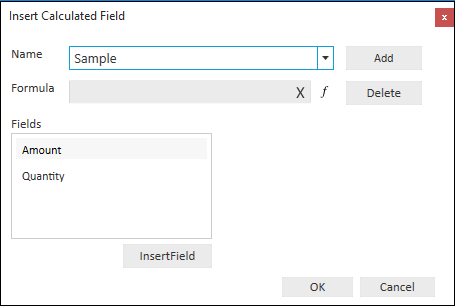
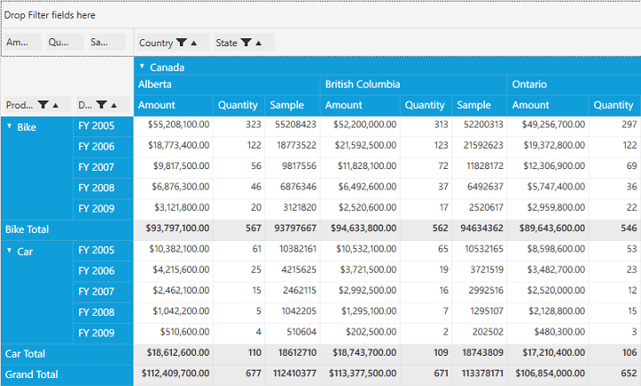

# Calculated Field in WPF Pivot Grid

The pivot grid inserts a new calculated field based on the existing calculated items using the calculated field window. This option is available as a menu item in the grouping bar context menu.

**Inserting a new calculated field in pivot grid**

To insert a new calculated field, open the calculated field window using the grouping bar context menu. Then, define a **Name** for the new calculated field.

_Defining Name for the Calculated Field_

Note that, the **Formula** can be entered by inserting calculation fields through the **Fields** section. For inserting numerical operator, you can use the formula pop-up as shown in the following screenshot.

_Entering Formula for the Calculated Field_

Click **Add** to add the calculated field and **OK** to populate the pivot grid control.

_PivotGrid with newly added Calculated Field_
