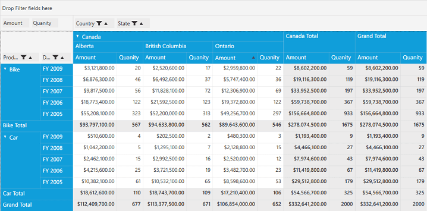

# Sorting by Values

Sorting-by-Values provides the following sort options:

* Sort all the columns.
* Sort all columns other than total and grand total columns.
* Sort only total columns.
* Sort only grand total columns.
* Disable the sort.

**Properties:**

* **SortDirection**: Gets or sets the sort order to ascending or descending.
* **SortOption**: Gets or sets the sorting option as all, none, column sorting, total sorting, or grand total sorting.

The **SortOption** property of pivot grid control can be defined both in XAML and code-behind. Refer to the following code sample and screenshots.



    <Grid>
        <syncfusion:PivotGridControl HorizontalAlignment="Left" Name="pivotGrid" VerticalAlignment="Top" SortOption=”All "    ItemSource="{Binding Source={StaticResource data}} " >

            <syncfusion:PivotGridControl.PivotRows>
                    <syncfusion:PivotItem FieldHeader="Product " FieldMappingName="Product " TotalHeader="Total " />
                    <syncfusion:PivotItem FieldHeader="Date " FieldMappingName="Date " TotalHeader="Total "/>
                </syncfusion:PivotGridControl.PivotRows>
                <syncfusion:PivotGridControl.PivotColumns>
                    <syncfusion:PivotItem FieldHeader="Country " FieldMappingName="Country " TotalHeader="Total " />
                    <syncfusion:PivotItem FieldHeader="State " FieldMappingName="State " TotalHeader="Total "/>
                </syncfusion:PivotGridControl.PivotColumns>
                <syncfusion:PivotGridControl.PivotCalculations>
                    <syncfusion:PivotComputationInfo CalculationName = "Total " FieldName = "Amount " Format="C " SummaryType="DoubleTotalSum "/>
                    <syncfusion:PivotComputationInfo CalculationName = "Total " FieldName = "Quantity " SummaryType="Count "/>
                </syncfusion:PivotGridControl.PivotCalculations>
        </syncfusion:PivotGridControl>
    </Grid>





public partial class MainWindow: Window {
    PivotGridControl pivotGrid = new PivotGridControl();
    public MainWindow() {
        InitializeComponent();
        grid1.Children.Add(pivotGrid);
        pivotGrid.ItemSource = ProductSales.GetSalesData();
        PivotItem m_PivotItem = new PivotItem() {
            FieldHeader = "Product", FieldMappingName = "Product", TotalHeader = "Total"
        };
        PivotItem m_PivotItem1 = new PivotItem() {
            FieldHeader = "Date", FieldMappingName = "Date", TotalHeader = "Total"
        };
        PivotItem n_PivotItem = new PivotItem() {
            FieldHeader = "Country", FieldMappingName = "Country", TotalHeader = "Total"
        };
        PivotItem n_PivotItem1 = new PivotItem() {
            FieldHeader = "State", FieldMappingName = "State", TotalHeader = "Total"
        };
        // Adding PivotItem to PivotRows
        pivotGrid.PivotRows.Add(m_PivotItem);
        pivotGrid.PivotRows.Add(m_PivotItem1);
        // Adding PivotItem to PivotColumns
        pivotGrid.PivotColumns.Add(n_PivotItem);
        pivotGrid.PivotColumns.Add(n_PivotItem1);
        PivotComputationInfo m_PivotComputationInfo = new PivotComputationInfo() {
            CalculationName = "Amount", FieldName = "Amount", Format = "C", SummaryType = SummaryType.DoubleTotalSum
        };
        PivotComputationInfo m_PivotComputationInfo1 = new PivotComputationInfo() {
            CalculationName = "Quantity", FieldName = "Quantity", SummaryType = SummaryType.Count
        };
        pivotGrid.PivotCalculations.Add(m_PivotComputationInfo);
        pivotGrid.PivotCalculations.Add(m_PivotComputationInfo1);

        this.pivotGrid.SortOption = PivotSortOption.All;
    }
}



## Sorting all the value columns

**All** is used to enable sorting for all the value columns of pivot grid.

## Sorting all columns other than total and grand total columns

**ColumnSorting** is used to enable sorting for all the value columns other than subtotal and grand total of the pivot grid.

## Sorting only subtotal columns

**TotalSorting** is used to enable sorting only for the subtotal columns of pivot grid.

## Sorting only grand total columns

**GrandTotalSorting** is used to enable sorting only for the grand total columns of the pivot grid.

## Disable sorting

**None** is the default option and it disables sorting on all the value columns of pivot grid.

## Multi-column sorting

Please [click here](http://help.syncfusion.com/wpf/pivotgrid/multi-column-sorting#multi-column-sorting-in-normal-mode-of-pivotgrid-control) for more details.