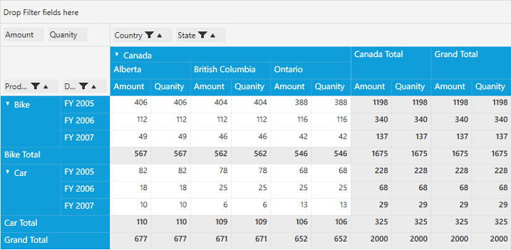

# Sorting in WPF Pivot Grid Control

Sorting enables you to quickly visualize, understand, organize, and find data that you want. By default, the pivot grid holds built-in comparers for all data types so that it will populate data in ascending/descending order according to its data type. You can also define your own custom comparer to view the data.

**Sorting using custom comparer**

Sorting the data with your own custom comparer can be achieved by defining the custom comparer and initializing its instance to the `Comparer` property of the corresponding PivotItem.

For example, a custom `ReverseOrderComparer` is defined for the PivotItem. Find the following appropriate code sample.



// ReverseOrderComparer for descending sort order.
public class ReverseOrderComparer: IComparer
{
    public int Compare(object x, object y)
    {
        if (x == null && y == null)
            return 0;
        else if (y == null)
            return 1;
        else if (x == null)
            return -1;
        else
            return -x.ToString().CompareTo(y.ToString());
    }
}



To apply this comparer to PivotItem, an instance for the `ReverseOrderComparer` is created and assigned it to the `Comparer` property of the *Product* PivotItem. Refer to the following code sample.



public MainWindow()
{
    InitializeComponent();
    this.Loaded += MainWindow_Loaded;
}

void MainWindow_Loaded(object sender, RoutedEventArgs e)
{
    PivotGridControl pivotGrid = new PivotGridControl();
    grid1.Children.Add(pivotGrid);
    PivotItem m_PivotItem = new PivotItem() {
        FieldHeader = "Product", FieldMappingName = "Product", TotalHeader = "Total", Comparer = new ReverseOrderComparer()
    };
    PivotItem m_PivotItem1 = new PivotItem() {
        FieldHeader = "Date", FieldMappingName = "Date", TotalHeader = "Total"
    };
    PivotItem n_PivotItem = new PivotItem() {
        FieldHeader = "Country", FieldMappingName = "Country", TotalHeader = "Total"
    };
    PivotItem n_PivotItem1 = new PivotItem() {
        FieldHeader = "State", FieldMappingName = "State", TotalHeader = "Total"
    };
    // Adding PivotItem to PivotRows
    pivotGrid.PivotRows.Add(m_PivotItem);
    pivotGrid.PivotRows.Add(m_PivotItem1);
    // Adding PivotItem to PivotColumns
    pivotGrid.PivotColumns.Add(n_PivotItem);
    pivotGrid.PivotColumns.Add(n_PivotItem1);
    PivotComputationInfo m_PivotComputationInfo = new PivotComputationInfo() {
        CalculationName = "Amount", FieldName = "Amount", SummaryType = SummaryType.Count
    };
    PivotComputationInfo m_PivotComputationInfo1 = new PivotComputationInfo() {
        CalculationName = "Quantity", FieldName = "Quantity", SummaryType = SummaryType.Count
    };
    pivotGrid.PivotCalculations.Add(m_PivotComputationInfo);
    pivotGrid.PivotCalculations.Add(m_PivotComputationInfo1);
    pivotGrid.ItemSource = ProductSales.GetSalesData();
}



_PivotGrid without ReverseOrderComparer_

_PivotGrid with ReverseOrderComparer_

N> You can refer to our [WPF Pivot Grid](https://www.syncfusion.com/wpf-controls/pivot-grid) feature tour page for its groundbreaking feature representations. You can also explore our [WPF Pivot Grid example](https://github.com/syncfusion/wpf-demos) to knows how to organizes and summarizes business data and displays the result in a cross-table format.