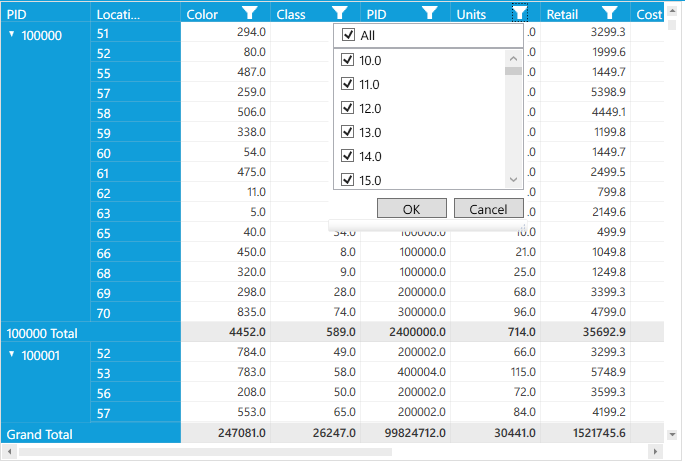

# Column Filtering

PivotGrid allows you to restrict the display of records by using a mechanism called filter. A filter enables you to extract a subset of records that meet certain criteria.

Property

* **AllowFilter** - Specifies whether the PivotGridControl allows to set a filter on the Calculation column.

Method

* **ApplySavedValueFilter** - When RowPivotsOnly is true, this method filters the values in computation columns using the information passed in the dictionary.

It is possible to do filtering operations for PivotCalculation during run-time as well as during initial load.

To do so, define the PivotGrid control in RowPivotsOnly mode. Add the respective PivotCalculations as per your requirement and set the `AllowFilter` property to "true".

Create the dictionary using `Dictionary` class and add the PivotItems which are to be filtered. Invoke the `ApplySavedValueFilter()` method for applying filters.

Refer to the following code sample.



    public partial class MainWindow : Window
    {
        public MainWindow()
        {
            InitializeComponent();
            pivotGrid.Loaded += pivotGrid_Loaded;
        }

      void pivotGrid1_Loaded(object sender, RoutedEventArgs e)
      {
        pivotGrid.PivotCalculations.Add(new PivotComputationInfo(){FieldName ="Cost", FieldHeader = "Cost", AllowFilter = true });
        Dictionary<string,HashSet<string>>  dictionary = new Dictionary<string,HashSet<string>>();
        dictionary.Add("Cost", new HashSet<string>(){"701","230"});
        pivotGrid.InternalGrid.ApplySavedValueFilter(dictionary);
      }
    }



