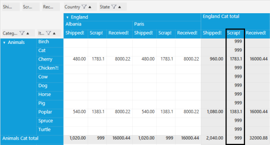

# Concepts

## PivotItem

A pivot item is an item in a PivotTable field. PivotItem provides the information needed to define a pivot item for either a row or column 
pivot. It consists of the following fields.

_Property Table_

<table>
<tr>
<th>
Property Name</th><th>
Description</th><th>
Type</th><th>
Value it Accepts</th><th>
Reference link</th></tr>
<tr>
<td>
Comparer</td><td>
Gets or sets the IComparer object used for sorting. If this value is null, then sorting will be performed under the assumption that this 
field is IComparable.</td><td>
IComparer</td><td>
-</td><td>
-</td></tr>
<tr>
<td>
FieldHeader</td><td>
Gets or sets the title you want to see in the header for this pivot item.</td><td>
string</td><td>
-</td><td>
-</td></tr>
<tr>
<td>
FieldMappingName</td><td>
Gets or sets the property's mapping name.</td><td>
string</td><td>
-</td><td>
-</td></tr>
<tr>
<td>
Format</td><td>
Gets or sets the format item for the specified field.</td><td>
string</td><td>
-</td><td>
-</td></tr>
<tr>
<td>
TotalHeader</td><td>
Gets or sets the string you want appended to the pivot item's summary cells.</td><td>
string</td><td>
-</td><td>
-</td></tr>
</table> 

### Defining PivotItem in XAML and Code-Behind

PivotItem can be defined in XAML or in code-behind.

 

 [XAML]

  <!--Defining Pivot Rows-->

  <syncfusion:PivotGridControl.PivotRows>

     <!--Adding PivotItem to PivotRows-->

     <syncfusion:PivotItem FieldMappingName="Product" FieldHeader="Product" 

     TotalHeader="Total"/>                    

  </syncfusion:PivotGridControl.PivotRows> 



or

  

[C#]

// Defining PivotItem

PivotItem m_PivotItem = new PivotItem() { FieldHeader="Product", FieldMappingName ="Product", TotalHeader ="Total" };            

// Adding PivotItem to PivotRows

this.PivotGridControl1.PivotRows.Add(m_PivotItem);

 

 

[VB]

' Defining PivotItem

Dim m_PivotItem As PivotItem = New PivotItem() With {.FieldHeader="Product", .FieldMappingName ="Product", .TotalHeader ="Total"}

' Adding PivotItem to PivotRows

Me.PivotGridControl1.PivotRows.Add(m_PivotItem)

 

### Sorting Using PivotItem

By default, PivotGrid will sort data in ascending order. The sorting order can be changed using the Comparer field of PivotItem.



[C#]

// Adding Pivot Rows to Grid with FieldMappingName, TotalHeader and Comparer

this.PivotGridControl1.PivotRows.Add(new PivotItem { FieldMappingName = "Product", TotalHeader = "Total", Comparer = new ReverseOrderComparer() });

/// 

/// Reverse Order Comparer for Descending sort order

/// 

public class ReverseOrderComparer : IComparer

{

   #region IComparer Members

   public int Compare(object x, object y)

   {

      if (x == null && y == null)

        return 0;

      else if (y == null)

        return 1;

      else if (x == null)

        return -1;

      else

        return -x.ToString().CompareTo(y.ToString());

   }

   #endregion  

}

   

 

[VB]

' Adding Pivot Rows to Grid with FieldMappingName, TotalHeader and Comparer

Me.PivotGridControl1.PivotRows.Add(New PivotItem With {.FieldMappingName = "Product", .TotalHeader = "Total", .Comparer = New ReverseOrderComparer()})

''' 

''' Reverse Order Comparer for Descending sort order

''' 

public class ReverseOrderComparer : IComparer

'   #Region "IComparer Members"

   public Integer Compare(Object x, Object y)

If x Is Nothing AndAlso y Is Nothing Then

Return 0

ElseIf y Is Nothing Then

Return 1

ElseIf x Is Nothing Then

Return -1

Else

Return -x.ToString().CompareTo(y.ToString())

End If

'   #End Region  

 

## PivotComputationInfo

This class holds the information needed for calculations that appear in a PivotGrid. For each calculation, there is an associated 
PivotComputationInfo object that is added to the PivotCalculations collection. The properties available in PivotComputationInfo are as follows.

_Properties Table_

<table>
<tr>
<td>
{{ '**Property Name**' | markdownify }}</td><td>
{{ '**Description**' | markdownify }}</td><td>
{{ '**Type**' | markdownify }}</td><td>
Value it Accepts</td><td>
Reference link</td></tr>
<tr>
<td>
CalculationName</td><td>
Gets or sets what is displayed in the Pivot table if more than one calculation is included in the PivotGrid.</td><td>
string</td><td>
-</td><td>
-</td></tr>
<tr>
<td>
Description</td><td>
Gets or sets the description of the calculation.</td><td>
string</td><td>
-</td><td>
-</td></tr>
<tr>
<td>
FieldName</td><td>
Gets or sets the name of the property to be used in this calculation.</td><td>
string</td><td>
-</td><td>
-</td></tr>
<tr>
<td>
Format</td><td>
Gets of sets the format string to be used, to format the calculation results in the PivotGrid.</td><td>
string</td><td>
-</td><td>
-</td></tr>
<tr>
<td>
Summary</td><td>
Gets or sets the SummaryBase object that is used to define this calculation. This value is automatically set when you specify any non-custom value of SummaryType; when you specify SummaryType.Custom, then you are required to set Summary to be an instance of your custom SummaryBase-derived object.</td><td>
SummaryBase</td><td>
-</td><td>
-</td></tr>
<tr>
<td>
SummaryType</td><td>
Gets or sets the SummaryType enumeration for this calculation. You can set some enumeration value to the summary type, otherwise by default it is set as Custom.</td><td>
SummaryType</td><td>
DoubleTotalSumDoubleAverageDoubleMaximumDoubleMinimumDoubleStandardDeviationDoubleVarianceCountDecimalTotalSumIntTotalSumCustomDisplayIfDiscreteValues</td><td>
SummaryType</td></tr>
<tr>
<td>
DisplayOption</td><td>
Gets or sets the values to be displayed in PivotEngine</td><td>
DisplayOption</td><td>
NoneCalculationsSummaryGrandTotalsAll</td><td>
DisplayOption</td></tr>
<tr>
<td>
CalculationType</td><td>
Used to define how to make the computational objects in Grid visible.</td><td>
CalculationType</td><td>
NoCalculationPercentageOfParentTotalPercentageOfGrandTotalPercentageOfColumnTotalPercentageOfRowTotalPercentageOfParentColumnTotalPercentageOfParentRowTotalIndexFormulaPercentageOfDifferenceFromPercentageOfDifferenceFromRunningTotalInPercentageOfRunningTotalInRankLargestToSmallestRankSmallestToLargest</td><td>
CalculationType</td></tr>
</table> 

### Defining PivotComputationInfo in XAML and Code-Behind

PivotComputationInfo can be defined in XAML as well as in C# or VB code.

#### Through XAML

1. To define the Pivot Item, you can add the PivotGridControl using the Syncfusion:PivotGridControl class.
2. Create a new PivotItem using PivotGridControl.PivotComputationInfo class.

  
 
 [XAML]

<Grid>

        <!—Adding PivotGrid Control-->

        <syncfusion:PivotGridControl HorizontalAlignment="Left" Name="PivotGridControl1" VerticalAlignment="Top" 

                                     ItemSource="{Binding Source={StaticResource data}}" >

<!--Defining Pivot Calculations -->

   <syncfusion:PivotGridControl.PivotCalculations>

     <!--Adding PivotComputationInfo to PivotCalculations-->

     <syncfusion:PivotComputationInfo CalculationName = "Total" FieldName =   

     "Quantity" SummaryType="Count"/>

   </syncfusion:PivotGridControl.PivotCalculations>

  </syncfusion:PivotGridControl

</Grid>

 

Through Code Behind

1. To define the PivotItem, create a new PivotGridControl using the PivotGridControl class in Window_Loaded() event handler method.
2. Create new PivotItem using the PivotComputationInfo class in PivotGridControl.

  

[C#]

protected void Window_Loaded(object sender, RoutedEventArgs e)

{

    Syncfusion.Windows.Controls.PivotGrid.PivotGridControl PivotGrid1 = new Syncfusion.Windows.Controls.PivotGrid.PivotGridControl ();   

// Defining PivotComputationInfo

PivotComputationInfo m_PivotComputationInfo = new PivotComputationInfo() { CalculationName="Amount", FieldName="Amount", SummaryType= SummaryType.Count };

// Adding PivotComputationInfo to PivotCalculations

this.pivotGrid1.PivotCalculations.Add(m_PivotComputationInfo);

}

 

 

[VB]

Protected Sub Window_Loaded(ByVal sender As Object, ByVal e As RoutedEventArgs)

Dim PivotGrid1 As New Syncfusion.Windows.Controls.PivotGrid.PivotGridControl()

' Defining PivotComputationInfo

Dim m_PivotComputationInfo As PivotComputationInfo = New PivotComputationInfo() With {.CalculationName="Amount", .FieldName="Amount", .SummaryType= SummaryType.Count}

' Adding PivotComputationInfo to PivotCalculations

Me.pivotGrid1.PivotCalculations.Add(m_PivotComputationInfo)

End Sub
 

### Format String in PivotComputationInfo

The PivotComputationInfo property replaces each format specification in a specified string with the textual equivalent of a corresponding value.

 

[XAML]

<!—Decimal Format-->

<syncfusion:PivotComputationInfo CalculationName = "Total" FieldName =   

   "Quantity" SummaryType="Count" Format = "0.00"/>

 

 

[C#]

// Decimal Format

PivotComputationInfo m_PivotComputationInfo = new PivotComputationInfo() { CalculationName="Total", FieldName="Quantity", SummaryType= SummaryType.Count, Format="0.00"};

  

 

[VB]

' Decimal Format

Dim m_PivotComputationInfo As PivotComputationInfo = New PivotComputationInfo() With {.CalculationName="Total", .FieldName="Quantity", .SummaryType= SummaryType.Count, .Format="0.00"}

 

### Types of format settings

_Formats Table_

<table>
<tr>
<td>
{{ '**Format**' | markdownify }}</td><td>
{{ '**Description**' | markdownify }}</td></tr>
<tr>
<td>
0.00</td><td>
Decimal</td></tr>
<tr>
<td>
C</td><td>
Currency</td></tr>
<tr>
<td>
#,##0</td><td>
Thousand Separator</td></tr>
<tr>
<td>
# ' degrees'</td><td>
Literal String Specifier</td></tr>
<tr>
<td>
D</td><td>
Long Date</td></tr>
</table> 

## DisplayOption

DisplayOption behavior is used to display or hide the computation values in PivotEngine based on the option provided. Following are the display options for PivotGrid.

#### All

This option is used to display complete values present in the PivotEngine, in the PivotGrid control.

#### Setting DisplayOption as “All”

#### Through XAML

1. First add the PivotGridControl using syncfusion:PivotGridControl class.
2. Then, create a new PivotItem using PivotGridControl.PivotComputationInfo class.
3. Finally, set the DisplayOption for PivotCalculations using DisplayOption property.

 

[XAML]

<Grid>

        <!—Adding PivotGrid Control-->

        <syncfusion:PivotGridControl HorizontalAlignment="Left" Name="PivotGridControl1" VerticalAlignment="Top" 

                                     ItemSource="{Binding Source={StaticResource data}}" >

<syncfusion:PivotComputationInfo FieldHeader="Amount" FieldName="Amount" Format="C" DisplayOption="All" SummaryType="DoubleTotalSum"/>

</syncfusion:PivotGridControl>

</Grid>

 

#### Through Code Behind

1. First, create a new PivotGridControl using PivotGridControl class in Window_Loaded() event handler.
2. Then, create a new PivotItem using PivotComputationInfo class in PivotGridControl.
3. Finally set the DisplayOption property for PivotCalculations as illustrated here.

  

[C#]

protected void Window_Loaded(object sender, RoutedEventArgs e)

{

    Syncfusion.Windows.Controls.PivotGrid.PivotGridControl PivotGrid1 = new Syncfusion.Windows.Controls.PivotGrid.PivotGridControl ();   

// "All" DisplayOption

PivotComputationInfo m_PivotComputationInfo = new PivotComputationInfo() { CalculationName = "Amount", FieldName = "Amount", 

SummaryType = SummaryType.DoubleTotalSum, DisplayOption = DisplayOption.All  };

}

 

 

[VB]

Protected Sub Window_Loaded(ByVal sender As Object, ByVal e As RoutedEventArgs)

Dim PivotGrid1 As New Syncfusion.Windows.Controls.PivotGrid.PivotGridControl()

’ "All" DisplayOption

Dim m_PivotComputationInfo As PivotComputationInfo = New PivotComputationInfo()With {.CalculationName="Amount",.FieldName="Amount", .SummaryType= SummaryType.DoubleTotalSum . DisplayOption = DisplayOption.All   }

End Sub

 

_PivotGrid when DisplayOption is set to “All”_

#### Calculations

This option allows the specific PivotComputationInfo to be visible only in the Calculation columns of PivotGrid.

#### Setting DisplayOption as “Calculations”

#### Through XAML

1. First add the PivotGridControl using syncfusion:PivotGridControl class.
2. Then create new PivotItem using PivotGridControl.PivotComputationInfo class.
3. Finally, set the DisplayOption for PivotCalculations using DisplayOption property.

 

 [XAML]

<Grid>

        <!—Adding PivotGrid Control-->

        <syncfusion:PivotGridControl HorizontalAlignment="Left" Name="PivotGridControl1" VerticalAlignment="Top" 

                                     ItemSource="{Binding Source={StaticResource data}}" >

<syncfusion:PivotComputationInfo FieldHeader="Amount" FieldName="Amount" Format="C" DisplayOption="Calculations" SummaryType="DoubleTotalSum"/>

</syncfusion:PivotGridControl>

</Grid>



#### Through Code Behind

1. First create a new PivotGridControl using PivotGridControl class in Window_Loaded() event handler.
2. Then create new PivotItem using PivotComputationInfo class in PivotGridControl.
3. Finally set the DisplayOption property for PivotCalculations as illustrated here.

  

[C#]

protected void Window_Loaded(object sender, RoutedEventArgs e)

{

    Syncfusion.Windows.Controls.PivotGrid.PivotGridControl PivotGrid1 = new Syncfusion.Windows.Controls.PivotGrid.PivotGridControl ();   

// "Calculation" DisplayOption

PivotComputationInfo m_PivotComputationInfo = new PivotComputationInfo() { CalculationName = "Amount", FieldName = "Amount", 

SummaryType = SummaryType.DoubleTotalSum, DisplayOption = DisplayOption.Calculations  };

}

 

 

[VB]

Protected Sub Window_Loaded(ByVal sender As Object, ByVal e As RoutedEventArgs)

Dim PivotGrid1 As New Syncfusion.Windows.Controls.PivotGrid.PivotGridControl()

’ "Calculations" DisplayOption

Dim m_PivotComputationInfo As PivotComputationInfo = New PivotComputationInfo()With {.CalculationName="Amount",.FieldName="Amount", .SummaryType= SummaryType.DoubleTotalSum . DisplayOption = DisplayOption.Calculations   }

End Sub

 

_PivotGrid when DisplayOption is set to “Calculations”_

#### Summary

This option allows the specific PivotComputationInfo to be visible only in the Summary columns of PivotGrid.

#### Setting DisplayOption as Summary

#### Through XAML

1. First add the PivotGridControl using syncfusion:PivotGridControl class.
2. Then create a new PivotItem using PivotGridControl.PivotComputationInfo class.
3. Finally set the DisplayOption for PivotCalculations using DisplayOption property.

 

[XAML]

<Grid>

        <!—Adding PivotGrid Control-->

        <syncfusion:PivotGridControl HorizontalAlignment="Left" Name="PivotGridControl1" VerticalAlignment="Top" 

                                     ItemSource="{Binding Source={StaticResource data}}" >

<syncfusion:PivotComputationInfo FieldHeader="Amount" FieldName="Amount" Format="C" DisplayOption="Summary" SummaryType="DoubleTotalSum"/>

</syncfusion:PivotGridControl>

</Grid>

 

#### Through Code Behind

1. First create a new PivotGridControl using PivotGridControl class in Window_Loaded() event handler.
2. Then create a new PivotItem using PivotComputationInfo class in PivotGridControl.
3. Finally set the DisplayOption property for PivotCalculations as illustrated here.

  

[C#]

protected void Window_Loaded(object sender, RoutedEventArgs e)

{

    Syncfusion.Windows.Controls.PivotGrid.PivotGridControl PivotGrid1 = new Syncfusion.Windows.Controls.PivotGrid.PivotGridControl ();   

// "Summary" DisplayOption

PivotComputationInfo m_PivotComputationInfo = new PivotComputationInfo() { CalculationName = "Amount", FieldName = "Amount", 

SummaryType = SummaryType.DoubleTotalSum, DisplayOption = DisplayOption.Summary  };

}

 

 

[VB]

Protected Sub Window_Loaded(ByVal sender As Object, ByVal e As RoutedEventArgs)

Dim PivotGrid1 As New Syncfusion.Windows.Controls.PivotGrid.PivotGridControl()

’ "Summary" DisplayOption

Dim m_PivotComputationInfo As PivotComputationInfo = New PivotComputationInfo()With {.CalculationName="Amount",.FieldName="Amount", .SummaryType= SummaryType.DoubleTotalSum . DisplayOption = DisplayOption.Summary   }

End Sub

 

_PivotGrid when DisplayOption is set to “Summary”_

#### GrandTotals  

This option allows the specific PivotComputationInfo to be visible only in the GrandTotal columns of PivotGrid.

#### Setting DisplayOption as GrandTotals

#### Through XAML

1. First add the PivotGridControl using syncfusion:PivotGridControl class.
2. Then create a new PivotItem using PivotGridControl.PivotComputationInfo class.
3. Finally set the DisplayOption for PivotCalculations using DisplayOption property.



[XAML]

<Grid>

        <!—Adding PivotGrid Control-->

        <syncfusion:PivotGridControl HorizontalAlignment="Left" Name="PivotGridControl1" VerticalAlignment="Top" 

                                     ItemSource="{Binding Source={StaticResource data}}" >

<syncfusion:PivotComputationInfo FieldHeader="Amount" FieldName="Amount" Format="C" DisplayOption="GrandTotals" SummaryType="DoubleTotalSum"/>

</syncfusion:PivotGridControl>

</Grid>

  
 

#### Through Code Behind

1. First create a new PivotGridControl using PivotGridControl class in Window_Loaded() event handler.
2. Then create new PivotItem using PivotComputationInfo class in PivotGridControl.
3. Finally set the DisplayOption property for PivotCalculations as illustrated here.

  

[C#]

protected void Window_Loaded(object sender, RoutedEventArgs e)

{

    Syncfusion.Windows.Controls.PivotGrid.PivotGridControl PivotGrid1 = new Syncfusion.Windows.Controls.PivotGrid.PivotGridControl ();   

// "GrandTotals" DisplayOption

PivotComputationInfo m_PivotComputationInfo = new PivotComputationInfo() { CalculationName = "Amount", FieldName = "Amount", 

SummaryType = SummaryType.DoubleTotalSum, DisplayOption = DisplayOption.GrandTotals };

}

 

 

[VB]

Protected Sub Window_Loaded(ByVal sender As Object, ByVal e As RoutedEventArgs)

Dim PivotGrid1 As New Syncfusion.Windows.Controls.PivotGrid.PivotGridControl()

’ "GrandTotals" DisplayOption 

Dim m_PivotComputationInfo As PivotComputationInfo = New PivotComputationInfo()With {.CalculationName="Amount",..FieldName="Amount", .SummaryType= SummaryType.DoubleTotalSum . DisplayOption = DisplayOption.GrandTotals   }

End Sub

 

_PivotGrid when DisplayOption is set to “GrandTotals”_

#### None

This option does not allow the specific PivotComputationInfo to be visible in any region of PivotGrid. 

#### Setting DisplayOption as None

#### Through XAML

1. First add the PivotGridControl using syncfusion:PivotGridControl class.
2. Then create a new PivotItem using PivotGridControl.PivotComputationInfo class.
3. Finally set the DisplayOption for PivotCalculations using DisplayOption property.

 

[XAML]

<Grid>

        <!—Adding PivotGrid Control-->

        <syncfusion:PivotGridControl HorizontalAlignment="Left" Name="PivotGridControl1" VerticalAlignment="Top" 

                                     ItemSource="{Binding Source={StaticResource data}}" >

<syncfusion:PivotComputationInfo FieldHeader="Amount" FieldName="Amount" Format="C" DisplayOption="None" SummaryType="DoubleTotalSum"/>

</syncfusion:PivotGridControl>

</Grid>

 

#### Through Code Behind

1. First create a new PivotGridControl using PivotGridControl class in Window_Loaded() event handler.
2. Then create a new PivotItem using PivotComputationInfo class in PivotGridControl.
3. Finally set the DisplayOption property for PivotCalculations as illustrated here.

  

[C#]

protected void Window_Loaded(object sender, RoutedEventArgs e)

{

    Syncfusion.Windows.Controls.PivotGrid.PivotGridControl PivotGrid1 = new Syncfusion.Windows.Controls.PivotGrid.PivotGridControl ();   

// "None” displayOption

PivotComputationInfo m_PivotComputationInfo = new PivotComputationInfo() { CalculationName = "Amount", FieldName = "Amount", 

SummaryType = SummaryType.DoubleTotalSum, DisplayOption = DisplayOption.None  };

}

 

 

[VB]

Protected Sub Window_Loaded(ByVal sender As Object, ByVal e As RoutedEventArgs)

Dim PivotGrid1 As New Syncfusion.Windows.Controls.PivotGrid.PivotGridControl()

’ "None" DisplayOption

Dim m_PivotComputationInfo As PivotComputationInfo = New PivotComputationInfo()With {.CalculationName="Amount",..FieldName="Amount", .SummaryType= SummaryType.DoubleTotalSum . DisplayOption = DisplayOption.None   }

End Sub

 

_PivotGrid when DisplayOption is set to “None”_

## CalculationType

CalculationType is an enumerator defined in the PivotComputationInfo class that is used to specify the type of the calculation. The following table lists the various calculation types that are used for performing calculations:

_CalculationType table_

<table>
<tr>
<td>
{{ '**CalculationType**' | markdownify }}</td><td>
{{ '**Description**' | markdownify }}</td></tr>
<tr>
<td>
NoCalculation</td><td>
Removes the custom calculation and restore to original values (Default value). Displays the pivot values as default value.</td></tr>
<tr>
<td>
PercentageOfGrandTotal</td><td>
Displays a value cell as a percentage of grand total of all value cells of Pivot Engine.</td></tr>
<tr>
<td>
PercentageOfColumnTotal</td><td>
Displays all value cells in each column as a percentage of its corresponding column total.</td></tr>
<tr>
<td>
PercentageOfRowTotal</td><td>
Displays all value cells in each row as a percentage of its corresponding row total.</td></tr>
<tr>
<td>
PercentageOfParentColumnTotal</td><td>
Displays a value cell as a percentage of parent column item values</td></tr>
<tr>
<td>
PercentageOfParentRowTotal</td><td>
Displays a value cell as a percentage of parent row item values.</td></tr>
<tr>
<td>
PercentageOfParentTotal</td><td>
Displays a value cell as a percentage of Base Field (Parent Row/Column Total).</td></tr>
<tr>
<td>
Index</td><td>
Displays a value cell as an index value based on PivotEngine generation.</td></tr>
<tr>
<td>
Formula</td><td>
Displays a calculation based on a well formed algebraic expression involving other calculations.</td></tr>
<tr>
<td>
PercentageOf</td><td>
Displays values as a percentage of the value of the Base item in the Base field.</td></tr>
<tr>
<td>
DifferenceFrom</td><td>
Displays values as the difference from the value of the Base item in the Base field.</td></tr>
<tr>
<td>
PercentageOfDifferenceFrom</td><td>
Displays values as the percentage difference from the value of the Base item in the Base field.</td></tr>
<tr>
<td>
RunningTotalIn</td><td>
Displays the value for successive items in the Base field as a running total.</td></tr>
<tr>
<td>
PercentageOfRunningTotalIn</td><td>
Calculates the value for successive items in the Base field that are displayed as a running total as a percentage.</td></tr>
<tr>
<td>
RankSmallestToLargest</td><td>
Displays the rank of selected values in a specific field, listing the smallest item in the field as 1, and each larger value with higher rank value.</td></tr>
<tr>
<td>
RankLargestToSmallest</td><td>
Displays the rank of selected values in a specific field, listing the largest item in the field as 1, and each smaller value with higher rank value</td></tr>
</table>

### Adding CalculationType in Application

By default, the value of CalculationType is NoCalculation. To change the CalculationType, you can use the following code examples.

#### Through XAML

1. First you need to add PivotGridControl by using syncfusion:PivotGridControl class.
2. Then, create new PivotItem by using PivotGridControl.PivotComputationInfo class.
3. Finally define the CalculationType for PivotCalculation by using CalculationType property.

 

[XAML]

<Grid>

        <!--Adding PivotGrid Control-->

        <syncfusion:PivotGridControl HorizontalAlignment="Left" Name="PivotGridControl1" VerticalAlignment="Top"                                      ItemSource="{Binding Source={StaticResource data}}" >

<syncfusion:PivotComputationInfo FieldHeader="Amount" FieldName="Amount" Format="C" SummaryType="DoubleTotalSum" CalculationType="PercentageOfParentColumnTotal" />

</syncfusion:PivotGridControl>

</Grid>

 

#### Through Code Behind

1. First you need to create a new PivotGridControl by using PivotGridControl class in Window_Loaded() event handler.
2. Then, create a new PivotItem by using PivotComputationInfo class in PivotGridControl.
3. Finally set CalculationType property for PivotCalculations as follows.
4. Add PivotCalculation into PivotGridControl.

   

[C#]

protected void Window_Loaded(object sender, RoutedEventArgs e)

{

    Syncfusion.Windows.Controls.PivotGrid.PivotGridControl PivotGrid1 = new Syncfusion.Windows.Controls.PivotGrid.PivotGridControl();   

// "PercentageOfParentColumnTotal” CalculationType

PivotComputationInfo m_PivotComputationInfo = new PivotComputationInfo() { CalculationName = "Amount", FieldName = "Amount", 

CalculationType = CalculationType.PercentageOfParentColumnTotal };

// Adding PivotComputationInfo to PivotCalculations

this.pivotGrid1.PivotCalculations.Add(m_PivotComputationInfo);

}



 

[VB]

Protected Sub Window_Loaded(ByVal sender As Object, ByVal e As RoutedEventArgs)

Dim PivotGrid1 As New Syncfusion.Windows.Controls.PivotGrid.PivotGridControl()

' "PercentageOfParentColumnTotal" CalculationType

Dim m_PivotComputationInfo As PivotComputationInfo = New PivotComputationInfo()With {.CalculationName="Amount",.FieldName="Amount", . CalculationType = CalculationType.PercentageOfParentColumnTotal }

' Adding PivotComputationInfo to PivotCalculations

Me.pivotGrid1.PivotCalculations.Add(m_PivotComputationInfo)

End Sub

 

_PivotValues as PercentageOfParentColumnTotal calculation_

## SummaryType

SummaryType is an enumerator defined in the PivotComputationInfo class that is used to specify the type of the summary. The following table lists the various summary types that are used for performing calculations:

_Summar types table_

<table>
<tr>
<td>
{{ '**Type**' | markdownify }}</td><td>
{{ '**Description**' | markdownify }}</td></tr>
<tr>
<td>
DoubleTotalSum</td><td>
Computes the sum of double or integer values.</td></tr>
<tr>
<td>
DoubleAverage</td><td>
Computes the average of double or integer values.</td></tr>
<tr>
<td>
DoubleMaximum</td><td>
Computes the maximum of double or integer values.</td></tr>
<tr>
<td>
DoubleMinimum</td><td>
Computes the minimum of double or integer values.</td></tr>
<tr>
<td>
DoubleStandardDeviation</td><td>
Computes the standard deviation of double or integer values.</td></tr>
<tr>
<td>
DoubleVariance</td><td>
Computes the variance of double or integer values.</td></tr>
<tr>
<td>
Count</td><td>
Computes the count of double or integer values.</td></tr>
<tr>
<td>
DecimalTotalSum</td><td>
Computes the sum of decimal values.</td></tr>
<tr>
<td>
IntTotalSum</td><td>
Computes the sum of integer values.</td></tr>
<tr>
<td>
Custom</td><td>
Specifies that you are using a custom SummaryBase object to define the calculation.</td></tr>
<tr>
<td>
DisplayIfDiscreteValues</td><td>
Displays the aggregated value in the Pivot Computation column if all the values are aggregated to be same, else the PadString property value is displayed (By default, PadString property is set to “*”).</td></tr>
</table>  

### DisplayIfDiscreteValues Summary Type

DisplayIfDiscreteLevelsEqual is a new summary type that has been added to the PivotComputationInfo class of the Pivot Grid control. This summary type displays the  aggregated value in the Pivot Computation column if all the values are common, else the default value displayed is “*”.

You can also change the default  value to any custom string of your choice by using the PadString property.

#### Property

_Property Table_

<table>
<tr>
<td>
{{ '**Property**' | markdownify }}</td><td>
{{ '**Description**' | markdownify }}</td></tr>
<tr>
<td>
PadString</td><td>
You can use this property to specify a custom string in the Pivot Computation column instead of the cell’s original value. The default value is “*”.> {{ '_Note: The SummaryType enumerator must be set to DisplayIfDiscreteValuesEqual to use this property._' | markdownify }}</td></tr>
</table>

#### Code Sample

 

[XAML]

<syncfusion:PivotComputationInfo FieldHeader="Amount" FieldName="Amount" Format="C" SummaryType="DisplayIfDiscreteValuesEqual" PadString="***"/>

 

  

[C#]

// "DisplayIfDiscreteValuesEqual" Summary Type

PivotComputationInfo m_PivotComputationInfo = new PivotComputationInfo() { CalculationName = "Amount", FieldName = "Amount", 

SummaryType = SummaryType.DisplayIfDiscreteValuesEqual, PadString = "***" };

 



[VB]

’ "DisplayIfDiscreteValuesEqual" Summary Type

Dim m_PivotComputationInfo As PivotComputationInfo = New PivotComputationInfo() With {.CalculationName="Amount", .FieldName="Amount", .SummaryType= SummaryType. DisplayIfDiscreteValuesEqual, .PadString = "***" }

  
 
#### Screenshot

_DisplayIfDiscreteValues Summary Type Illustrated_

#### Sample Location

{InstallationDrive}:\Users\{UserName}\AppData\Local\Syncfusion\EssentialStudio\11.1.0.9\Wpf \PivotAnalysis.Wpf\ Summaries\CustomSummaries Demo

### DisplayIfDiscreteValues Summary Type in Numeric Format

This feature lets users provide an optional value like 999, 99, or 1000 to represent a discrete value. This will behave like the DisplayIfDiscreteValuesEqual summary type but it will carry a number format instead of characters to represent the aggregate values. The user can assign certain fields to be in a number format instead of the PadString displaying a special character, e.g., 999 instead of ***.

#### Use Case Scenario

Users can perform calculations using the numeric format assigned to a field when it is exported to Excel. Previously the summary type of “DisplayIfDiscreteValue” was always treated as a string which on exported to excel, user cannot perform any calculations since it had string format assigned for the field.

#### Property

_Property Table_

<table>
<tr>
<td>
{{ '**Property**' | markdownify }}</td><td>
{{ '**Description**' | markdownify }}</td><td>
{{ '**Type**' | markdownify }}</td><td>
{{ '**Data Type**' | markdownify }}</td></tr>
<tr>
<td>
PadString</td><td>
Gets or sets the PadString for the discrete value in numeric format to display.</td><td>
Normal</td><td>
string</td></tr>
</table> 

#### Adding DisplayIfDiscreteValues Summary Type in Numeric Format in an Application 

To enable the DisplayIfDiscreteValues summary type in numeric format in an application, we need to set a numerical value to the property PadString. For example, PadString=”999”

The following code sample explains how to set PadString to display the discrete value in a numerical format. It can be set by XAML or C# code.

 

[XAML]

<syncfusion:PivotComputationInfo FieldHeader="Amount" FieldName="Amount" Format="C" SummaryType="DisplayIfDiscreteValuesEqual" PadString="999"/>

 

  

[C#]

// DisplayIfDiscreteValuesEqual Summary Type

PivotComputationInfo m_PivotComputationInfo = new PivotComputationInfo() { CalculationName = "Amount", FieldName = "Amount", 

SummaryType = SummaryType.DisplayIfDiscreteValuesEqual, PadString = "999" };

 

 

[VB]

’ DisplayIfDiscreteValuesEqual Summary Type

Dim m_PivotComputationInfo As PivotComputationInfo = New PivotComputationInfo() With {.CalculationName="Amount", .FieldName="Amount", .SummaryType= SummaryType. DisplayIfDiscreteValuesEqual, .PadString = "999" }

 

_DisplayIfDiscreteValues Summary Type in Numeric Format_

#### Sample Location

{Installation Drive}:\Users\{UserName}\AppData\Local\Syncfusion\EssentialStudio\11.4.0.20\Wpf \PivotAnalysis.Wpf\Summaries\CustomSummaries Demo

## Filter Expression

This class encapsulates the information needed to define a filter. It contains the following properties.

_Property Table_

<table>
<tr>
<td>
{{ '**Property Name**' | markdownify }}</td><td>
{{ '**Description**' | markdownify }}</td><td>
{{ '**Type**' | markdownify }}</td><td>
{{ '**Value it Accepts**' | markdownify }}</td></tr>
<tr>
<td>
CaseSensitive</td><td>
Gets or sets whether the expression should be treated in a case sensitive manner.</td><td>
bool</td><td>
True or False</td></tr>
<tr>
<td>
Error</td><td>
Gets the last error that was logged during the compilation and calculation phases.</td><td>
ExpressionError</td><td>
CannotCompareDifferentTypesExceptionRaisedMismatchedParenthesesMissingRightQuoteNoneNotAValidFormulaUnknownOperator</td></tr>
<tr>
<td>
ErrorString</td><td>
Gets a descriptive string for the last error raised.</td><td>
string</td><td>
-</td></tr>
<tr>
<td>
Expression</td><td>
Gets or sets the well-formed logical expression that defines this FilterExpression.</td><td>
string</td><td>
-</td></tr>
<tr>
<td>
Name</td><td>
Gets or sets the name of this FilterExpression.</td><td>
string</td><td>
-</td></tr>
</table> 

## Defining Filters

Filters can be added to PivotGrid by the following way:

  

[C#]

// Adding filters with filter expressions

this.PivotGridControl1.Filters.Add(new FilterExpression { Expression="Product = Bike" Name="Product Filter" });

 

 

[VB]

' Adding filters with filter expressions

Me.PivotGridControl1.Filters.Add(New FilterExpression With {.Expression="Product = Bike" .Name="Product Filter" })

 
