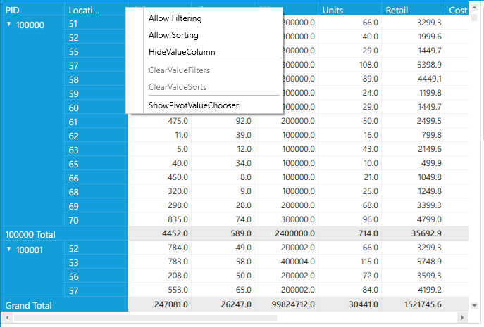

# Context Menu

PivotGrid that supports the context menu behaviour for Row pivots only mode. The context menu that helps to filter,sort and to hide total values etc. This behaviour is same as in the PivotGrid in normal mode. It provides the following options.

* **Allow Filtering** - Enable or disable filtering in the selected pivot computation column.
* **Allow Sorting**  - Enable or disable sorting in the selected pivot computation column.
* **HideValueColumn** - Hides the selected pivot computation column.
* **ClearValueFilters** - To clear the filtered changes in all pivot computation columns.
* **ClearValueSorts** - To clear sorted values in all pivot computation columns.
* **ShowPivotValueChooser** - Launches the Pivot Value Chooser window to add or remove the items in PivotGrid.

Property Table

<table>
<tr>
<th>
Property </th><th>
Description </th><th>
Type </th><th>
Value It Accepts</th><th>
Reference Link</th></tr>
<tr>
<td>
EnableContextMenu</td><td>
This property is used to display the context menu for each column when right clicking the column.</td><td>
bool</td><td>
True, False(Default)</td><td>
-</td></tr>
</table>

## Defining the property in RowPivotsOnly mode of PivotGrid 

The property **EnableContextMenu** can be mentioned in *Code-Behind*. 

After defining PivotGrid control in RowPivotsOnly mode, raise the Loaded event of PivotGrid. Inside the PivotGrid_Loaded() event, set the property **EnableContextMenu**.



public partial class MainWindow: Window {
    public MainWindow() {
        InitializeComponent();
        pivotGrid.Loaded += pivotGrid_Loaded;
    }

    void pivotGrid_Loaded(object sender, RoutedEventArgs e) {
        pivotGrid.RowHeaderCellStyle.EnableContextMenu = true;
        pivotGrid.ColumnHeaderCellStyle.EnableContextMenu = true;
    }
}

	

