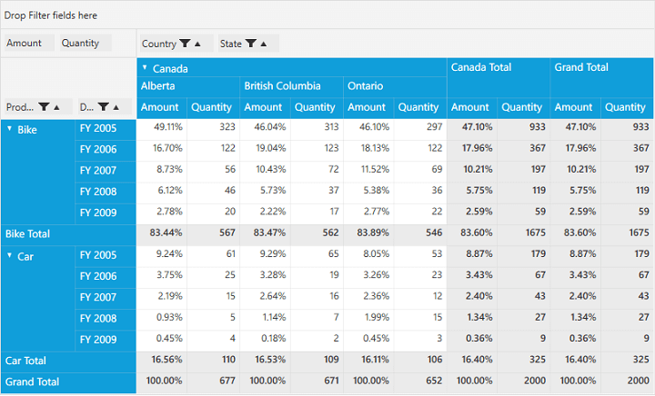

# Custom Calculations

**CalculationType** is an enumerator defined in the PivotComputationInfo class which is used to specify the type of the calculation. The various calculation types that are used for performing calculations are as follows:
 
* **NoCalculation** - Remove the custom calculations and restore to original values (default value). Display the Pivot values as default value.
* **PercentageOfGrandTotal** - Displays a value cell as a percentage of grand total of all value cells of PivotEngine.
* **PercentageOfColumnTotal** - Displays all value cells in each column as a percentage of its corresponding column total. 
* **PercentageOfRowTotal** - Displays all value cells in each row as a percentage of its corresponding row total.
* **PercentageOfParentColumnTotal** - Displays a value cell as a percentage of parent column item values.
* **PercentageOfParentRowTotal** - Displays a value cell as a percentage of parent row item values.
* **PercentageOfParentTotal** - Displays a value cell as a percentage of Base Field (Parent Row/Column Total).
* **Index** - Displays a value cell as an index value based on PivotEngine generation.
* **Formula** - Displays a calculation based on a well formed algebraic expression involving other calculations.
* **PercentageOf** - Displays values as a percentage of the value of the Base item in the Base field.
* **DifferenceFrom** - Displays values as the difference from the value of the Base item in the Base field.
* **PercentageOfDifferenceFrom** - Displays values as the percentage difference from the value of the Base item in the Base field.
* **RunningTotalIn** - Displays the value for successive items in the Base field as a running total.
* **PercentageOfRunningTotalIn** - Calculates the value for successive items in the Base field that are displayed as a running total as a percentage.
* **RankSmallestToLargest** - Displays the rank of selected values in a specific field, listing the smallest item in the field as 1, and each larger value will have a higher rank value.
* **RankLargestToSmallest** - Displays the rank of selected values in a specific field, listing the largest item in the field as 1, and each smaller value will have a higher rank value.

`CalculationType` property is used to achieve this requirement. It can be set for the corresponding PivotCalculation item through `PivotComputationInfo` class. It can be set either through *XAML* or through *Code-behind*.

If through *XAML*, please refer the below code sample.



<Grid>
    <syncfusion:PivotGridControl HorizontalAlignment="Left" Name="pivotGrid" VerticalAlignment="Top" VisualStyle="Metro" ItemSource="{Binding   Source={StaticResource data}}">

        <syncfusion:PivotGridControl.PivotRows>
            <syncfusion:PivotItem FieldHeader="Product" FieldMappingName="Product" TotalHeader="Total" />
            <syncfusion:PivotItem FieldHeader="Date" FieldMappingName="Date" TotalHeader="Total" />
        </syncfusion:PivotGridControl.PivotRows>
        <syncfusion:PivotGridControl.PivotColumns>
            <syncfusion:PivotItem FieldHeader="Country" FieldMappingName="Country" TotalHeader="Total" />
            <syncfusion:PivotItem FieldHeader="State" FieldMappingName="State" TotalHeader="Total" />
        </syncfusion:PivotGridControl.PivotColumns>
        <syncfusion:PivotGridControl.PivotCalculations>
            <syncfusion:PivotComputationInfo CalculationName="Total" FieldName="Amount" Format="C" SummaryType="DoubleTotalSum" CalculationType="PercentageOfColumnTotal" />
            <syncfusion:PivotComputationInfo CalculationName="Total" FieldName="Quantity" SummaryType="Count" />
        </syncfusion:PivotGridControl.PivotCalculations>
</Grid>



Else if through **Code-behind**, please refer the below code sample.



public partial class MainWindow: Window {
    PivotGridControl pivotGrid = new PivotGridControl();
    public MainWindow() {
        InitializeComponent();
        grid1.Children.Add(pivotGrid);
        pivotGrid.ItemSource = ProductSales.GetSalesData();
        PivotItem m_PivotItem = new PivotItem() {
            FieldHeader = "Product", FieldMappingName = "Product", TotalHeader = "Total"
        };
        PivotItem m_PivotItem1 = new PivotItem() {
            FieldHeader = "Date", FieldMappingName = "Date", TotalHeader = "Total"
        };
        PivotItem n_PivotItem = new PivotItem() {
            FieldHeader = "Country", FieldMappingName = "Country", TotalHeader = "Total"
        };
        PivotItem n_PivotItem1 = new PivotItem() {
            FieldHeader = "State", FieldMappingName = "State", TotalHeader = "Total"
        };
        // Adding PivotItem to PivotRows
        pivotGrid.PivotRows.Add(m_PivotItem);
        pivotGrid.PivotRows.Add(m_PivotItem1);
        // Adding PivotItem to PivotColumns
        pivotGrid.PivotColumns.Add(n_PivotItem);
        pivotGrid.PivotColumns.Add(n_PivotItem1);
        PivotComputationInfo m_PivotComputationInfo = new PivotComputationInfo() {
            CalculationName = "Amount", FieldName = "Amount", Format = "C", SummaryType = SummaryType.DoubleTotalSum, CalculationType = CalculationType.PercentageOfColumnTotal
        };
        PivotComputationInfo m_PivotComputationInfo1 = new PivotComputationInfo() {
            CalculationName = "Quantity", FieldName = "Quantity", SummaryType = SummaryType.Count
        };
        pivotGrid.PivotCalculations.Add(m_PivotComputationInfo);
        pivotGrid.PivotCalculations.Add(m_PivotComputationInfo1);
    }
}



## Providing expression field calculation for Summaries

To provide calculated field support to summary cells in PivotGrid and to make it behave accordingly, despite any options provided in summaries such as sum, count, max, min, etc…. 

It can be achieved by setting the calculation type as "Formula" and by specifying the appropriate formula. Please refer the below code samples and screen-shots.



<Grid>
    <syncfusion:PivotGridControl HorizontalAlignment="Left" Name="pivotGrid" VerticalAlignment="Top" VisualStyle="Metro" ItemSource="{Binding   Source={StaticResource data}}">

        <syncfusion:PivotGridControl.PivotRows>
            <syncfusion:PivotItem FieldHeader="Product" FieldMappingName="Product" TotalHeader="Total" />
            <syncfusion:PivotItem FieldHeader="Date" FieldMappingName="Date" TotalHeader="Total" />
        </syncfusion:PivotGridControl.PivotRows>
        <syncfusion:PivotGridControl.PivotColumns>
            <syncfusion:PivotItem FieldHeader="Country" FieldMappingName="Country" TotalHeader="Total" />
            <syncfusion:PivotItem FieldHeader="State" FieldMappingName="State" TotalHeader="Total" />
        </syncfusion:PivotGridControl.PivotColumns>
        <syncfusion:PivotGridControl.PivotCalculations>
            <syncfusion:PivotComputationInfo CalculationName="Total" FieldName="Amount" Format="C" SummaryType="DoubleTotalSum" />
            <syncfusion:PivotComputationInfo CalculationName="Total" FieldName="Quantity" SummaryType="Count" />
            <syncfusion:PivotComputationInfo CalculationName="Total" FieldName="UnitPrice" CalculationType="Formula" Formula="[Amount] / [Quantity]" />
        </syncfusion:PivotGridControl.PivotCalculations>
    </syncfusion:PivotGridControl>
</Grid>





public partial class MainWindow: Window {
    PivotGridControl pivotGrid = new PivotGridControl();
    public MainWindow() {
        InitializeComponent();
        grid1.Children.Add(pivotGrid);
        pivotGrid.ItemSource = ProductSales.GetSalesData();
        PivotItem m_PivotItem = new PivotItem() {
            FieldHeader = "Product", FieldMappingName = "Product", TotalHeader = "Total"
        };
        PivotItem m_PivotItem1 = new PivotItem() {
            FieldHeader = "Date", FieldMappingName = "Date", TotalHeader = "Total"
        };
        PivotItem n_PivotItem = new PivotItem() {
            FieldHeader = "Country", FieldMappingName = "Country", TotalHeader = "Total"
        };
        PivotItem n_PivotItem1 = new PivotItem() {
            FieldHeader = "State", FieldMappingName = "State", TotalHeader = "Total"
        };
        // Adding PivotItem to PivotRows
        pivotGrid.PivotRows.Add(m_PivotItem);
        pivotGrid.PivotRows.Add(m_PivotItem1);
        // Adding PivotItem to PivotColumns
        pivotGrid.PivotColumns.Add(n_PivotItem);
        pivotGrid.PivotColumns.Add(n_PivotItem1);
        PivotComputationInfo m_PivotComputationInfo = new PivotComputationInfo() {
            CalculationName = "Amount", FieldName = "Amount", Format = "C", SummaryType = SummaryType.DoubleTotalSum
        };
        PivotComputationInfo m_PivotComputationInfo1 = new PivotComputationInfo() {
            CalculationName = "Quantity", FieldName = "Quantity", SummaryType = SummaryType.Count
        };
        pivotGrid.PivotCalculations.Add(m_PivotComputationInfo);
        pivotGrid.PivotCalculations.Add(m_PivotComputationInfo1);

        PivotComputationInfo m_PivotComputationInfo2 = new PivotComputationInfo() {
            CalculationName = "Total", FieldName = "UnitPrice", CalculationType = CalculationType.Formula, Formula = "[Amount] / [Quantity]"
        };;
        pivotGrid.PivotCalculations.Add(m_PivotComputationInfo2);
    }
}



