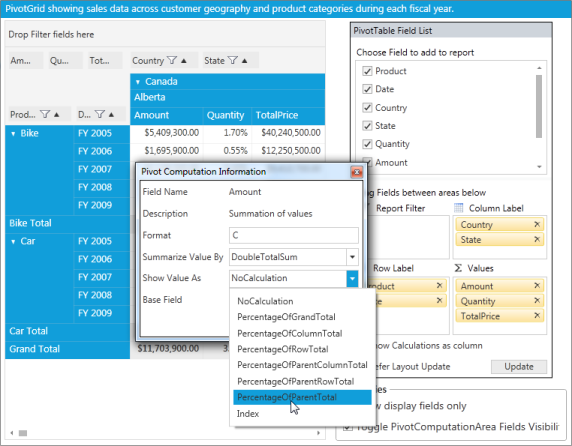

# Custom Calculations

Custom Calculations can be applied to the value fields through the following built-in calculation functions:

*Percentage of Grand Total Cell

*Percentage of Column Total Cell

*Percentage of Row Total Cell

*Percentage of Parent Total Cell 

*Percentage of Parent Column Total Cell

*Percentage of Parent Row Total Cell and

*Index

## Use Case Scenarios

The user can easily analyze the specific value field based on the different value cells through the custom calculations. For example, the user can view the sales amount for United States in FY 2011 as a percentage of the whole sales at United States by selecting the Percentage of Parent Total option.

For an instant,

The sales amount in Untied States for FY 2011: $40,000,000.00

The sales amount in United States for all years: $120,000,000.00

Hence, the sales amount for FY 2011 is 33.33 % of overall year sales (FY 2008 to FY 2011) at United States.

### Properties

<table>
<tr>
<th>
Property</th><th>
Description </th><th>
Type**' | markdownify }} </th><th>
Data Type </th><th>
Reference links</th></tr>
<tr>
<td>
CalculationType</td><td>
Gets or sets the CalculationType for the PivotComputationInfo object.</td><td>
CLR</td><td>
CalculationType</td><td>
Class Reference link for CalculationTypeIn PivotAnalysis.Base </td></tr>
<tr>
<td>
BaseField</td><td>
Gets or sets the BaseField for calculations [Applicable only for the PercentageOfParentTotal calculation type].</td><td>
CLR</td><td>
string</td><td>
Class Reference link for BaseField in PivotAnalysis.Base.</td></tr>
</table>

### Sample Location

The sample is available in the following location:

_<SystemDrive>:\Users\<user_name>\AppData\Local\Syncfusion\EssentialStudio\<version_number>\BI\WPF\PivotAnalysis.Wpf\Samples\Product Showcase\PivotGrid Demo_

## Implementing Custom Calculations 

To show the value cell as a percentage of its summary cells, use the following code snippet:


 

<syncfusion:PivotGridControl.PivotCalculations>

                    <syncfusion:PivotComputationInfo FieldName="Amount" Format="C" CalculationName="Amount Total" CalculationType="PercentageOfParentTotal" BaseField="Country" />

</syncfusion:PivotGridControl.PivotCalculations>

 

  

this.pivotGrid1.PivotCalculations.Add(new Syncfusion.PivotAnalysis.Base.PivotComputationInfo { FieldName = "Amount", Format = "C", CalculationName = "Total Amount", CalculationType = Syncfusion.PivotAnalysis.Base.CalculationType.PercentageOfParentTotal, BaseField = "Country" });

 

 

Me.pivotGrid1.PivotCalculations.Add(New Syncfusion.PivotAnalysis.Base.PivotComputationInfo() With {.FieldName = "Amount", .Format = "C", .CalculationName = "Total Amount", .CalculationType = Syncfusion.PivotAnalysis.Base.CalculationType.PercentageOfParentTotal, .BaseField = "Country"})

 


To change the value cell’s calculation for different view dynamically, do the following procedure through Pivot Schema Designer control:

1. Double-click the respective PivotComputationInfo field at value fields section of the Pivot Schema Designer.
2. In the Pivot Computation Information window pop-up, change the view by selecting  the ‘Show Value As’ combo box as shown in the below image:

