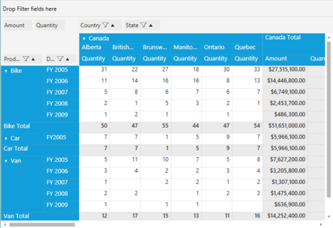
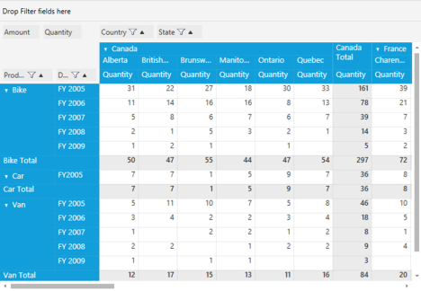

## DisplayOption

DisplayOption behavior is used to display or hide the computation values in PivotEngine based on the option provided. Following are the display options for PivotGrid.

#### All

This option is used to display complete values present in the PivotEngine, in the PivotGrid control.

#### Setting DisplayOption as “All”

#### Through XAML

1. First add the PivotGridControl using syncfusion:PivotGridControl class.
2. Then, create a new PivotItem using PivotGridControl.PivotComputationInfo class.
3. Finally, set the DisplayOption for PivotCalculations using DisplayOption property.

 

[XAML]

<Grid>

        <!—Adding PivotGrid Control-->

        <syncfusion:PivotGridControl HorizontalAlignment="Left" Name="PivotGridControl1" VerticalAlignment="Top" 

                                     ItemSource="{Binding Source={StaticResource data}}" >

<syncfusion:PivotComputationInfo FieldHeader="Amount" FieldName="Amount" Format="C" DisplayOption="All" SummaryType="DoubleTotalSum"/>

</syncfusion:PivotGridControl>

</Grid>

 

#### Through Code Behind

1. First, create a new PivotGridControl using PivotGridControl class in Window_Loaded() event handler.
2. Then, create a new PivotItem using PivotComputationInfo class in PivotGridControl.
3. Finally set the DisplayOption property for PivotCalculations as illustrated here.

  

[C#]

protected void Window_Loaded(object sender, RoutedEventArgs e)

{

    Syncfusion.Windows.Controls.PivotGrid.PivotGridControl PivotGrid1 = new Syncfusion.Windows.Controls.PivotGrid.PivotGridControl ();   

// "All" DisplayOption

PivotComputationInfo m_PivotComputationInfo = new PivotComputationInfo() { CalculationName = "Amount", FieldName = "Amount", 

SummaryType = SummaryType.DoubleTotalSum, DisplayOption = DisplayOption.All  };

}

 

 

[VB]

Protected Sub Window_Loaded(ByVal sender As Object, ByVal e As RoutedEventArgs)

Dim PivotGrid1 As New Syncfusion.Windows.Controls.PivotGrid.PivotGridControl()

’ "All" DisplayOption

Dim m_PivotComputationInfo As PivotComputationInfo = New PivotComputationInfo()With {.CalculationName="Amount",.FieldName="Amount", .SummaryType= SummaryType.DoubleTotalSum . DisplayOption = DisplayOption.All   }

End Sub

 

_PivotGrid when DisplayOption is set to “All”_

#### Calculations

This option allows the specific PivotComputationInfo to be visible only in the Calculation columns of PivotGrid.

#### Setting DisplayOption as “Calculations”

#### Through XAML

1. First add the PivotGridControl using syncfusion:PivotGridControl class.
2. Then create new PivotItem using PivotGridControl.PivotComputationInfo class.
3. Finally, set the DisplayOption for PivotCalculations using DisplayOption property.

 

 [XAML]

<Grid>

        <!—Adding PivotGrid Control-->

        <syncfusion:PivotGridControl HorizontalAlignment="Left" Name="PivotGridControl1" VerticalAlignment="Top" 

                                     ItemSource="{Binding Source={StaticResource data}}" >

<syncfusion:PivotComputationInfo FieldHeader="Amount" FieldName="Amount" Format="C" DisplayOption="Calculations" SummaryType="DoubleTotalSum"/>

</syncfusion:PivotGridControl>

</Grid>



#### Through Code Behind

1. First create a new PivotGridControl using PivotGridControl class in Window_Loaded() event handler.
2. Then create new PivotItem using PivotComputationInfo class in PivotGridControl.
3. Finally set the DisplayOption property for PivotCalculations as illustrated here.

  

[C#]

protected void Window_Loaded(object sender, RoutedEventArgs e)

{

    Syncfusion.Windows.Controls.PivotGrid.PivotGridControl PivotGrid1 = new Syncfusion.Windows.Controls.PivotGrid.PivotGridControl ();   

// "Calculation" DisplayOption

PivotComputationInfo m_PivotComputationInfo = new PivotComputationInfo() { CalculationName = "Amount", FieldName = "Amount", 

SummaryType = SummaryType.DoubleTotalSum, DisplayOption = DisplayOption.Calculations  };

}

 

 

[VB]

Protected Sub Window_Loaded(ByVal sender As Object, ByVal e As RoutedEventArgs)

Dim PivotGrid1 As New Syncfusion.Windows.Controls.PivotGrid.PivotGridControl()

’ "Calculations" DisplayOption

Dim m_PivotComputationInfo As PivotComputationInfo = New PivotComputationInfo()With {.CalculationName="Amount",.FieldName="Amount", .SummaryType= SummaryType.DoubleTotalSum . DisplayOption = DisplayOption.Calculations   }

End Sub

 

_PivotGrid when DisplayOption is set to “Calculations”_

#### Summary

This option allows the specific PivotComputationInfo to be visible only in the Summary columns of PivotGrid.

#### Setting DisplayOption as Summary

#### Through XAML

1. First add the PivotGridControl using syncfusion:PivotGridControl class.
2. Then create a new PivotItem using PivotGridControl.PivotComputationInfo class.
3. Finally set the DisplayOption for PivotCalculations using DisplayOption property.

 

[XAML]

<Grid>

        <!—Adding PivotGrid Control-->

        <syncfusion:PivotGridControl HorizontalAlignment="Left" Name="PivotGridControl1" VerticalAlignment="Top" 

                                     ItemSource="{Binding Source={StaticResource data}}" >

<syncfusion:PivotComputationInfo FieldHeader="Amount" FieldName="Amount" Format="C" DisplayOption="Summary" SummaryType="DoubleTotalSum"/>

</syncfusion:PivotGridControl>

</Grid>

 

#### Through Code Behind

1. First create a new PivotGridControl using PivotGridControl class in Window_Loaded() event handler.
2. Then create a new PivotItem using PivotComputationInfo class in PivotGridControl.
3. Finally set the DisplayOption property for PivotCalculations as illustrated here.

  

[C#]

protected void Window_Loaded(object sender, RoutedEventArgs e)

{

    Syncfusion.Windows.Controls.PivotGrid.PivotGridControl PivotGrid1 = new Syncfusion.Windows.Controls.PivotGrid.PivotGridControl ();   

// "Summary" DisplayOption

PivotComputationInfo m_PivotComputationInfo = new PivotComputationInfo() { CalculationName = "Amount", FieldName = "Amount", 

SummaryType = SummaryType.DoubleTotalSum, DisplayOption = DisplayOption.Summary  };

}

 

 

[VB]

Protected Sub Window_Loaded(ByVal sender As Object, ByVal e As RoutedEventArgs)

Dim PivotGrid1 As New Syncfusion.Windows.Controls.PivotGrid.PivotGridControl()

’ "Summary" DisplayOption

Dim m_PivotComputationInfo As PivotComputationInfo = New PivotComputationInfo()With {.CalculationName="Amount",.FieldName="Amount", .SummaryType= SummaryType.DoubleTotalSum . DisplayOption = DisplayOption.Summary   }

End Sub

 

_PivotGrid when DisplayOption is set to “Summary”_

#### GrandTotals  

This option allows the specific PivotComputationInfo to be visible only in the GrandTotal columns of PivotGrid.

#### Setting DisplayOption as GrandTotals

#### Through XAML

1. First add the PivotGridControl using syncfusion:PivotGridControl class.
2. Then create a new PivotItem using PivotGridControl.PivotComputationInfo class.
3. Finally set the DisplayOption for PivotCalculations using DisplayOption property.



[XAML]

<Grid>

        <!—Adding PivotGrid Control-->

        <syncfusion:PivotGridControl HorizontalAlignment="Left" Name="PivotGridControl1" VerticalAlignment="Top" 

                                     ItemSource="{Binding Source={StaticResource data}}" >

<syncfusion:PivotComputationInfo FieldHeader="Amount" FieldName="Amount" Format="C" DisplayOption="GrandTotals" SummaryType="DoubleTotalSum"/>

</syncfusion:PivotGridControl>

</Grid>

  
 

#### Through Code Behind

1. First create a new PivotGridControl using PivotGridControl class in Window_Loaded() event handler.
2. Then create new PivotItem using PivotComputationInfo class in PivotGridControl.
3. Finally set the DisplayOption property for PivotCalculations as illustrated here.

  

[C#]

protected void Window_Loaded(object sender, RoutedEventArgs e)

{

    Syncfusion.Windows.Controls.PivotGrid.PivotGridControl PivotGrid1 = new Syncfusion.Windows.Controls.PivotGrid.PivotGridControl ();   

// "GrandTotals" DisplayOption

PivotComputationInfo m_PivotComputationInfo = new PivotComputationInfo() { CalculationName = "Amount", FieldName = "Amount", 

SummaryType = SummaryType.DoubleTotalSum, DisplayOption = DisplayOption.GrandTotals };

}

 

 

[VB]

Protected Sub Window_Loaded(ByVal sender As Object, ByVal e As RoutedEventArgs)

Dim PivotGrid1 As New Syncfusion.Windows.Controls.PivotGrid.PivotGridControl()

’ "GrandTotals" DisplayOption 

Dim m_PivotComputationInfo As PivotComputationInfo = New PivotComputationInfo()With {.CalculationName="Amount",..FieldName="Amount", .SummaryType= SummaryType.DoubleTotalSum . DisplayOption = DisplayOption.GrandTotals   }

End Sub

 

_PivotGrid when DisplayOption is set to “GrandTotals”_

#### None

This option does not allow the specific PivotComputationInfo to be visible in any region of PivotGrid. 

#### Setting DisplayOption as None

#### Through XAML

1. First add the PivotGridControl using syncfusion:PivotGridControl class.
2. Then create a new PivotItem using PivotGridControl.PivotComputationInfo class.
3. Finally set the DisplayOption for PivotCalculations using DisplayOption property.

 

[XAML]

<Grid>

        <!—Adding PivotGrid Control-->

        <syncfusion:PivotGridControl HorizontalAlignment="Left" Name="PivotGridControl1" VerticalAlignment="Top" 

                                     ItemSource="{Binding Source={StaticResource data}}" >

<syncfusion:PivotComputationInfo FieldHeader="Amount" FieldName="Amount" Format="C" DisplayOption="None" SummaryType="DoubleTotalSum"/>

</syncfusion:PivotGridControl>

</Grid>

 

#### Through Code Behind

1. First create a new PivotGridControl using PivotGridControl class in Window_Loaded() event handler.
2. Then create a new PivotItem using PivotComputationInfo class in PivotGridControl.
3. Finally set the DisplayOption property for PivotCalculations as illustrated here.

  

[C#]

protected void Window_Loaded(object sender, RoutedEventArgs e)

{

    Syncfusion.Windows.Controls.PivotGrid.PivotGridControl PivotGrid1 = new Syncfusion.Windows.Controls.PivotGrid.PivotGridControl ();   

// "None” displayOption

PivotComputationInfo m_PivotComputationInfo = new PivotComputationInfo() { CalculationName = "Amount", FieldName = "Amount", 

SummaryType = SummaryType.DoubleTotalSum, DisplayOption = DisplayOption.None  };

}

 

 

[VB]

Protected Sub Window_Loaded(ByVal sender As Object, ByVal e As RoutedEventArgs)

Dim PivotGrid1 As New Syncfusion.Windows.Controls.PivotGrid.PivotGridControl()

’ "None" DisplayOption

Dim m_PivotComputationInfo As PivotComputationInfo = New PivotComputationInfo()With {.CalculationName="Amount",..FieldName="Amount", .SummaryType= SummaryType.DoubleTotalSum . DisplayOption = DisplayOption.None   }

End Sub

 

_PivotGrid when DisplayOption is set to “None”_

