# Features

## Filtering 

Filtered data displays only a subset of data that meets criteria that you specify and hides data that you do not want displayed. Filters are automatically reapplied every time the PivotGrid is refreshed or updated. In the PivotGrid, filters are additive, which means that each additional filter is based on the current filter and further reduces the subset of data. We can apply n number of filtering conditions to the grid at a time. Data is filtered based on the filter expression specified.

  

// Adding filters with filter expressions

this.PivotGridControl1.Filters.Add(new FilterExpression { Expression="Product = Bike" Name="Product Filter" });

 

 

' Adding filters with filter expressions

Me.PivotGridControl1.Filters.Add(New FilterExpression With {.Expression="Product = Bike" .Name="Product Filter" })

 

## Sorting

Sorting data enables you to quickly visualize and understand your data better, organize and find the data that you want, and ultimately make more effective decisions. By default, PivotGrid will populate the data in ascending order. Sorting order can be changed using the Comparer field of PivotItem.

 

// Adding Pivot Rows to Grid with FieldMappingName, TotalHeader and Comparer

this.PivotGridControl1.PivotRows.Add(new PivotItem { FieldMappingName = "Product", TotalHeader = "Total", Comparer = new ReverseOrderComparer() });

/// 

/// Reverse Order Comparer for Descending sort order

/// 

public class ReverseOrderComparer : IComparer

{

   #region IComparer Members

   public int Compare(object x, object y)

   {

      if (x == null && y == null)

        return 0;

      else if (y == null)

        return 1;

      else if (x == null)

        return -1;

      else

        return -x.ToString().CompareTo(y.ToString());

   }

   #endregion  

}

  

 

' Adding Pivot Rows to Grid with FieldMappingName, TotalHeader and Comparer

Me.PivotGridControl1.PivotRows.Add(New PivotItem With {.FieldMappingName = "Product", .TotalHeader = "Total", .Comparer = New ReverseOrderComparer()})

''' 

''' Reverse Order Comparer for Descending sort order

''' 

public class ReverseOrderComparer : IComparer

'   #Region "IComparer Members"

   public Integer Compare(Object x, Object y)

If x Is Nothing AndAlso y Is Nothing Then

Return 0

ElseIf y Is Nothing Then

Return 1

ElseIf x Is Nothing Then

Return -1

Else

Return -x.ToString().CompareTo(y.ToString())

End If

'   #End Region  

 

## Freezing Headers

PivotGrid for WPF provides built-in support for freezing column and row headers. This is achieved by setting the FreezeHeaders property of PivotGrid to True. This feature also enables scrolling through the value cells.

  

// To Freeze Grid Headers

this.PivotGridControl1.FreezeHeaders = true;

 

 

[VB]

' To Freeze Grid Headers

Me.PivotGridControl1.FreezeHeaders = True 

 

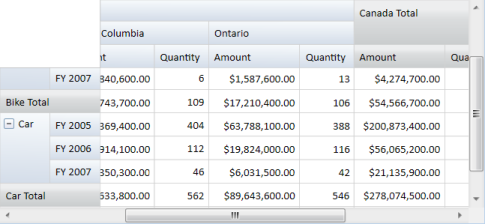

## Cell Style

The following properties of a grid cell can be customized so that the grid appears in a custom style rather than the default one.

Property Table

<table>
<tr>
<th>
{{ '**Property Name**' | markdownify }}</th><th>
{{ '**Description**' | markdownify }}</th><th>
{{ '**Type**' | markdownify }}</th><th>
{{ '**Value it Accepts**' | markdownify }}</th><th>
{{ '**Reference link**' | markdownify }}</th></tr>
<tr>
<td>
Background</td><td>
Gets or sets the background color of a grid cell.</td><td>
Brush</td><td>
-</td><td>
-</td></tr>
<tr>
<td>
FontFamily</td><td>
Gets or sets the font family of a grid cell.</td><td>
FontFamily</td><td>
-</td><td>
-</td></tr>
<tr>
<td>
FontSize</td><td>
Gets or sets the font size of a grid cell.</td><td>
int</td><td>
-</td><td>
-</td></tr>
<tr>
<td>
FontWeight</td><td>
Gets or sets the font weigh of a grid cell.</td><td>
FontWeight</td><td>
-</td><td>
-</td></tr>
<tr>
<td>
Foreground</td><td>
Gets or sets the foreground color of a grid cell.</td><td>
Brush</td><td>
-</td><td>
-</td></tr>
</table>

Column, row, summary, and value cells of a grid can be formatted independently using the following properties:

 * ColumnHeaderCellStyle – Specifies the style for column headers.
 * RowHeaderCellStyle – Specifies the style for row headers.
 * SummaryCellStyle – Specifies the style for summary cells.
 * ValueCellStyle  –  Specifies the style for value cells.

 
 

    		// Specifying the Background color for Grid column header

            this.PivotGridControl1.ColumnHeaderCellStyle.Background = new SolidColorBrush(Color.FromRgb(175, 209, 255));

            // Specifying the Background color for Grid row header

            this.PivotGridControl1.RowHeaderCellStyle.Background = new SolidColorBrush(Color.FromRgb(175, 209, 255));

            // Specifying the Background color for Grid summary cell

            this.PivotGridControl1.SummaryCellStyle.Background = new SolidColorBrush(Color.FromRgb(206, 225, 248)); 

  

  

' Specifying the Background color for Grid column header

Me.PivotGridControl1.ColumnHeaderCellStyle.Background = New SolidColorBrush(Color.FromRgb(175, 209, 255))

' Specifying the Background color for Grid row header

Me.PivotGridControl1.RowHeaderCellStyle.Background = New SolidColorBrush(Color.FromRgb(175, 209, 255))

' Specifying the Background color for Grid summary cell

Me.PivotGridControl1.SummaryCellStyle.Background = New SolidColorBrush(Color.FromRgb(206, 225, 248))



The formatting set in the above code generates the following PivotTable.

## Grouping Bar

The PivotGrid Grouping Bar enables the drag and drop feature of fields between different areas like column, row, value and filter. By using the Grouping Bar, you can add, rearrange, or remove fields to show data in a PivotGrid exactly the way they want. It consists of the following:

* FilterHeader Area
* DataHeader Area
* ColumnHeader Area
* RowHeader Area

The Field headers identify fields in the pivot grid. A field header contains:

* a caption string which identifies the field's content
* a sort indicator which identifies the sort order applied to the field's values 
* a filter button which end-users can use to filter field values

The headers of all visible fields are contained within header areas. The headers of row and column fields are displayed within the row header and column header areas, respectively. The headers of data fields are displayed within the data header area.

#### Use Case Scenarios

At times, you may expect the Grid to perform sorting and filtering at run-time.

#### Adding Grouping Bar 

By default, Grouping Bar is enabled. It can be disabled by setting ShowGroupingBar property of PivotGrid to False.

 

<syncfusion:PivotGrid>

  <!--Adding PivotRows-->

   <syncfusion:PivotGridControl.PivotRows>

     <syncfusion:PivotItem FieldMappingName="Product" FieldHeader="Product" TotalHeader="Total"/>

     <syncfusion:PivotItem FieldMappingName="Date" FieldHeader="Date" TotalHeader="Total"/>

   </syncfusion:PivotGridControl.PivotRows>

   <!--Adding PivotColumns-->

   <syncfusion:PivotGridControl.PivotColumns>

     <syncfusion:PivotItem FieldMappingName="Country" FieldHeader="Country" TotalHeader="Total"/>

     <syncfusion:PivotItem FieldMappingName="State" FieldHeader="State" TotalHeader="Total"/>

   </syncfusion:PivotGridControl.PivotColumns>

   <!--Adding PivotCalculations-->

     <syncfusion:PivotGridControl.PivotCalculations>

       <syncfusion:PivotComputationInfo CalculationName = "Total" Description = "Summation of values" FieldName = "Amount" Format = "C" SummaryType="DoubleTotalSum"/>

       <syncfusion:PivotComputationInfo CalculationName = "Total" Description = "Summation of values" FieldName = "Quantity" Format = "#,##0"/>

     </syncfusion:PivotGridControl.PivotCalculations>

</syncfusion:PivotGrid>

 

  

// Instantiating PivotGridControl.

PivotGridControl pivotGridControl1 = new PivotGridControl();

// Adding PivotRows.

pivotGridControl1.PivotRows.Add(new PivotItem { FieldHeader = "Product" });

pivotGridControl1.PivotColumns.Add(new PivotItem { FieldHeader = "Date" });

// Adding PivotColumns.

pivotGridControl1.PivotColumns.Add(new PivotItem { FieldHeader = "Country" });

pivotGridControl1.PivotColumns.Add(new PivotItem { FieldHeader = "State" });

// Adding PivotCalculations.

pivotGridControl1.PivotCalculations.Add(new PivotComputationInfo { FieldName="Amount" , Format="C"});

pivotGridControl1.PivotCalculations.Add(new PivotComputationInfo { FieldName = "Quantity", Format = "#,##0" });



 

' Instantiating PivotGridControl.

Dim pivotGridControl1 As PivotGridControl = New PivotGridControl()

' Adding PivotRows.

pivotGridControl1.PivotRows.Add(New PivotItem With {.FieldHeader = "Product"})

pivotGridControl1.PivotColumns.Add(New PivotItem With {.FieldHeader = "Date"})

' Adding PivotColumns.

pivotGridControl1.PivotColumns.Add(New PivotItem With {.FieldHeader = "Country"})

pivotGridControl1.PivotColumns.Add(New PivotItem With {.FieldHeader = "State"})

' Adding PivotCalculations.

pivotGridControl1.PivotCalculations.Add(New PivotComputationInfo With {.FieldName="Amount", .Format="C"})

pivotGridControl1.PivotCalculations.Add(New PivotComputationInfo With {.FieldName = "Quantity", .Format = "#,##0"})

 

#### Filtering

Filtering of data displays only a subset of data that meets criteria specified by you and hides data that you don’t want to get displayed. The Items present in the FilterHeaderArea, ColumnHeaderArea and RowHeaderArea provides the option of run-time filtering which is represented as a Funnel symbol on it. On clicking, it opens a filter popup which displays a list of elements through which filtering can be applied. 

  

// Disabling Filtering.

pivotGridControl1.GroupingBar.AllowFiltering = false;

 

 

// Disabling Filtering.

pivotGridControl1.GroupingBar.AllowFiltering = False 

 

The above code snippets disable Filtering in Grouping Bar.

#### Sorting

Sorting data enables you to quickly visualize, organize and understand the data better., It also enables you to find data that you want, and ultimately helps to make more effective decisions. By default, PivotGrid will populate the data in ascending order. Sorting order can be changed clicking on the item present in the RowHeaderArea and ColumnHeaderArea. The Sort indicator present in the item represents the Sort type whether it is ascending sort or descending sort. 

The following image illustrates the Sort indicator with Sort types.

 

// Disabling Sorting.

pivotGridControl1.GroupingBar.AllowSorting = false;
 
 

 

// Disabling Sorting.

pivotGridControl1.GroupingBar.AllowSorting = False 

 

The above code snippets disable Sorting in Grouping Bar.

#### Sample Link

..\..\ Syncfusion\BI\WPF\PivotAnalysis.WPF\Samples\Grouping\Grid GroupingBar Demo

### Disable Grouping by Specific Fields 

This feature enables the user to prevent the drop of certain pivot items that has been dragged either from PivotSchemaDesigner or within the pivot grid to the grouping bar at runtime.

#### Use Case Scenarios

This feature enables the user to restrict grouping for any specific field at runtime.

The following screenshot shows disabled grouping:

#### Properties

Properties Table

<table>
<tr>
<th>
{{ '**Property**' | markdownify }}</th><th>
{{ '**Description**' | markdownify }}</th><th>
{{ '**Type**' | markdownify }}</th><th>
{{ '**Data Type**' | markdownify }}</th><th>
{{ '**Reference links**' | markdownify }}</th></tr>
<tr>
<td>
AllowRunTimeGroupByField</td><td>
Gets or sets the value to enable/disable grouping for PivotItem. The default value is true.</td><td>
CLR</td><td>
bool </td><td>
- </td></tr>
<tr>
<td>
ShowDisabledGroupBackground</td><td>
Enable/Disable Background color for the grouping disabled fields. The default value is false.</td><td>
Dependency </td><td>
bool</td><td>
-</td></tr>
</table>

#### Sample Link

A sample is provided in the following location:

{InstalledLoction}:\Users\{User}AppData\Local\Syncfusion\EssentialStudio\{InstalledVersion}\BI\WPF\PivotAnalysis.WPF\Samples\Grouping Bar\Grouping Bar Demo

#### Adding Disable Grouping by Specific Fields to an Application 

The user needs to set the AllowRunTimeGroupByField property value to enable/disable grouping. The AllowRunTimeGroupByField property is added to PivotItem, PivotComputationInfo and FilterItemsCollection. The ShowDisabledGroupBackground property will allow user to set a disabled look to the grouping disabled pivot items.  

The following code snippets, explains the implementation of the disable grouping by specific fields feature:

 

/// Adding Pivot Columns

<syncfusion:PivotGridControl.PivotColumns>

    <syncfusion:PivotItem FieldMappingName="Country" FieldHeader="Country" TotalHeader="Total" AllowRunTimeGroupByField="False"/>

</syncfusion:PivotGridControl.PivotColumns>

/// Adding Pivot Rows

<syncfusion:PivotGridControl.PivotRows>

    <syncfusion:PivotItem FieldMappingName="Product" FieldHeader="Product" TotalHeader="Total" AllowRunTimeGroupByField="False"/>

</syncfusion:PivotGridControl.PivotRows>

<syncfusion:PivotGridControl.PivotCalculations>

/// Adding Pivot Calculations

    <syncfusion:PivotComputationInfo CalculationName = "Total" Description = "Summation of values" FieldName = "Amount" Format = "C" SummaryType="DoubleTotalSum" AllowRunTimeGroupByField="False"/>

</syncfusion:PivotGridControl.PivotCalculations>

/// Enabling Disabled Background for Grouping disabled items.

  <CheckBox x:Name="chkBoxShowDisabledGroupBackground"  Margin="5"  Content="ShowDisabledGroupBG"  IsChecked="{Binding ElementName=pivotGrid1,Path=ShowDisabledGroupBackground,Mode=TwoWay}"/>

 

  

/// Adding Pivot Columns

this.pivotGrid1.PivotColumns.Add(new PivotItem() { FieldMappingName = "Country", FieldHeader = "Country", TotalHeader = "Total", AllowRunTimeGroupByField = false });

/// Adding Pivot Rows

this.pivotGrid1.PivotRows.Add(new PivotItem() { FieldMappingName = "Product", FieldHeader = "Product", TotalHeader = "Total", AllowRunTimeGroupByField = false });

/// Adding Pivot Calculations

this.pivotGrid1.PivotCalculations.Add(new PivotComputationInfo() { FieldName = "Amount", SummaryType = SummaryType.DoubleTotalSum, CalculationName = "DoubleTotalSum", Format = "C", AllowRunTimeGroupByField = false });          

/// Enabling Disabled Background for Grouping disabled items.

this.pivotGrid1.ShowDisabledGroupBackground = true;

 

 

' Adding Pivot Columns

Me.pivotGrid1.PivotColumns.Add(New PivotItem() With {.FieldMappingName = "Country", .FieldHeader = "Country", .TotalHeader = "Total", .AllowRunTimeGroupByField = False})

' Adding Pivot Rows

Me.pivotGrid1.PivotRows.Add(New PivotItem() With {.FieldMappingName = "Product", .FieldHeader = "Product", .TotalHeader = "Total", .AllowRunTimeGroupByField = False})

' Adding Pivot Calculations

Me.pivotGrid1.PivotCalculations.Add(New PivotComputationInfo() With {.FieldName = "Amount", .SummaryType = SummaryType.DoubleTotalSum, .CalculationName = "DoubleTotalSum", .Format = "C", .AllowRunTimeGroupByField = False})

/// Enabling Disabled Background for Grouping disabled items.

Me.pivotGrid1.ShowDisabledGroupBackground = True 

  

## Hyperlink Cells

The PivotGrid for WPF allows Hyperlinking of cells to retrieve a detailed description about a particular cell. The Hyperlink Cells property of PivotGrid generates a separate event called HyperLinkCellClick for the clicked cell and the HyperLinkCellClickEventArgs will return the clicked PivotCellInfo.

Hyperlink Cell’s property can be applied to the following cells:

* Column Header 
* Row Header 
* Summary Header
* Summary Cell
* Value Cell

#### Use Case Scenarios

You can Hyperlink cells and can perform some custom operation on a Cell click. While doing so, you can get the complete information of the Cell like its Type, Range etc.

#### Enabling Hyperlink Cells

You can enable a cell present in the Grid as a Hyperlink by setting the IsHyperlinkCell property of that cell style to True.

Example: To make a column header cell as a hyperlink, set PivotGrid.ColumnHeaderStyle.IsHyperlinkCell = True.

The property usage is illustrated in the code given below.

 

// Instantiating PivotGridControl.

PivotGridControl PivotGrid1 = new PivotGridControl();

// Adding PivotRows.

PivotGrid1.PivotRows.Add(new PivotItem { FieldHeader = "Product" });

// Adding PivotColumns.

PivotGrid1.PivotColumns.Add(new PivotItem { FieldHeader = "Date" });

// Adding PivotCalculations.

PivotGrid1.PivotCalculations.Add(new PivotComputationInfo { FieldName="Amount" });

// To Enable Hyperlink for Column Header.

this.PivotGrid1.ColumnHeaderCellStyle.IsHyperlinkCell = true;

// To Enable Hyperlink for Row Header.

this.PivotGrid1.RowHeaderCellStyle.IsHyperlinkCell = true;

// To Enable Hyperlink for Summary Header.

this.PivotGrid1.SummaryHeaderStyle.IsHyperlinkCell = true;

// To Enable Hyperlink for Summary Cell.

this.PivotGrid1.SummaryCellStyle.IsHyperlinkCell = true;

// To Enable Hyperlink for Value Cell.

this.PivotGrid1.ValueCellStyle.IsHyperlinkCell = true;

  

 

' Instantiating PivotGridControl.

Dim PivotGrid1 As PivotGridControl = New PivotGridControl()

' Adding PivotRows.

PivotGrid1.PivotRows.Add(New PivotItem With {.FieldHeader = "Product"})

' Adding PivotColumns.

PivotGrid1.PivotColumns.Add(New PivotItem With {.FieldHeader = "Date"})

' Adding PivotCalculations.

PivotGrid1.PivotCalculations.Add(New PivotComputationInfo With {.FieldName="Amount"})

' To Enable Hyperlink for Column Header.

Me.PivotGrid1.ColumnHeaderCellStyle.IsHyperlinkCell = True

' To Enable Hyperlink for Row Header.

Me.PivotGrid1.RowHeaderCellStyle.IsHyperlinkCell = True

' To Enable Hyperlink for Summary Header.

MePivotGrid1.SummaryHeaderStyle.IsHyperlinkCell = True

' To Enable Hyperlink for Summary Cell.

Me. PivotGrid1.SummaryCellStyle.IsHyperlinkCell = True

' To Enable Hyperlink for Value Cell.

Me.PivotGrid1.ValueCellStyle.IsHyperlinkCell = True

 

The below screen shot shows how the Column Header is hyperlinked.

The below screen shot shows how the Row Header is hyperlinked.

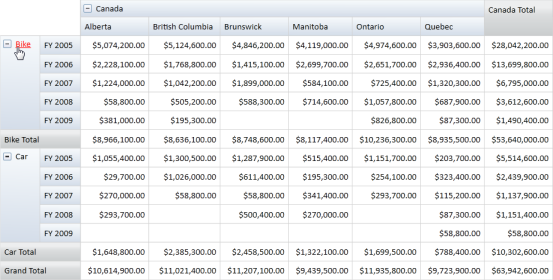

The below screen shot shows how the value in a cell is hyperlinked.

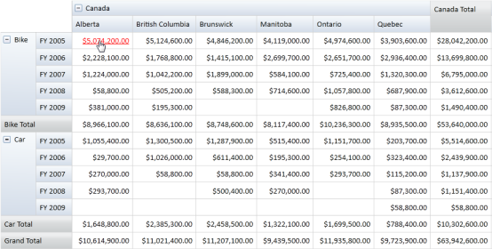

#### Sample Link

..\..\ Syncfusion\BI\WPF\PivotAnalysis.WPF\Samples\Appearance\Hyperlink Cell Demo

## Conditional Formatting

Conditional formatting is the process of applying customized styles to any object based on specified conditions. Conditional Formatting for
PivotGrid WPF allows you to format Grid cells based on specified conditions. This can be achieved by defining PivotGridDataConditionalFormat 
for the Grid, which allows you to specify the criteria for filtering the cells and the style to be applied to the filtered cells. After the 
specifications are defined, the styles are applied only to the cells that fulfil the specified conditions. Conditional Formatting can be 
specified by using the PivotGridControl.ConditionalFormats property, which is an observable collection of type PivotGridDataConditionalFormat. 

The criteria for filtering the cells are specified by using the PivotGridDataConditionalFormat.Conditions property, which is a collection of PivotGridDataCondition objects. The Style for each ConditionalFormat can be specified by using the PivotGridDataConditionalFormat.CellStyle property, which should be of type PivotGridCellStyle.

#### Use Case Scenarios

Conditional Formatting can be used in Marketing software to help users easily trace the product sales rate for different regions. 

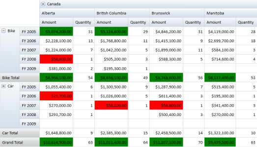

#### Adding Conditional Formatting

Conditional Formatting can be added to code behind and XAML, as shown in the following code snippets. 

 

  <!--Specifying PivotRows.-->

            <syncfusion:PivotGridControl.PivotRows>

                <syncfusion:PivotItem FieldMappingName="Product" TotalHeader="Total"/>

                <syncfusion:PivotItem FieldMappingName="Date" TotalHeader="Total"/>

            </syncfusion:PivotGridControl.PivotRows>

            <!--Specifying PivotColumns.-->

            <syncfusion:PivotGridControl.PivotColumns>

                <syncfusion:PivotItem FieldMappingName="Country" TotalHeader="Total"/>

                <syncfusion:PivotItem FieldMappingName="State" TotalHeader="Total"/>

            </syncfusion:PivotGridControl.PivotColumns>

            <!--Specifying PivotCalculationValues.--> 

            <syncfusion:PivotGridControl.PivotCalculations>

                <syncfusion:PivotComputationInfo FieldName="Amount" Format="C" SummaryType="DoubleTotalSum"/>

                <syncfusion:PivotComputationInfo FieldName="Quantity" Format="#,##0"/>

            </syncfusion:PivotGridControl.PivotCalculations>

<syncfusion:PivotGrid.ConditionalFormats> 

   <!-- Adding Conditions. -->                       

   <syncfusion:PivotGridDataConditionalFormat Name="C1">

      <!-- Specifying the Cell Style. -->

      <syncfusion:PivotGridDataConditionalFormat.CellStyle>

          <syncfusion:PivotGridCellStyle Background="Green" FontFamily="Calibri" FontSize="12"/>

      </syncfusion:PivotGridDataConditionalFormat.CellStyle>

      <!-- Specifying Conditions. --> 

      <syncfusion:PivotGridDataConditionalFormat.Conditions>

          <syncfusion:PivotGridDataCondition ConditionType="GreaterThan" Value="5000000" MeasureElement="Amount" PredicateType="And"/>

          </syncfusion:PivotGridDataConditionalFormat.Conditions>

      </syncfusion:PivotGridDataConditionalFormat>

   <syncfusion:PivotGridDataConditionalFormat Name="C2">

      <!-- Specifying the Cell Style. -->

      <syncfusion:PivotGridDataConditionalFormat.CellStyle>

          <syncfusion:PivotGridCellStyle Background="Red" FontFamily="Calibri" FontSize="12"/>

      </syncfusion:PivotGridDataConditionalFormat.CellStyle>

      <!-- Specifying Conditions. --> 

      <syncfusion:PivotGridDataConditionalFormat.Conditions>

          <syncfusion:PivotGridDataCondition ConditionType="LessThan" Value="100000

" MeasureElement="Amount" PredicateType="And"/>

          </syncfusion:PivotGridDataConditionalFormat.Conditions>

      </syncfusion:PivotGridDataConditionalFormat>           

</syncfusion:PivotGrid.ConditionalFormats>

 

 

// Specifying PivotGridDataConditionalFormat.

PivotGridDataConditionalFormat conditionalFormat1 = new PivotGridDataConditionalFormat();

// Adding Conditions to PivotGridDataConditionalFormat.

conditionalFormat1.Conditions.Add(new PivotGridDataCondition() { 

            ConditionType= PivotGridDataConditionType.GreaterThan , 

            MeasureElement="Amount",

            Value="5000000",

            PredicateType = PredicateType.And });

// Specifying the Cell Style.

conditionalFormat1.CellStyle = new PivotGridCellStyle() { Background= Brushes.Green, FontFamily = new FontFamily("Calibri"), FontSize=12 

};

// Specifying PivotGridDataConditionalFormat.

PivotGridDataConditionalFormat conditionalFormat2 = new PivotGridDataConditionalFormat();

// Adding Conditions to PivotGridDataConditionalFormat.

conditionalFormat2.Conditions.Add(new PivotGridDataCondition() { 

            ConditionType= PivotGridDataConditionType.LessThan , 

            MeasureElement="Amount",

            Value="100000",

            PredicateType = PredicateType.And });

// Specifying the Cell Style.

conditionalFormat2.CellStyle = new PivotGridCellStyle() { Background= Brushes.Red, FontFamily = new FontFamily("Calibri"), FontSize=12 

};

// Adding Conditions to PivotGrid.

this.PivotGrid1.ConditionalFormats.Add(conditionalFormat1);

this.PivotGrid1.ConditionalFormats.Add(conditionalFormat2);

  

  

' Specifying PivotGridDataConditionalFormat.

Dim conditionalFormat1 As PivotGridDataConditionalFormat = New PivotGridDataConditionalFormat()

' Adding Conditions to PivotGridDataConditionalFormat.

conditionalFormat1.Conditions.Add(New PivotGridDataCondition() With {.ConditionType= PivotGridDataConditionType.GreaterThan, .MeasureElement="Amount", .Value="5000000", .PredicateType = PredicateType.And})

' Specifying the Cell Style.

conditionalFormat1.CellStyle = New PivotGridCellStyle()

Dim TempFontFamily As FontFamily = New FontFamily("Calibri"), FontSize=12

Brushes.Green, FontFamily = New FontFamily("Calibri"), FontSize

Background= Brushes.Green, FontFamily

' Specifying PivotGridDataConditionalFormat.

Dim conditionalFormat2 As PivotGridDataConditionalFormat = New PivotGridDataConditionalFormat()

' Adding Conditions to PivotGridDataConditionalFormat.

conditionalFormat2.Conditions.Add(New PivotGridDataCondition() With {.ConditionType= PivotGridDataConditionType.GreaterThan, .MeasureElement="Amount", .Value="100000", .PredicateType = PredicateType.And})

' Specifying the Cell Style.

conditionalFormat2.CellStyle = New PivotGridCellStyle()

Dim TempFontFamily As FontFamily = New FontFamily("Calibri"), FontSize=12

Brushes.Red, FontFamily = New FontFamily("Calibri"), FontSize

Background= Brushes.Red, FontFamily

' Adding Conditions to PivotGrid.

Me.PivotGrid1.ConditionalFormats.Add(conditionalFormat1)

Me.PivotGrid1.ConditionalFormats.Add(conditionalFormat2)



#### Sample Link

A sample application that illustrates Conditional Formatting is distributed along with the Essential PivotGrid WPF installation and can be found at:

..\Syncfusion\BI\WPF\PivotAnalysis.WPF\Samples\Appearance\ Conditional Formatting Demo.

To access a Conditional Formatting sample:

1. Open the Syncfusion Dashboard. 
2. Click Business Intelligence.
3. Click the WPF drop-down list, and then select Explore Samples. 
4. Navigate to PivotAnalysis.WPF -> Samples -> Appearance -> Conditional Formatting Demo. 

## Cell Templates

The Cell Templates feature of PivotGrid allows you to define Templates and change the appearance of elements, such as column, row, summary, and value cells that are present in the Grid. The style for each element in the Grid should be defined of type PivotGridTemplateCell. The customized template can be defined for the following properties of PivotGrid:

* ColumnHeaderCellStyle
* RowHeaderCellStyle
* SummaryHeaderStyle
* SummaryCellStyle
* ValueCellStyle

The Expander’s in the Grid can also be customized with any UIElement and it should be named as “PART_Expander” to perform drill-up and drill-down operations.

#### Use Case Scenarios

Cell Templates will be useful when users require a rich User Interface (UI) appearance.

#### Adding Cell Template

RowHeaderStyle of PivotGrid can be customized by using the Template, as shown in the following XAML. 

 

           </Image.Style>

          </Image>

          <!-- A Textblock representing the Cell Value. -->

          <TextBlock Grid.Column="1" VerticalAlignment="Top" Margin="2,5,2,0"

            Text="{Binding Path=Text, RelativeSource={RelativeSource TemplatedParent}}" 

            TextWrapping="Wrap" FontFamily="Calibri" FontSize="12" />                                   

      </StackPanel>                            

     </ControlTemplate>

   </Setter.Value>

 </Setter>

</Style>

<syncfusion:PivotGridControl>

 <!—Specifying RowHeaderCellStyle. -->

 <syncfusion:PivotGridControl.RowHeaderCellStyle>

   <syncfusion:PivotGridCellStyle Style="{StaticResource rowStyle}"/>

  </syncfusion:PivotGridControl.RowHeaderCellStyle>

</syncfusion:PivotGridControl>

 

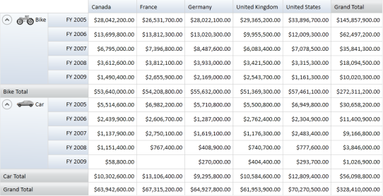

#### Sample Link

A sample application that illustrates Cell Template is distributed along with the Essential PivotGrid WPF installation and can be found at:

..\Syncfusion\BI\WPF\PivotAnalysis.WPF\Samples\Appearance\Cell Template Demo

#### To access a Cell Template sample

1. Open the Syncfusion Dashboard. 
2. Click Business Intelligence.
3. Click the WPF drop-down list, and then select Explore Samples. 
4. Navigate to PivotAnalysis.WPF > Samples > Appearance > Cell Template Demo.

## Cell Selection

PivotGrid for WPF supports excel like cell selection where you can select grid value cells as like in MS-Excel. On cell selection, an event called PivotGridSelectionChanged will be triggered and the PivotGridSelectionChangedEventArgs will return an IEnumerable collection of column, row and value of the corresponding selected cell. The EventArgs will also return the cell range and the selection reason like mousedown, mousemove, mouseup etc,.

#### Use Case Scenarios

Using Cell Selection, you can select cells that can be copied to clipboard or notepad. You can perform custom operation on cell selection and also can bind any control based on the selected cell values.

#### Adding Cell Selection 

The following code snippets show how to create a PivotGrid and to specify Cell Selection.

 

<!--Adding PivotGrid and Enabling Cell Selection-->

<syncfusion:PivotGrid AllowSelection="True"> 

  <!--Adding PivotRows-->

   <syncfusion:PivotGridControl.PivotRows>

     <syncfusion:PivotItem FieldMappingName="Product" FieldHeader="Product" TotalHeader="Total"/>

     <syncfusion:PivotItem FieldMappingName="Date" FieldHeader="Date" TotalHeader="Total"/>

   </syncfusion:PivotGridControl.PivotRows>

   <!--Adding PivotColumns-->

   <syncfusion:PivotGridControl.PivotColumns>

     <syncfusion:PivotItem FieldMappingName="Country" FieldHeader="Country" TotalHeader="Total"/>

     <syncfusion:PivotItem FieldMappingName="State" FieldHeader="State" TotalHeader="Total"/>

   </syncfusion:PivotGridControl.PivotColumns>

   <!--Adding PivotCalculations-->

     <syncfusion:PivotGridControl.PivotCalculations>

       <syncfusion:PivotComputationInfo CalculationName = "Total" Description = "Summation of values" FieldName = "Amount" Format = "C" SummaryType="DoubleTotalSum"/>

       <syncfusion:PivotComputationInfo CalculationName = "Total" Description = "Summation of values" FieldName = "Quantity" Format = "#,##0"/>

     </syncfusion:PivotGridControl.PivotCalculations>

</syncfusion:PivotGrid>

 

  

// Instantiating PivotGridControl.

PivotGridControl pivotGridControl1 = new PivotGridControl();

// Adding PivotRows.

pivotGridControl1.PivotRows.Add(new PivotItem { FieldHeader = "Product" });

pivotGridControl1.PivotColumns.Add(new PivotItem { FieldHeader = "Date" });

// Adding PivotColumns.

pivotGridControl1.PivotColumns.Add(new PivotItem { FieldHeader = "Country" });

pivotGridControl1.PivotColumns.Add(new PivotItem { FieldHeader = "State" });

// Adding PivotCalculations.

pivotGridControl1.PivotCalculations.Add(new PivotComputationInfo { FieldName="Amount" , Format="C"});

pivotGridControl1.PivotCalculations.Add(new PivotComputationInfo { FieldName = "Quantity", Format = "#,##0" });

// Enable Cell Selection.

this.pivotGridControl1.AllowSelection = false;

 

 

' Instantiating PivotGridControl.

Dim pivotGridControl1 As PivotGridControl = New PivotGridControl()

' Adding PivotRows.

pivotGridControl1.PivotRows.Add(New PivotItem With {.FieldHeader = "Product"})

pivotGridControl1.PivotColumns.Add(New PivotItem With {.FieldHeader = "Date"})

' Adding PivotColumns.

pivotGridControl1.PivotColumns.Add(New PivotItem With {.FieldHeader = "Country"})

pivotGridControl1.PivotColumns.Add(New PivotItem With {.FieldHeader = "State"})

' Adding PivotCalculations.

pivotGridControl1.PivotCalculations.Add(New PivotComputationInfo With {.FieldName="Amount", .Format="C"})

pivotGridControl1.PivotCalculations.Add(New PivotComputationInfo With {.FieldName = "Quantity", .Format = "#,##0"})

' Enable Cell Selection.

Me.pivotGridControl1.AllowSelection = False

 

#### Sample Link

..\..\ Syncfusion\BI\WPF\PivotAnalysis.WPF\Samples\Appearance\Cell Selection Demo

## Exporting

### PDF Export

PivotGrid for WPF can be exported as a PDF file using Essential PDF. . The user can export the contents of the PivotGrid to the PDF document for future archival, references and analysis purposes.

#### Call Export method

The GridPdfExport class provides support for exporting data from a PivotGrid to a PDF document for verification. The following dlls should be added, along with the default dlls in the reference folder: 

  * Syncfusion.PivotGridConverter.Wpf

  

//// Export to PDF.

SaveFileDialog savedialog = new SaveFileDialog();

savedialog.AddExtension = true;

savedialog.FileName = "Sample";

savedialog.DefaultExt = "pdf";

savedialog.Filter = "Pdf file (.pdf)|*.pdf";

if (savedialog.ShowDialog() == true)

{

     fileName = savedialog.FileName;

     GridPdfExport pdfExport = new GridPdfExport(this.pivotGrid1);

     pdfExport.Export(fileName);

}

 

 

' Export to PDF.

Dim savedialog As SaveFileDialog = New SaveFileDialog()

savedialog.AddExtension = True

savedialog.FileName = "Sample"

savedialog.DefaultExt = "pdf"

savedialog.Filter = "Pdf file (.pdf)|*.pdf"

If savedialog.ShowDialog() = True Then

    fileName = savedialog.FileName

    Dim pdfExport As GridPdfExport = New GridPdfExport(Me.pivotGrid1)

    pdfExport.Export(fileName)

End If

 

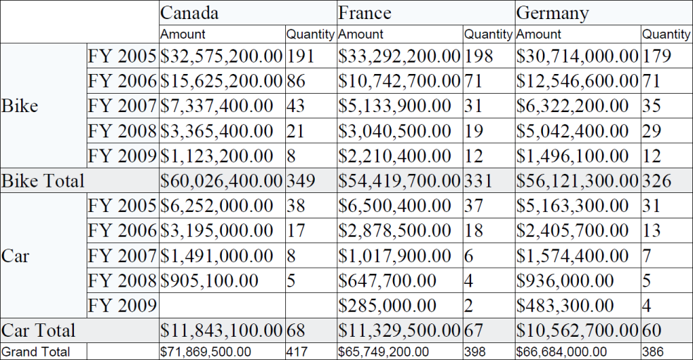

### Excel Export

PivotGrid for WPF can be exported as an XLS file using Essential XlsIO. The user can export the contents of the PivotGrid to the Excel document for future archival, references and analysis purposes.

#### Call Export method

The GridExcelExport class provides support for exporting data from a PivotGrid to an Excel spreadsheet for verification and/or computation. The following dlls should be added, along with the default dlls in the reference folder: 

*  Syncfusion.PivotGridConverter.Wpf

  

//// Export to Excel.

SaveFileDialog savedialog = new SaveFileDialog();

savedialog.AddExtension = true;

savedialog.FileName = "Sample";

savedialog.DefaultExt = "xls";

savedialog.Filter = "Excel file (.xls)|*.xls";

if (savedialog.ShowDialog() == true)

{
     fileName = savedialog.FileName;

     GridExcelExport excelExport = new GridExcelExport(this.pivotGrid1);

     excelExport.Export(fileName);
}

 

 

' Export to Excel.

Dim savedialog As SaveFileDialog = New SaveFileDialog()

savedialog.AddExtension = True

savedialog.FileName = "Sample"

savedialog.DefaultExt = "xls"

savedialog.Filter = "Excel file (.xls)|*.xls"

If savedialog.ShowDialog() = True Then

    fileName = savedialog.FileName

    Dim excelExport As GridExcelExport = New GridExcelExport(Me.pivotGrid1)

    excelExport.Export(fileName)

End If

 

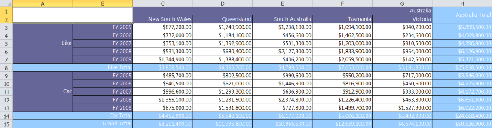

### Word Export

PivotGrid for WPF can be exported as a Word document using Essential DocIO. The user can export the contents of the PivotGrid to the Word document for future archival, references and analysis purposes.

#### Call Export method

The GridWordExport class provides support for exporting data from a PivotGrid to a Word document for verification. The following dlls should be added, along with the default dlls in the reference folder: 

 *Syncfusion.PivotGridConverter.Wpf

 
  

//// Export to Word Document.

SaveFileDialog savedialog = new SaveFileDialog();

savedialog.AddExtension = true;

savedialog.FileName = "Sample";

savedialog.DefaultExt = "Doc";

savedialog.Filter = "Word file (.Doc)|*.Doc";

if (savedialog.ShowDialog() == true)

{

     fileName = savedialog.FileName;

     GridWordExport wordExport = new GridWordExport(this.pivotGrid1);

     wordExport.Export(fileName);

}

 

 

' Export to Word Document.

Dim savedialog As SaveFileDialog = New SaveFileDialog()

savedialog.AddExtension = True

savedialog.FileName = "Sample"

savedialog.DefaultExt = "Doc"

savedialog.Filter = "Word file (.Doc)|*.Doc"

If savedialog.ShowDialog() = True Then

    fileName = savedialog.FileName

    Dim wordExport As GridWordExport = New GridWordExport(Me.pivotGrid1)

    wordExport.Export(fileName)

End If

 

### CSV Export

PivotGridControl for WPF provides support to export itself to CSV file format. 

### Use Case Scenarios 

You can export the contents of the PivotGridControl to the CSV file format for future references and analysis purposes.

Methods

<table>
<tr>
<th>
{{ '**Method**' | markdownify }}</th><th>
{{ '**Description**' | markdownify }}</th><th>
{{ '**Parameters**' | markdownify }}</th><th>
{{ '**Type**' | markdownify }}</th><th>
{{ '**Return Type**' | markdownify }}</th></tr>
<tr>
<td>
Export(string filename)</td><td>
Gets the file name to save the CSV file with the specified name.</td><td>
filename as string</td><td>
-</td><td>
void</td></tr>
<tr>
<td>
ExportToCsv(PivotGridControl pivotGridControl, string filename)</td><td>
Gets the PivotGridControl and file name for exporting the content to CSV file format with the specified name. </td><td>
pivotGridControl as PivotGridControl, filename as string</td><td>
-</td><td>
void</td></tr>
</table> 

### Adding CSV Export for PivotGridControl in an application

The GridCsvExport class provides support for exporting data from PivotGridControl to a CSV file format. You are required to add the following dll along with the default dll’s in the reference folder: 

* Syncfusion.PivotGridConverter.Wpf

  
 

SaveFileDialog saveFileDialog = new SaveFileDialog();

saveFileDialog.AddExtension = true;

saveFileDialog.FileName = "Sample";

saveFileDialog.DefaultExt = "CSV";

saveFileDialog.Filter = "Csv file (.csv)|*.csv";

if (saveFileDialog.ShowDialog() == true)

{

GridCsvExport csvExport = new GridCsvExport(this.Target);                                         
csvExport.Delimiter = ",";                                
csvExport.Export(saveFileDialog.FileName);                               
MessageBox.Show("CSV document exported successfully!");

} 



 

### Sample Link

{Installation Drive}:\Users\<user name>\AppData\Local\Syncfusion\EssentialStudio\<version number>\ WPF\PivotAnalysis.WPF\Samples\Exporting\Exporting Demo\

### Sample Link

To access a Exporting Demo sample:

1. Open the Syncfusion Dashboard. 
2. Click Business Intelligence.
3. Click the WPF drop-down list, and select Explore Samples. 
4. Navigate to PivotAnalysis.WPF -> Samples -> Exporting -> Exporting Demo.

## PivotGrid Field List

With the current implementation of ‘Grouping bar, users cannot add or delete items in it. The Delete operation can be easily performed using the context menu, but in case of adding an item there should be a separate window, which should hold the fields present in the Item Source. In order to achieve this, a window called PivotGrid Field List is available in PivotGrid control, which is bound to a collection of PivotItems defined in the PivotFields property of PivotGridControl. 

#### Use Case Scenarios

This feature will be useful for applications that need to configure PivotGrid at run-time, that is to add/remove items to/from PivotGrid at run-time

#### Adding PivotGrid Field List

PivotGrid Field List (or Dynamic Field List ) can be launched by setting the ShowFieldList property to true or by clicking on the ShowFieldList menu item of Grouping bar context menu. PivotGrid Field List is bound to PivotFilelds property of PivotGridControl, which is a collection of  PivotItems. PivotFields can be added via code-behind and XAML, as shown in the following code snippets. 

 

        <syncfusion:PivotGridControl ShowFieldList="True"

           <!--Specifying PivotRows-->

            <syncfusion:PivotGridControl.PivotRows>

                <syncfusion:PivotItem FieldMappingName="Product" TotalHeader="Total"/>

                <syncfusion:PivotItem FieldMappingName="Date" TotalHeader="Total"/>

             </syncfusion:PivotGridControl.PivotRows>

            <!--Specifying PivotColumns-->

            <syncfusion:PivotGridControl.PivotColumns>

                <syncfusion:PivotItem FieldMappingName="Country" TotalHeader="Total"/>

            </syncfusion:PivotGridControl.PivotColumns>

            <!--Specifying PivotCalculationValues--> 

            <syncfusion:PivotGridControl.PivotCalculations>

                <syncfusion:PivotComputationInfo FieldName="Amount" Format="C" SummaryType="DoubleTotalSum"/>

                <syncfusion:PivotComputationInfo FieldName="Quantity" Format="#,##0"/>

            </syncfusion:PivotGridControl.PivotCalculations>

            <!--Specifying Pivot Fields--> 

               <syncfusion:PivotGridControl.PivotFields>

                <syncfusion:PivotItem FieldMappingName="State" FieldHeader="State" TotalHeader="Total"/>

            </syncfusion:PivotGridControl.PivotFields>

                   </syncfusion:PivotGridControl>

 

  

  /// Adding Pivot Columns

            this.pivotGrid1.PivotColumns.Add(new PivotItem() { FieldHeader="Country", FieldMappingName="Country",TotalHeader="Total" });

            /// Adding Pivot Rows

            this.pivotGrid1.PivotRows.Add(new PivotItem() { FieldHeader = "Product", FieldMappingName = "Product", TotalHeader = "Total" });

            this.pivotGrid1.PivotRows.Add(new PivotItem() { FieldHeader = "Date", FieldMappingName = "Date", TotalHeader = "Total" });

            /// Adding Pivot Calculations

            this.pivotGrid1.PivotCalculations.Add(new PivotComputationInfo() { FieldName="Amount", SummaryType= SummaryType.DoubleTotalSum, Format="C" });

            this.pivotGrid1.PivotCalculations.Add(new PivotComputationInfo() { FieldName="Quantity", Format="#,###" });

            /// Adding Pivot Fields

            this.pivotGrid1.PivotFields.Add(new PivotItem() { FieldHeader="State", FieldMappingName="State" }); 

            /// Displaying Field List

            this.pivotGrid1.ShowFieldList = true;

 

 

            ' Adding Pivot Columns

            Me.pivotGrid1.PivotColumns.Add(New PivotItem() With {.FieldHeader = "Country", .FieldMappingName = "Country", .TotalHeader = "Total"})

            ' Adding Pivot Rows

            Me.pivotGrid1.PivotRows.Add(New PivotItem() With {.FieldHeader = "Product", .FieldMappingName = "Product", .TotalHeader = "Total"})

            Me.pivotGrid1.PivotRows.Add(New PivotItem() With {.FieldHeader = "Date", .FieldMappingName = "Date", .TotalHeader = "Total"})

            ' Adding Pivot Calculations

            Me.pivotGrid1.PivotCalculations.Add(New PivotComputationInfo() With {.FieldName = "Amount", .SummaryType = SummaryType.DoubleTotalSum, .Format = "C"})

            Me.pivotGrid1.PivotCalculations.Add(New PivotComputationInfo() With {.FieldName = "Quantity", .Format = "#,###"})

            ' Adding Pivot Fields

            Me.pivotGrid1.PivotFields.Add(New PivotItem() With {.FieldHeader = "State", .FieldMappingName = "State"})

            ' Displaying Field List

            Me.pivotGrid1.ShowFieldList = True

 

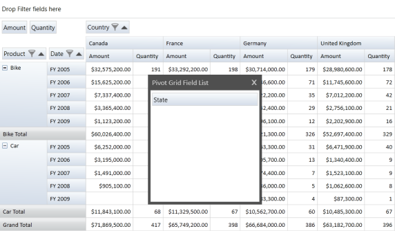

#### Properties

PivotGridControl Table

<table>
    <tr>
        <th>{{ '**Property**' | markdownify }}</th>
		<th>{{ '**Description**' | markdownify }}</th>
		<th>{{ '**Type**' | markdownify }}</th>
		<th>{{ '**Data Type**' | markdownify }}</th>
		<th>{{ '**Reference links**' | markdownify }}</th>
	</tr>
	
    <tr>
        <td>PivotFields</td>
		<td>Gets the collection of PivotItems to be displayed in FieldList</td>
		<td>Normal</td>
		<td>ObservableCollection</td>
		<td>NA</td>
    </tr>
	
    <tr>
        <td>ShowFieldList</td>
		<td>Gets or sets a value indicating whether to display FieldList</td>
		<td>Dependency</td>
		<td>bool</td>
		<td>NA</td>
    </tr>
</table>

GroupingBar Table

<table>
	<tr>
		<th>{{ '**Property**' | markdownify }}</th>
		<th>{{ '**Description**' | markdownify }}</th>
		<th>{{ '**Type**' | markdownify }}</th>
		<th>{{ '**Data Type**' | markdownify }}</th>
		<th>{{ '**Reference links**' | markdownify }}</th>
	</tr>
	<tr>
		<td>FieldList</td>
		<td>Gets the field list, which is used to add items into the Grouping Bar</td>
		<td>Normal</td>
		<td>Window</td>
		<td>NA</td>
	</tr>
	<tr>
		<td>FieldListBorderBrush</td>
		<td>Gets or sets the Border brush for Field List</td>
		<td>Dependency</td>
		<td>Brush</td>
		<td>NA</td>
	</tr>
</table>

#### Sample Link

To access a Conditional Formatting sample

1. Open the Syncfusion Dashboard. 
2. Click Business Intelligence.
3. Click the WPF drop-down list, and select Explore Samples. 
4. Navigate to PivotAnalysis.WPF -> Samples -> Field List -> Field List Demo.

## Grouping Bar Context Menu

The Grouping bar context menu consists of the following menu items:

1. Reload Data - Refresh the Grid with the Current Item source
2. Show Field List - Launches the PivotGrid Field List

The following are the menu items present in the context menu of Grouping bar items:

1. Reload Data - Refresh the Grid with the Current Item Source
2. Order – It is used to change the position of the item present in the Grouping bar. It contains the following sub menu items:
1. Move to Beginning - Moves the current item to the first position
2. Move to Left - Moves the current item one step towards its left
3. Move to Right - Moves the current item one step towards its right
4. Move to End - Moves the current item to the last position
3. Show Field List - Launches the PivotGrid Field List

#### Use Case Scenarios

This feature is useful for applications related to Stock Market where the data will change from time to time and users can refresh the grid using the context menu.

#### Adding Grouping Bar Context Menu

#### Sample Link

To access a Conditional Formatting sample:

1. Open the Syncfusion Dashboard. 
2. Click Business Intelligence.
3. Click the WPF drop-down list, and select Explore Samples. 
4. Navigate to PivotAnalysis.WPF -> Samples -> Grouping Bar -> Context Menu Demo.

## Restrict Auto-resizing of Row Header Area

The PivotGrid control provides support for restricting the row header items from being stretched when there are too many items in the computation area. When the Computation button (Show List button) located in the DataHeaderArea of the grouping bar is clicked, the Computation List window appears with the computation fields. 

#### Use Case Scenarios

This feature will restrict the row header items from being stretched and maintains its size with the fixed one so that users can view most of the data in the viewable area instead of scrolling to view the data.

Properties

Property Table

<table>
<tr>
<th>
{{ '**Property**' | markdownify }}</th><th>
{{ '**Description**' | markdownify }}</th><th>
{{ '**Type**' | markdownify }}</th><th>
{{ '**Data Type**' | markdownify }}</th></tr>
<tr>
<td>
AllowRowHeaderAreaAutoSizing</td><td>
Shows the ComputationButton (Show Field List Button) whose click event opens the Computation List Window with the calculation fields of the PivotGrid and restricts the stretching of row header items in the grouping bar.</td><td>
Dependency</td><td>
Boolean </td></tr>
</table>

### Enabling Resizing Pivot Grid

Users can enable or disable this feature by using the AllowRowHeaderAreaAutoSizing__property. To show the Computation button (Show Fields button) and to restrict the row header items from being stretched when more items are added to the computation area, set this property to false. To hide the Computation button (Show Fields Button) and to allow the row header items to stretch when more items are added to the computation area, set this property to true. By default the property is set to true.

The following code illustrates how to restrict the items from stretching and how to show the Computation List window through Computation button click:

 

this.pivotGrid1.AllowRowHeaderAreaAutoSizing = false;

  

 

Me.pivotGrid1.AllowRowHeaderAreaAutoSizing = False

 

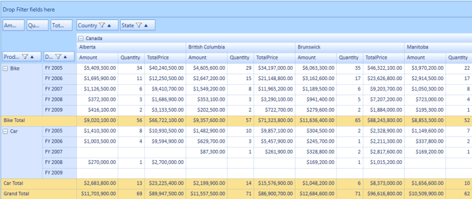

The following code illustrates how to allow the items to stretch and how to hide the Computation button:

  

this.pivotGrid1.AllowRowHeaderAreaAutoSizing = true;

 

 

Me.pivotGrid1.AllowRowHeaderAreaAutoSizing = True 

 

###  Sample Link
Follow the steps given below to view a sample of this feature. 

1. Select Start > Programs > Syncfusion > Essential Studio x.x.xx > Dashboard
2. Click Run Samples for WPF under BI edition
3. Select PivotGrid
4. Navigate to Product Showcase > PivotGrid Demo

## Serialization/Deserialization

Using this feature, you can save the current state of PivotGrid as an XML file format and restore the same at any time. 

The following properties of PivotGrid control can be serialized.

Property Table

<table>
<tr>
<th>
{{ '**Property Name**' | markdownify }}</th><th>
{{ '**Type**' | markdownify }}</th></tr>
<tr>
<td>
AllowResizeColumns</td><td>
bool</td></tr>
<tr>
<td>
AllowResizeRows</td><td>
bool</td></tr>
<tr>
<td>
AllowSelection</td><td>
bool</td></tr>
<tr>
<td>
AutoSizeColumnCount</td><td>
int</td></tr>
<tr>
<td>
AutoSizeOption</td><td>
GridAutoSizeOption</td></tr>
<tr>
<td>
AutoSizeRowCount</td><td>
int</td></tr>
<tr>
<td>
DeferLayoutUpdate</td><td>
bool</td></tr>
<tr>
<td>
Filters</td><td>
ObservableCollection</td></tr>
<tr>
<td>
FreezeHeaders</td><td>
bool</td></tr>
<tr>
<td>
IsDynamicData</td><td>
bool</td></tr>
<tr>
<td>
PivotCalculations</td><td>
ObservableCollection</td></tr>
<tr>
<td>
PivotColumns</td><td>
ObservableCollection</td></tr>
<tr>
<td>
PivotFields</td><td>
ObservableCollection</td></tr>
<tr>
<td>
PivotRows</td><td>
ObservableCollection</td></tr>
<tr>
<td>
ShowCalculationsAsColumns</td><td>
bool</td></tr>
<tr>
<td>
ShowFieldList</td><td>
bool</td></tr>
<tr>
<td>
ShowGrandTotals</td><td>
bool</td></tr>
<tr>
<td>
ShowGroupingBar</td><td>
bool</td></tr>
<tr>
<td>
GroupingBar.AllowFiltering</td><td>
bool</td></tr>
<tr>
<td>
GroupingBar.AllowSorting</td><td>
bool</td></tr>
</table>

On Serialization, the expand and the collapse state of PivotGrid cells are maintained. So while de-serializing, the item source specified for the Grid should be as same as that when used in Serialization. This can be ignored by setting IgnoreExpandCollapseOnSerialization property of PivotGrid control to False.

#### Use Case Scenarios

Serialization can be implemented for applications which need to save its data and structure after the application is closed. Serialization supports to save the structure and data of PivotGridControl to an XML file and it can be loaded at any time.

#### Adding Serialization/Deserialization

Serialization/Deserialization can be achieved using the following code snippet,

 

/// Serialize the PivotGrid into XML file format.

this.pivotGrid1.Serialize();

/// De serialize the PivotGrid from the saved XML file.

this.pivotGrid1.Deserialize();

/// Serialize the PivotGrid into XML file format and saves it in the specified location.

this.pivotGrid1.Serialize(@"C:/PivotGrid.xml");

/// De serialize the PivotGrid from the specified XML file.

this.pivotGrid1.Deserialize(@"C:/PivotGrid.xml");

  

 

' Serialize the PivotGrid into XML file format.

Me.pivotGrid1.Serialize()

' De serialize the PivotGrid from the saved XML file.

Me.pivotGrid1.Deserialize()

' Serialize the PivotGrid into XML file format and saves it in the specified location.

Me.pivotGrid1.Serialize("C:/PivotGrid.xml")

' De serialize the PivotGrid from the specified XML file.

Me.pivotGrid1.Deserialize("C:/PivotGrid.xml")

 

#### Methods

Methods Table

<table>
<tr>
<th>
{{ '**Method**' | markdownify }}</th><th>
{{ '**Description**' | markdownify }}</th><th>
{{ '**Parameters**' | markdownify }}</th><th>
{{ '**Type**' | markdownify }}</th><th>
{{ '**Return Type**' | markdownify }}</th></tr>
<tr>
<td>
Serialize()</td><td>
Serializes the PivotGrid into XML file format using the save file dialog</td><td>
</td><td>
void</td><td>
void</td></tr>
<tr>
<td>
Deserialize()</td><td>
Deserializes the PivotGrid from the saved XML file using the open file dialog</td><td>
</td><td>
void</td><td>
void</td></tr>
<tr>
<td>
Serilize(string fileName)</td><td>
Serializes the PivotGrid into XML file format and saves it in the specified location</td><td>
string fileName</td><td>
void</td><td>
void</td></tr>
<tr>
<td>
Deserialize(string filename)</td><td>
Deserializes the PivotGrid from the specified XML file</td><td>
string fileName</td><td>
void</td><td>
void</td></tr>
</table>

#### Sample Link

To access a Conditional Formatting sample:

1. Open the Syncfusion Dashboard.
2. Click Business Intelligence.
3. Click the WPF drop-down list, and select Explore Samples.
4. Navigate to PivotAnalysis.WPF -> Samples -> Serialization -> Serialization Demo.

## Removing Fields from Grouping Area

Essential PivotGrid provides a remove button for fields in grouping area. This helps you to remove the fields from _Grouping Area._ Removed fields will be stored in the _PivotTable Field List_ dialog for later use. Instead of dragging the field from _Grouping Area_, you can click the remove button to achieve this.

Property Table

<table>
<tr>
<th>
{{ '**Property**' | markdownify }}</th><th>
{{ '**Description**' | markdownify }}</t><th>
{{ '**Type**' | markdownify }}</th><th>
{{ '**Data Type**' | markdownify }}</th><th>
{{ '**Reference links**' | markdownify }}</th></tr>
<tr>
<td>
AllowRemove </td><td>
Enables remove button. </td><td>
Dependency </td><td>
Boolean  </td><td>
NA</td></tr>
</table>

#### Enabling Remove Button 

To add the remove button for fields in grouping area, set the _AllowRemove_ property to true. By default this is set to false. 

The following code illustrates how to enable the remove button:

  

this.pivotGrid1.GroupingBar.AllowRemove = true;

 

  

Me.pivotGrid1.GroupingBar.AllowRemove = True



#### Sample Link

A demo of this feature is available in the following location:

#### Windows 7/Vista

SystemDrive:\Users\<user_name>\AppData\Local\Syncfusion\EssentialStudio\<version_number>\BI\WPF\PivotAnalysis.Wpf\Samples\Grouping Bar\Grouping Bar Demo_

#### Windows XP

SystemDrive:\Syncfusion\EssentialStudio\<version_number>\ BI\WPF\PivotAnalysis.Wpf\Samples\Grouping Bar\Grouping Bar Demo_ 

## Runtime Custom Summary Type setting

This feature enables the user to set the custom summaries to the pivot item at both load time and runtime (using PivotComputationInfo dialog).

#### Use Case Scenarios

The user can set different custom summary types at runtime. 

The following screenshot shows the custom summary at runtime:

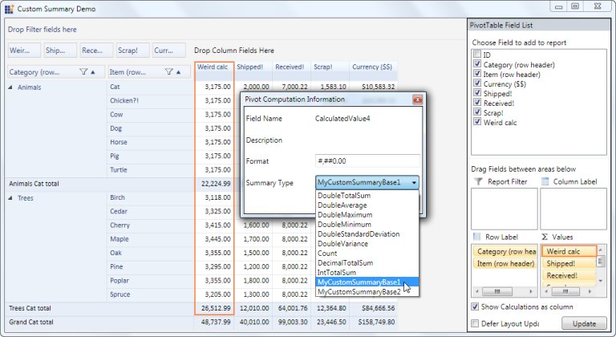

#### Property

Property Table

<table>
<tr>
<th>
{{ '**Property**' | markdownify }}</th><th>
{{ '**Description**' | markdownify }}</th><th>
{{ '**Type**' | markdownify }}</th><th>
{{ '**Data Type**' | markdownify }}</th><th>
{{ '**Reference links**' | markdownify }}</th></tr>
<tr>
<td>
CustomSummaryBaseCollection</td><td>
Gets/Sets the Custom SummaryBase collection to set via PivotComputationInfo Dialog at runtime</td><td>
CLR</td><td>
ObservableCollection of type SummaryBase </td><td>
- </td></tr>
</table>

#### Sample Link

The user can find a sample in the following location:

{InstalledLoction}:\Users\{User}AppData\Local\Syncfusion\EssentialStudio\{InstalledVersion}\BI\WPF\PivotAnalysis.WPF\Samples\Summaries\CustomSummariesDemo

#### Adding Runtime Custom Summary Type setting to an Application 

To add the feature to an application:

1.Create a Custom SummaryBase class using the abstract class SummaryBase. 

2.Implement your summary logics by overriding Combine(), CombineSummary(),GetResult() methods. 

3.Create an object for the Custom Summary. 

4.Set the created object to PivotSchemaDesigner object’s  CustomSummaryBaseCollection property. 

  Hence this property is an ObservableCollection type of SummaryBase that enable the user to add more than one class object. Each object is considered as a unique Custom SummaryBase. 

5. Using the CustomSummaryBaseCollection, set the summary for the respective columns by its Summary property.  
 
Note: Ensure to set the SummaryType as Custom, otherwise the default type Count will be assigned._ 

To set Custom Summary at runtime:

1. Double click Items from the PivotSchemaDesigner which will pop up the Pivot Computation Information dialog box. 
2. In the Summary Type combo box, you can select the Custom summaries. 

The following code snippets, explains the implementation of adding Runtime Custom Summary Type settings feature:

  

/// Adding Custom SummaryBases to the CustomSummaryBaseCollection property

this.Designer.CustomSummaryBaseCollection = new System.Collections.ObjectModel.ObservableCollection<SummaryBase> { new CustomSummaries.MyCustomSummaryBase1(), new CustomSummaries.MyCustomSummaryBase2() };

/// Setting the summary to the Pivot item using the same collection

CalcColumn.Summary = this.Designer.CustomSummaryBaseCollection[0];

/// Setting the Summary type to Custom

CalcColumn.SummaryType = SummaryType.Custom;

 

 

' Adding Custom SummaryBases to the CustomSummaryBaseCollection property

Me.Designer.CustomSummaryBaseCollection = New System.Collections.ObjectModel.ObservableCollection(Of SummaryBase) From {New CustomSummaries.MyCustomSummaryBase1(), New CustomSummaries.MyCustomSummaryBase2()}

' Setting the summary to the Pivot item using the same collection

CalcColumn.Summary = Me.Designer.CustomSummaryBaseCollection(0)

' Setting the Summary type to Custom

CalcColumn.SummaryType = SummaryType.Custom

  

## State Persistence

This feature enables the user to maintain the collapsed or expanded state in the PivotGrid when pivot schema is changed.

#### Use Case Scenarios

The user can maintain collapsed or expanded states and save/load these settings dynamically in the PivotGrid control. 

The following image shows state persistence in the PivotGrid control:

#### Properties

Property Table

<table>
<tr>
<th>
{{ '**Property**' | markdownify }}</th><th>
{{ '**Description**' | markdownify }}</th><th>
{{ '**Type**' | markdownify }}</th><th>
{{ '**Data Type**' | markdownify }}</th><th>
{{ '**Reference links**' | markdownify }}</th></tr>
<tr>
<td>
StatePersistenceEnabled</td><td>
Gets or sets a value indicating whether to maintain/show collapsed cells when pivot schema getting changed</td><td>
Dependency </td><td>
Boolean</td><td>
</td></tr>
</table>

#### Sample Link

The user can find a sample in the following location:

SystemDrive:\Users\<user_name>\AppData\Local\Syncfusion\EssentialStudio\<version_number>\BI\WPF\PivotAnalysis.Wpf\Samples\Appearance\State Persistence Demo

#### Adding State Persistence to an Application 

The user can enable or disable the state persistence by using the following code snippets in an application:

  

pivotGrid1.StatePersistenceEnabled = true;

 

 

pivotGrid1.StatePersistenceEnabled = true

 

## Subtotal Hiding

The sub-total hiding feature is used to show or hide sub-totals in PivotGrid. This feature enables you to have an abstract view of the data, in case of a larger data table by hiding sub-totals using the ShowSubTotals__property.

#### Use Case Scenarios

When the user has more computational fields with sub-totals for each group in PivotGrid, as shown here, it can be difficult to view all the data. In such cases, you can hide the sub-totals and make it visible when required.

The following screenshot shows the PivotGrid with the sub-totals shown and hidden.

#### Properties

Properties

<table>
<tr>
<th>
{{ '**Property**' | markdownify }}</th><th>
{{ '**Description**' | markdownify }}</th><th>
{{ '**Value it Accepts**' | markdownify }}</th><th>
{{ '**Data Type**' | markdownify }}</th></tr>
<tr>
<td>
ShowSubTotals</td><td>
Shows or hides sub-totals </td><td>
True(Default)False </td><td>
Boolean </td></tr>
<tr>
<td>
ShowRowSubTotals</td><td>
Shows or hides sub-totals for pivot rows</td><td>
True(Default)False</td><td>
Boolean</td></tr>
<tr>
<td>
ShowColumnSubTotals</td><td>
Shows or hides sub-totals for pivot columns</td><td>
True(Default)False</td><td>
Boolean</td></tr>
</table>

#### Methods

Methods

<table>
<tr>
<th>
{{ '**Method**' | markdownify }}</th><th>
{{ '**Description**' | markdownify }}</th><th>
{{ '**Parameters**' | markdownify }}</th><th>
{{ '**Type**' | markdownify }}</th><th>
{{ '**Return Type**' | markdownify }}</th></tr>
<tr>
<td>
SubTotalsRendering</td><td>
Handles rendering of cells(showing or hiding the cells) by calculating the cell range values in the Pivot Engine based on the ShowSubTotals property value in the control</td><td>
</td><td>
Server Side </td><td>
Void </td></tr>
<tr>
<td>
SubTotalsVisibilityRenderer</td><td>
Handles rendering of cells(showing or hiding the cells) by calculating the cell range values for both rows and columns in the PivotEngine</td><td>
PivotItem</td><td>
Server Side</td><td>
Void</td></tr>
</table>

#### Adding sub-total hiding to an application 

The following code example shows how to set values for the ShowSubTotals property:

#### To hide sub-totals

In XAML,

To hide sub-totals, set the ShowSubTotals property as False as illustrated here.

 

<Grid>

<syncfusion:PivotGridControl HorizontalAlignment="Left" Name="PivotGridControl1" VerticalAlignment="Top"

ShowSubTotals="False" ItemSource="{Binding Source={StaticResource data}}" >

</syncfusion:PivotGridControl>

</Grid>

 

Through Code Behind,

To hide sub-totals, set the ShowSubTotals property as False in the MainWindow() constructor.

 

public MainWindow()

{

    InitializeComponent();

    this.pivotGrid1.ShowSubTotals = false;   

}

  

 

Public Sub MainWindow()

    InitializeComponent()

    Me.pivotGrid1.ShowSubTotals = False

End Sub

 

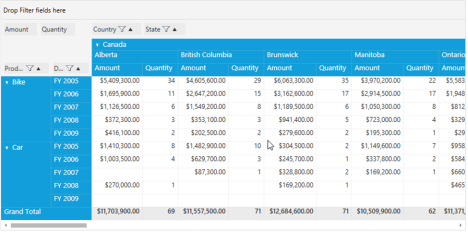

####To hide sub-totals for columns

#### In XAML,

To hide sub-totals, set the ShowColumnSubTotals property as False as illustrated here.

 

<Grid>

<syncfusion:PivotGridControl HorizontalAlignment="Left" Name="PivotGridControl1" VerticalAlignment="Top"

ShowColumnSubTotals="False" ItemSource="{Binding Source={StaticResource data}}" >

</syncfusion:PivotGridControl>

</Grid>

 

#### Through Code Behind,

To hide sub-totals for columns, set the ShowColumnSubTotals property to False in MainWindow() constructor.

  

public MainWindow()

{

    InitializeComponent();

    this.pivotGrid1.ShowColumnSubTotals = false;

}

 

 

Public Sub MainWindow()

    InitializeComponent()

    Me.pivotGrid1.ShowColumnSubTotals = False

End Sub

 

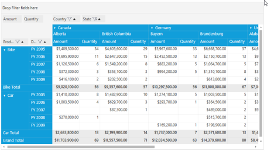

#### To hide sub-totals for rows:

#### In XAML,

To hide sub-totals, set the ShowRowSubTotals property as False as illustrated here.

 

<Grid>

<syncfusion:PivotGridControl HorizontalAlignment="Left" Name="PivotGridControl1" VerticalAlignment="Top"

ShowRowSubTotals="False" ItemSource="{Binding Source={StaticResource data}}" >

</syncfusion:PivotGridControl>

</Grid>

 

#### Through Code Behind

To hide sub-totals for rows, set the ShowRowSubTotals property as False in the MainWindow() constructor.

  

public MainWindow()

{

    InitializeComponent();

    this.pivotGrid1.ShowRowSubTotals = false;

}

 

 

Public Sub MainWindow()

    InitializeComponent()

    Me.pivotGrid1.ShowRowSubTotals = False

End Sub

 

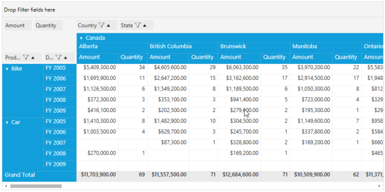

## Resizing the PivotGrid to fit its content

PivotGrid provides support for resizing the grid to fit its content while group expanding and collapsing the groups. The grid will be resized after refreshing the page. 

#### Use Case Scenarios

This feature will be useful to provide more space to display the controls sharing its parent control during group collapse operation. 

#### Properties

Property Table

<table>
<tr>
<th>
{{ '**Property**' | markdownify }}</th><th>
{{ '**Description**' | markdownify }}</th><th>
{{ '**Type**' | markdownify }}</th><th>
{{ '**Data Type**' | markdownify }}</th><th>
{{ '**Reference links**' | markdownify }}</th></tr>
<tr>
<td>
ResizePivotGridToFit </td><td>
Resizes the PivotGrid according to the content of the grid. </td><td>
Dependency</td><td>
Boolean </td><td>
NA </td></tr>
</table>

#### Enabling Resizing Pivot Grid

You can enable or disable this feature using the _ResizePivotGridToFit_ property.  To enable resizing, set this property to true. To disable resizing, set this property to false.  By default this is set to false.

The following code illustrates how to enable resizing to fit the content, when you expand or collapse the PivotGrid group:

  

this.pivotGrid1.ResizePivotGridToFit = true; 

 

 

Me.pivotGrid1.ResizePivotGridToFit = True 

 

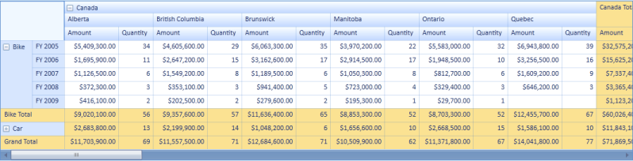

The following code illustrates how to disable resizing to fit the content, when you expand or collapse the PivotGrid group:

  

this.pivotGrid1.ResizePivotGridToFit = false;

 

 

Me.pivotGrid1.ResizePivotGridToFit = False

 

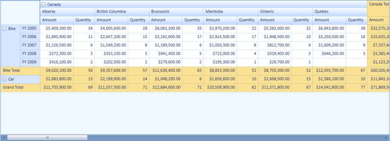

#### Sample Link

To view samples: 

1.Open Syncfusion Dashboard.

2.Select BI > WPF.

3.Click Run Samples.

4.Navigate to PivotGrid > Product Showcase > Pivot Grid Demo.

## Sorting Pivot Fields

The pivot row fields, pivot column fields, and PivotComputationInfo fields can be arranged individually either in ascending or descending order. The following options to handle this arrangement are available in the context menu that appears in the grouping bar:

*Smallest to Largest—Arranges the pivot fields based on the field header from first letter to the last.

*Largest to Smallest—Arranges the pivot fields based on the field header from last letter to the first.

The above mentioned options will rearrange the fields in the respective pivot item area.

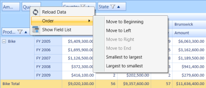

#### Sample Link

A demo of this feature is available in the following location:

C:\Users\<UserName>\AppData\Local\Syncfusion\EssentialStudio\x.x.x.x\ BI\WPF\PivotAnalysis.WPF\Samples\Grouping Bar\Context Menu Demo\

### Sort by value of computations fields

This feature allows users to sort column values in ascending or descending order. 

There are five options for sorting:

1.Sort all the columns.

2.Sort all columns other than total and grand total columns.

3.Sort only total columns.

4.Sort only grand total columns.

5.Disable sort.

#### Use Case Scenarios

Using this feature, the values in the columns can be sorted in given order, either ascending or descending. 

Properties

Properties Table

<table>
<tr>
<th>
{{ '**Property**' | markdownify }}</th><th>
{{ '**Description**' | markdownify }}</th><th>
{{ '**Type**' | markdownify }}</th><th>
{{ '**Data Type**' | markdownify }}</th><th>
{{ '**Reference links**' | markdownify }}</th></tr>
<tr>
<td>
SortDirection</td><td>
Gets or sets the sort order to ascending or descending. </td><td>
CLR </td><td>
ListSortDirection</td><td>
NA</td></tr>
<tr>
<td>
SortOption</td><td>
Gets or sets the sorting option as all, none, columnsorting, total sorting, or grandtotal sorting.</td><td>
DependencyProperty</td><td>
PivotSortOption</td><td>
NA</td></tr>
</table>

Methods

Method Table

<table>
<tr>
   <th>{{ '**Method**' | markdownify }}</th>
   <th>{{ '**Description**' | markdownify }}</th>
   <th>{{ '**Parameters**' | markdownify }}</th>
   <th>{{ '**Type**' | markdownify }}</th>
   <th>{{ '**Return Type**' | markdownify }}</th>
   <th>{{ '**Reference links**' | markdownify }}</th>
</tr>
<tr>
    <td>SortByCalculation</th>
	<td>Sorts the values in the columns in ascending or descending order.</th>
	<td>columnIndex </th>
	<td>NA</th>
	<td>void</th>
	<td>NA</th>
</tr>
</table>

Enum

Enum Table

<table>
<tr>
<th>
{{ '**Name**' | markdownify }}</th><th>
{{ '**Options**' | markdownify }}</th></tr>
<tr>
<td>
PivotSortOption</td><td>
NoneAll Column SortingTotal SortingGrandTotal Sorting </td></tr>
</table>

#### Sample Link

{InstalledDrive}:\Users\{username}\AppData\Local\Syncfusion\EssentialStudio\11.1.0.9\Wpf\PivotAnalysis.WPF\Interactivity features\SortingDemo

Adding sort by value of computations fields to an application

The following code sample illustrates how to sort computations fields by value:



Sorting Options

//All: Enables sort on all the columns in pivot grid.

this.pivotGrid.SortOption = PivotSortOption.All;

//Column Sorting: Enables sort on all the columns other than total and grand total columns.

this.pivotGrid.SortOption = PivotSortOption.ColumnSorting;

//Total Sorting: Enables sort on total columns.

this.pivitGrid.SortOption = PivotSortOption.TotalSorting;

//GrandTotal Sorting: Enables sort on grand total columns.

this.pivotGrid.SortOption = PivotSortOption.GrandTotalSorting;

//None: It is the default option and it disables sorting on columns.

this.pivotGrid.SortOption = PivotSortOption.None;



### Providing the option to add/remove Report Filters in the PivotGrid control

This feature provides programmatic-level support to apply filtering (Add, Remove, Insert, RemoveAt, InsertAt) to the pivot grid.

The following filter operations can be done from programmatic level:

1.Add – Includes a filter item at the end of the filter collection.

2.InsertAt – Used to insert the filter item at the given position in the collection.

3.Remove – Removes the given filter item.

4.RemoveAt- Used to remove the item present at the given position.

5.Clear- Removes all the items in the filter collection.

#### Use Case Scenarios

This feature helps the user to add or remove the filter items from programmatic level instead of UI.

Properties

Properties Table

<table>
<tr>
<th>
{{ '**Property**' | markdownify }}</th><th>
{{ '**Description**' | markdownify }}</th><th>
{{ '**Type**' | markdownify }}</th><th>
{{ '**Data Type**' | markdownify }}</th><th>
{{ '**Reference links**' | markdownify }}</th></tr>
<tr>
<td>
DimensionName</td><td>
Name of the dimension (FieldMappingName). </td><td>
CLR </td><td>
string</td><td>
NA</td></tr>
<tr>
<td>
DimensionHeader</td><td>
Name of the dimension header (FieldHeader).</td><td>
CLR</td><td>
string</td><td>
NA</td></tr>
<tr>
<td>
ItemCollection</td><td>
Returns the list of elements under the filter item.</td><td>
CLR</td><td>
FilterItemsCollection</td><td>
NA</td></tr>
</table>

#### Methods

Methods Table

<table>
<tr>
<th>
{{ '**Method**' | markdownify }}</th><th>
{{ '**Description**' | markdownify }}</th><th>
{{ '**Parameters**' | markdownify }}</th><th>
{{ '**Type**' | markdownify }}</th><th>
{{ '**Return Type**' | markdownify }}</th><th>
{{ '**Reference links**' | markdownify }}</th></tr>
<tr>
<td>
AddFilter</td><td>
Used to add a filter item in the filter collection.</td><td>
(FilterExpression item) </td><td>
NA </td><td>
void</td><td>
NA</td></tr>
<tr>
<td>
RemoveFilter</td><td>
Used to remove the given item from the filter collection.</td><td>
(FilterExpress item)</td><td>
NA</td><td>
void</td><td>
NA</td></tr>
</table>

#### Sample Link

{InstallationDrive}:\Users\{UserName} \AppData\Local\Syncfusion\EssentialStudio\11.1.0.9\Wpf \PivotAnalysis.Wpf\Interactivity features\FilteringDemo

### Adding the providing option to add or remove Report Filters in the PivotGrid control to an application

  

 //Add:            

               this.pivotGrid.Filters.Add(new FilterExpression("Product"));

//Remove:

               this.pivotGrid.Filters.Remove(this.Target.Filters.Where(i => i.DimensionName == "Product").FirstOrDefault());

//Insert:

               this.pivotGrid.Filters.Insert(0, new FilterExpression("State"));

//RemoveAt:

               this.pivotGrid.Filters.RemoveAt(1);

//Clear:                    
               this.pivotGrid.Filters.Clear();



## ToolTips

ToolTips can be set to individual cells. The ToolTip information has the cell value and its respective row and column data and it is set in the style’s Tag property. Using a simple Boolean property, it can be set to the PivotGrid. A ToolTip’s skin will be set depending upon the theme set for the PivotGrid. Also, users can customize the ToolTip skin at the sample level. ToolTip text can be localized for its “Value”, “Row”, and “Column” text. Users can also set custom text for ToolTips.

#### Use Case Scenarios

ToolTips can be used to show the data of any cell so that user can get the cell’s full information, e.g., the row and column on which it depends.

### Properties

Properties Table

<table>
<tr>
<th>
{{ '**Property**' | markdownify }}</th><th>
{{ '**Description**' | markdownify }}</th><th>
{{ '**Type**' | markdownify }}</th><th>
{{ '**Data Type**' | markdownify }}</th></tr>
<tr>
<td>
TooltipEnabled</td><td>
Enable/disable the ToolTip for the PivotGrid control.</td><td>
Dependency</td><td>
Boolean </td></tr>
<tr>
<td>
TooltipEnabled</td><td>
Enable/disable the ToolTip for individual cell styles (ColumnHeaderStyle, RowHeaderStyle, ValueCellStyle, SummaryCellStyle, SummaryHeaderStyle)</td><td>
Dependency</td><td>
Boolean </td></tr>
<tr>
<td>
CustomToolTipTemplateKey</td><td>
Gets/sets the DataTemplate key for custom ToolTips for the entire PivotGrid control.</td><td>
CLR</td><td>
String</td></tr>
<tr>
<td>
CustomToolTipTemplateKey</td><td>
Gets/sets DataTemplate key for custom ToolTip for individual cell styles (ColumnHeaderStyle, RowHeaderStyle, ValueCellStyle, SummaryCellStyle, SummaryHeaderStyle)</td><td>
CLR</td><td>
String</td></tr>
</table>

### Sample Link

A sample is available in the Essential Studio WPF dashboard in the following location.

PivotAnalysis > Appearance > ToolTipDemo

{InstalledDrive}\Users\ {User}\AppData\ Local \Syncfusion\ EssentialStudio\{Installed Version}\BI\WPF\PivotAnalysis.Wpf\Samples\Appearance \Tooltip Demo

### Adding ToolTip to an Application 

To show the ToolTip in the PivotGrid control you need to set the PivotGrid control’s TooltipEnabled property to true. This is the master property which controls all the styles of the ToolTip property. The following code explains its usage.

 

//Enable Tooltip for PivotGridControl

this.pivotGrid1.ToolTipEnabled = true;

  

 

//Enable Tooltip for PivotGridControl

Me.pivotGrid1.ToolTipEnabled = True

 

You can set the appearance of ToolTips with respect to their styles. Each style has its own ToolTipEnabled property. These properties help to set the appearance individually for each style. The following code explains its implementation.

  

//Enable Tooltip for RowHeaderCellStyle

this.pivotGrid1.RowHeaderCellStyle.ToolTipEnabled = true;

//Enable Tooltip for ColumnHeaderCellStyle

this.pivotGrid1.ColumnHeaderCellStyle.ToolTipEnabled = true;

//Enable Tooltip for ValueCellStyle

this.pivotGrid1.ValueCellStyle.ToolTipEnabled = true;

//Enable Tooltip for SummaryHeaderStyle

this.pivotGrid1.SummaryHeaderStyle.ToolTipEnabled = true;

//Enable Tooltip for SummaryCellStyle

this.pivotGrid1.SummaryCellStyle.ToolTipEnabled = true;

 

 

//Enable Tooltip for RowHeaderCellStyle

Me.pivotGrid1.RowHeaderCellStyle.ToolTipEnabled = True

//Enable Tooltip for ColumnHeaderCellStyle

Me.pivotGrid1.ColumnHeaderCellStyle.ToolTipEnabled = True

//Enable Tooltip for ValueCellStyle

Me.pivotGrid1.ValueCellStyle.ToolTipEnabled = True

//Enable Tooltip for SummaryHeaderStyle

Me.pivotGrid1.SummaryHeaderStyle.ToolTipEnabled = True

//Enable Tooltip for SummaryCellStyle

Me.pivotGrid1.SummaryCellStyle.ToolTipEnabled = True

 

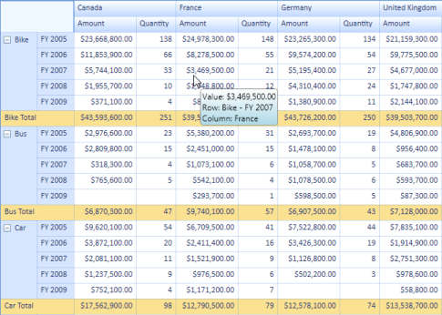

Custom data templates can be set to the PivotGrid control’s ToolTip. To do so, you need to write a data template and bind the style’s Tag property and set the key to the PivotGrid control’s CustomToolTipTemplateKey property. The following code explains its implementation.

   

//Set the Custom DataTemplate for PivotGridControl’s Tooltip

this.pivotGrid1.CustomToolTipTemplateKey = "CustomTemplateTooltip";



 

//Set the Custom DataTemplate for PivotGridControl’s Tooltip

Me.pivotGrid1.CustomToolTipTemplateKey = "CustomTemplateTooltip"

 

You can set the data template of ToolTip with respect to its styles. Each style has its own CustomToolTipTemplateKey property. These properties help to set the appearance individually for each style. The following code explains its implementation.

  

//Set the Custom DataTemplate for ColumnHeaderCellStyle Tooltip

this.pivotGrid1.ColumnHeaderCellStyle.CustomToolTipTemplateKey = "ColumnTemplateTooltip";

//Set the Custom DataTemplate for RowHeaderCellStyle Tooltip

this.pivotGrid1.RowHeaderCellStyle.CustomToolTipTemplateKey = "RowTemplateTooltip";

//Set the Custom DataTemplate for 	ValueCellStyle Tooltip

this.pivotGrid1.ValueCellStyle.CustomToolTipTemplateKey = "ValueTemplateTooltip";

//Set the Custom DataTemplate for 	SummaryHeaderStyle Tooltip

this.pivotGrid1.SummaryHeaderStyle.CustomToolTipTemplateKey = "SummaryHeaderTemplateTooltip";

//Set the Custom DataTemplate for SummaryCellStyle Tooltip

this.pivotGrid1.SummaryCellStyle.CustomToolTipTemplateKey = "SummaryCellTemplateTooltip";

 

 

//Set the Custom DataTemplate for ColumnHeaderCellStyle Tooltip

Me.pivotGrid1.ColumnHeaderCellStyle.CustomToolTipTemplateKey = "ColumnTemplateTooltip"

//Set the Custom DataTemplate for RowHeaderCellStyle Tooltip

Me.pivotGrid1.RowHeaderCellStyle.CustomToolTipTemplateKey = "RowTemplateTooltip"

//Set the Custom DataTemplate for 	ValueCellStyle Tooltip

Me.pivotGrid1.ValueCellStyle.CustomToolTipTemplateKey = "ValueTemplateTooltip"

//Set the Custom DataTemplate for 	SummaryHeaderStyle Tooltip

Me.pivotGrid1.SummaryHeaderStyle.CustomToolTipTemplateKey = "SummaryHeaderTemplateTooltip"

//Set the Custom DataTemplate for SummaryCellStyle Tooltip

Me.pivotGrid1.SummaryCellStyle.CustomToolTipTemplateKey = "SummaryCellTemplateTooltip"

 

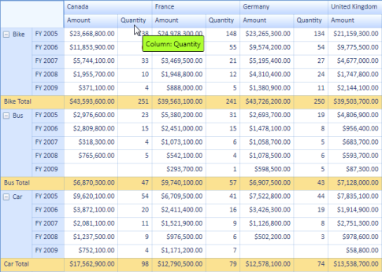

## Updating and Editing

### Editing and Updating in Value and Total Cells in the PivotGrid Control

Editing and updating the value cells and total cells is possible now in the PivotGrid control. Editing and updating can be enabled through the EnableValueEditing and EnableUpdating properties respectively. While handling the editing and updating operations, the values will be calculated automatically and its total values will be reflected.

#### Use Case Scenarios

Editing and updating features are useful when users would like to edit the values at run time and save their changes to the underlying data source, thereby reflecting its update in the total cells.

### Tables for Properties, Methods, and Events

### Properties

Properties Table

<table>
<tr>
<th>
{{ '**Property**' | markdownify }}</th><th>
{{ '**Description**' | markdownify }}</th><th>
{{ '**Type**' | markdownify }}</th><th>
{{ '**Data Type**' | markdownify }}</th></tr>
<tr>
<td>
EnableValueEditing</td><td>
Gets/sets the Boolean value to enable editing in value cells</td><td>
CLR</td><td>
Boolean </td></tr>
<tr>
<td>
EnableUpdating</td><td>
Gets/sets the Boolean value to enable updating</td><td>
CLR</td><td>
Boolean</td></tr>
<tr>
<td>
ThrottleUpdateRate</td><td>
Gets or sets a millisecond value for time between UI refreshes. Zero indicates immediate refreshes of the UI without delays. Throttling the refresh rate can minimize CPU usage. The default value is zero, but depending upon your updating rate, values of 300 to 500 milliseconds may give lower CPU usage.</td><td>
CLR</td><td>
Int</td></tr>
<tr>
<td>
AllowEditingOfTotalCells</td><td>
Gets/sets the Boolean value to enable editing in total cells</td><td>
CLR</td><td>
Boolean</td></tr>
<tr>
<td>
HideExpanders</td><td>
Gets/sets the Boolean value to hide expanders in the header cells</td><td>
CLR</td><td>
Boolean</td></tr>
</table> 

### Events

Event Table

<table>
<tr>
<th>
{{ '**Event**' | markdownify }}</th><th>
{{ '**Description**' | markdownify }}</th><th>
{{ '**Arguments**' | markdownify }}</th><th>
{{ '**Type**' | markdownify }}</th></tr>
<tr>
<td>
ChangeValue</td><td>
Triggered when changing a cell’s value. Using this event we can alter the PivotCellInfo.</td><td>
Object oldValue, object newValue, int row1, int col1, PivotCellInfo pi</td><td>
Event </td></tr>
</table>

#### Sample Link

Updating Demo

{InstalledDrive}\Users\{User}\AppData\Local\Syncfusion\EssentialStudio\{Version}\BI\WPF\PivotAnalysis.Wpf\Samples\Interactive Features\Updating Demo

Editing Demo

{InstalledDrive}\Users\{User}\AppData\Local\Syncfusion\EssentialStudio\{Version}\BI\WPF\PivotAnalysis.Wpf\Samples\Interactive Features\Editing Demo

### Adding Updating and Editing to an Application 

You can enable updating in value and total cells by setting the EnableValueEditing and EnableUpdating Boolean properties of the PivotGrid control to true. Enabling the AllowEditingOfTotalCells property allows you to edit the total cells in the PivotGrid control.

 

// To Enable Editing Value cells in PivotGridControl

this.pivotGrid1.EnableValueEditing = true;

// To Enable Updating in PivotGridControl

this.pivotGrid1.EnableUpdating = true;

// To Enable Editing Total cells in PivotGridControl this.pivotGrid1.EditManager.AllowEditingOfTotalCells = true;

  



‘To Enable Editing in PivotGridControl

Me.pivotGrid1.EnableValueEditing = True

‘To Enable Updating in PivotGridControl

Me.pivotGrid1.EnableUpdating = True 

  

‘To Enable Editing Total cells in PivotGridControl Me.pivotGrid1.EditManager.AllowEditingOfTotalCells = True

A custom editing manager can be used so that you can format the PivotCellInfo. This can be handled by overriding the ChangeValue event. The following code demonstrates its implementation where the formatted text is customized by appending * after editing the cell.

  

//User derived EditManager.

this.pivotGrid1.EditManager.Dispose(); //dispose the current one...

//Set the derived one...

this.pivotGrid1.EditManager = new CustomEditManager(this.pivotGrid1); 

//Custom Editing manager

public class CustomEditManager : PivotEditingManager

{

    public CustomEditManager(PivotGridControl pg)

        : base(pg) {}

    protected override void ChangeValue(object oldValue, object newValue, int row1, int col1, PivotCellInfo pi)

    {

        //do the base change

        base.ChangeValue(oldValue, newValue, row1, col1, pi);

        //mark all the adjusted cell contents

        pi.FormattedText +="*";

    }

}

 

 

'User derived EditManager.

Me.pivotGrid1.EditManager.Dispose() 'dispose the current one...

'Set the derived one...

Me.pivotGrid1.EditManager = New CustomEditManager(Me.pivotGrid1) 

//Custom Editing manager

Public Class CustomEditManager

Inherits PivotEditingManager

Public Sub New(ByVal pg As PivotGridControl)

MyBase.New(pg)

End Sub

Protected Overrides Sub ChangeValue(ByVal oldValue As Object, ByVal newValue As Object, ByVal row1 As Integer, ByVal col1 As Integer, ByVal pi As PivotCellInfo)

'do the base change

MyBase.ChangeValue(oldValue, newValue, row1, col1, pi)

'mark all the adjusted cell contents

pi.FormattedText &= "*"

End Sub

End Class

 

While updating the PivotGrid control you can throttle its updating speed which can be set through the ThrottleUpdateRate property. It gets the value in milliseconds as the time interval for UI refreshes to take place. Zero indicates immediate refresh of the UI without any delays. Throttling the refresh rate can minimize CPU usage. The default value is zero, but depending upon your updating rate, values of 300 to 500 milliseconds may give lower CPU usage. The following code explains its implementation.

   

// To set throttle rate for updating in PivotGridControl

this.pivotGrid1.UpdateManager.ThrottleUpdateRate = 300;



 

‘To set throttle rate for updating in PivotGridControl

Me.pivotGrid1.UpdateManager.ThrottleUpdateRate = 300 

 

## Header Cell Context Menu

### Programmatic and UI level support for expand collapse operation

Expand/collapse operations can be done at both the UI and programmatic level. The context menu will be shown while right-clicking on the expander cell. Its skin will change with respect to the grid’s background color, and it is localizable too. Expand/collapse operations can be handled at the row level and column level individually. The header cell’s UniqueText will be shown as a ToolTip for each context menu item.

#### Use Case Scenarios

Enabling UI-level expand/collapse operations will allow the end user to expand and collapse the particular cell and entire row or column individually. Programmatically, they can expand/collapse any number of rows or columns.

### Tables for Properties, Methods, and Events

### Properties

Properties Table

<table>
<tr>
<th>
{{ '**Property**' | markdownify }}</th><th>
{{ '**Description**' | markdownify }}</th><th>
{{ '**Type**' | markdownify }}</th><th>
{{ '**Data Type**' | markdownify }}</th></tr>
<tr>
<td>
EnableContextMenu</td><td>
Gets or sets the context menu for expander cells (row header and column header cells only) </td><td>
Dependency</td><td>
Boolean </td></tr>
</table> 

### Methods

Methods Table

<table>
<tr>
<th>
{{ '**Method**' | markdownify }}</th><th>
{{ '**Description**' | markdownify }}</th><th>
{{ '**Parameters**' | markdownify }}</th><th>
{{ '**Type**' | markdownify }}</th><th>
{{ '**Return Type**' | markdownify }}</th></tr>
<tr>
<td>
ExpandRow(string)  </td><td>
Expands the group for the given row UniqueText.</td><td>
string </td><td>
NA </td><td>
void </td></tr>
<tr>
<td>
ExpandColumn (string)  </td><td>
Expands the group for the given column UniqueText.</td><td>
string</td><td>
NA</td><td>
void</td></tr>
<tr>
<td>
CollapseRow(string)  </td><td>
Collapse the group for the given row UniqueText.</td><td>
string</td><td>
NA</td><td>
void</td></tr>
<tr>
<td>
CollapseColumn (string)  </td><td>
Collapse the group for the given column UniqueText.</td><td>
string</td><td>
NA</td><td>
void</td></tr>
<tr>
<td>
ExpandRow(List[string])  </td><td>
Expands the group for the given list of row UniqueText.</td><td>
List(string)</td><td>
NA</td><td>
void</td></tr>
<tr>
<td>
ExpandColumn (List[string])  </td><td>
Expands the group for the given list of column UniqueText.</td><td>
List(string)</td><td>
NA</td><td>
void</td></tr>
<tr>
<td>
CollapseRow(List[string])  </td><td>
Collapse the group for the given list of row UniqueText.</td><td>
List(string)</td><td>
NA</td><td>
void</td></tr>
<tr>
<td>
CollapseColumn (List[string])  </td><td>
Collapse the group for the given list of column UniqueText.</td><td>
List(string)</td><td>
NA</td><td>
void</td></tr>
</table> 

### Events

Event Table

<table>
<tr>
<th>
 {{ '**Event**' | markdownify }}</th><th>
{{ '**Description**' | markdownify }} </th><th>
{{ '**Arguments**' | markdownify }} </th><th>
{{ '**Type**' | markdownify }} </th></tr>
<tr>
<td>
ExpandCollapse</td><td>
Provides enabling/disabling option for expand/collapse for a specific group (using UniqueText).</td><td>
NA </td><td>
Event</td></tr>
</table>

#### Sample Link

A sample is available in the Syncfusion WPF BI dashboard in the following location.

PivotAnalysis > GroupingBar > Context Menu Demo

{InstalledDrive}\Users\ {User}\AppData\ Local \Syncfusion\ EssentialStudio\{Installed Version}\BI\WPF\PivotAnalysis.Wpf\Samples\Grouping Bar \Context Menu Demo

### Adding to an Application 

You can enable the context menu for row/column header cells present in the grid by setting the EnableContextMenu Boolean property of that cell style to true.

The property usage is illustrated in the code given below.

  

// To Enable Context Menu for Column Header.

this.PivotGrid1.ColumnHeaderCellStyle.EnableContextMenu = true;

// To Enable Context Menu for Row Header.

this.PivotGrid1.RowHeaderCellStyle.EnableContextMenu = true;

 

 

// To Enable Context Menu for Column Header.

Me.PivotGrid1.ColumnHeaderCellStyle.EnableContextMenu = True

// To Enable Context Menu for Row Header.

Me.PivotGrid1.RowHeaderCellStyle.EnableContextMenu = True

 

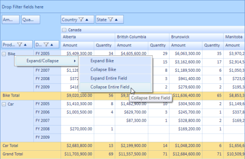

To perform the expand/collapse operations programmatically, you can make use of the eight methods respectively as per your requirement. Passing the UniqueText as a parameter you can expand/collapse one or more columns/rows. The method usage is illustrated in the following code sample.

   

/// Expands the Bike from row       

this.pivotGrid1.ExpandRow("Bike");

/// Collapses the Bike from row        

this.pivotGrid1.CollapseRow("Bike");        

/// Expands the Canada from column        

this.pivotGrid1.ExpandColumn("Canada");        

/// Collapses the Canada from column        

this.pivotGrid1.CollapseColumn("Canada");        

/// Collapses the given collection of UniqueText string values for row        

this.pivotGrid1.CollapseRow(new List<string> { "Bike", "Car" });        

/// Expands the given collection of UniqueText string values for row        

this.pivotGrid1.ExpandRow(new List<string> { "Bike", "Car" });        

/// Collapses the given collection of UniqueText string values for Column        

this.pivotGrid1.CollapseColumn(new List<string> { "Canada", "France" });        

/// Expands the given collection of UniqueText string values for Column        

this.pivotGrid1.ExpandColumn(new List<string> { "Canada", "France" });



  

/// Expands the Bike from row       

Me.pivotGrid1.ExpandRow("Bike")

/// Collapses the Bike from row        

Me.pivotGrid1.CollapseRow("Bike")

/// Expands the Canada from column        

Me.pivotGrid1.ExpandColumn("Canada")

/// Collapses the Canada from column        

Me.pivotGrid1.CollapseColumn("Canada")

/// Collapses the given collection of UniqueText string values for row        

Me.pivotGrid1.CollapseRow(New String() {"Bike", "Car"}.ToList())

/// Expands the given collection of UniqueText string values for row        

Me.pivotGrid1.ExpandRow(New String() {"Bike", "Car"}.ToList())

/// Collapses the given collection of UniqueText string values for Column        

Me.pivotGrid1.CollapseColumn(New String() {"Canada", "France"}.ToList())

/// Expands the given collection of UniqueText string values for Column        

Me.pivotGrid1.ExpandColumn(New String() {"Canada", "France"}.ToList())

 

## Custom Calculations

Custom Calculations can be applied to the value fields through the following built-in calculation functions:

*Percentage of Grand Total Cell

*Percentage of Column Total Cell

*Percentage of Row Total Cell

*Percentage of Parent Total Cell 

*Percentage of Parent Column Total Cell

*Percentage of Parent Row Total Cell and

*Index

### Use Case Scenarios

The user can easily analyze the specific value field based on the different value cells through the custom calculations. For example, the user can view the sales amount for United States in FY 2011 as a percentage of the whole sales at United States by selecting the Percentage of Parent Total option.

For an instant,

The sales amount in Untied States for FY 2011: $40,000,000.00

The sales amount in United States for all years: $120,000,000.00

Hence, the sales amount for FY 2011 is 33.33 % of overall year sales (FY 2008 to FY 2011) at United States.

#### Properties

Properties Table

<table>
<tr>
<th>
{{ '**Property**' | markdownify }} </th><th>
{{ '**Description**' | markdownify }} </th><th>
{{ '**Type**' | markdownify }} </th><th>
{{ '**Data Type**' | markdownify }} </th><th>
{{ '**Reference links**' | markdownify }} </th></tr>
<tr>
<td>
CalculationType</td><td>
Gets or sets the CalculationType for the PivotComputationInfo object.</td><td>
CLR</td><td>
CalculationType</td><td>
Class Reference link for CalculationTypeIn PivotAnalysis.Base </td></tr>
<tr>
<td>
BaseField</td><td>
Gets or sets the BaseField for calculations [Applicable only for the PercentageOfParentTotal calculation type].</td><td>
CLR</td><td>
string</td><td>
Class Reference link for BaseField in PivotAnalysis.Base.</td></tr>
</table>

#### Sample Location

The sample is available in the following location:

<SystemDrive>:\Users\<user_name>\AppData\Local\Syncfusion\EssentialStudio\<version_number>\BI\WPF\PivotAnalysis.Wpf\Samples\Product Showcase\PivotGrid Demo

### Implementing Custom Calculations 

To show the value cell as a percentage of its summary cells, use the following code snippet:

 

<syncfusion:PivotGridControl.PivotCalculations>

                    <syncfusion:PivotComputationInfo FieldName="Amount" Format="C" CalculationName="Amount Total" CalculationType="PercentageOfParentTotal" BaseField="Country" />

</syncfusion:PivotGridControl.PivotCalculations>

 

  

this.pivotGrid1.PivotCalculations.Add(new Syncfusion.PivotAnalysis.Base.PivotComputationInfo { FieldName = "Amount", Format = "C", CalculationName = "Total Amount", CalculationType = Syncfusion.PivotAnalysis.Base.CalculationType.PercentageOfParentTotal, BaseField = "Country" });

 

 

Me.pivotGrid1.PivotCalculations.Add(New Syncfusion.PivotAnalysis.Base.PivotComputationInfo() With {.FieldName = "Amount", .Format = "C", .CalculationName = "Total Amount", .CalculationType = Syncfusion.PivotAnalysis.Base.CalculationType.PercentageOfParentTotal, .BaseField = "Country"})

 

To change the value cell’s calculation for different view dynamically, do the following procedure through Pivot Schema Designer control:

1. Double-click the respective PivotComputationInfo field at value fields section of the Pivot Schema Designer.
2. In the Pivot Computation Information window pop-up, change the view by selecting  the ‘Show Value As’ combo box as shown in the below image:

## GetRawItemFor Method 

The GetRawItemFor method is used to obtain the list of raw items for value cell, total cell or grand total cell in PivotGrid. This method has been implemented in the PivotEngine which can be used independently from the PivotGrid control. 

#### Use Case Scenarios

The user can utilize this method when they want to know the raw item from which the Pivot Cell’s value is obtained and also they can get the raw items of the summary cells.

Methods

Method Table

<table>
<tr>
<th>
 {{ '**Method**' | markdownify }}</th><th>
 {{ '**Description**' | markdownify }}</th><th>
 {{ '**Parameters**' | markdownify }}</th><th>
 {{ '**Return Type**' | markdownify }}</th></tr>
<tr>
<td>
GetRawItemFor </td><td>
This method allows you to get the raw item of the selected cell (Value cell or Summary cell). </td><td>
int row, int column</td><td>
List(object)</td></tr>
</table>

#### Sample Link

You can find a sample in the following location:

{Installed Drive}:\Users\<UserName>\AppData\Local\Syncfusion\EssentialStudio\<Version>\BI\Wpf\PivotAnalysis.Wpf\Samples\Interactive Features\DrillThroughDemo

### Adding GetRawItemFor method  to an Application 

Adding the GetRawItemFor method to an application is described in the following steps:

1. Add the GridData control to the application.
 
<syncfusion:GridDataControl x:Name="gridDataControl1" />
 

2. Enable Hyperlink to Value and Total Cells.

  

this.pivotGridControl1.ValueCellStyle.IsHyperlinkCell = true;       
     this.pivotGridControl1.SummaryCellStyle.IsHyperlinkCell = true;
	 


3. Call the GetRawItemFor method inside the Hyperlink click event and bind the result of GetRawItemFor() to GridDataControl.

  
void pivotGridControl1_HyperlinkCellClick(object sender, Syncfusion.Windows.Controls.PivotGrid.HyperlinkCellClickEventArgs e)        

{           

 this.gridDataControl1.ItemsSource = this.pivotGridControl1.PivotEngine.GetRawItemsFor(e.RowColumnIndex.RowIndex, e.RowColumnIndex.ColumnIndex);       

 }
 

 
 
## Theming

Theming is the process of applying particular settings to the visual elements of a product. This feature provides the following theming options:

*Office 2010 Blue

*Office 2010 Black

*Office 2010 Silver

*Transparent

*Office 2007 Blue

*Office 2007 Black

*Office 2007 Silver

*Blend

*Metro

*Office 2003

*Default

#### Use Case Scenarios

This feature enables users to develop a single application and apply different looks as necessary. 

#### Property

Property Table

<table>
<tr>
<th>
{{ '**Property**' | markdownify }} </th><th>
{{ '**Description**' | markdownify }} </th><th>
{{ '**Type**' | markdownify }} </th><th>
{{ '**Data Type**' | markdownify }} </th></tr>
<tr>
<td>
VisualStyle </td><td>
Gets or Sets the VisualStyle of BI control </td><td>
Dependency Property</td><td>
PivotGridVisualStyle</td></tr>
</table>

#### Sample Link

A sample demo available in the following link,

{InstalledDrive} :\Users\sabapathyk\AppData\Local\Syncfusion\EssentialStudio\10.4.0.53\BI\WPF\PivotAnalysis.WPF\Samples\Appearance\Skin Customization Demo

### Adding Theming to an Application 

The following code sample demonstrates adding theming to the PivotGrid control.

 

      <syncfusion:PivotGridControl  x:Name="pivotGrid" VisualStyle="Transparent"/>

 

  

       this.pivotGrid.VisualStyle = PivotGridVisualStyle.Transparent;

 

## Performance Improvement along Virtualized Binding

This feature provides high performance for a large set of records. This feature also helps load the data in the PivotGrid control on demand.

### Use Case Scenarios

Users can view the output in a few seconds for a large number of records that have been bound with the PivotGrid control. 

#### Properties

Properties Table

<table>
<tr>
<th>
 {{ '**Property**' | markdownify }}</th><th>
{{ '**Description**' | markdownify }} </th><th>
 {{ '**Type**' | markdownify }}</th><th>
 {{ '**Data Type**' | markdownify }}</th><th>
 {{ '**Reference links**' | markdownify }}</th></tr>
<tr>
<td>
UseIndexedEngine</td><td>
Gets or sets whether an optimized algorithm that relies on indexing the raw data should be used to compute the pivot information.</td><td>
CLR</td><td>
Boolean</td><td>
</td></tr>
<tr>
<td>
EnableOnDemandCalculations</td><td>
Gets or sets whether the calculations are postponed until the value is requested through the Indexer in the PivotEngine. The default value is false.</td><td>
CLR</td><td>
Boolean</td><td>
-</td></tr>
</table>

#### Sample Link

To launch the sample for this feature:

1. Open the Syncfusion Dashboard.
2. Click WPF platform and then Run Samples.
3. Select PivotAnalysis product and navigate to Performance > On-demand Loading Demo.

### Adding a virtualized binding feature in Pivot Grid control 

1. Set the value as “true” for the following properties in Pivot Grid’s PivotEngine class:
1. UseIndexedEngine
2. EnableOnDemandCalculations
2. Update the PivotEngine values on demand using recursive calls.

The following code sample explains how to achieve on-demand loading support in PivotGrid control.

  

DateTime _startIndex = DateTime.Now;

public MainPage()

        {

            InitializeComponent();

            pivotGrid.PivotEngine.EnableOnDemandCalculations =

                    pivotGrid.PivotEngine.UseIndexedEngine = true;

                pivotGrid.PivotEngine.GetValue = ItemObjectLookup;

               ObservableCollection<ItemObject> itemsSourceObject =

                    (AssociatedObject.DataContext as ViewModel.ViewModel).ItemObjectCollection;

                pivotGrid.PivotEngine.PivotSchemaChanged +=

                    PivotEngine_PivotSchemaChanged;

                pivotGrid.ItemSource = itemsSourceObject;

        }

private void PivotEngine_PivotSchemaChanged(object sender, PivotSchemaChangedArgs e)

        {

            _startIndex = DateTime.Now;

            pivotGrid.Dispatcher.BeginInvoke(DispatcherPriority.SystemIdle, new Action(() =>

                {

                    if (!pivotGrid.IgnoreRefesh)

                    {

                        if ((_scrollViewer.Content as TextBlock) != null)

                            (_scrollViewer.Content as TextBlock).Text = string.Empty;

                        CheckTime(_startIndex, "Initial part done in");

                        ContinueLoadingAsynchonolously(

                            pivotGrid.PivotEngine.IndexEngine, _startIndex);

                    }

                }));

        }

        private void ContinueLoadingAsynchonolously(IndexEngine engine, DateTime startIndex)

        {

            pivotGrid.Dispatcher.BeginInvoke(new Action(() =>

                {

                    if (engine != null && engine.HighRowLevel < engine.RowCount - 1)

                    {

                        int cutOff = Math.Min(engine.HighRowLevel + 800, engine.RowCount - 1);

                        object o = engine[cutOff, 0]; ////Gets 800 more rows from the pivot engine (on demand calculation).

                        if ((_scrollViewer.Content as TextBlock) != null)

                        {

                            (_scrollViewer.Content as TextBlock).Text +=

                                string.Format("\n{0}/{1}", engine.HighRowLevel, engine.RowCount - 1);

                            ContinueLoadingAsynchonolously(engine, startIndex); //Recursive call to update the rows of the PivotEngine until they reach high row level.

                        }

                    }

                    else

                    {

                        CheckTime(startIndex, "Load Completed");

                    }

                }), DispatcherPriority.SystemIdle);

        }

        private void CheckTime(DateTime start, string label)

        {

            if (_textBlock != null)

                _textBlock.Text += string.Format("\n{0} {1:0.0000} seconds.", label,

                                                 DateTime.Now.Subtract(start).TotalSeconds);

        }

        public IComparable ItemObjectLookup(object o, string name)

        {

            IComparable c = null;

            var io = o as ItemObject;

            if (io != null)

            {

                switch (name)

                {

                    case "Date":

                        c = io.Date;

                        break;

                    case "Client":

                        c = io.Client;

                        break;

                    case "Campaign":

                        c = io.Campaign;

                        break;

                    case "Color":

                        c = io.Color;

                        break;

                    case "Shape":

                        c = io.Shape;

                        break;

                    case "Price":

                        c = io.Price;

                        break;

                    case "Spend":

                        c = io.Spend;

                        break;

                    case "ColH":

                        c = io.ColH;

                        break;

                    case "ColI":

                        c = io.ColI;

                        break;

                    case "ColJ":

                        c = io.ColJ;

                        break;

                }

            }

            return c;

        } 
		
 

## Filtering on Pivot Columns

### Filtering support for Calculation Columns

Pivot Grid allows you to restrict the display of records by using a mechanism called Filters. A filter enables you to extract a subset of records that meet certain filter criteria. Filters can be applied to one or more columns.

#### Methods

The following methods are used to perform filtering on Pivot Columns.

Methods Table

<table>
<tr>
<th>
{{ '**Method**' | markdownify }}</th><th>
{{ '**Prototype**' | markdownify }}</th><th>
{{ '**Description**' | markdownify }}</th></tr>
<tr>
<td>
ApplySavedValueFilter</td><td>
Void ApplySavedValueFilter(Dictionary(string,HashSet(string))</td><td>
This method is used to add the filter expression for the columns programmatically.</td></tr>
<tr>
<td>
ApplyFilters</td><td>
1. void ApplyFilters() 2. public void ApplyFilters(bool clearExistingFilter) </td><td>
This method uses the contents of HiddenRowIndexes to display pivot results filtered by using calculation values.Any previous filters are first cleared.This method uses the contents of HiddenRowIndexes to display pivot results filtered by using calculation values. Any previous filters are optionally cleared depending upon the Boolean value received from the “clearExisitingFilter” parameter.The preceding methods take effect only when the RowPivotsOnly property is set to _true_.</td></tr>
<tr>
<td>
ClearFilters</td><td>
1. void ClearFilters() 2. void ClearFilters(bool refresh) </td><td>
This method clears the current filtered state and redraws the pivot display.This method clears the current filtered state, and optionally redraws the pivot display.</td></tr>
<tr>
<td>
ReapplyFiltersAfterSort</td><td>
void ReapplyFiltersAfterSort()</td><td>
This method is used to reapply the filter after sort operation is performed.</td></tr>
<tr>
<td>
 RaiseFilterActionCompleted</td><td>
void RaiseFilterActionCompleted(FilterActionCompletedEventArgs e)</td><td>
This method is used raise the FilterActionCompleted event.</td></tr>
<tr>
<td>
GetFilteredValueFields()</td><td>
1. List(string) GetFilteredValueFields() 2. List[string] GetFilteredFieldValues(string fieldName, bool returnExclusions)</td><td>
This method returns the currently filtered value field names; RowPivotsOnly property must be set to _true_.This method returns a list of filtered values associated with a specific value column; RowPivotsOnly property must be set to _true_.</td></tr>
<tr>
<td>
UpdateAllSummariesRespectingHiddenRowIndexes</td><td>
void UpdateAllSummariesRespectingHiddenRowIndexes()</td><td>
This method will recompute all summaries, ignoring any summary row whose index is found under HiddenRowIndexes.</td></tr>
</table>

#### Properties

The following properties are used to perform filtering on Pivot Columns.

Properties Table

<table>
<tr>
<th>
{{ '**Property**' | markdownify }}</th><th>
{{ '**Description**' | markdownify }}</th></tr>
<tr>
<td>
AllowFilter</td><td>
Specifies whether the PivotGridControl allows to set a filter on the Calculation column.</td></tr>
<tr>
<td>
RowPivotOnly</td><td>
Specifies whether the PivotGridControl is used to pivot only rows, or both rows and columns. The default value is set to allow pivoting both rows and columns.Setting this property to true will produce the following changes:1. ShowGroupingBar property will be automatically set to _false_.2. The TopLeft covered cell that normally appears in a PivotGrid is replaced with individual header cells that have the same appearance as that of Calculation header cells.</td></tr>
</table>

#### Events

The following event is used to perform filtering on Pivot Columns.

Events Table

<table>
<tr>
<th>
{{ '**Event**' | markdownify }}</th><th>
{{ '**Parameters**' | markdownify }}</th><th>
{{ '**Description**' | markdownify }}</th></tr>
<tr>
<td>
FilterActionCompleted</td><td>
 object sender, FilterActionCompletedEventArgs e</td><td>
This event is triggered when the Filter action is completed.</td></tr>
</table>

The following code sample illustrates how to use the ApplySavedValueFilter method.

  

Dictionary<string,HashSet<string>> dictionary = new Dictionary(string,HashSet(string))();

dictionary.Add("Cost", new HashSet(string)(){"701","230"});

this.pivotGridControl1.InternalGrid.ApplySavedValueFilter(dictionary);

 

The following code sample illustrates how to use the AllowFilter property.

 

pivotGridControl1.PivotCalculations[4].AllowFilter = true;

(or)

pivotGridControl1.PivotCalculations.Add(new PivotComputationInfo(){FieldName ="Cost", FieldHeader = "Cost", AllowFilter = true });

  
 
### Screenshot

Filtering on Pivot Columns

#### Sample Link

{InstallationDrive}:\Users\{UserName}\AppData\Local\Syncfusion\EssentialStudio\11.1.0.9\Wpf \PivotAnalysis.Wpf\Product Showcase\RowPivotsOnly Demo

## User-Configurable Context Menu Support

### Description

This feature provides support to reorder the Context Menu Items displayed on right-clicking the Header cells of the Pivot Row and Column of the PivotGrid control. It enhances user-accessibility to frequently used Context Menu Items by providing a User-Configurable Context Menu. You can reorder Context Menu Items according to your preference and ease.

The default Context Menu lists the following Items:

1.Allow Filtering – Enable or disable filtering in the selected pivot computation column.

2.Allow Sorting – Enable or disable sorting in the selected pivot computation column.

3.HideValueColumn – Hides the selected pivot computation column.

4.ClearValueFilters – Disables filtering in all pivot computation columns.

5.ClearValueSorts – Disables sorting in all pivot computation columns.

6.ShowPivotValueChooser – Launches the Pivot Value Chooser window.

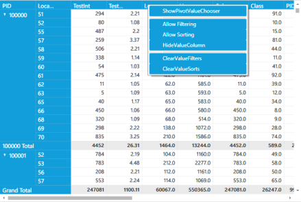

PivotGrid with User-Configurable Context Menu

### Enabling the User-Configurable Context Menu

This User-Configurable Context Menu is available only in the RowPivotsOnly mode. The following code is used to enable the user-configurable context menu:

 

this.pivotGridControl1.RowPivotsOnly = true;

this.pivotGridControl1.ColumnHeaderCellStyle.EnableContextMenu = true;

  
 
### Customizing the User-Configurable Context Menu

This following code illustrates how to reorder the Context Menu Items of the User-Configurable Context Menu in the PivotGrid control

  

void pivotGridControl1_Loaded(object sender, RoutedEventArgs e)

{

this.pivotGridControl1.InternalGrid.ContextMenuOpening += new    

ContextMenuEventHandler(InternalGrid_ContextMenuOpening);

}

void InternalGrid_ContextMenuOpening(object sender, ContextMenuEventArgs e)

{

PivotSortHeaderCell pivotGridSortHeaderCell = e.Source as PivotSortHeaderCell;

if (pivotGridSortHeaderCell != null)

{

ContextMenu contextMenu = pivotGridSortHeaderCell.GetContextMenu();

if (contextMenu != null)

{

ItemCollection itemCollection = contextMenu.Items;

List<object> newItemCollection = new List<object>(itemCollection.Count);

foreach (var item in itemCollection)

{

if (item is MenuItem)

{

MenuItem tempItem = (item as MenuItem);

switch (tempItem.Tag.ToString())

{

case "Allow Sorting":

newItemCollection.Add(tempItem);

break;

case "Allow Filtering":

newItemCollection.Add(tempItem);

break;

case "Hide Column":

newItemCollection.Add(tempItem);

newItemCollection.Add(new Separator());

break;

case "Clear Filters":

newItemCollection.Add(tempItem);

break;

case "Clear Sorts":

newItemCollection.Add(tempItem);

break;

case "Show Pivot Value Chooser":

newItemCollection.Insert(0, tempItem);

newItemCollection.Insert(1, new Separator());

break;

}

}

}

contextMenu.Items.Clear();

foreach (var item in newItemCollection)

{

contextMenu.Items.Add(item);

}

}

}

}

 

#### Sample Link

{InstalledDrive}:\Users\{User_Name}\AppData\Local\Syncfusion\EssentialStudio\{VersionNumber{x.x.x.x}\WPF\PivotAnalysis.WPF\Samples\Product Showcase\RowPivotsOnly Demo

## Pivot Value Chooser

The Pivot Value Chooser is used to list all the pivot fields in the data source when the pivot grid is in RowPivotsOnly mode. This window enables users to select a pivot calculation and add it to the pivot grid, drag and drop the grid fields, and rearrange the calculation column in the PivotGrid control at run time.

### Use Case Scenario

This feature enables users to show or hide particular pivot calculations in the pivot grid at run time.

Pivot Grid with Pivot Value Chooser

### Properties

Properties Table

<table>
<tr>
<th>
{{ '**Property**' | markdownify }}</th><th>
{{ '**Description**' | markdownify }}</th><th>
{{ '**Type**' | markdownify }}</th><th>
{{ '**Data Type**' | markdownify }}</th></tr>
<tr>
<td>
ShowPivotValueChooser</td><td>
Hides or shows a computation value column chooser dialog that allows users to hide, show, or reorder the pivot calculations in the pivot grid.</td><td>
Dependency Property</td><td>
Boolean</td></tr>
<tr>
<td>
PossiblePivotCalculations</td><td>
Gets or sets a collection of possible pivot calculations that may appear in the PivotGrid control and lists them in the PivotValueChooser.</td><td>
Dependency Property</td><td>
ObservableCollectionOf type PivotComputationInfo</td></tr>
</table>

#### Sample Link

A sample of this feature can be found in the following location:

{InstalledDrive}:\Users\<UserName>\AppData\Local\Syncfusion\EssentialStudio\<Version>\BI\Wpf\PivotAnalysis.Wpf\Samples\Product Showcase\RowPivotsOnly Demo

### Showing the Pivot Value Chooser in an Application

Users can show or hide the Pivot Value Chooser by setting the ShowPivotValueChooser property to true or false, respectively. The RowPivotsOnly mode must be enabled in the pivot grid for this feature to function.

N> PossiblePivotCalculations is a collection where users can define which fields should appear in the Pivot Value Chooser window. If it is not defined, then this collection will be automatically generated from the PivotGrid control’s ItemSource.

#### Showing the Pivot Value Chooser with Possible Pivot Calculations

  

ObservableCollection<PivotComputationInfo> possibleComputations = new ObservableCollection<PivotComputationInfo>()

            {

                //Add computation collection.

            };

this.pivotGridControl1.PossiblePivotCalculations = possibleComputations;

this.pivotGridControl1.RowPivotsOnly = true;

this.pivotGridControl1.ShowPivotValueChooser = true;

 

 

Dim possibleComputations As New ObservableCollection(Of PivotComputationInfo)() From {}

'Add computation collection.

Me.pivotGridControl1.PossiblePivotCalculations = possibleComputations

Me.pivotGridControl1.RowPivotsOnly = True

Me.pivotGridControl1.ShowPivotValueChooser = True

 

#### Showing Pivot Value Chooser without Possible Pivot Calculations

  

this.pivotGridControl1.RowPivotsOnly = true;

this.pivotGridControl1.ShowPivotValueChooser = true;

 

 

Me.pivotGridControl1.RowPivotsOnly = True

Me.pivotGridControl1.ShowPivotValueChooser = True 

 

## Asynchronous Data Loading

The PivotGrid control provides support for loading data in a unique UI thread. That is, the PivotGrid control can perform long running operations asynchronously on a background thread so that users can access other UI controls while the grid is loading. It also loads asynchronously for every layout change operation, such as filtering, sorting, drag and drop, manipulating the field list, or changing the Pivot Schema Designer. This can be achieved by setting the LoadInBackground property to true.

Property Table

<table>
<tr>
<th>
{{ '**Property**' | markdownify }}</th><th>
{{ '**Description**' | markdownify }}</th></tr>
<tr>
<td>
LoadInBackground</td><td>
This property enables the PivotGrid control to perform loading operations asynchronously on a background thread.</td></tr>
</table>

#### To enable asynchronous loading

   

         // Loading asynchronously on a background thread.

          this.pivotGrid1.InternalGrid.LoadInBackground = true;



 

         ’ Loading asynchronously on a background thread.

          Me.pivotGrid1.InternalGrid.LoadInBackground = True 

 

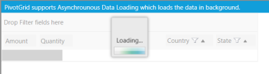

PivotGrid Control Loading Asynchronously

PivotGrid after Loading

#### Sample Link

To access the UI threading demo:

1.Open the Syncfusion Dashboard.

2.Click Business Intelligence.

3.Click the WPF drop-down list, and select Explore Samples.
 
4.Navigate to PivotAnalysis.WPF > Samples >Product Showcase >UIThreading Demo.

## Subtotal Hiding at Pivot Item level in the PivotGrid control

### Subtotal hiding at PivotItem level

This feature is an enhancement for the PivotGrid control. It has the ability to selectively turn column and row subtotals on and off. This means the user can specify the rows or columns that should not be included in subtotal calculation by setting that pivot item’s ShowSubTotal property as false. Also, while calculating the GrandTotal, the values of hidden subtotals will be omitted. Everything has been made at Grid level for performance consideration. By default, the Subtotal visibility of all the pivot items is true.

###Show or hide the expander symbol for a single Pivot Item

This feature enables the user to set the visibility of the expander symbol of the PivotItem which has single row (after hide its subtotal row or column) by setting the property “ShowExpanderForSinglePivot”. By default this property value will be true (the visibility of the expander symbol will be set to Visible). 

### Use Case Scenarios

When the user has more computational fields with subtotals and wants to view the subtotal of a specific PivotItem to simplify viewing large amounts of data, the user can also hide the subtotals of a particular PivotItem when needed.

The following screenshots show the PivotGrid with the PivotItem “Product” subtotal shown and hidden:

Subtotals displayed

Subtotals hidden

The expander for the item “Car” is collapsed in the following screenshot since it only has a single row (FY2005) after its subtotal is hidden:

Car row collapsed

#### Properties

Property Table

<table>
<tr>
<th>
 {{ '**Property**' | markdownify }}</th><th>
 {{ '**Description**' | markdownify }}</th><th>
 {{ '**Type**' | markdownify }}</th><th>
 {{ '**Data Type**' | markdownify }}</th><th>
 {{ '**Reference links**' | markdownify }}</th></tr>
<tr>
<td>
ShowSubTotal</td><td>
Shows or hides the subtotal of the particular pivot item.</td><td>
Dependency </td><td>
Boolean </td><td>
</td></tr>
<tr>
<td>
ShowExpanderForSinglePivot</td><td>
Shows or hides expander of the  item which has single row after its subtotals hidden</td><td>
General</td><td>
Boolean</td><td>
</td></tr>
</table>

#### Sample Link

Use the following steps to view a sample of this feature:

1.Select Start > Programs > Syncfusion > Essential Studio <version number> > Dashboard

2.Click Run Samples for the WPF platform.

3.Select PivotGrid.

4.Navigate to Product Showcase > Pivot Grid Demo.

### Show or hide the subtotal for a specific pivot item in the PivotGrid control

Users can show or hide a particular PivotItem’s subtotal using the ShowSubTotal property. To show its subtotal, set this property to true. To hide the subtotal, set this property to false. By default, the value of the ShowSubTotal property is set to true.

The following code sample shows how to set values for the ShowSubTotal property:

 

 <syncfusion:PivotItem FieldMappingName="Product" FieldHeader="Product" ShowSubTotal="False" TotalHeader="Total"/>

 

To show the subtotal of an item at the specified index in a PivotColumn:

  

 pivotGrid1.PivotColumns[index].ShowSubTotal = true; 

 

 

Me.pivotGrid1.PivotColumns[index].ShowSubTotals = True

 

To hide subtotal of an item at the specified index in a PivotRow:

  

pivotGrid1.PivotRows[index].ShowSubTotal = false;  

 

 

Me.pivotGrid1.PivotRows[index].ShowSubTotals = False

 

#### Show or hide the expander symbol for a single row in the PivotGrid control

Users can show or hide the expander symbol for items with a single row or column after its subtotals are hidden using the ShowExpanderForSinglePivot property. To hide the expander for a single row, set this property to false. By default the value of the ShowExpanderForSinglePivot property is set to true.

 

  <syncfusion:PivotGridControl ShowExpanderForSinglePivot="False" Name="pivotGrid/>

 

To show the expander of the row or column that has a single row after its subtotals are hidden:

 

 pivotGrid.ShowExpanderForSinglePivot = true;

  

  

Me.pivotGrid.ShowExpanderForSinglePivot = True



 To hide the expander of the row or column that has a single row after its subtotals are hidden:

  

pivotGrid.ShowExpanderForSinglePivot = false;

 

 

Me.pivotGrid.ShowExpanderForSinglePivot = False

 

## RTL support

Right-to-left support has been provided for the PivotGrid control for WPF. Users can now display content from right to left by setting the flow direction option in the control. 

#### Use Case Scenario

Some cultures have a written language that reads from right to left. Controls deployed for such cultures should be rendered from right to left. In these cases, we can utilize RTL support of the OLAP Gauge component. 

#### Properties

Property Table

<table>
<tr>
<th>
{{ '**Property**' | markdownify }} </th><th>
{{ '**Description**' | markdownify }} </th><th>
{{ '**Type**' | markdownify }} </th><th>
{{ '**Data Type**' | markdownify }} </th></tr>
<tr>
<td>
FlowDirection</td><td>
Gets or sets the flow direction for the PivotGrid control.</td><td>
Normal</td><td>
enum</td></tr>
</table> 

### Adding RTL support for PivotGrid in an Application 

To enable RTL support, the FlowDirection property of the PivotGrid control needs to be set as RightToLeft. The following code sample explains how to set the FlowDirection property. It can be set through XAML or C# code.

 

<syncfusion:PivotGridControl FlowDirection="RightToLeft" x:Name="pivotGrid1" ItemSource="{Binding ProductSalesData}" >  

 

  

  this.pivotGrid1.FlowDirection = System.Windows.FlowDirection.RightToLeft;

 

 

  Me.pivotGrid1.FlowDirection = System.Windows.FlowDirection.RightToLeft;

 

RTL support for PivotGrid

#### Sample Link

A sample is available locally in the following location:

SystemDrive:\Users\<user_name>\AppData\Local\Syncfusion\EssentialStudio\<version_number>\BI\WPF\PivotAnalysis.WPF\Localization\LocalizationDemo

## Top Summary Layout

This feature provides support to display the summary data of each PivotItem at the top and at the beginning of value cells. 

### Tables for Properties, Methods and Events

### Properties

Property Table

<table>
<tr>
<th>
 {{ '**Property**' | markdownify }}</th><th>
 {{ '**Description**' | markdownify }}</th><th>
 {{ '**Data Type**' | markdownify }}</th><th>
{{ '**Default Value**' | markdownify }}</th></tr>
<tr>
<td>
GridLayout </td><td>
Gets or sets the layout of summary data in Pivot Grid. </td><td>
enum</td><td>
Normal</td></tr>
</table> 

### Adding Top Summary Layout for PivotGrid in an Application

To show the summary at the top of the Pivot Grid value cells, you can set the built-in enum type “GridLayout” in PivotGrid. By default, this property is set to “Normal”, which displays the summary data of rows or columns at the end of the value cells. Setting the GridLayout property to “TopSummary”, displays the summary data at the Top or at the beginning of value cells.

The following code shows how to set the GridLayout property. You can also set the value using XAML, C# or VB language.

 

<pivotGrid:PivotGridControl Grid.Row="0" GridLayout="TopSummary" VisualStyle="Default" HorizontalAlignment="Left" Margin="0,0,0,0" Name="pivotGrid"                                     ItemSource="{Binding DataTableSFA}" >

 

  

this.pivotGrid.GridLayout = GridLayout.TopSummary;

 

 

Me.pivotGrid.GridLayout = GridLayout.TopSummary

 

The following image illustrates a Pivot Grid which is set show the summary data at the top.  

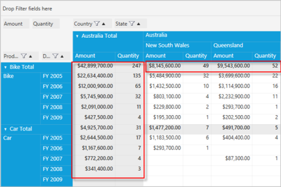

Summary data at the top

#### Sample Link

Windows 8/7/Vista

{Installation Drive}:\Users\<user name>\AppData\Local\Syncfusion\EssentialStudio\<version number>\BI\WPF\PivotAnalysis.WPF\ProductShowCase\PivotCustomization Demo

## Print Preview and Print

Essential PivotGrid for WPF provides in-built support for printing and print preview. This feature provides a print dialog that allows you to preview the output and make any modifications if required before printing.

### Use Case Scenarios

Printing option allows you to have a hard copy of the PivotGrid.

### Tables for Properties, Methods, and Events

### Properties

Property Table

<table>
<tr>
<th>
{{ '**Property**' | markdownify }}</th><th>
{{ '**Description**' | markdownify }}</th><th>
{{ '**Type**' | markdownify }}</th><th>
{{ '**Data Type**' | markdownify }}</th><th>
{{ '**Reference links**' | markdownify }}</th></tr>
<tr>
<td>
PrintHeader </td><td>
Add/Remove the Header in the Print Preview dialog</td><td>
Attached Property</td><td>
Boolean</td><td>
-</td></tr>
<tr>
<td>
PrintFooter</td><td>
Add/Remove the Footer in the Print Preview dialog</td><td>
Attached Property</td><td>
Boolean</td><td>
-</td></tr>
</table>

### Methods

Methods Table

<table>
<tr>
<th>
{{ '**Method**' | markdownify }}</th><th>
{{ '**Description**' | markdownify }}</th><th>
{{ '**Parameters**' | markdownify }}</th><th>
{{ '**Type**' | markdownify }}</th><th>
{{ '**Return Type**' | markdownify }}</th><th>
{{ '**Reference links**' | markdownify }}</th></tr>
<tr>
<td>
ShowPrintPreview</td><td>
Shows the Print Preview window with empty template and default title</td><td>
(Window Win)</td><td>
-</td><td>
Void</td><td>
-</td></tr>
<tr>
<td>
ShowPrintPreview</td><td>
Shows the Print Preview window with templates for header, footer and default title.</td><td>
(DataTemplate headerTemplate, DataTemplate footerTemplate, Window win)</td><td>
-</td><td>
Void</td><td>
-</td></tr>
<tr>
<td>
ShowPrintPreview</td><td>
Shows the Print Preview window with templates for header, footer and user defined title</td><td>
(DataTemplate headerTemplate, DataTemplate footerTemplate, string title, Window win)</td><td>
</td><td>
</td><td>
</td></tr>
</table>

### Adding Print Preview and Print for PivotGrid in an Application

This feature has been implemented to provide printing support for PivotGrid control along with grouping bar. You can use the method “ShowPrintPreview” to preview the PivotGrid control before printing by opening the PrintPreview Window. The properties “PrintHeader” and “PrintFooter” helps to add or remove the header and footer information while printing.

Following code example shows how to set the PrintHeader and PrintFooter properties.

 

<syncfusion:PivotGridControl x:Name="pivotGrid1" syncfusion:PrintSettings.PrintFooter="True" syncfusion:PrintSettings.PrintHeader="True" VerticalAlignment="Top" ItemSource="{Binding ProductSalesData}">

 

Following code example shows how to call ShowPrintPreview methods.

 

    //	Shows the Print Preview window with templates for header, footer and with user defined title          
	this.pivotGrid1.ShowPrintPreview((DataTemplate)this.Resources["HeaderTemplate"], (DataTemplate)this.Resources["FooterTemplate"],"Print Preview", this);

    //	Shows the Print Preview window with empty template and default title this.pivotGrid1.ShowPrintPreview(this);

    //	Shows the Print Preview window with templates for header, footer and with default title.            
	this.pivotGrid1.ShowPrintPreview((DataTemplate)this.Resources["HeaderTemplate"], (DataTemplate)this.Resources["FooterTemplate"], this);

  

#### Print Preview

The following screenshot displays a Print Preview window along with a header and footer:

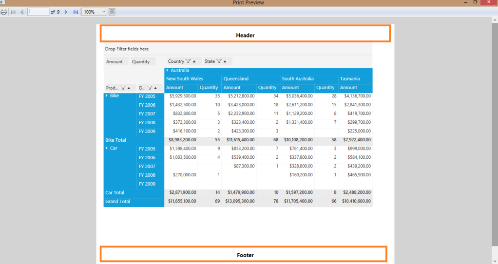

Print Preview

The Print Preview window provides the following options:  “Zooming”, “Page Settings”,”Print”. 

You can use these options to get a magnified view of the PivotGrid or to change the page setup or to print the PivotGrid 
control respectively.

#### Zooming

Click on the “Zoom” drop-down button in the print preview window and select the desired percentage to magnify the print 
preview in PivotGrid. You can choose from various preset zoom level options such as 50%, 100%, 200% or 400%.

The following screen shot shows the zooming options dropdown in the Print preview window:

Zooming

#### Page Settings

Click the “PageSettings” button in the print preview to change the page settings while printing.

The following screenshot shows the Page setting icon in a Print preview window:

Page settings

#### Print 

Click the “Print” button in the print preview window to print the PivotGrid content.

The following screen shot shows the Print icon in the print preview window.

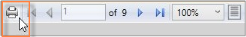

Print option

### Sample Link

Windows 8/7/Vista

{Installation Drive}:\Users\<user name>\AppData\Local\Syncfusion\EssentialStudio\<version number>\BI\WPF\PivotAnalysis.Wpf\Printing\Printing Demo

## Multi-column Sorting

Multi-column sorting behavior is implemented in PivotGrid at normal mode that allows you to sort the grid by one field after the other.

### Use Case Scenario

There are three different fields being rendered by the PivotGrid and it can be sorted in any desired manner. For example: OrderBy(Country), OrderBy(State), OrderBy(City). 

### Applying multi-column sorting in PivotGrid Control

Refer the following screenshots that display the step-by-step implementation of multi-column sorting.

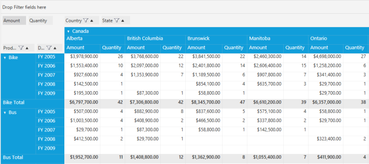

Normal PivotGrid without any sorting

 “Quantity” has been sorted in the descending order

Multi-columns (Amount and Quantity) has been sorted in the above PivotGrid

 ‘N’ number of column has been sorted in the above PivotGrid

### Sample Link

{Installation Drive}:\Users\<user name>\AppData\Local\Syncfusion\EssentialStudio\<version    number>\BI\WPF\PivotAnalysis.Wpf\Samples\Sorting\Sorting Demo

## Cell selection with headers

PivotGrid control provides cell selection feature that is used to select values along the row and column headers according to their covered ranges.

Properties

<table>
<tr>
<th>
{{ '**Property**' | markdownify }}</th><th>
{{ '**Description**' | markdownify }}</th><th>
{{ '**Parameters**' | markdownify }}</th><th>
    {{ '**Type**' | markdownify }}</th><th>
{{ '**Return Type**' | markdownify }}</th></tr>
<tr>
<td>
EnableSelectionWithHeaders</td><td>
Used to enable the selection behavior.</td><td>
</td><td>
bool</td><td>
bool</td></tr>
</table>

### Adding cell selection option with headers for PivotGridControl in an application

The following code example explains the usage of the "EnableAllowSelctionWithHeaders" property. You can use the mentioned 
property either in XAML or C#.

  

<syncfusion:PivotGridControl Margin="5" Grid.Row="0" x:Name="pivotGrid1" ShowGroupingBar="False" ItemSource="{Binding ProductSalesData}" AllowSelectionWithHeaders="True">



  

this.pivotGrid1.AllowSelectionWithHeaders = true;

 

It is used to select the header cells along with the value cells while selecting the respective row(s) or column(s). Refer the following screenshots.

Selecting the sub-columns along with headers

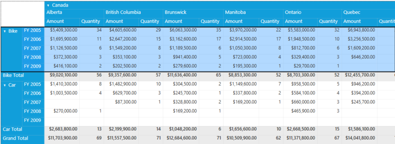

Selecting the entire row along with headers

### Sample Link

{Installation Drive}:\Users\<user name>\AppData\Local\Syncfusion\EssentialStudio\<version    number>\BI\WPF\PivotAnalysis.Wpf\Samples\Selection\Cell Selection Demo

