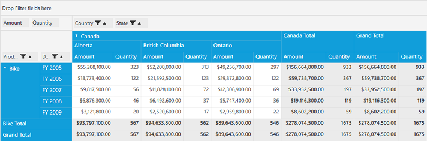

# Filtering

Filtered data displays only a subset of data that meets a criteria that you specify and hides data that you do not want to display. **PivotGrid Filters** are automatically re-applied every time when the PivotGrid is refreshed or updated until you remove those Filters. In the PivotGrid, Filters are additive, which means that each additional filter is based on the current filter and further reduces the subset of data. We can apply 'n' number of filtering conditions to the PivotGrid at a time. While applying Filters, a **FilterExpression** has been created and the data is filtered based on that FilterExpression specified.

## Filtering by FilterExpression

FilterExpression class used to encapsulates the information needed to define a filter. It contains the following properties.

Properties Table

<table>
<tr>
<th>
Property Name</th><th>
Description</th><th>
Type</th><th>
Value it Accepts</th><th>
Reference Link</th></tr>
<tr>
<td>
Expression</td><td>
Gets or sets the well-formed logical expression that defines this FilterExpression.</td><td>
string</td><td>
-</td><td>
-</td></tr>
<tr>
<td>
Name</td><td>
Gets or sets the name of this FilterExpression.</td><td>
string</td><td>
-</td><td>
-</td></tr>
<tr>
<td>
DimensionName</td><td>
Gets or sets the dimension name for filter expression</td><td>
string</td><td>
-</td><td>
-</td></tr>
<tr>
<td>
DimensionHeader</td><td>
Gets or sets the dimension header for filter expression</td><td>
string</td><td>
-</td><td>
-</td></tr>
<tr>
<td>
Format</td><td>
Gets or sets the format of filter expression </td><td>
string</td><td>
-</td><td>
-</td></tr>
<tr>
<td>
Evaluator</td><td>
Used to evaluate the given value</td><td>
Delegate</td><td>
-</td><td>
-</td></tr>
</table>

###Defining Filters in XAML

Create a new FilterExpression under **PivotGridContol.Filters** class. Please refer the code snippet below.



<Grid>
    <syncfusion:PivotGridControl HorizontalAlignment="Left" Name="pivotGrid" VerticalAlignment="Top" ShowFieldList="True" ItemSource="{Binding   Source={StaticResource data}}">
        <syncfusion:PivotGridControl.PivotRows>
            <syncfusion:PivotItem FieldHeader="Product" FieldMappingName="Product" TotalHeader="Total" />
            <syncfusion:PivotItem FieldHeader="Date" FieldMappingName="Date" TotalHeader="Total" />
        </syncfusion:PivotGridControl.PivotRows>
        <syncfusion:PivotGridControl.PivotColumns>
            <syncfusion:PivotItem FieldHeader="Country" FieldMappingName="Country" TotalHeader="Total" />
            <syncfusion:PivotItem FieldHeader="State" FieldMappingName="State" TotalHeader="Total" />
        </syncfusion:PivotGridControl.PivotColumns>
        <syncfusion:PivotGridControl.PivotCalculations>
            <syncfusion:PivotComputationInfo CalculationName="Total" FieldName="Amount" Format="C" SummaryType="DoubleTotalSum" />
            <syncfusion:PivotComputationInfo CalculationName="Total" FieldName="Quantity" SummaryType="Count" />
        </syncfusion:PivotGridControl.PivotCalculations>

        <syncfusion:PivotGridControl.Filters>
            <syncfusion:FilterExpression DimensionHeader="Product" DimensionName="Product" Name="Product" Expression="Product = Bike" />
        </syncfusion:PivotGridControl.Filters>

    </syncfusion:PivotGridControl>
</Grid>



###Defining Filters in Code-Behind

Create a new FilterExpression by using the **FilterExpression** class and add that FilterExpression to **Filters** collection of PivotGrid control. 

Please refer the code snippet below.



public partial class MainWindow: Window {
    PivotGridControl pivotGrid = new PivotGridControl();
    public MainWindow() {
        InitializeComponent();
        grid1.Children.Add(pivotGrid);
        pivotGrid.ItemSource = ProductSales.GetSalesData();
        PivotItem m_PivotItem = new PivotItem() {
            FieldHeader = "Product", FieldMappingName = "Product", TotalHeader = "Total"
        };
        PivotItem m_PivotItem1 = new PivotItem() {
            FieldHeader = "Date", FieldMappingName = "Date", TotalHeader = "Total"
        };
        PivotItem n_PivotItem = new PivotItem() {
            FieldHeader = "Country", FieldMappingName = "Country", TotalHeader = "Total"
        };
        PivotItem n_PivotItem1 = new PivotItem() {
            FieldHeader = "State", FieldMappingName = "State", TotalHeader = "Total"
        };
        // Adding PivotItem to PivotRows
        pivotGrid.PivotRows.Add(m_PivotItem);
        pivotGrid.PivotRows.Add(m_PivotItem1);
        // Adding PivotItem to PivotColumns
        pivotGrid.PivotColumns.Add(n_PivotItem);
        pivotGrid.PivotColumns.Add(n_PivotItem1);
        PivotComputationInfo m_PivotComputationInfo = new PivotComputationInfo() {
            CalculationName = "Amount", FieldName = "Amount", Format = "C", SummaryType = SummaryType.DoubleTotalSum
        };
        PivotComputationInfo m_PivotComputationInfo1 = new PivotComputationInfo() {
            CalculationName = "Quantity", FieldName = "Quantity", SummaryType = SummaryType.Count
        };
        pivotGrid.PivotCalculations.Add(m_PivotComputationInfo);
        pivotGrid.PivotCalculations.Add(m_PivotComputationInfo1);

        FilterExpression m_FilterExpression = new FilterExpression() {
            DimensionHeader = "Product", Name = "Product", DimensionName = "Product", Expression = "Product = Bike"
        };
        //Adding FilterExpression to Filters
        pivotGrid.Filters.Add(m_FilterExpression);

    }
}
        


##Filtering by using FilterPopup

Filters can also be applied to PivotGrid control at runtime using **FilterPopup**. This FilterPopup can be opened by clicking the Filter button in the Grouping Bar item. FilterPopup contains the filter list in which we can uncheck the items we need to filter and click ok.
This in turns, create a FilterExpression on runtime by using the unchecked items and apply the Filters to PivotGrid control.

