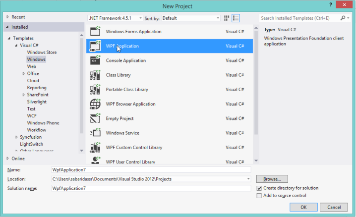
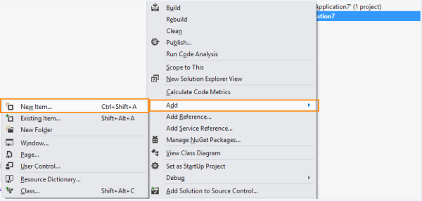
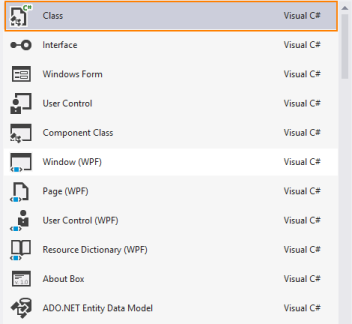
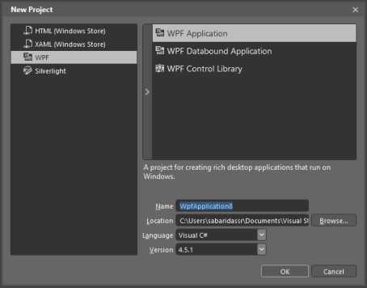
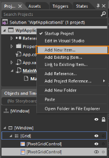
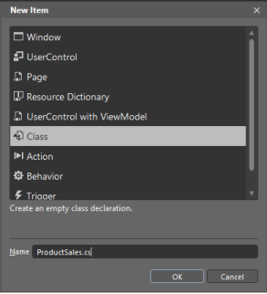
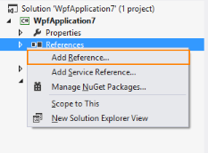

# Getting Started

## Configuring PivotGrid Control

This section encompasses how to configure the PivotGrid component in an application. You can also learn how to pass the required data to 
PivotGrid and customize its various options according to your requirements.

In the following example, PivotGrid component tabulates Amount and Quantity over a period of fiscal years for different products across the 
different customer geographic locations. 

### Through Visual Studio

1.Open Visual Studio IDE and from the File menu, select New  Project. 

2.In the New Project Dialog box, click the tree node item Windows under Visual C# and select WPF Application. 

3.Select WPF Application and click OK.

4.Drag and drop the PivotGridControl from the Syncfusion BI WPF toolbox into the Designpage. Required Syncfusion assemblies are added automatically to the application.

5.Add name to the PivotGridControl to access it through code-behind.

 

[XAML]

<Window x:Class="WpfApplication7.Window1"

    xmlns="http://schemas.microsoft.com/winfx/2006/xaml/presentation"

    xmlns:x="http://schemas.microsoft.com/winfx/2006/xaml"

    Title="Window1" Height="323" Width="500" 

    xmlns:syncfusion="http://schemas.syncfusion.com/wpf"

    xmlns:local="clr-namespace:WpfApplication1">

<Grid>

        <!—Adds PivotGrid Control-->

        <syncfusion:PivotGridControl HorizontalAlignment="Left" Name="PivotGridControl1" VerticalAlignment="Top" 

                                     ItemSource="{Binding Source={StaticResource data}}" >

</syncfusion:PivotGridControl>

<Grid>

</Window>

 

6.Under Solution Explorer, right-click on the project name and select Add  New Item.

7.Add New Item dialog box opens as follows.

8.Select Class and create file under the name ProductSales.cs. ItemSource can be instantiated from the ProductSales.cs file. 

  

[C#]

public class ProductSales

    {

        public string Product { get; set; }

        public string Year { get; set; }

        public string Country { get; set; }

        public string State { get; set; }

        public int Quantity { get; set; }

        public double Amount { get; set; }

        public static ProductSalesCollection GetSalesData()

        {

            /// Geography

            string[] countries = new string[] { "Canada" };

            string[] canadaStates = new string[] { "Alberta", "British Columbia","Ontario" };

            /// Time

            string[] dates = new string[] { "FY 2005", "FY 2006", "FY 2007" };

            /// Products

            string[] products = new string[] { "Bike", "Car" };

            Random r = new Random(123345345);

            int numberOfRecords = 2000;

            ProductSalesCollection listOfProductSales = new ProductSalesCollection();

            for (int i = 0; i < numberOfRecords; i++)

            {

                ProductSales sales = new ProductSales();

                sales.Country = countries[r.Next(0, countries.GetLength(0))];

                sales.Quantity = r.Next(1, 12);

                /// 1 percent discount for 1 quantity

                double discount = (30000 * sales.Quantity) * (double.Parse(sales.Quantity.ToString()) / 100);

                sales.Amount = (30000 * sales.Quantity) - discount;

                sales.Year = dates[r.Next(r.Next(dates.GetLength(0) + 1))];

                sales.Product = products[r.Next(r.Next(products.GetLength(0) + 1))];

                sales.State = canadaStates[r.Next(canadaStates.GetLength(0))];             

                listOfProductSales.Add(sales);

            }

            return listOfProductSales;

        }

        public override string ToString()

        {

            return string.Format("{0}-{1}-{2}", this.Country, this.State, this.Product);

        }

        public class ProductSalesCollection : List<ProductSales>

        {

        }

    }

 

9.GetSalesData method is used to get the PivotItems that needs to be populated in the PivotGridControl.

10.Binding ItemSource with the PivotGrid control,

#### Through XAML

ObjectDataProvider is usedto get the ItemSource object. Binding ItemSource with the PivotGridControl is shown in the following code example.

 

[XAML]

<Window x:Class="WpfApplication1.Window1"

    xmlns="http://schemas.microsoft.com/winfx/2006/xaml/presentation"

    xmlns:x="http://schemas.microsoft.com/winfx/2006/xaml"

    Title="Window1" Height="323" Width="500" 

    xmlns:syncfusion="http://schemas.syncfusion.com/wpf"

    xmlns:local="clr-namespace:WpfApplication1">

    <!-- Specifies the DataSource in Window Resources -->

    <Window.Resources>

        <ResourceDictionary>

            <ObjectDataProvider x:Key="data" ObjectType="{x:Type local:ProductSales}" MethodName="GetSalesData"/>

        </ResourceDictionary>

    </Window.Resources>

    <Grid>

        <syncfusion:PivotGridControl HorizontalAlignment="Left" Name="PivotGridControl1" VerticalAlignment="Top"                                     ItemSource="{Binding Source={StaticResource data}}" />

    </Grid>

</Window>

 

#### Through Code Behind

The PivotGrid in XAML is initialized and binding the ItemSource through code-behind is illustrated in the following code example.

 

[XAML]

<Window x:Class="WpfApplication7.Window1"

    xmlns="http://schemas.microsoft.com/winfx/2006/xaml/presentation"

    xmlns:x="http://schemas.microsoft.com/winfx/2006/xaml"

    Title="Window1" Height="323" Width="500" 

    xmlns:syncfusion="http://schemas.syncfusion.com/wpf"

    xmlns:local="clr-namespace:WpfApplication1">

<Grid>

        <!-- Adds PivotGrid Control -->

        <syncfusion:PivotGridControl HorizontalAlignment="Left" Name="PivotGridControl1" VerticalAlignment="Top" 

</syncfusion:PivotGridControl>

<Grid>

</Window>

 

  

[C#]

protected void Window_Loaded(object sender, RoutedEventArgs e)

{

    // Specifies the ItemSource for the PivotGrid

    this.PivotGridControl1.ItemSource = ProductSales.GetSalesData();

}

 

 

[VB]

Protected Sub Window_Loaded(ByVal sender As Object, ByVal e As RoutedEventArgs)

    ' Specifies the ItemSource for the PivotGrid

    Me.PivotGridControl1.ItemSource = ProductSales.GetSalesData()

End Sub

 

11.You can specify the PivotRows, PivotColumns and PivotComputationInfo that tabulate values in the PivotGrid.

12.Adding PivotRows is illustrated as follows.

#### Through XAML

 

[XAML]

<Window x:Class="WpfApplication1.Window1"

    xmlns="http://schemas.microsoft.com/winfx/2006/xaml/presentation"

    xmlns:x="http://schemas.microsoft.com/winfx/2006/xaml"

    Title="Window1" Height="323" Width="500" 

    xmlns:syncfusion="http://schemas.syncfusion.com/wpf"

    xmlns:local="clr-namespace:WpfApplication1">

    <!--Specifies the DataSource in Window Resources-->

    <Window.Resources>

        <ResourceDictionary>

            <ObjectDataProvider x:Key="data" ObjectType="{x:Type local:ProductSales}" MethodName="GetSalesData"/>

        </ResourceDictionary>

    </Window.Resources>

<Grid>

        <!—Adds PivotGrid Control-->

        <syncfusion:PivotGridControl HorizontalAlignment="Left" Name="PivotGridControl1" VerticalAlignment="Top" 

                                     ItemSource="{Binding Source={StaticResource data}}" >

            <!--Specifies Pivot Rows-->

            <syncfusion:PivotGridControl.PivotRows>

                <syncfusion:PivotItem FieldMappingName="Product" TotalHeader="Total"/>

            </syncfusion:PivotGridControl.PivotRows>

</syncfusion:PivotGridControl>

<Grid>

</Window>

 

#### Through Code-Behind

The PivotGrid in XAML is initialized and adding the PivotRows through code-behind is illustrated in the following code example.

 

[XAML]

<Window x:Class="WpfApplication7.Window1"

    xmlns="http://schemas.microsoft.com/winfx/2006/xaml/presentation"

    xmlns:x="http://schemas.microsoft.com/winfx/2006/xaml"

    Title="Window1" Height="323" Width="500" 

    xmlns:syncfusion="http://schemas.syncfusion.com/wpf"

    xmlns:local="clr-namespace:WpfApplication1">

<Grid>

        <!—Adds PivotGrid Control-->

        <syncfusion:PivotGridControl HorizontalAlignment="Left" Name="PivotGridControl1" VerticalAlignment="Top" 

</syncfusion:PivotGridControl>

<Grid>

</Window>

 

 

[C#]

protected void Window_Loaded(object sender, RoutedEventArgs e)

{

    // Specifies the ItemSource for PivotGrid

    this.PivotGridControl1.ItemSource = ProductSales.GetSalesData();

    // Adds Pivot Rows to Grid

    this.PivotGridControl1.PivotRows.Add(new PivotItem { FieldMappingName = "Product", TotalHeader = "Total" });

}

  

 

[VB]

Protected Sub Window_Loaded(ByVal sender As Object, ByVal e As RoutedEventArgs)

    ' Specifies the ItemSource for PivotGrid

    Me.PivotGridControl1.ItemSource = ProductSales.GetSalesData()

    ' Adds Pivot Rows to Grid

    Me.PivotGridControl1.PivotRows.Add(New PivotItem With {.FieldMappingName = "Product", .TotalHeader = "Total"})

End Sub

 

13.Adding the PivotColumns is illustrated in the following code example.

Through XAML

 

[XAML]

<Window x:Class="WpfApplication1.Window1"

    xmlns="http://schemas.microsoft.com/winfx/2006/xaml/presentation"

    xmlns:x="http://schemas.microsoft.com/winfx/2006/xaml"

    Title="Window1" Height="323" Width="500" 

    xmlns:syncfusion="http://schemas.syncfusion.com/wpf"

    xmlns:local="clr-namespace:WpfApplication1">

    <!--Specifies the DataSource in Window Resources-->

    <Window.Resources>

        <ResourceDictionary>

            <ObjectDataProvider x:Key="data" ObjectType="{x:Type local:ProductSales}" MethodName="GetSalesData"/>

        </ResourceDictionary>

    </Window.Resources>

<Grid>

        <!—Adds PivotGrid Control-->

        <syncfusion:PivotGridControl HorizontalAlignment="Left" Name="PivotGridControl1" VerticalAlignment="Top" 

                                     ItemSource="{Binding Source={StaticResource data}}" >

            <!--Specifies Pivot Columns-->

            <syncfusion:PivotGridControl.PivotColumns>

                <syncfusion:PivotItem FieldMappingName="Country" TotalHeader="Total"/>

            </syncfusion:PivotGridControl.PivotColumns>

</syncfusion:PivotGridControl>

<Grid>

</Window>

 

#### Through Code-Behind

The PivotGrid in XAML is initialized and adding the PivotColumns through code-behind is illustrated in the following code example.

 

[XAML]

<Window x:Class="WpfApplication7.Window1"

    xmlns="http://schemas.microsoft.com/winfx/2006/xaml/presentation"

    xmlns:x="http://schemas.microsoft.com/winfx/2006/xaml"

    Title="Window1" Height="323" Width="500" 

    xmlns:syncfusion="http://schemas.syncfusion.com/wpf"

    xmlns:local="clr-namespace:WpfApplication1">

<Grid>

        <!—Adds PivotGrid Control-->

        <syncfusion:PivotGridControl HorizontalAlignment="Left" Name="PivotGridControl1" VerticalAlignment="Top" 

</syncfusion:PivotGridControl>

<Grid>

</Window>

 

 

[C#]

protected void Window_Loaded(object sender, RoutedEventArgs e)

{

    // Specifies the ItemSource for PivotGrid

    this.PivotGridControl1.ItemSource = ProductSales.GetSalesData();

    // Adds Pivot Colums to Grid

    this.PivotGridControl1.PivotColumns.Add(new PivotItem { FieldMappingName = "Country", TotalHeader = "Total" });

}

  
 

 

[VB]

Protected Sub Window_Loaded(ByVal sender As Object, ByVal e As RoutedEventArgs)

    ' Specifies the ItemSource for Pivot Grid

    Me.PivotGridControl1.ItemSource = ProductSales.GetSalesData()

    ' Adds Pivot Colums to Grid

    Me.PivotGridControl1.PivotColumns.Add(New PivotItem With {.FieldMappingName = "Country", .TotalHeader = "Total"})

End Sub

 

14.Adding the PivotCalculations is illustrated in the following code example.



[XAML]

<Window x:Class="WpfApplication1.Window1"

    xmlns="http://schemas.microsoft.com/winfx/2006/xaml/presentation"

    xmlns:x="http://schemas.microsoft.com/winfx/2006/xaml"

    Title="Window1" Height="323" Width="500" 

    xmlns:syncfusion="http://schemas.syncfusion.com/wpf"

    xmlns:local="clr-namespace:WpfApplication1">

    <!--Specifies the DataSource in Window Resources-->

    <Window.Resources>

        <ResourceDictionary>

            <ObjectDataProvider x:Key="data" ObjectType="{x:Type local:ProductSales}" MethodName="GetSalesData"/>

        </ResourceDictionary>

    </Window.Resources>

<Grid>

        <!—Adds PivotGrid Control-->

        <syncfusion:PivotGridControl HorizontalAlignment="Left" Name="PivotGridControl1" VerticalAlignment="Top" 

                                     ItemSource="{Binding Source={StaticResource data}}" >

            <!--Specifies Pivot Calculation Values--> 

            <syncfusion:PivotGridControl.PivotCalculations>

                <syncfusion:PivotComputationInfo FieldName="Amount" Format="C" SummaryType="DoubleTotalSum"/>

            </syncfusion:PivotGridControl.PivotCalculations>

</syncfusion:PivotGridControl>

<Grid>

</Window>

 

#### Through Code-Behind

The PivotGrid in XAML is initialized and adding the PivotCalculations through code-behind is illustrated in the following code example.

 

[XAML]

<Window x:Class="WpfApplication7.Window1"

    xmlns="http://schemas.microsoft.com/winfx/2006/xaml/presentation"

    xmlns:x="http://schemas.microsoft.com/winfx/2006/xaml"

    Title="Window1" Height="323" Width="500" 

    xmlns:syncfusion="http://schemas.syncfusion.com/wpf"

    xmlns:local="clr-namespace:WpfApplication1">

<Grid>

        <!—Adds PivotGrid Control-->

        <syncfusion:PivotGridControl HorizontalAlignment="Left" Name="PivotGridControl1" VerticalAlignment="Top" 

</syncfusion:PivotGridControl>

<Grid>

</Window>

 

  

[C#]

protected void Window_Loaded(object sender, RoutedEventArgs e)

{

    // Specifies the ItemSource for PivotGrid

    this.PivotGridControl1.ItemSource = ProductSales.GetSalesData();

    // Adds PivotCalculations to Grid

    this.PivotGridControl1.PivotCalculations.Add(new PivotComputationInfo { FieldName = "Amount",Format="C" , SummaryType = SummaryType.DoubleTotalSum });

}

 

 

[VB]

Protected Sub Window_Loaded(ByVal sender As Object, ByVal e As RoutedEventArgs)

    ' Specifies the ItemSource for PivotGrid

    Me.PivotGridControl1.ItemSource = ProductSales.GetSalesData()

    ' Adds PivotCalculations to Grid

    Me.PivotGridControl1.PivotCalculations.Add(New PivotComputationInfo With {.FieldName = "Amount", .Format="C", .SummaryType = SummaryType.DoubleTotalSum})

End Sub

 

#### To populate PivotGrid with a sample IList data, Through XAML

 

[XAML]

<Window x:Class="WpfApplication1.Window1"

    xmlns="http://schemas.microsoft.com/winfx/2006/xaml/presentation"

    xmlns:x="http://schemas.microsoft.com/winfx/2006/xaml"

    Title="Window1" Height="323" Width="500" 

    xmlns:syncfusion="http://schemas.syncfusion.com/wpf"

    xmlns:local="clr-namespace:WpfApplication1">

    <!--Specifies the DataSource in Window Resources-->

    <Window.Resources>

        <ResourceDictionary>

            <ObjectDataProvider x:Key="data" ObjectType="{x:Type local:ProductSales}" MethodName="GetSalesData"/>

        </ResourceDictionary>

    </Window.Resources>

    <Grid>

        <!—Adds PivotGrid Control-->

        <syncfusion:PivotGridControl HorizontalAlignment="Left" Name="PivotGridControl1" VerticalAlignment="Top" 

                                     ItemSource="{Binding Source={StaticResource data}}" >

            <!--Specifies Pivot Rows-->

            <syncfusion:PivotGridControl.PivotRows>

                <syncfusion:PivotItem FieldMappingName="Product" TotalHeader="Total"/>

                <syncfusion:PivotItem FieldMappingName="Date" TotalHeader="Total"/>

            </syncfusion:PivotGridControl.PivotRows>

            <!--Specifies Pivot Columns-->

            <syncfusion:PivotGridControl.PivotColumns>

                <syncfusion:PivotItem FieldMappingName="Country" TotalHeader="Total"/>

                <syncfusion:PivotItem FieldMappingName="State" TotalHeader="Total"/>

            </syncfusion:PivotGridControl.PivotColumns>

            <!--Specifies Pivot Calculation Values--> 

            <syncfusion:PivotGridControl.PivotCalculations>

                <syncfusion:PivotComputationInfo FieldName="Amount" Format="C" SummaryType="DoubleTotalSum"/>

                <syncfusion:PivotComputationInfo FieldName="Quantity" Format="#,##0"/>

            </syncfusion:PivotGridControl.PivotCalculations>

        </syncfusion:PivotGridControl>            

    </Grid>

</Window>

 

#### Through Code-Behind

  

[C#]

protected void Window_Loaded(object sender, RoutedEventArgs e)

{

    // Specifies the ItemSource for Pivot Grid

    this.PivotGridControl1.ItemSource = ProductSales.GetSalesData();

    // Adds Pivot Rows to Grid

    this.PivotGridControl1.PivotRows.Add(new PivotItem { FieldMappingName = "Product", TotalHeader = "Total" });

    this.PivotGridControl1.PivotRows.Add(new PivotItem { FieldMappingName = "Year", TotalHeader = "Total" });

    // Adds Pivot Colums to Grid

    this.PivotGridControl1.PivotColumns.Add(new PivotItem { FieldMappingName = "Country", TotalHeader = "Total" });

    this.PivotGridControl1.PivotColumns.Add(new PivotItem { FieldMappingName = "State", TotalHeader = "Total" });

    // Adds PivotCalculations to Grid

    this.PivotGridControl1.PivotCalculations.Add(new PivotComputationInfo { FieldName = "Amount",Format="C" , SummaryType = SummaryType.DoubleTotalSum });

    this.PivotGridControl1.PivotCalculations.Add(new PivotComputationInfo { FieldName = "Quantity", Format ="#,##0"});

}

 

 

[VB]

Protected Sub Window_Loaded(ByVal sender As Object, ByVal e As RoutedEventArgs)

    ' Specifies the ItemSource for Pivot Grid

    Me.PivotGridControl1.ItemSource = ProductSales.GetSalesData()

    ' Adds Pivot Rows to Grid

    Me.PivotGridControl1.PivotRows.Add(New PivotItem With {.FieldMappingName = "Product", .TotalHeader = "Total"})

    Me.PivotGridControl1.PivotRows.Add(New PivotItem With {.FieldMappingName = "Year", .TotalHeader = "Total"})

    ' Adds Pivot Colums to Grid

    Me.PivotGridControl1.PivotColumns.Add(New PivotItem With {.FieldMappingName = "Country", .TotalHeader = "Total"})

    Me.PivotGridControl1.PivotColumns.Add(New PivotItem With {.FieldMappingName = "State", .TotalHeader = "Total"})

    ' Adds PivotCalculations to Grid

    Me.PivotGridControl1.PivotCalculations.Add(New PivotComputationInfo With {.FieldName = "Amount", .Format="C", .SummaryType = SummaryType.DoubleTotalSum})

    Me.PivotGridControl1.PivotCalculations.Add(New PivotComputationInfo With {.FieldName = "Quantity", .Format ="#,##0"})

End Sub

 

15.Run the application and the following output is generated.

### Through Expression Blend

1.Open the Start menu and select Blend for Visual Studio 2013.

2.Click New Project, now the dialog box for New Project appears as follows.

3.Select WPF Application and click OK.

4.Select the Project tab in the application window.

__

5.Right-click on the References and select Add Referenc, then add the following assemblies into the project from installed location.

   1. Syncfusion.PivotAnalysis.Base
   2. Syncfusion.PivotAnalysis.Wpf

#### Assembly Location

{System Drive}:\Program Files (x86)\Syncfusion\Essential Studio\{Version Number}\precompiledassemblies\{Version Number}

6.After adding the above assemblies, the PivotGridControl is automatically added into Assests.

7.Now drag the PivotGridControl from toolbox into the Designer page. Required Syncfusion assemblies are added automatically to the application.

8.Add name to the PivotGridControl to access it through code-behind.

  

[XAML]

<Window x:Class="WpfApplication7.Window1"

    xmlns="http://schemas.microsoft.com/winfx/2006/xaml/presentation"

    xmlns:x="http://schemas.microsoft.com/winfx/2006/xaml"

    Title="Window1" Height="323" Width="500" 

    xmlns:syncfusion="http://schemas.syncfusion.com/wpf"

    xmlns:local="clr-namespace:WpfApplication1">

<Grid>

        <!—Adds the PivotGrid Control-->

        <syncfusion:PivotGridControl HorizontalAlignment="Left" Name="PivotGridControl1" VerticalAlignment="Top"                                      ItemSource="{Binding Source={StaticResource data}}" >

</syncfusion:PivotGridControl>

<Grid>

</Window>

 

9.Under Solution Explorer, right-click on the project name and select Add  New Item.

10.Add New Item dialog box opens as follows.

11.Select Class and create file under the name ProductSales.cs. ItemSource can be instantiated in the ProductSales.cs file. 

 

[C#]

public class ProductSales

    {

        public string Product { get; set; }

        public string Year { get; set; }

        public string Country { get; set; }

        public string State { get; set; }

        public int Quantity { get; set; }

        public double Amount { get; set; }

        public static ProductSalesCollection GetSalesData()

        {

            /// Geography

            string[] countries = new string[] { "Canada" };

            string[] canadaStates = new string[] { "Alberta", "British Columbia","Ontario" };

            /// Time

            string[] dates = new string[] { "FY 2005", "FY 2006", "FY 2007" };

            /// Products

            string[] products = new string[] { "Bike", "Car" };

            Random r = new Random(123345345);

            int numberOfRecords = 2000;

            ProductSalesCollection listOfProductSales = new ProductSalesCollection();

            for (int i = 0; i < numberOfRecords; i++)

            {

                ProductSales sales = new ProductSales();

                sales.Country = countries[r.Next(0, countries.GetLength(0))];

                sales.Quantity = r.Next(1, 12);

                /// 1 percent discount for 1 quantity

                double discount = (30000 * sales.Quantity) * (double.Parse(sales.Quantity.ToString()) / 100);

                sales.Amount = (30000 * sales.Quantity) - discount;

                sales.Year = dates[r.Next(r.Next(dates.GetLength(0) + 1))];

                sales.Product = products[r.Next(r.Next(products.GetLength(0) + 1))];

                sales.State = canadaStates[r.Next(canadaStates.GetLength(0))];             

                listOfProductSales.Add(sales);

            }

            return listOfProductSales;

        }

        public override string ToString()

        {

            return string.Format("{0}-{1}-{2}", this.Country, this.State, this.Product);

        }

        public class ProductSalesCollection : List<ProductSales>

        {

        }

    }

  

12.GetSalesData method is used to get the PivotItems that needs to be populated in the PivotGridControl.

13.Binding ItemSource with the PivotGrid control,

#### Through XAML

ObjectDataProvider is usedto get the ItemSource object. Binding ItemSource with the PivotGridControl is shown in the following code example.

  

[XAML]

<Window x:Class="WpfApplication1.Window1"

    xmlns="http://schemas.microsoft.com/winfx/2006/xaml/presentation"

    xmlns:x="http://schemas.microsoft.com/winfx/2006/xaml"

    Title="Window1" Height="323" Width="500" 

    xmlns:syncfusion="http://schemas.syncfusion.com/wpf"

    xmlns:local="clr-namespace:WpfApplication1">

    <!-- Specifies the DataSource in Window Resources -->

    <Window.Resources>

        <ResourceDictionary>

            <ObjectDataProvider x:Key="data" ObjectType="{x:Type local:ProductSales}" MethodName="GetSalesData"/>

        </ResourceDictionary>

    </Window.Resources>

    <Grid>

        <syncfusion:PivotGridControl HorizontalAlignment="Left" Name="PivotGridControl1" VerticalAlignment="Top"                                     ItemSource="{Binding Source={StaticResource data}}" />

    </Grid>

</Window>



#### Through Code Behind

The PivotGrid in XAML is initialized and binding the ItemSource through code-behind is illustrated in the following code example.

 

[XAML]

<Window x:Class="WpfApplication7.Window1"

    xmlns="http://schemas.microsoft.com/winfx/2006/xaml/presentation"

    xmlns:x="http://schemas.microsoft.com/winfx/2006/xaml"

    Title="Window1" Height="323" Width="500" 

    xmlns:syncfusion="http://schemas.syncfusion.com/wpf"

    xmlns:local="clr-namespace:WpfApplication1">

<Grid>

        <!-- Adds PivotGrid Control -->

        <syncfusion:PivotGridControl HorizontalAlignment="Left" Name="PivotGridControl1" VerticalAlignment="Top" 

</syncfusion:PivotGridControl>

<Grid>

</Window>

 

 

[C#]

protected void Window_Loaded(object sender, RoutedEventArgs e)

{

    // Specifies the ItemSource for Pivot Grid

    this.PivotGridControl1.ItemSource = ProductSales.GetSalesData();

}

  

 

[VB]

Protected Sub Window_Loaded(ByVal sender As Object, ByVal e As RoutedEventArgs)

    ' Specifies the ItemSource for Pivot Grid

    Me.PivotGridControl1.ItemSource = ProductSales.GetSalesData()

End Sub

 

14.You can specify PivotRows, PivotColumns and PivotComputationInfo that tabulate the values in the PivotGrid.

15.Adding PivotRows is illustrated in the following code example.

#### Through XAML

 

[XAML]

<Window x:Class="WpfApplication1.Window1"

    xmlns="http://schemas.microsoft.com/winfx/2006/xaml/presentation"

    xmlns:x="http://schemas.microsoft.com/winfx/2006/xaml"

    Title="Window1" Height="323" Width="500" 

    xmlns:syncfusion="http://schemas.syncfusion.com/wpf"

    xmlns:local="clr-namespace:WpfApplication1">

    <!--Specifies the DataSource in Window Resources-->

    <Window.Resources>

        <ResourceDictionary>

            <ObjectDataProvider x:Key="data" ObjectType="{x:Type local:ProductSales}" MethodName="GetSalesData"/>

        </ResourceDictionary>

    </Window.Resources>

<Grid>

        <!—Adds PivotGrid Control-->

        <syncfusion:PivotGridControl HorizontalAlignment="Left" Name="PivotGridControl1" VerticalAlignment="Top" 

                                     ItemSource="{Binding Source={StaticResource data}}" >

            <!--Specifies Pivot Rows-->

            <syncfusion:PivotGridControl.PivotRows>

                <syncfusion:PivotItem FieldMappingName="Product" TotalHeader="Total"/>

            </syncfusion:PivotGridControl.PivotRows>

</syncfusion:PivotGridControl>

<Grid>

</Window>

 

#### Through Code-Behind

The PivotGrid in XAML is initialized and adding the PivotRows through code-behind is illustrated in the following code example.

 

[XAML]

<Window x:Class="WpfApplication7.Window1"

    xmlns="http://schemas.microsoft.com/winfx/2006/xaml/presentation"

    xmlns:x="http://schemas.microsoft.com/winfx/2006/xaml"

    Title="Window1" Height="323" Width="500" 

    xmlns:syncfusion="http://schemas.syncfusion.com/wpf"

    xmlns:local="clr-namespace:WpfApplication1">

<Grid>

        <!—Adds PivotGrid Control-->

        <syncfusion:PivotGridControl HorizontalAlignment="Left" Name="PivotGridControl1" VerticalAlignment="Top" 

</syncfusion:PivotGridControl>

<Grid>

</Window>

 

  

[C#]

protected void Window_Loaded(object sender, RoutedEventArgs e)

{

    // Specifies the ItemSource for Pivot Grid

    this.PivotGridControl1.ItemSource = ProductSales.GetSalesData();

    // Adds Pivot Rows to Grid

    this.PivotGridControl1.PivotRows.Add(new PivotItem { FieldMappingName = "Product", TotalHeader = "Total" });

}

 

 

[VB]

Protected Sub Window_Loaded(ByVal sender As Object, ByVal e As RoutedEventArgs)

    ' Specifies the ItemSource for Pivot Grid

    Me.PivotGridControl1.ItemSource = ProductSales.GetSalesData()

    ' Adds Pivot Rows to Grid

    Me.PivotGridControl1.PivotRows.Add(New PivotItem With {.FieldMappingName = "Product", .TotalHeader = "Total"})

End Sub

 

16.Adding PivotColumns is illustrated in the following code example.

#### Through XAML

 

[XAML]

<Window x:Class="WpfApplication1.Window1"

    xmlns="http://schemas.microsoft.com/winfx/2006/xaml/presentation"

    xmlns:x="http://schemas.microsoft.com/winfx/2006/xaml"

    Title="Window1" Height="323" Width="500" 

    xmlns:syncfusion="http://schemas.syncfusion.com/wpf"

    xmlns:local="clr-namespace:WpfApplication1">

    <!--Specifies the DataSource in Window Resources-->

    <Window.Resources>

        <ResourceDictionary>

            <ObjectDataProvider x:Key="data" ObjectType="{x:Type local:ProductSales}" MethodName="GetSalesData"/>

        </ResourceDictionary>

    </Window.Resources>

<Grid>

        <!—Adds PivotGrid Control-->

        <syncfusion:PivotGridControl HorizontalAlignment="Left" Name="PivotGridControl1" VerticalAlignment="Top" 

                                     ItemSource="{Binding Source={StaticResource data}}" >

            <!--Specifies Pivot Columns-->

            <syncfusion:PivotGridControl.PivotColumns>

                <syncfusion:PivotItem FieldMappingName="Country" TotalHeader="Total"/>

            </syncfusion:PivotGridControl.PivotColumns>

</syncfusion:PivotGridControl>

<Grid>

</Window>

 

#### Through Code-Behind

The PivotGrid in XAML is initialized and adding the PivotColumns through code-behind is illustrated in the following code example.

 

[XAML]

<Window x:Class="WpfApplication7.Window1"

    xmlns="http://schemas.microsoft.com/winfx/2006/xaml/presentation"

    xmlns:x="http://schemas.microsoft.com/winfx/2006/xaml"

    Title="Window1" Height="323" Width="500" 

    xmlns:syncfusion="http://schemas.syncfusion.com/wpf"

    xmlns:local="clr-namespace:WpfApplication1">

<Grid>

        <!—Adds PivotGrid Control-->

        <syncfusion:PivotGridControl HorizontalAlignment="Left" Name="PivotGridControl1" VerticalAlignment="Top" 

</syncfusion:PivotGridControl>

<Grid>

</Window>

  

 

[C#]

protected void Window_Loaded(object sender, RoutedEventArgs e)

{

    // Specifies the ItemSource for PivotGrid

    this.PivotGridControl1.ItemSource = ProductSales.GetSalesData();

    // Adds Pivot Colums to Grid

    this.PivotGridControl1.PivotColumns.Add(new PivotItem { FieldMappingName = "Country", TotalHeader = "Total" });

}

  
 

 

[VB]

Protected Sub Window_Loaded(ByVal sender As Object, ByVal e As RoutedEventArgs)

    ' Specifies the ItemSource for PivotGrid

    Me.PivotGridControl1.ItemSource = ProductSales.GetSalesData()

    ' Adding Pivot Colums to Grid

    Me.PivotGridControl1.PivotColumns.Add(New PivotItem With {.FieldMappingName = "Country", .TotalHeader = "Total"})

End Sub

 

17.Adding PivotCalculations is illustrated in the following code example.

 

[XAML]

<Window x:Class="WpfApplication1.Window1"

    xmlns="http://schemas.microsoft.com/winfx/2006/xaml/presentation"

    xmlns:x="http://schemas.microsoft.com/winfx/2006/xaml"

    Title="Window1" Height="323" Width="500" 

    xmlns:syncfusion="http://schemas.syncfusion.com/wpf"

    xmlns:local="clr-namespace:WpfApplication1">

    <!--Specifies the DataSource in Window Resources-->

    <Window.Resources>

        <ResourceDictionary>

            <ObjectDataProvider x:Key="data" ObjectType="{x:Type local:ProductSales}" MethodName="GetSalesData"/>

        </ResourceDictionary>

    </Window.Resources>

<Grid>

        <!—Adds PivotGrid Control-->

        <syncfusion:PivotGridControl HorizontalAlignment="Left" Name="PivotGridControl1" VerticalAlignment="Top" 

                                     ItemSource="{Binding Source={StaticResource data}}" >

            <!--Specifies Pivot Calculation Values--> 

            <syncfusion:PivotGridControl.PivotCalculations>

                <syncfusion:PivotComputationInfo FieldName="Amount" Format="C" SummaryType="DoubleTotalSum"/>

            </syncfusion:PivotGridControl.PivotCalculations>

</syncfusion:PivotGridControl>

<Grid>

</Window>

 

#### Through Code-Behind

The PivotGrid in XAML is initialized and adding the PivotCalculations through code-behind is illustrated in the following code example.

 

[XAML]

<Window x:Class="WpfApplication7.Window1"

    xmlns="http://schemas.microsoft.com/winfx/2006/xaml/presentation"

    xmlns:x="http://schemas.microsoft.com/winfx/2006/xaml"

    Title="Window1" Height="323" Width="500" 

    xmlns:syncfusion="http://schemas.syncfusion.com/wpf"

    xmlns:local="clr-namespace:WpfApplication1">

<Grid>

        <!—Adds PivotGrid Control-->

        <syncfusion:PivotGridControl HorizontalAlignment="Left" Name="PivotGridControl1" VerticalAlignment="Top" 

</syncfusion:PivotGridControl>

<Grid>

</Window>

 

  

[C#]

protected void Window_Loaded(object sender, RoutedEventArgs e)

{

    // Specifies the ItemSource for PivotGrid

    this.PivotGridControl1.ItemSource = ProductSales.GetSalesData();

    // Adds PivotCalculations to Grid

    this.PivotGridControl1.PivotCalculations.Add(new PivotComputationInfo { FieldName = "Amount",Format="C" , SummaryType = SummaryType.DoubleTotalSum });

}

 

 

[VB]

Protected Sub Window_Loaded(ByVal sender As Object, ByVal e As RoutedEventArgs)

    ' Specifies the ItemSource for PivotGrid

    Me.PivotGridControl1.ItemSource = ProductSales.GetSalesData()

    ' Adds PivotCalculations to Grid

    Me.PivotGridControl1.PivotCalculations.Add(New PivotComputationInfo With {.FieldName = "Amount", .Format="C", .SummaryType = SummaryType.DoubleTotalSum})

End Sub

 

#### To populate PivotGrid with a sample IList data

#### Through XAML

 

[XAML]

<Window x:Class="WpfApplication1.Window1"

    xmlns="http://schemas.microsoft.com/winfx/2006/xaml/presentation"

    xmlns:x="http://schemas.microsoft.com/winfx/2006/xaml"

    Title="Window1" Height="323" Width="500" 

    xmlns:syncfusion="http://schemas.syncfusion.com/wpf"

    xmlns:local="clr-namespace:WpfApplication1">

    <!--Specifies the DataSource in Window Resources-->

    <Window.Resources>

        <ResourceDictionary>

            <ObjectDataProvider x:Key="data" ObjectType="{x:Type local:ProductSales}" MethodName="GetSalesData"/>

        </ResourceDictionary>

    </Window.Resources>

    <Grid>

        <!—Adds PivotGrid Control-->

        <syncfusion:PivotGridControl HorizontalAlignment="Left" Name="PivotGridControl1" VerticalAlignment="Top" 

                                     ItemSource="{Binding Source={StaticResource data}}" >

            <!--Specifies Pivot Rows-->

            <syncfusion:PivotGridControl.PivotRows>

                <syncfusion:PivotItem FieldMappingName="Product" TotalHeader="Total"/>

                <syncfusion:PivotItem FieldMappingName="Date" TotalHeader="Total"/>

            </syncfusion:PivotGridControl.PivotRows>

            <!--Specifies Pivot Columns-->

            <syncfusion:PivotGridControl.PivotColumns>

                <syncfusion:PivotItem FieldMappingName="Country" TotalHeader="Total"/>

                <syncfusion:PivotItem FieldMappingName="State" TotalHeader="Total"/>

            </syncfusion:PivotGridControl.PivotColumns>

            <!--Specifies Pivot Calculation Values--> 

            <syncfusion:PivotGridControl.PivotCalculations>

                <syncfusion:PivotComputationInfo FieldName="Amount" Format="C" SummaryType="DoubleTotalSum"/>

                <syncfusion:PivotComputationInfo FieldName="Quantity" Format="#,##0"/>

            </syncfusion:PivotGridControl.PivotCalculations>

        </syncfusion:PivotGridControl>            

    </Grid>

</Window>

 

#### Through Code-Behind

  

[C#]

protected void Window_Loaded(object sender, RoutedEventArgs e)

{

    // Specifies the ItemSource for PivotGrid

    this.PivotGridControl1.ItemSource = ProductSales.GetSalesData();

    // Adds Pivot Rows to Grid

    this.PivotGridControl1.PivotRows.Add(new PivotItem { FieldMappingName = "Product", TotalHeader = "Total" });

    this.PivotGridControl1.PivotRows.Add(new PivotItem { FieldMappingName = "Year", TotalHeader = "Total" });

    // Adds Pivot Colums to Grid

    this.PivotGridControl1.PivotColumns.Add(new PivotItem { FieldMappingName = "Country", TotalHeader = "Total" });

    this.PivotGridControl1.PivotColumns.Add(new PivotItem { FieldMappingName = "State", TotalHeader = "Total" });

    // Adds PivotCalculations to Grid

    this.PivotGridControl1.PivotCalculations.Add(new PivotComputationInfo { FieldName = "Amount",Format="C" , SummaryType = SummaryType.DoubleTotalSum });

    this.PivotGridControl1.PivotCalculations.Add(new PivotComputationInfo { FieldName = "Quantity", Format ="#,##0"});

}

 

 

[VB]

Protected Sub Window_Loaded(ByVal sender As Object, ByVal e As RoutedEventArgs)

    ' Specifies the ItemSource for PivotGrid

    Me.PivotGridControl1.ItemSource = ProductSales.GetSalesData()

    ' Adds Pivot Rows to Grid

    Me.PivotGridControl1.PivotRows.Add(New PivotItem With {.FieldMappingName = "Product", .TotalHeader = "Total"})

    Me.PivotGridControl1.PivotRows.Add(New PivotItem With {.FieldMappingName = "Year", .TotalHeader = "Total"})

    ' Adds Pivot Colums to Grid

    Me.PivotGridControl1.PivotColumns.Add(New PivotItem With {.FieldMappingName = "Country", .TotalHeader = "Total"})

    Me.PivotGridControl1.PivotColumns.Add(New PivotItem With {.FieldMappingName = "State", .TotalHeader = "Total"})

    ' Adds PivotCalculations to Grid

    Me.PivotGridControl1.PivotCalculations.Add(New PivotComputationInfo With {.FieldName = "Amount", .Format="C", .SummaryType = SummaryType.DoubleTotalSum})

    Me.PivotGridControl1.PivotCalculations.Add(New PivotComputationInfo With {.FieldName = "Quantity", .Format ="#,##0"})

End Sub

 

18.Run the application and the following output is generated:

### Through Code Behind

1.Open Visual Studio IDE and from the File menu, select New  Project. 

2.In the New Project Dialog box, click the tree node item Windows under Visual C# and select WPF Application. 

3.Select WPF Application and click OK.

4.Provide a Name to Grid in design page to access it through code-behind.

 

[XAML]

<Window x:Class="WpfApplication10.MainWindow"         xmlns="http://schemas.microsoft.com/winfx/2006/xaml/presentation"

        xmlns:x="http://schemas.microsoft.com/winfx/2006/xaml"

        Title="MainWindow" Height="350" Width="525">

    <Grid Name="grid1">

    </Grid>

</Window>

 

5.Use the following namespace to create a new PivotGrid control through code-behind.

   1. Syncfusion.Windows.Controls.PivotGrid

6.Right-click on the References and select Add Referene, then add the following assemblies from the mentioned location.

   1. Syncfusin.Grid.Wpf
   2. Syncfusion.GridCommon.Wpf
   3. Syncfusion.Linq.Base
   4. Syncfusion.PivotAnalysis.Base
   5. Syncfusion.PivotAnalysis.Wpf
   6. Syncfusion.Shared.Wpf

   
#### Assemblies Location

{System Drive}:\Program Files (x86)\Syncfusion\Essential Studio\{Version Number}\precompiledassemblies\{Version Number}

7.In Window_Loaded() event, create a new PivotGridControl by using the object created from PivotGridControl class and add this PivotGridControl to the main window by using grid1.Children.Add() method.

 

[C#]

protected void Window_Loaded(object sender, RoutedEventArgs e)

{

    PivotGridControl PivotGrid1 = new PivotGridControl();

    this.grid1.Children.Add(PivotGrid1);

}

  
 

 

[VB]

Protected Sub Window_Loaded(ByVal sender As Object, ByVal e As RoutedEventArgs)

    Dim PivotGrid1 As New PivotGridControl()

    Me.grid1.Children.Add(PivotGridControl1)

End Sub

 

8.In Solution Explorer, right-click on the project name and select Add New Item.

9.Add New Item dialog box opens as follows.

10.Select Class and create file under the name ProductSales.cs. ItemSource can be instantiated from the ProductSales.cs file. 

 

[C#]

public class ProductSales

    {

        public string Product { get; set; }

        public string Year { get; set; }

        public string Country { get; set; }

        public string State { get; set; }

        public int Quantity { get; set; }

        public double Amount { get; set; }

        public static ProductSalesCollection GetSalesData()

        {

            /// Geography

            string[] countries = new string[] { "Canada" };

            string[] canadaStates = new string[] { "Alberta", "British Columbia","Ontario" };

            /// Time

            string[] dates = new string[] { "FY 2005", "FY 2006", "FY 2007" };

            /// Products

            string[] products = new string[] { "Bike", "Car" };

            Random r = new Random(123345345);

            int numberOfRecords = 2000;

            ProductSalesCollection listOfProductSales = new ProductSalesCollection();

            for (int i = 0; i < numberOfRecords; i++)

            {

                ProductSales sales = new ProductSales();

                sales.Country = countries[r.Next(0, countries.GetLength(0))];

                sales.Quantity = r.Next(1, 12);

                /// 1 percent discount for 1 quantity

                double discount = (30000 * sales.Quantity) * (double.Parse(sales.Quantity.ToString()) / 100);

                sales.Amount = (30000 * sales.Quantity) - discount;

                sales.Year = dates[r.Next(r.Next(dates.GetLength(0) + 1))];

                sales.Product = products[r.Next(r.Next(products.GetLength(0) + 1))];

                sales.State = canadaStates[r.Next(canadaStates.GetLength(0))];             

                listOfProductSales.Add(sales);

            }

            return listOfProductSales;

        }

        public override string ToString()

        {

            return string.Format("{0}-{1}-{2}", this.Country, this.State, this.Product);

        }

        public class ProductSalesCollection : List<ProductSales>

        {

        }

    }

  
 

11.GetSalesData method is used to get the PivotItems that needs to be populated in the PivotGridControl.

12.Binding ItemSource with PivotGrid control is illustrated in the following code example.

 

[C#]

protected void Window_Loaded(object sender, RoutedEventArgs e)

{

    PivotGridControl PivotGridControl1 = new PivotGridControl();

    // Specifies ItemSource for PivotGrid

    this.PivotGridControl1.ItemSource = ProductSales.GetSalesData();

}

  
 
 

 

[VB]

Protected Sub Window_Loaded(ByVal sender As Object, ByVal e As RoutedEventArgs)

    Dim PivotGridControl1 As New PivotGridControl()

    ' Specifies ItemSource for PivotGrid

    Me.PivotGridControl1.ItemSource = ProductSales.GetSalesData()

End Sub

 

13.You can specify the PivotRows, PivotColumns and PivotComputationInfo that tabulate the values in the PivotGrid.

14.Adding the PivotRows is illustrated in the following code example.

 

[C#]

protected void Window_Loaded(object sender, RoutedEventArgs e)

{

    PivotGridControl PivotGridControl1 = new PivotGridControl();

    // Specifies ItemSource for PivotGrid

    this.PivotGridControl1.ItemSource = ProductSales.GetSalesData();

    // Adds Pivot Rows to Grid

    this.PivotGridControl1.PivotRows.Add(new PivotItem { FieldMappingName = "Product", TotalHeader = "Total" });

}

  

 

[VB]

Protected Sub Window_Loaded(ByVal sender As Object, ByVal e As RoutedEventArgs)

    Dim PivotGridControl1 As New PivotGridControl()

    ' Specifies ItemSource for PivotGrid

    Me.PivotGridControl1.ItemSource = ProductSales.GetSalesData()

    ' Adds Pivot Rows to Grid

    Me.PivotGridControl1.PivotRows.Add(New PivotItem With {.FieldMappingName = "Product", .TotalHeader = "Total"})

End Sub

 

15.Adding PivotColumns is illustrated in the following code example.

 

[C#]

protected void Window_Loaded(object sender, RoutedEventArgs e)

{

    PivotGridControl PivotGridControl1 = new PivotGridControl();

    // Specifies ItemSource for PivotGrid

    this.PivotGridControl1.ItemSource = ProductSales.GetSalesData();

    // Adds Pivot Colums to Grid

    this.PivotGridControl1.PivotColumns.Add(new PivotItem { FieldMappingName = "Country", TotalHeader = "Total" });

}

 

 

[VB]

Protected Sub Window_Loaded(ByVal sender As Object, ByVal e As RoutedEventArgs)

    Dim PivotGridControl1 As New PivotGridControl()

    ' Specifies ItemSource for PivotGrid

    Me.PivotGridControl1.ItemSource = ProductSales.GetSalesData()

    ' Adds Pivot Colums to Grid

    Me.PivotGridControl1.PivotColumns.Add(New PivotItem With {.FieldMappingName = "Country", .TotalHeader = "Total"})

End Sub

 

16.Adding PivotCalculations is illustrated in the following code example.

  

[C#]

protected void Window_Loaded(object sender, RoutedEventArgs e)

{

    PivotGridControl PivotGridControl1 = new PivotGridControl();

    // Specifies ItemSource for PivotGrid

    this.PivotGridControl1.ItemSource = ProductSales.GetSalesData();

    // Adds PivotCalculations to Grid

    this.PivotGridControl1.PivotCalculations.Add(new PivotComputationInfo { FieldName = "Amount",Format="C" , SummaryType = SummaryType.DoubleTotalSum });

}

 

 

[VB]

Protected Sub Window_Loaded(ByVal sender As Object, ByVal e As RoutedEventArgs)

    Dim PivotGridControl1 As New PivotGridControl()

    ' Specifies ItemSource for PivotGrid

    Me.PivotGridControl1.ItemSource = ProductSales.GetSalesData()

    ' Adds PivotCalculations to Grid

    Me.PivotGridControl1.PivotCalculations.Add(New PivotComputationInfo With {.FieldName = "Amount", .Format="C", .SummaryType = SummaryType.DoubleTotalSum})

End Sub

 

To populate a PivotGrid with the sample IList data

  

[C#]

protected void Window_Loaded(object sender, RoutedEventArgs e)

{

    PivotGridControl PivotGridControl1 = new PivotGridControl();

    // Specifies ItemSource for PivotGrid

    this.PivotGridControl1.ItemSource = ProductSales.GetSalesData();

    // Adds Pivot Rows to Grid

    this.PivotGridControl1.PivotRows.Add(new PivotItem { FieldMappingName = "Product", TotalHeader = "Total" });

    this.PivotGridControl1.PivotRows.Add(new PivotItem { FieldMappingName = "Year", TotalHeader = "Total" });

    // Adds Pivot Colums to Grid

    this.PivotGridControl1.PivotColumns.Add(new PivotItem { FieldMappingName = "Country", TotalHeader = "Total" });

    this.PivotGridControl1.PivotColumns.Add(new PivotItem { FieldMappingName = "State", TotalHeader = "Total" });

    // Adds PivotCalculations to Grid

    this.PivotGridControl1.PivotCalculations.Add(new PivotComputationInfo { FieldName = "Amount",Format="C" , SummaryType = SummaryType.DoubleTotalSum });

    this.PivotGridControl1.PivotCalculations.Add(new PivotComputationInfo { FieldName = "Quantity", Format ="#,##0"});

}

 

 

[VB]

Protected Sub Window_Loaded(ByVal sender As Object, ByVal e As RoutedEventArgs)

    Dim PivotGridControl1 As New PivotGridControl()

    ' Specifies ItemSource for PivotGrid

    Me.PivotGridControl1.ItemSource = ProductSales.GetSalesData()

    ' Adds Pivot Rows to Grid

    Me.PivotGridControl1.PivotRows.Add(New PivotItem With {.FieldMappingName = "Product", .TotalHeader = "Total"})

    Me.PivotGridControl1.PivotRows.Add(New PivotItem With {.FieldMappingName = "Year", .TotalHeader = "Total"})

    ' Adds Pivot Colums to Grid

    Me.PivotGridControl1.PivotColumns.Add(New PivotItem With {.FieldMappingName = "Country", .TotalHeader = "Total"})

    Me.PivotGridControl1.PivotColumns.Add(New PivotItem With {.FieldMappingName = "State", .TotalHeader = "Total"})

    ' Adds PivotCalculations to Grid

    Me.PivotGridControl1.PivotCalculations.Add(New PivotComputationInfo With {.FieldName = "Amount", .Format="C", .SummaryType = SummaryType.DoubleTotalSum})

    Me.PivotGridControl1.PivotCalculations.Add(New PivotComputationInfo With {.FieldName = "Quantity", .Format ="#,##0"})

End Sub

 

17.Run the application and the following output is generated. 

