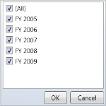

# Grouping Bar

The PivotGrid Grouping Bar enables the drag and drop feature of fields between different areas like column, row, value and filter. By using the Grouping Bar, you can add, rearrange, or remove fields to show data in a PivotGrid exactly the way they want. It consists of the following:

* FilterHeader Area
* DataHeader Area
* ColumnHeader Area
* RowHeader Area

The Field headers identify fields in the pivot grid. A field header contains:

* a caption string which identifies the field's content
* a sort indicator which identifies the sort order applied to the field's values 
* a filter button which end-users can use to filter field values

The headers of all visible fields are contained within header areas. The headers of row and column fields are displayed within the row header and column header areas, respectively. The headers of data fields are displayed within the data header area.

### Use Case Scenarios

At times, you may expect the Grid to perform sorting and filtering at run-time.

## Adding Grouping Bar 

By default, Grouping Bar is enabled. It can be disabled by setting ShowGroupingBar property of PivotGrid to False.


 

<syncfusion:PivotGrid>

  <!--Adding PivotRows-->

   <syncfusion:PivotGridControl.PivotRows>

     <syncfusion:PivotItem FieldMappingName="Product" FieldHeader="Product" TotalHeader="Total"/>

     <syncfusion:PivotItem FieldMappingName="Date" FieldHeader="Date" TotalHeader="Total"/>

   </syncfusion:PivotGridControl.PivotRows>

   <!--Adding PivotColumns-->

   <syncfusion:PivotGridControl.PivotColumns>

     <syncfusion:PivotItem FieldMappingName="Country" FieldHeader="Country" TotalHeader="Total"/>

     <syncfusion:PivotItem FieldMappingName="State" FieldHeader="State" TotalHeader="Total"/>

   </syncfusion:PivotGridControl.PivotColumns>

   <!--Adding PivotCalculations-->

     <syncfusion:PivotGridControl.PivotCalculations>

       <syncfusion:PivotComputationInfo CalculationName = "Total" Description = "Summation of values" FieldName = "Amount" Format = "C" SummaryType="DoubleTotalSum"/>

       <syncfusion:PivotComputationInfo CalculationName = "Total" Description = "Summation of values" FieldName = "Quantity" Format = "#,##0"/>

     </syncfusion:PivotGridControl.PivotCalculations>

</syncfusion:PivotGrid>

 

  

// Instantiating PivotGridControl.

PivotGridControl pivotGridControl1 = new PivotGridControl();

// Adding PivotRows.

pivotGridControl1.PivotRows.Add(new PivotItem { FieldHeader = "Product" });

pivotGridControl1.PivotColumns.Add(new PivotItem { FieldHeader = "Date" });

// Adding PivotColumns.

pivotGridControl1.PivotColumns.Add(new PivotItem { FieldHeader = "Country" });

pivotGridControl1.PivotColumns.Add(new PivotItem { FieldHeader = "State" });

// Adding PivotCalculations.

pivotGridControl1.PivotCalculations.Add(new PivotComputationInfo { FieldName="Amount" , Format="C"});

pivotGridControl1.PivotCalculations.Add(new PivotComputationInfo { FieldName = "Quantity", Format = "#,##0" });



 

' Instantiating PivotGridControl.

Dim pivotGridControl1 As PivotGridControl = New PivotGridControl()

' Adding PivotRows.

pivotGridControl1.PivotRows.Add(New PivotItem With {.FieldHeader = "Product"})

pivotGridControl1.PivotColumns.Add(New PivotItem With {.FieldHeader = "Date"})

' Adding PivotColumns.

pivotGridControl1.PivotColumns.Add(New PivotItem With {.FieldHeader = "Country"})

pivotGridControl1.PivotColumns.Add(New PivotItem With {.FieldHeader = "State"})

' Adding PivotCalculations.

pivotGridControl1.PivotCalculations.Add(New PivotComputationInfo With {.FieldName="Amount", .Format="C"})

pivotGridControl1.PivotCalculations.Add(New PivotComputationInfo With {.FieldName = "Quantity", .Format = "#,##0"})

 


## Filtering

Filtering of data displays only a subset of data that meets criteria specified by you and hides data that you don’t want to get displayed. The Items present in the FilterHeaderArea, ColumnHeaderArea and RowHeaderArea provides the option of run-time filtering which is represented as a Funnel symbol on it. On clicking, it opens a filter popup which displays a list of elements through which filtering can be applied. 


  

// Disabling Filtering.

pivotGridControl1.GroupingBar.AllowFiltering = false;

 

 

// Disabling Filtering.

pivotGridControl1.GroupingBar.AllowFiltering = False 

 


The above code snippets disable Filtering in Grouping Bar.

## Sorting

Sorting data enables you to quickly visualize, organize and understand the data better., It also enables you to find data that you want, and ultimately helps to make more effective decisions. By default, PivotGrid will populate the data in ascending order. Sorting order can be changed clicking on the item present in the RowHeaderArea and ColumnHeaderArea. The Sort indicator present in the item represents the Sort type whether it is ascending sort or descending sort. 

The following image illustrates the Sort indicator with Sort types.

 

// Disabling Sorting.

pivotGridControl1.GroupingBar.AllowSorting = false;
 
 

 

// Disabling Sorting.

pivotGridControl1.GroupingBar.AllowSorting = False 

 

The above code snippets disable Sorting in Grouping Bar.

### Sample Link

..\..\ Syncfusion\BI\WPF\PivotAnalysis.WPF\Samples\Grouping\Grid GroupingBar Demo

## Disable Grouping by Specific Fields 

This feature enables the user to prevent the drop of certain pivot items that has been dragged either from PivotSchemaDesigner or within the pivot grid to the grouping bar at runtime.

### Use Case Scenarios

This feature enables the user to restrict grouping for any specific field at runtime.

The following screenshot shows disabled grouping:

### Properties

<table>
<tr>
<th>
Property</th><th>
Description</th><th>
Type</th><th>
Data Type</th><th>
Reference links</th></tr>
<tr>
<td>
AllowRunTimeGroupByField</td><td>
Gets or sets the value to enable/disable grouping for PivotItem. The default value is true.</td><td>
CLR</td><td>
bool </td><td>
- </td></tr>
<tr>
<td>
ShowDisabledGroupBackground</td><td>
Enable/Disable Background color for the grouping disabled fields. The default value is false.</td><td>
Dependency </td><td>
bool</td><td>
-</td></tr>
</table>

### Sample Link

A sample is provided in the following location:

{InstalledLoction}:\Users\{User}AppData\Local\Syncfusion\EssentialStudio\{InstalledVersion}\BI\WPF\PivotAnalysis.WPF\Samples\Grouping Bar\Grouping Bar Demo

## Adding Disable Grouping by Specific Fields to an Application 

The user needs to set the AllowRunTimeGroupByField property value to enable/disable grouping. The AllowRunTimeGroupByField property is added to PivotItem, PivotComputationInfo and FilterItemsCollection. The ShowDisabledGroupBackground property will allow user to set a disabled look to the grouping disabled pivot items.  

The following code snippets, explains the implementation of the disable grouping by specific fields feature:


 

/// Adding Pivot Columns

<syncfusion:PivotGridControl.PivotColumns>

    <syncfusion:PivotItem FieldMappingName="Country" FieldHeader="Country" TotalHeader="Total" AllowRunTimeGroupByField="False"/>

</syncfusion:PivotGridControl.PivotColumns>

/// Adding Pivot Rows

<syncfusion:PivotGridControl.PivotRows>

    <syncfusion:PivotItem FieldMappingName="Product" FieldHeader="Product" TotalHeader="Total" AllowRunTimeGroupByField="False"/>

</syncfusion:PivotGridControl.PivotRows>

<syncfusion:PivotGridControl.PivotCalculations>

/// Adding Pivot Calculations

    <syncfusion:PivotComputationInfo CalculationName = "Total" Description = "Summation of values" FieldName = "Amount" Format = "C" SummaryType="DoubleTotalSum" AllowRunTimeGroupByField="False"/>

</syncfusion:PivotGridControl.PivotCalculations>

/// Enabling Disabled Background for Grouping disabled items.

  <CheckBox x:Name="chkBoxShowDisabledGroupBackground"  Margin="5"  Content="ShowDisabledGroupBG"  IsChecked="{Binding ElementName=pivotGrid1,Path=ShowDisabledGroupBackground,Mode=TwoWay}"/>

 

  

/// Adding Pivot Columns

this.pivotGrid1.PivotColumns.Add(new PivotItem() { FieldMappingName = "Country", FieldHeader = "Country", TotalHeader = "Total", AllowRunTimeGroupByField = false });

/// Adding Pivot Rows

this.pivotGrid1.PivotRows.Add(new PivotItem() { FieldMappingName = "Product", FieldHeader = "Product", TotalHeader = "Total", AllowRunTimeGroupByField = false });

/// Adding Pivot Calculations

this.pivotGrid1.PivotCalculations.Add(new PivotComputationInfo() { FieldName = "Amount", SummaryType = SummaryType.DoubleTotalSum, CalculationName = "DoubleTotalSum", Format = "C", AllowRunTimeGroupByField = false });          

/// Enabling Disabled Background for Grouping disabled items.

this.pivotGrid1.ShowDisabledGroupBackground = true;

 

 

' Adding Pivot Columns

Me.pivotGrid1.PivotColumns.Add(New PivotItem() With {.FieldMappingName = "Country", .FieldHeader = "Country", .TotalHeader = "Total", .AllowRunTimeGroupByField = False})

' Adding Pivot Rows

Me.pivotGrid1.PivotRows.Add(New PivotItem() With {.FieldMappingName = "Product", .FieldHeader = "Product", .TotalHeader = "Total", .AllowRunTimeGroupByField = False})

' Adding Pivot Calculations

Me.pivotGrid1.PivotCalculations.Add(New PivotComputationInfo() With {.FieldName = "Amount", .SummaryType = SummaryType.DoubleTotalSum, .CalculationName = "DoubleTotalSum", .Format = "C", .AllowRunTimeGroupByField = False})

/// Enabling Disabled Background for Grouping disabled items.

Me.pivotGrid1.ShowDisabledGroupBackground = True 

  


