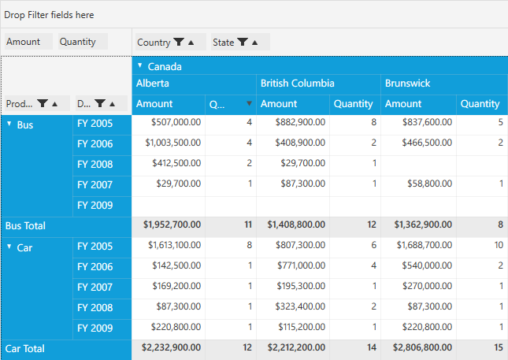

# Multi-Column Sorting

Multiple column sorting allows you to sort the fields one after the other. For example, if a user has three different fields rendered in PivotGrid, then it is possible to sort like: **OrderBy(field1).ThenBy(field2).ThenBy(field3).**. 

A separate index number is used at the top of each column to maintain the order of the sorted columns while doing the multi-column sorting. Also multi-column sorting can be applied for both **Normal** and **Row Pivots Only** mode of PivotGrid control.

##Multi-Column Sorting in Normal Mode

We can enable the sorting through *XAML* or *Code-behind* using `SortOption` property of PivotGrid control.
 
If through *XAML*, please refer the below code sample.



<Grid>
    <syncfusion:PivotGridControl HorizontalAlignment="Left" Name="pivotGrid" VerticalAlignment="Top" SortOption="All" ItemSource="{Binding   Source={StaticResource data}}">

        <syncfusion:PivotGridControl.PivotRows>
            <syncfusion:PivotItem FieldHeader="Product" FieldMappingName="Product" TotalHeader="Total" />
            <syncfusion:PivotItem FieldHeader="Date" FieldMappingName="Date" TotalHeader="Total" />
        </syncfusion:PivotGridControl.PivotRows>
        <syncfusion:PivotGridControl.PivotColumns>
            <syncfusion:PivotItem FieldHeader="Country" FieldMappingName="Country" TotalHeader="Total" />
            <syncfusion:PivotItem FieldHeader="State" FieldMappingName="State" TotalHeader="Total" />
        </syncfusion:PivotGridControl.PivotColumns>
        <syncfusion:PivotGridControl.PivotCalculations>
            <syncfusion:PivotComputationInfo CalculationName="Total" FieldName="Amount" Format="C" SummaryType="DoubleTotalSum" />
            <syncfusion:PivotComputationInfo CalculationName="Total" FieldName="Quantity" SummaryType="Count" />
        </syncfusion:PivotGridControl.PivotCalculations>
    </syncfusion:PivotGridControl>
</Grid>



Else if through *Code-behind*, please refer the below code sample.



public partial class MainWindow: Window {
    PivotGridControl pivotGrid = new PivotGridControl();
    public MainWindow() {
        InitializeComponent();
        grid1.Children.Add(pivotGrid);
        pivotGrid.ItemSource = ProductSales.GetSalesData();
        PivotItem m_PivotItem = new PivotItem() {
            FieldHeader = "Product", FieldMappingName = "Product", TotalHeader = "Total"
        };
        PivotItem m_PivotItem1 = new PivotItem() {
            FieldHeader = "Date", FieldMappingName = "Date", TotalHeader = "Total"
        };
        PivotItem n_PivotItem = new PivotItem() {
            FieldHeader = "Country", FieldMappingName = "Country", TotalHeader = "Total"
        };
        PivotItem n_PivotItem1 = new PivotItem() {
            FieldHeader = "State", FieldMappingName = "State", TotalHeader = "Total"
        };
        // Adding PivotItem to PivotRows
        pivotGrid.PivotRows.Add(m_PivotItem);
        pivotGrid.PivotRows.Add(m_PivotItem1);
        // Adding PivotItem to PivotColumns
        pivotGrid.PivotColumns.Add(n_PivotItem);
        pivotGrid.PivotColumns.Add(n_PivotItem1);
        PivotComputationInfo m_PivotComputationInfo = new PivotComputationInfo() {
            CalculationName = "Amount", FieldName = "Amount", Format = "C", SummaryType = SummaryType.DoubleTotalSum
        };
        PivotComputationInfo m_PivotComputationInfo1 = new PivotComputationInfo() {
            CalculationName = "Quantity", FieldName = "Quantity", SummaryType = SummaryType.Count
        };
        pivotGrid.PivotCalculations.Add(m_PivotComputationInfo);
        pivotGrid.PivotCalculations.Add(m_PivotComputationInfo1);

        pivotGrid.SortOption = PivotSortOption.All;
    }
}
		


* The below screenshot shows the normal PivotGrid.

   
   
* The **Quantity** column has been sorted in the PivotGrid.

   
   
* Then by pressing the Ctrl key, **Amount** column has been sorted. Now the PivotGrid has been sorted by multiple columns.

   
   
* Then again by pressing the Ctrl key, we can the sort the PivotGrid for 'n' number of columns.

   

## Multi-Column Sorting in Row Pivots Only Mode

We can enable sorting through *XAML* or *Code-behind* using `SortOption` property of PivotGrid control in RowPivotsOnly mode.
 
If through *XAML*, please refer the below code sample.



<Grid>
    <syncfusion:PivotGridControl Name="pivotGrid" SortOption="All" RowPivotsOnly="True">

        <syncfusion:PivotGridControl.PivotRows>
            <syncfusion:PivotItem AllowFilter="False" FieldHeader="PID" FieldMappingName="PID" TotalHeader="Total" />
            <syncfusion:PivotItem AllowFilter="False" FieldHeader="Location" FieldMappingName="Location" TotalHeader="Total" />
        </syncfusion:PivotGridControl.PivotRows>
        <syncfusion:PivotGridControl.PivotCalculations>
            <syncfusion:PivotComputationInfo FieldHeader="Color" FieldName="Color" Format="0.0" SummaryType="DoubleTotalSum" AllowSort="True" />
            <syncfusion:PivotComputationInfo FieldHeader="Class" FieldName="Class" Format="0.0" SummaryType="DoubleTotalSum" AllowSort="True" />
            <syncfusion:PivotComputationInfo FieldHeader="PID" FieldName="PID" Format="0.0" SummaryType="DoubleTotalSum" AllowSort="True" />
            <syncfusion:PivotComputationInfo FieldHeader="Units" FieldName="Units" Format="0.0" SummaryType="DoubleTotalSum" AllowSort="True" />
            <syncfusion:PivotComputationInfo FieldHeader="Retail" FieldName="Retail" Format="0.0" SummaryType="DoubleTotalSum" AllowSort="True" />
            <syncfusion:PivotComputationInfo FieldHeader="Cost" FieldName="Cost" Format="0.0" SummaryType="DoubleTotalSum" AllowSort="True" />
            <syncfusion:PivotComputationInfo FieldHeader="TestStr" FieldName="TestStr" Format="0.0" PadString="***" SummaryType="DisplayIfDiscreteValuesEqual" AllowSort="True" />
            <syncfusion:PivotComputationInfo FieldHeader="TestInt" FieldName="TestInt" Format="0.0" PadString="***" SummaryType="DisplayIfDiscreteValuesEqual" AllowSort="True" />
            <syncfusion:PivotComputationInfo FieldHeader="TestDouble" FieldName="TestDouble" Format="0.00" PadString="***" SummaryType="DisplayIfDiscreteValuesEqual" AllowSort="True" />
        </syncfusion:PivotGridControl.PivotCalculations>

    </syncfusion:PivotGridControl>
</Grid>



Else if through *Code-behind*, please refer the below code sample.



public partial class MainWindow: Window {
    public MainWindow() {
        InitializeComponent();
        pivotGrid.SortOption = PivotSortOption.All;
    }
}
		


Similarly, we can perform 'n' number of sorting in RowPivotsOnly mode by pressing Ctrl key.

