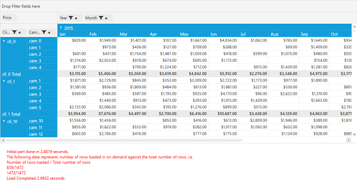

# Performance Improvement along Virtualized Binding

It provides high loading performance for a large set of records. This feature also helps to load the data in PivotGrid on demand by using **Index Engine**.

## Adding a Virtualized binding feature in Pivot Grid

After defining the PivotGrid control, set the properties **EnableOnDemandCalculations** and **UseIndexedEngine** of PivotEngine as true. The values for IndexEngine has been get by using ItemObjectLookup() method and time span must be calculated by using Dispatcher.BeginInvoke() method.

Please refer the below code snippets.



    public partial class MainWindow : Window
    {
        DateTime _startIndex = DateTime.Now;
        public MainWindow()
        {
            InitializeComponent();
            pivotGrid.PivotEngine.EnableOnDemandCalculations =
                    pivotGrid.PivotEngine.UseIndexedEngine = true;
                pivotGrid.PivotEngine.GetValue = ItemObjectLookup;
               ObservableCollection<ItemObject> itemsSourceObject =
                    (pivotGrid.DataContext as ViewModel.ViewModel).ItemObjectCollection;
                pivotGrid.PivotEngine.PivotSchemaChanged +=
                    PivotEngine_PivotSchemaChanged;
                pivotGrid.ItemSource = itemsSourceObject;
        }

        private void PivotEngine_PivotSchemaChanged(object sender, PivotSchemaChangedArgs e)
        {
            _startIndex = DateTime.Now;
           ScrollViewer _scrollViewer = e.OriginalSource as ScrollViewer;
            pivotGrid.Dispatcher.BeginInvoke(DispatcherPriority.SystemIdle, new Action(() =>
                {
                    if (!pivotGrid.IgnoreRefesh)
                    {
                        if ((_scrollViewer.Content as TextBlock) != null)
                            && (__scrollViewer.Content as TextBlock).Text = string.Empty);

                        CheckTime(_startIndex, "Initial part done in");
                        ContinueLoadingAsynchonolously(
                            pivotGrid.PivotEngine.IndexEngine, _startIndex);
                    }
                }));
        }

        private void ContinueLoadingAsynchonolously(IndexEngine engine, DateTime startIndex)
        {
            pivotGrid.Dispatcher.BeginInvoke(new Action(() =>
                {
                    if (engine != null && engine.HighRowLevel < engine.RowCount - 1)
                    {
                        int cutOff = Math.Min(engine.HighRowLevel + 800, engine.RowCount - 1);
                        object o = engine[cutOff, 0]; ////Gets 800 more rows from the pivot engine (on demand calculation).
                        if ((_scrollViewer.Content as TextBlock) != null)
                        {
                            (_scrollViewer.Content as TextBlock).Text +=
                                string.Format("\n{0}/{1}", engine.HighRowLevel, engine.RowCount - 1);
                            ContinueLoadingAsynchonolously(engine, startIndex); //Recursive call to update the rows of the PivotEngine until they reach high row level.
                        }
                    }
                    else
                    {
                        CheckTime(startIndex, "Load Completed");
                    }
                }), DispatcherPriority.SystemIdle);
        }

        private void CheckTime(DateTime start, string label)
        {
            if (_textBlock != null)
                _textBlock.Text += string.Format("\n{0} {1:0.0000} seconds.", label,
                                                 DateTime.Now.Subtract(start).TotalSeconds);
        }

        public IComparable ItemObjectLookup(object o, string name)
        {
            IComparable c = null;
            var io = o as ItemObject;
            if (io != null)
            {
                switch (name)
                {
                    case "Date":
                        c = io.Date;
                        break;
                    case "Client":
                        c = io.Client;
                        break;
                    case "Campaign":
                        c = io.Campaign;
                        break;
                    case "Color":
                        c = io.Color;
                        break;
                    case "Shape":
                        c = io.Shape;
                        break;
                    case "Price":
                        c = io.Price;
                        break;
                    case "Spend":
                        c = io.Spend;
                        break;
                    case "ColH":
                        c = io.ColH;
                        break;
                    case "ColI":
                        c = io.ColI;
                        break;
                    case "ColJ":
                        c = io.ColJ;
                        break;
                }
            }
            return c;
        }
    }    



