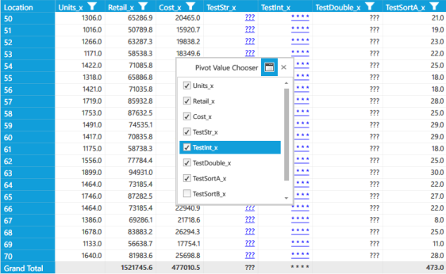

# Pivot Value Chooser

The Pivot Value Chooser is used to list all the pivot fields in the data source when the pivot grid is in RowPivotsOnly mode. This window enables users to select a pivot calculation and add it to the pivot grid, drag and drop the grid fields, and rearrange the calculation column in the PivotGrid control at run time.

### Use Case Scenario

This feature enables users to show or hide particular pivot calculations in the pivot grid at run time.

Pivot Grid with Pivot Value Chooser
{:.caption}

### Properties

<table>
<tr>
<td>
Property</td><td>
Description}</td><td>
Type</td><td>
Data Type</td></tr>
<tr>
<td>
ShowPivotValueChooser</td><td>
Hides or shows a computation value column chooser dialog that allows users to hide, show, or reorder the pivot calculations in the pivot grid.</td><td>
Dependency Property</td><td>
Boolean</td></tr>
<tr>
<td>
PossiblePivotCalculations</td><td>
Gets or sets a collection of possible pivot calculations that may appear in the PivotGrid control and lists them in the PivotValueChooser.</td><td>
Dependency Property</td><td>
ObservableCollectionOf type PivotComputationInfo</td></tr>
</table>

### Sample Link

A sample of this feature can be found in the following location:

{InstalledDrive}:\Users\<UserName>\AppData\Local\Syncfusion\EssentialStudio\<Version>\BI\Wpf\PivotAnalysis.Wpf\Samples\Product Showcase\RowPivotsOnly Demo

## Showing the Pivot Value Chooser in an Application

Users can show or hide the Pivot Value Chooser by setting the ShowPivotValueChooser property to true or false, respectively. The RowPivotsOnly mode must be enabled in the pivot grid for this feature to function.

N> PossiblePivotCalculations is a collection where users can define which fields should appear in the Pivot Value Chooser window. If it is not defined, then this collection will be automatically generated from the PivotGrid control’s ItemSource.

### Showing the Pivot Value Chooser with Possible Pivot Calculations


  

ObservableCollection<PivotComputationInfo> possibleComputations = new ObservableCollection<PivotComputationInfo>()

{

//Add computation collection.

};

this.pivotGridControl1.PossiblePivotCalculations = possibleComputations;

this.pivotGridControl1.RowPivotsOnly = true;

this.pivotGridControl1.ShowPivotValueChooser = true;

 

 

Dim possibleComputations As New ObservableCollection(Of PivotComputationInfo)() From {}

'Add computation collection.

Me.pivotGridControl1.PossiblePivotCalculations = possibleComputations

Me.pivotGridControl1.RowPivotsOnly = True

Me.pivotGridControl1.ShowPivotValueChooser = True

 


### Showing Pivot Value Chooser without Possible Pivot Calculations


  

this.pivotGridControl1.RowPivotsOnly = true;

this.pivotGridControl1.ShowPivotValueChooser = true;

 

 

Me.pivotGridControl1.RowPivotsOnly = True

Me.pivotGridControl1.ShowPivotValueChooser = True 

 


