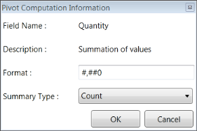
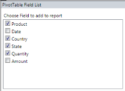
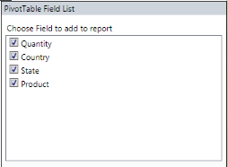

## PivotSchemaDesigner for WPF

PivotSchemaDesigner for WPF can be support in PivotGrid samples so that PivotGrid can be presented like an ExcelPivotTable. It enables drag 
and drop feature of fields between different areas like Column, row, value and filter. By using the PivotTable Field List, you can add, 
rearrange, or remove fields to show data in a PivotGrid exactly the way that you want. The PivotTable Field List displays two sections, 
consisting of the following items:

* A field section at the top for adding fields to and removing fields from the PivotGrid.
* A layout section at the bottom for rearranging and repositioning the fields in the PivotGrid.

### Fields Section

The Fields section consists of the list of fields present in the PivotGrid including Row, Column, and Summary elements. A field will be added 
to the PivotGrid if it is checked, or it will be removed from the PivotGrid if it is unchecked. By default, fields will be added to the row 
label if checked, and added to the column label by simply dragging the field and dropping it onto the column label area.

### Layout Section

The layout section is used to rearrange and reposition the fields in a PivotGrid. It has the following areas:

* Report Filter
* Column Label
* Row Label
* Values

### Report Filter

Report filter is used to filter the entire report based on the selected item in the report filter. The Report filter pop-up window can be 
launched by clicking on the expander icon available in the right corner of each filter item.

### Column Label

The column label is used to display fields as columns at the top of a report. A column lower in position is nested within another column 
immediately above it in the PivotGrid.

### Row Label

The row label is used to display fields as rows at the top of a report. A row lower in position is nested within another row immediately above 
it in the PivotGrid.

### Values

Values are used to display summary values.

### Pivot Computation Information Window

The Pivot Computation Information window is used to change or edit value format and summary type.

### Binding PivotTableDesigner to PivotGrid

The PivotTableDesigner can be bound to PivotGrid with the help of the PivotControl property of PivotTableDesigner.

 

[XAML]

<!--PivotTable designer--> 

<syncfusion:PivotTableDesigner Grid.Column="1" PivotControl="{Binding ElementName=pivotGrid1}"/>

 

### Features

### Support to Hide Fields in PivotSchemaDesigner 

The user can customize the PivotTable field list in PivotSchemaDesigner. The user can hide the unnecessary fields from the 
PivotSchemaDesigner by using the ShowDisplayFieldsOnly property.

#### Use Case Scenarios

This feature enables the user to load required set of items in PivotSchemaDesigner.

The following screen shot shows a PivotSchemaDesigner control with all items and required items in a pivot table field list:

#### Properties

_Properties Table_

<table>
<tr>
<td>
Property </td><td>
Description </td><td>
Type </td><td>
Data Type </td><td>
Reference links </td></tr>
<tr>
<td>
ShowDisplayFieldsOnly</td><td>
Gets or sets the value incdicating to show only the fields that are used in PivotGrid </td><td>
Dependency</td><td>
Boolean</td><td>
- </td></tr>
</table>

#### Sample Link

A sample is placed in the following location:

SystemDrive\Users\<user_name>\AppData\Local\Syncfusion\EssentialStudio\<Version_number>\BI\WPF\PivotAnalysis.Wpf\Product Showcase\PivotGridDemo

### Sample IList Data

  

[C#]

public class ProductSales

    {

        public string Product { get; set; }

        public string Year { get; set; }

        public string Country { get; set; }

        public string State { get; set; }

        public int Quantity { get; set; }

        public double Amount { get; set; }

        public static ProductSalesCollection GetSalesData()

        {

            /// Geography

            string[] countries = new string[] { "Canada" };

            string[] canadaStates = new string[] { "Alberta", "British Columbia","Ontario" };

            /// Time

            string[] dates = new string[] { "FY 2005", "FY 2006", "FY 2007" };

            /// Products

            string[] products = new string[] { "Bike", "Car" };

            Random r = new Random(123345345);

            int numberOfRecords = 2000;

            ProductSalesCollection listOfProductSales = new ProductSalesCollection();

            for (int i = 0; i < numberOfRecords; i++)

            {

                ProductSales sales = new ProductSales();

                sales.Country = countries[r.Next(0, countries.GetLength(0))];

                sales.Quantity = r.Next(1, 12);

                /// 1 percent discount for 1 quantity

                double discount = (30000 * sales.Quantity) * (double.Parse(sales.Quantity.ToString()) / 100);

                sales.Amount = (30000 * sales.Quantity) - discount;

                sales.Year = dates[r.Next(r.Next(dates.GetLength(0) + 1))];

                sales.Product = products[r.Next(r.Next(products.GetLength(0) + 1))];

                sales.State = canadaStates[r.Next(canadaStates.GetLength(0))];             

                listOfProductSales.Add(sales);

            }

            return listOfProductSales;

        }

        public override string ToString()

        {

            return string.Format("{0}-{1}-{2}", this.Country, this.State, this.Product);

        }

        public class ProductSalesCollection : List<ProductSales>

        {

        }

    }

	
 

 

[VB]

Public Class ProductSales

Private privateProduct As String

Public Property Product() As String

Get

Return privateProduct

End Get

Set(ByVal value As String)

privateProduct = value

End Set

End Property

Private privateYear As String

Public Property Year() As String

Get

Return privateYear

End Get

Set(ByVal value As String)

privateYear = value

End Set

End Property

Private privateCountry As String

Public Property Country() As String

Get

Return privateCountry

End Get

Set(ByVal value As String)

privateCountry = value

End Set

End Property

Private privateState As String

Public Property State() As String

Get

Return privateState

End Get

Set(ByVal value As String)

privateState = value

End Set

End Property

Private privateQuantity As Integer

Public Property Quantity() As Integer

Get

Return privateQuantity

End Get

Set(ByVal value As Integer)

privateQuantity = value

End Set

End Property

Private privateAmount As Double

Public Property Amount() As Double

Get

Return privateAmount

End Get

Set(ByVal value As Double)

privateAmount = value

End Set

End Property

Public Shared Function GetSalesData() As ProductSalesCollection

''' Geography

Dim countries() As String = New String() { "Canada" }

Dim canadaStates() As String = New String() { "Alberta", "British Columbia","Ontario" }

''' Time

Dim dates() As String = New String() { "FY 2005", "FY 2006", "FY 2007" }

''' Products

Dim products() As String = New String() { "Bike", "Car" }

Dim r As Random = New Random(123345345)

Dim numberOfRecords As Integer = 2000

Dim listOfProductSales As ProductSalesCollection = New ProductSalesCollection()

For i As Integer = 0 To numberOfRecords - 1

Dim sales As ProductSales = New ProductSales()

sales.Country = countries(r.Next(0, countries.GetLength(0)))

sales.Quantity = r.Next(1, 12)

''' 1 percent discount for 1 quantity

Dim discount As Double = (30000 * sales.Quantity) * (Double.Parse(sales.Quantity.ToString()) / 100)

sales.Amount = (30000 * sales.Quantity) - discount

sales.Year = dates(r.Next(r.Next(dates.GetLength(0) + 1)))

sales.Product = products(r.Next(r.Next(products.GetLength(0) + 1)))

sales.State = canadaStates(r.Next(canadaStates.GetLength(0)))

listOfProductSales.Add(sales)

Next i

Return listOfProductSales

End Function

Public Overrides Function ToString() As String

Return String.Format("{0}-{1}-{2}", Me.Country, Me.State, Me.Product)

End Function

Public Class ProductSalesCollection

Inherits List(Of ProductSales)

End Class

End Class

 

