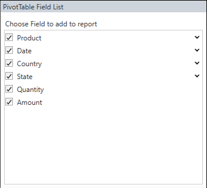
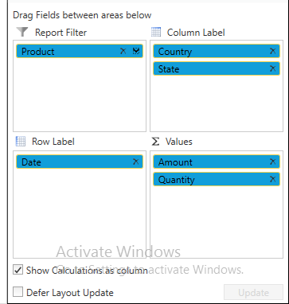
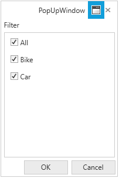

# Pivot Schema Designer for Pivot Grid

**PivotSchemaDesigner** can be supported in PivotGrid, so that it can be presented like an **ExcelPivotTable**. By using the PivotSchemaDesigner, you can add, re-arrange, or remove fields to show data in a PivotGrid exactly the way you want. It contains two sections, consisting of the following items:

* A **field section** at the top is used for adding and removing fields from the PivotGrid.
* A **layout section** at the bottom is used for re-arranging and repositioning the fields in the PivotGrid.

## Fields Section

The **Fields section** consists of the list of fields present in the PivotGrid including Row, Column, and Summary elements which is called as **PivotTable Field List**. A field will be added to the PivotGrid if it is checked, or it will be removed from the PivotGrid if it is unchecked. By default, fields will be added to the row label if checked, and added to the column label by simply dragging the field and dropping it onto the column label area. We also support filtering in PivotTable Field List. Filter popup will be opened while clicking on the expander icon in the right corner of each PivotTable Field List items.

## Layout Section

The layout section is used to re-arrange and reposition the fields in a PivotGrid. It has the following areas:

* Report Filter
* Column Label
* Row Label
* Values

### Report Filter

Report filter is used to filter the entire report based on the selected item in the report filter. The Report filter pop-up window can be launched by clicking on the expander icon available in the right corner of each filter item.

### Column Label

Column label is used to display fields as columns at the top of a report. A column lower in position is nested within another column immediately above it in the PivotGrid.

### Row Label

Row label is used to display fields as rows at the top of a report. A row lower in position is nested within another row immediately above it in the PivotGrid.

### Values

Values section is used to display the summary fields of the PivotGrid.