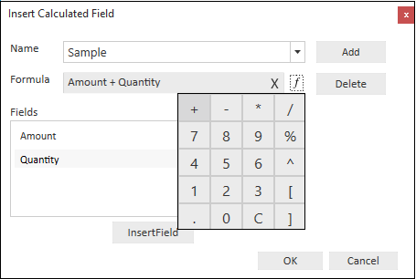
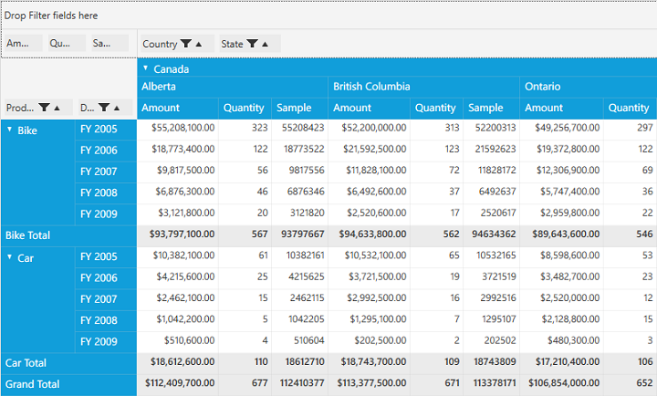

#Calculated Field

PivotGrid provides support to insert a new calculated field based on the existing calculated items using **CalculatedField** window. This option is available as a menu item in the GroupingBar context menu. 

**Use Case Scenario**

User could add a new calculated field based on their requirement at run time.

## Inserting a new CalculatedField in PivotGrid

To insert a new CalculatedField, open the CalculatedField window using the GroupingBar context menu. Then define a **Name** for the new calculated field. 

_Defining Name for the Calculated Field_

Note that, the **Formula** can be entered by inserting calculation fields through *Fields* section. For inserting numerical operator you can use formula popup as shown in the below screenshot.

_Entering Formula for the Calculated Field_

Click **Add** button for adding that calculated field and click **OK** to populate the PivotGrid control.

_PivotGrid with newly added Calculated Field_
