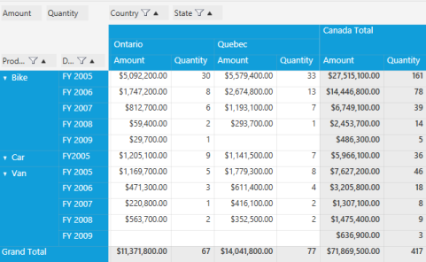
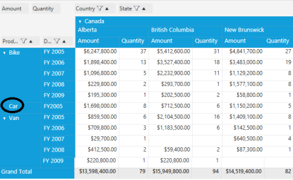

# Subtotal Hiding at Pivot Item level in the PivotGrid control

## Subtotal hiding at PivotItem level

This feature is an enhancement for the PivotGrid control. It has the ability to selectively turn column and row subtotals on and off. This means the user can specify the rows or columns that should not be included in subtotal calculation by setting that pivot item’s ShowSubTotal property as false. Also, while calculating the GrandTotal, the values of hidden subtotals will be omitted. Everything has been made at Grid level for performance consideration. By default, the Subtotal visibility of all the pivot items is true.

## Show or hide the expander symbol for a single Pivot Item

This feature enables the user to set the visibility of the expander symbol of the PivotItem which has single row (after hide its subtotal row or column) by setting the property “ShowExpanderForSinglePivot”. By default this property value will be true (the visibility of the expander symbol will be set to Visible). 

### Use Case Scenarios

When the user has more computational fields with subtotals and wants to view the subtotal of a specific PivotItem to simplify viewing large amounts of data, the user can also hide the subtotals of a particular PivotItem when needed.

The following screenshots show the PivotGrid with the PivotItem “Product” subtotal shown and hidden:

Subtotals displayed
{:.caption}

Subtotals hidden
{:.caption}

The expander for the item “Car” is collapsed in the following screenshot since it only has a single row (FY2005) after its subtotal is hidden:

Car row collapsed
{:.caption}

### Properties

<table>
<tr>
<td>
Property</td><td>
Description</td><td>
Type</td><td>
Data Type</td><td>
Reference links</td></tr>
<tr>
<td>
ShowSubTotal</td><td>
Shows or hides the subtotal of the particular pivot item.</td><td>
Dependency </td><td>
Boolean </td><td>
</td></tr>
<tr>
<td>
ShowExpanderForSinglePivot</td><td>
Shows or hides expander of the  item which has single row after its subtotals hidden</td><td>
General</td><td>
Boolean</td><td>
</td></tr>
</table>

### Sample Link

Use the following steps to view a sample of this feature:

1.Select Start > Programs > Syncfusion > Essential Studio <version number> > Dashboard

2.Click Run Samples for the WPF platform.

3.Select PivotGrid.

4.Navigate to Product Showcase > Pivot Grid Demo.

## Show or hide the subtotal for a specific pivot item in the PivotGrid control

Users can show or hide a particular PivotItem’s subtotal using the ShowSubTotal property. To show its subtotal, set this property to true. To hide the subtotal, set this property to false. By default, the value of the ShowSubTotal property is set to true.

The following code sample shows how to set values for the ShowSubTotal property:


 

 <syncfusion:PivotItem FieldMappingName="Product" FieldHeader="Product" ShowSubTotal="False" TotalHeader="Total"/>

 

To show the subtotal of an item at the specified index in a PivotColumn:

  

 pivotGrid1.PivotColumns[index].ShowSubTotal = true; 

 

 

Me.pivotGrid1.PivotColumns[index].ShowSubTotals = True

 


To hide subtotal of an item at the specified index in a PivotRow:


  

pivotGrid1.PivotRows[index].ShowSubTotal = false;  

 

 

Me.pivotGrid1.PivotRows[index].ShowSubTotals = False

 


#### Show or hide the expander symbol for a single row in the PivotGrid control

Users can show or hide the expander symbol for items with a single row or column after its subtotals are hidden using the ShowExpanderForSinglePivot property. To hide the expander for a single row, set this property to false. By default the value of the ShowExpanderForSinglePivot property is set to true.

 

  <syncfusion:PivotGridControl ShowExpanderForSinglePivot="False" Name="pivotGrid/>

 

To show the expander of the row or column that has a single row after its subtotals are hidden:


 

 pivotGrid.ShowExpanderForSinglePivot = true;

  

  

Me.pivotGrid.ShowExpanderForSinglePivot = True




 To hide the expander of the row or column that has a single row after its subtotals are hidden:

 
  

pivotGrid.ShowExpanderForSinglePivot = false;

 

 

Me.pivotGrid.ShowExpanderForSinglePivot = False

 


