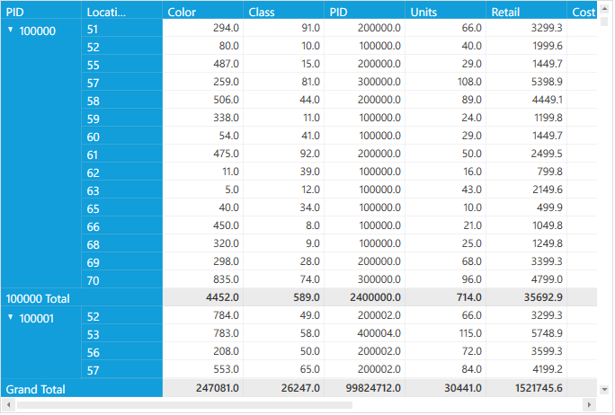

#Support to make the GrandTotalsRows always visible

PivotGrid provides support to the make the grand totals rows always visible in RowPivotsOnly mode. It can be achieved by using the **GrandTotalRowAlwaysVisible** property of PivotGrid control.

                                                              Property Table

<table>
<tr>
<th>
Property </th><th>
Description </th><th>
Type </th><th>
Value It Accepts</th><th>
Reference Link</th></tr>
<tr>
<td>
GrandTotalRowAlwaysVisible</td><td>
Gets or sets a value indicating whether to make the grand totals visible all the time.</td><td>
bool</td><td>
True, False(Default)</td><td>
-</td></tr>
<tr>
</table>

##Defining the property in PivotGrid 

This property can be defined either in *XAML* or in *Code-Behind*.

If through **XAML**, please refer the below code snippet.



<Grid>
    <syncfusion:PivotGridControl Name="pivotGrid" GrandTotalRowAlwaysVisible="True" RowPivotsOnly="True">

        <syncfusion:PivotGridControl.PivotRows>
            <syncfusion:PivotItem AllowFilter="False" FieldHeader="PID" FieldMappingName="PID" TotalHeader="Total" />
            <syncfusion:PivotItem AllowFilter="False" FieldHeader="Location" FieldMappingName="Location" TotalHeader="Total" />
        </syncfusion:PivotGridControl.PivotRows>
        <syncfusion:PivotGridControl.PivotCalculations>
            <syncfusion:PivotComputationInfo FieldHeader="Color" FieldName="Color" Format="0.0" SummaryType="DoubleTotalSum" />
            <syncfusion:PivotComputationInfo FieldHeader="Class" FieldName="Class" Format="0.0" SummaryType="DoubleTotalSum" />
            <syncfusion:PivotComputationInfo FieldHeader="PID" FieldName="PID" Format="0.0" SummaryType="DoubleTotalSum" />
            <syncfusion:PivotComputationInfo FieldHeader="Units" FieldName="Units" Format="0.0" SummaryType="DoubleTotalSum" />
            <syncfusion:PivotComputationInfo FieldHeader="Retail" FieldName="Retail" Format="0.0" SummaryType="DoubleTotalSum" />
            <syncfusion:PivotComputationInfo FieldHeader="Cost" FieldName="Cost" Format="0.0" SummaryType="DoubleTotalSum" />
            <syncfusion:PivotComputationInfo FieldHeader="TestStr" FieldName="TestStr" Format="0.0" PadString="***" SummaryType="DisplayIfDiscreteValuesEqual" />
            <syncfusion:PivotComputationInfo FieldHeader="TestInt" FieldName="TestInt" Format="0.0" PadString="***" SummaryType="DisplayIfDiscreteValuesEqual" />
            <syncfusion:PivotComputationInfo FieldHeader="TestDouble" FieldName="TestDouble" Format="0.00" PadString="***" SummaryType="DisplayIfDiscreteValuesEqual" />
        </syncfusion:PivotGridControl.PivotCalculations>

    </syncfusion:PivotGridControl>
</Grid>



Else if through **Code-Behind**, please refer the below code snippet.



public partial class MainWindow: Window {
    public MainWindow() {
        InitializeComponent();
        pivotGrid.GrandTotalRowAlwaysVisible = true;
    }
}
	 


