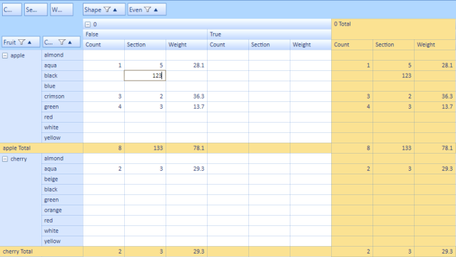

# Updating and Editing

## Editing and Updating in Value and Total Cells in the PivotGrid Control

Editing and updating the value cells and total cells is possible now in the PivotGrid control. Editing and updating can be enabled through the EnableValueEditing and EnableUpdating properties respectively. While handling the editing and updating operations, the values will be calculated automatically and its total values will be reflected.

### Use Case Scenarios

Editing and updating features are useful when users would like to edit the values at run time and save their changes to the underlying data source, thereby reflecting its update in the total cells.

### Properties Table

<table>
<tr>
<th>
Property</th><th>
Description</th><th>
Type</th><th>
Data Type</th></tr>
<tr>
<td>
EnableValueEditing</td><td>
Gets/sets the Boolean value to enable editing in value cells</td><td>
CLR</td><td>
Boolean </td></tr>
<tr>
<td>
EnableUpdating</td><td>
Gets/sets the Boolean value to enable updating</td><td>
CLR</td><td>
Boolean</td></tr>
<tr>
<td>
ThrottleUpdateRate</td><td>
Gets or sets a millisecond value for time between UI refreshes. Zero indicates immediate refreshes of the UI without delays. Throttling the refresh rate can minimize CPU usage. The default value is zero, but depending upon your updating rate, values of 300 to 500 milliseconds may give lower CPU usage.</td><td>
CLR</td><td>
Int</td></tr>
<tr>
<td>
AllowEditingOfTotalCells</td><td>
Gets/sets the Boolean value to enable editing in total cells</td><td>
CLR</td><td>
Boolean</td></tr>
<tr>
<td>
HideExpanders</td><td>
Gets/sets the Boolean value to hide expanders in the header cells</td><td>
CLR</td><td>
Boolean</td></tr>
</table> 

### Events

<table>
<tr>
<th>
Event</th><th>
Description</th><th>
Arguments</th><th>
Type</th></tr>
<tr>
<th>
ChangeValue</th><th>
Triggered when changing a cell’s value. Using this event we can alter the PivotCellInfo.</th><th>
Object oldValue, object newValue, int row1, int col1, PivotCellInfo pi</th><th>
Event </th></tr>
</table>

### Sample Link

#### Updating Demo

{InstalledDrive}\Users\{User}\AppData\Local\Syncfusion\EssentialStudio\{Version}\BI\WPF\PivotAnalysis.Wpf\Samples\Interactive Features\Updating Demo

#### Editing Demo

{InstalledDrive}\Users\{User}\AppData\Local\Syncfusion\EssentialStudio\{Version}\BI\WPF\PivotAnalysis.Wpf\Samples\Interactive Features\Editing Demo

### Adding Updating and Editing to an Application 

You can enable updating in value and total cells by setting the EnableValueEditing and EnableUpdating Boolean properties of the PivotGrid control to true. Enabling the AllowEditingOfTotalCells property allows you to edit the total cells in the PivotGrid control.


 

// To Enable Editing Value cells in PivotGridControl

this.pivotGrid1.EnableValueEditing = true;

// To Enable Updating in PivotGridControl

this.pivotGrid1.EnableUpdating = true;

// To Enable Editing Total cells in PivotGridControl this.pivotGrid1.EditManager.AllowEditingOfTotalCells = true;

  



‘To Enable Editing in PivotGridControl

Me.pivotGrid1.EnableValueEditing = True

‘To Enable Updating in PivotGridControl

Me.pivotGrid1.EnableUpdating = True 

  
 

‘To Enable Editing Total cells in PivotGridControl Me.pivotGrid1.EditManager.AllowEditingOfTotalCells = True

A custom editing manager can be used so that you can format the PivotCellInfo. This can be handled by overriding the ChangeValue event. The following code demonstrates its implementation where the formatted text is customized by appending * after editing the cell.


  

//User derived EditManager.

this.pivotGrid1.EditManager.Dispose(); //dispose the current one...

//Set the derived one...

this.pivotGrid1.EditManager = new CustomEditManager(this.pivotGrid1); 

//Custom Editing manager

public class CustomEditManager : PivotEditingManager

{

    public CustomEditManager(PivotGridControl pg)

        : base(pg) {}

    protected override void ChangeValue(object oldValue, object newValue, int row1, int col1, PivotCellInfo pi)

    {

        //do the base change

        base.ChangeValue(oldValue, newValue, row1, col1, pi);

        //mark all the adjusted cell contents

        pi.FormattedText +="*";

    }

}

 

 

'User derived EditManager.

Me.pivotGrid1.EditManager.Dispose() 'dispose the current one...

'Set the derived one...

Me.pivotGrid1.EditManager = New CustomEditManager(Me.pivotGrid1) 

//Custom Editing manager

Public Class CustomEditManager

Inherits PivotEditingManager

Public Sub New(ByVal pg As PivotGridControl)

MyBase.New(pg)

End Sub

Protected Overrides Sub ChangeValue(ByVal oldValue As Object, ByVal newValue As Object, ByVal row1 As Integer, ByVal col1 As Integer, ByVal pi As PivotCellInfo)

'do the base change

MyBase.ChangeValue(oldValue, newValue, row1, col1, pi)

'mark all the adjusted cell contents

pi.FormattedText &= "*"

End Sub

End Class

 


While updating the PivotGrid control you can throttle its updating speed which can be set through the ThrottleUpdateRate property. It gets the value in milliseconds as the time interval for UI refreshes to take place. Zero indicates immediate refresh of the UI without any delays. Throttling the refresh rate can minimize CPU usage. The default value is zero, but depending upon your updating rate, values of 300 to 500 milliseconds may give lower CPU usage. The following code explains its implementation.


   

// To set throttle rate for updating in PivotGridControl

this.pivotGrid1.UpdateManager.ThrottleUpdateRate = 300;



 

‘To set throttle rate for updating in PivotGridControl

Me.pivotGrid1.UpdateManager.ThrottleUpdateRate = 300 

 


