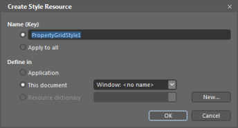
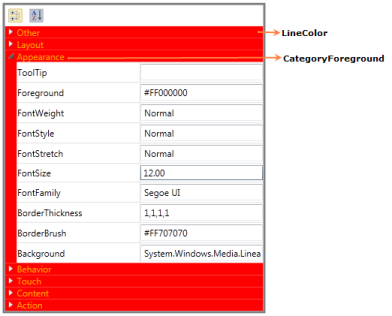

# Appearance

## Blendability

The PropertyGrid control can easily be editable in blend. You can edit the template of the PropertyGrid control to give a good look and feel for the control using Expression Blend.

### Using blendability support in an application

Create the PropertyGrid control using Blend. After creating the PropertyGrid control using Blend, select it and go to “Object” -> “Edit Style” -> “Edit a Copy” to edit the Template of the PropertyGrid control.

This will open a dialog (below) where you can give a name of your own style and define exactly where you would like to store it.

What’s produced through the set of steps is quite a bit of XAML which is placed within your application. This XAML represents the default style for the PropertyGrid control.

Now you can edit each part in the template and create custom look and feel for the control.

## Background and foreground support

You can customize the foreground and background of the PropertyGrid using the following properties,

* LineColor
* ViewBackground
* CategoryForeground

### Using background and foreground support in an application

Using LineColor, you can set the background for category heading while grouping.Using CategoryForeground, you can set the foreground for category heading.




<syncfusion:PropertyGrid x:Name="propertyGrid" SelectedObject="{Binding ElementName=Btn}" Margin="50" Width="350" BorderBrush="Gray" BorderThickness="3" HorizontalAlignment="Center" VerticalAlignment="Stretch" LineColor="Red" CategoryForeground="Black">
</syncfusion:PropertyGrid>




### Properties

Grouping and Sorting Table

<table>
<tr>
<th>
Property </th><th>
Description </th><th>
Type </th><th>
Data Type </th><th>
Reference links </th></tr>
<tr>
<td>
ViewBackground</td><td>
Sets the background for the PropertyGrid control.</td><td>
DependencyProperty</td><td>
Brush</td><td>
</td></tr>
<tr>
<td>
LineColor</td><td>
Sets the background for category heading while grouping.</td><td>
DependencyProperty</td><td>
Brush</td><td>
</td></tr>
<tr>
<td>
CategoryForeground</td><td>
Sets the foreground for category heading.</td><td>
DependencyProperty</td><td>
Brush</td><td>
</td></tr>
</table>

#### Sample link

1. Select Start -> Programs -> Syncfusion -> Essential Studio xx.x.x.xx -> Dashboard.
2. Select Run Locally Installed Samples in WPF Button.
3. Now expand the PropertyGrid treeview item in the Sample Browser.
4. Choose any one of the samples listed under it to launch. 
5. Skins

The appearance of the PropertyGrid can be customized by using the “VisualStyle” property. The following are the various built-in visual styles for PropertyGrid Control.

* Blend
* Office2003
* Office2007Blue
* Office2007Black
* Office2007Silver
* ShinyBlue
* ShinyRed
* SyncOrange
* VS2010
* Metro
* Transparent