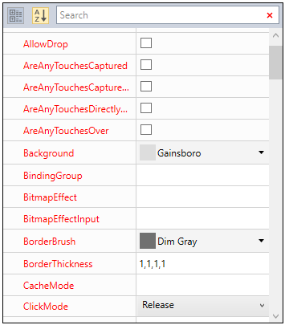
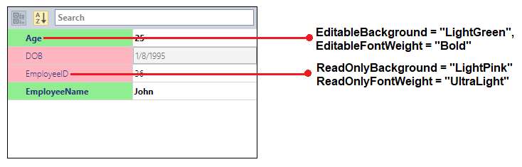
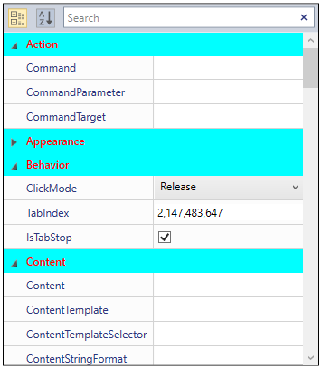
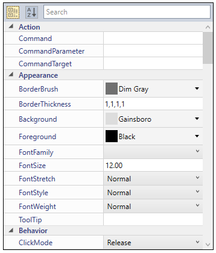
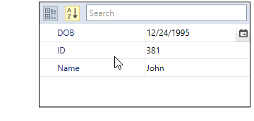
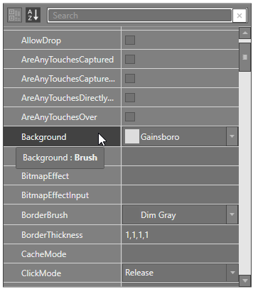

# Appearance in WPF PropertyGrid

This section explains different UI customization, styling, theming options available in [PropertyGrid](https://www.syncfusion.com/wpf-ui-controls/propertygrid) control.

## Setting the Foreground

We can change the foreground color for properties of [SelectedObject](https://help.syncfusion.com/cr/wpf/Syncfusion.Windows.PropertyGrid.PropertyGrid.html#Syncfusion_Windows_PropertyGrid_PropertyGrid_SelectedObject) by setting the `Foreground` property. The default color value of `Foreground` property is `Blue`.




<syncfusion:PropertyGrid Foreground="Red" x:Name="propertyGrid1">
    <syncfusion:PropertyGrid.SelectedObject>
         <Button></Button>
    </syncfusion:PropertyGrid.SelectedObject>
</syncfusion:PropertyGrid>




PropertyGrid propertyGrid1 = new PropertyGrid();
propertyGrid1.SelectedObject = new Button();
propertyGrid1.Foreground = Brushes.Red;




## Setting the Background and FontWeight

We can change the background and font weight for all the properties by using the [ViewBackgroundColor](https://help.syncfusion.com/cr/wpf/Syncfusion.Windows.PropertyGrid.PropertyGrid.html#Syncfusion_Windows_PropertyGrid_PropertyGrid_ViewBackgroundColor) and `FontWeight` properties.




<syncfusion:PropertyGrid ViewBackgroundColor="Cyan" FontWeight="Bold" 
                         x:Name="propertyGrid1">
    <syncfusion:PropertyGrid.SelectedObject>
        <Button></Button>
    </syncfusion:PropertyGrid.SelectedObject>
</syncfusion:PropertyGrid>




PropertyGrid propertyGrid1 = new PropertyGrid();
propertyGrid1.SelectedObject = new Button();
propertyGrid1.ViewBackgroundColor = Brushes.Cyan;
propertyGrid1.FontWeight = FontWeights.Bold;



### Background and FontWeight for the Editable and Readonly Properties

If we want to differentiate between editable and readonly properties, we can do this by using [EditableBackground](https://help.syncfusion.com/cr/wpf/Syncfusion.Windows.PropertyGrid.PropertyGrid.html#Syncfusion_Windows_PropertyGrid_PropertyGrid_EditableBackground) and [EditableFontWeight](https://help.syncfusion.com/cr/wpf/Syncfusion.Windows.PropertyGrid.PropertyGrid.html#Syncfusion_Windows_PropertyGrid_PropertyGrid_EditableFontWeight) properties to highlights the editable properties and use the [ReadOnlyBackground](https://help.syncfusion.com/cr/wpf/Syncfusion.Windows.PropertyGrid.PropertyGrid.html#Syncfusion_Windows_PropertyGrid_PropertyGrid_ReadOnlyBackground) and [ReadOnlyFontWeight](https://help.syncfusion.com/cr/wpf/Syncfusion.Windows.PropertyGrid.PropertyGrid.html#Syncfusion_Windows_PropertyGrid_PropertyGrid_ReadOnlyFontWeight) properties to highlights the readonly properties.




class Employee {
    public string EmployeeName { get; set; }
    [Editable(false)]
    public int EmployeeID { get; set; }     
    public int Age { get; set; }
    [ReadOnly(true)]
    public DateTime DOB { get; set; }
}

public class ViewModel {
    public Object SelectedEmployee { get; set; }
    public ViewModel() {
        SelectedEmployee = new Employee() 
        { 
            EmployeeName = "John", 
            DOB = new DateTime(1995, 01, 08), 
            Age=25, 
            EmployeeID = 036 
        };
    }
}







<syncfusion:PropertyGrid EditableBackground="LightGreen" EditableFontWeight="Bold"
                         ReadOnlyBackground="LightPink"  ReadOnlyFontWeight="UltraLight"
                         SelectedObject="{Binding SelectedEmployee}" x:Name="propertyGrid1" >
    <syncfusion:PropertyGrid.DataContext>
        <local:ViewModel></local:ViewModel>
    </syncfusion:PropertyGrid.DataContext>
</syncfusion:PropertyGrid>




PropertyGrid propertyGrid1 = new PropertyGrid();
propertyGrid1.DataContext = new ViewModel();
propertyGrid1.SetBinding(PropertyGrid.SelectedObjectProperty, new Binding("SelectedEmployee"));
propertyGrid1.EditableBackground = Brushes.LightGreen;
propertyGrid1.EditableFontWeight = FontWeights.Bold;
propertyGrid1.ReadOnlyBackground = Brushes.LightPink;
propertyGrid1.ReadOnlyFontWeight = FontWeights.UltraLight;




N> If you use `EditableBackground` or `ReadOnlyBackground` properties with `ViewBackgroundColor` property, `EditableBackground` and `ReadOnlyBackground` properties have higher priority.

N> If you use `EditableFontWeight` or `ReadOnlyFontWeight` properties with `FontWeight` property, `EditableFontWeight` and `ReadOnlyFontWeight` properties have higher priority.

## Category Header's foreground and background

We can change the background and foreground of the category header by setting the [LineColor](https://help.syncfusion.com/cr/wpf/Syncfusion.Windows.PropertyGrid.PropertyGrid.html#Syncfusion_Windows_PropertyGrid_PropertyGrid_LineColor) property and [CategoryForeground](https://help.syncfusion.com/cr/wpf/Syncfusion.Windows.PropertyGrid.PropertyGrid.html#Syncfusion_Windows_PropertyGrid_PropertyGrid_CategoryForeground) property. The `LineColor` property value applied to the background and `CategoryForeground` property value applied to the foreground of the category header only on category view. To enable category view, use the [EnableGrouping](https://help.syncfusion.com/cr/wpf/Syncfusion.Windows.PropertyGrid.PropertyGrid.html#Syncfusion_Windows_PropertyGrid_PropertyGrid_EnableGrouping) property as `true`.




<syncfusion:PropertyGrid LineColor="Cyan" CategoryForeground="Red"
                         x:Name="propertyGrid1" >
    <syncfusion:PropertyGrid.SelectedObject>
        <Button></Button>
    </syncfusion:PropertyGrid.SelectedObject>
</syncfusion:PropertyGrid>




PropertyGrid propertyGrid1 = new PropertyGrid();
propertyGrid1.SelectedObject = new Button();
propertyGrid1.LineColor = Brushes.Cyan;
propertyGrid1.CategoryForeground = Brushes.Red;




## Customize the height of PropertyViewItem and PropertyCatagoryViewItem 

We can customize the height of [PropertyViewItem](https://help.syncfusion.com/cr/wpf/Syncfusion.Windows.PropertyGrid.PropertyViewItem.html) and [PropertyCatagoryViewItem](https://help.syncfusion.com/cr/wpf/Syncfusion.Windows.PropertyGrid.PropertyCatagoryViewItem.html) using its `Padding` property by overriding style in PropertyGrid. 





<Window x:Class="PropertyGrid_CustomEditor.MainWindow"
        xmlns="http://schemas.microsoft.com/winfx/2006/xaml/presentation"
        xmlns:x="http://schemas.microsoft.com/winfx/2006/xaml"
        xmlns:d="http://schemas.microsoft.com/expression/blend/2008"
        xmlns:mc="http://schemas.openxmlformats.org/markup-compatibility/2006"
        xmlns:local="clr-namespace:PropertyGrid_CustomEditor"
        xmlns:syncfusion="http://schemas.syncfusion.com/wpf"
        mc:Ignorable="d" WindowStartupLocation="CenterScreen"
        Title="MainWindow" Height="450" Width="600">
    <Window.Resources>
        
        
    </Window.Resources>
    <Grid>
        <syncfusion:PropertyGrid Margin="10" x:Name="propertyGrid1" >
            <syncfusion:PropertyGrid.SelectedObject>
                <Button></Button>
            </syncfusion:PropertyGrid.SelectedObject>
        </syncfusion:PropertyGrid>
    </Grid>
</Window>





PropertyGrid propertyGrid1 = new PropertyGrid();
propertyGrid1.SelectedObject = new Button();





## Tooltip support

You can get the value and description about the property item through tooltip when hover the mouse on the respective property item and its value field. If the property item not contains any description, tooltip shows the property display name. You can restrict the tooltip support by setting the [EnableToolTip](https://help.syncfusion.com/cr/wpf/Syncfusion.Windows.PropertyGrid.PropertyGrid.html#Syncfusion_Windows_PropertyGrid_PropertyGrid_EnableToolTip) property as `false`. The default value of `EnableToolTip` property is `true`.




using System;
using System.ComponentModel;
using System.ComponentModel.DataAnnotations;

public class Employee {
    [Description("Name of the employee")]
    public string Name { get; set; }
    public string ID { get; set; }
    [Description("Birth date of the employee")]
    public DateTime DOB { get; set; }
}

public class ViewModel {
    public Object SelectedEmployee { get; set; }
    public ViewModel() {
        SelectedEmployee = new Employee()
        {
            Name = "John",
            ID = "381",
            DOB = new DateTime(1995, 12, 24)
        };
    }
}







<syncfusion:PropertyGrid EnableToolTip="True"
                         SelectedObject="{Binding SelectedEmployee}"
                         x:Name="propertyGrid1">
    <syncfusion:PropertyGrid.DataContext>
        <local:ViewModel></local:ViewModel>
    </syncfusion:PropertyGrid.DataContext>
</syncfusion:PropertyGrid>




PropertyGrid propertyGrid1 = new PropertyGrid();
propertyGrid1.EnableToolTip = true;
propertyGrid1.DataContext = new ViewModel();
propertyGrid1.SetBinding(PropertyGrid.SelectedObjectProperty, new Binding("SelectedEmployee"));




N> View [Sample](https://github.com/SyncfusionExamples/wpf-property-grid-examples/tree/master/Samples/Apperance) in GitHub

## Theme

We can customize the appearance of the `PropertyGrid` control by using the [SfSkinManager.SetVisualStyle](https://help.syncfusion.com/cr/wpf/Syncfusion.SfSkinmanager.SfSkinmanager.html#Syncfusion_SfSkinManager_SfSkinManager_SetVisualStyle_System_Windows_DependencyObject_Syncfusion_SfSkinManager_VisualStyles_) method. The following are the various built-in visual styles for `PropertyGrid` control.

* Blend
* Default
* Lime
* Metro
* Office2010Black
* Office2010Blue
* Office2010Silver
* Office2013DarkGray
* Office2013LightGray
* Office2013White
* Office2016Colorful
* Office2016DarkGray
* Office2016White
* Office365
* Saffron
* SystemTheme
* VisualStudio2013
* VisualStudio2015

Here, the `Blend` style is applied to the `PropertyGrid`.




<syncfusion:PropertyGrid syncfusionskin:SfSkinManager.VisualStyle="Blend" 
                         x:Name="propertyGrid1" >
    <syncfusion:PropertyGrid.SelectedObject>
        <Button></Button>
    </syncfusion:PropertyGrid.SelectedObject>
</syncfusion:PropertyGrid>




//Namespace for the SfSkinManager.
using Syncfusion.SfSkinManager;
PropertyGrid propertyGrid1 = new PropertyGrid();
propertyGrid1.SelectedObject = new Button();
SfSkinManager.SetVisualStyle(propertyGrid1, VisualStyles.Blend);




Click [here](https://github.com/SyncfusionExamples/wpf-property-grid-examples/tree/master/Samples/Themes) to download the sample that showcases the different theming support. 