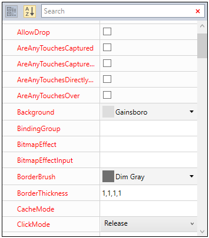
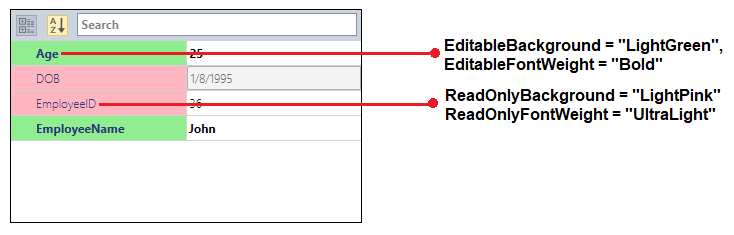
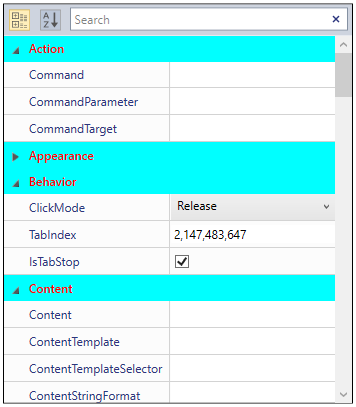
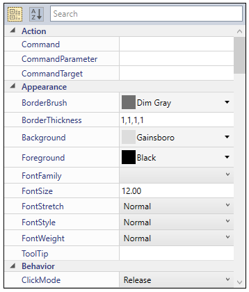
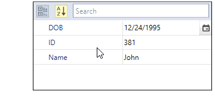

# Appearance in WPF PropertyGrid

This section explains the different UI customization, styling, and theming options available in the [WPF PropertyGrid](https://www.syncfusion.com/wpf-controls/propertygrid) control. The WPF PropertyGrid is implemented through the `PropertyGrid` class.

## Setting the Foreground

We can change the foreground color for the properties of the [SelectedObject](https://help.syncfusion.com/cr/wpf/Syncfusion.Windows.PropertyGrid.PropertyGrid.html#Syncfusion_Windows_PropertyGrid_PropertyGrid_SelectedObject) by setting the `Foreground` property. The default color value of the `Foreground` property is `Blue`.




<syncfusion:PropertyGrid Foreground="Red" x:Name="propertyGrid1">
    <syncfusion:PropertyGrid.SelectedObject>
         <Button></Button>
    </syncfusion:PropertyGrid.SelectedObject>
</syncfusion:PropertyGrid>




PropertyGrid propertyGrid1 = new PropertyGrid();
propertyGrid1.SelectedObject = new Button();
propertyGrid1.Foreground = Brushes.Red;




## Setting the Background and FontWeight

We can change the background and font weight for all the properties by using the [ViewBackgroundColor](https://help.syncfusion.com/cr/wpf/Syncfusion.Windows.PropertyGrid.PropertyGrid.html#Syncfusion_Windows_PropertyGrid_PropertyGrid_ViewBackgroundColor) and `FontWeight` properties.




<syncfusion:PropertyGrid ViewBackgroundColor="Cyan" FontWeight="Bold" 
                         x:Name="propertyGrid1">
    <syncfusion:PropertyGrid.SelectedObject>
        <Button></Button>
    </syncfusion:PropertyGrid.SelectedObject>
</syncfusion:PropertyGrid>




PropertyGrid propertyGrid1 = new PropertyGrid();
propertyGrid1.SelectedObject = new Button();
propertyGrid1.ViewBackgroundColor = Brushes.Cyan;
propertyGrid1.FontWeight = FontWeights.Bold;



### Background and FontWeight for the Editable and Readonly Properties

If we want to differentiate between editable and readonly properties, we can use the [EditableBackground](https://help.syncfusion.com/cr/wpf/Syncfusion.Windows.PropertyGrid.PropertyGrid.html#Syncfusion_Windows_PropertyGrid_PropertyGrid_EditableBackground) and [EditableFontWeight](https://help.syncfusion.com/cr/wpf/Syncfusion.Windows.PropertyGrid.PropertyGrid.html#Syncfusion_Windows_PropertyGrid_PropertyGrid_EditableFontWeight) properties to highlight the editable properties, and the [ReadOnlyBackground](https://help.syncfusion.com/cr/wpf/Syncfusion.Windows.PropertyGrid.PropertyGrid.html#Syncfusion_Windows_PropertyGrid_PropertyGrid_ReadOnlyBackground) and [ReadOnlyFontWeight](https://help.syncfusion.com/cr/wpf/Syncfusion.Windows.PropertyGrid.PropertyGrid.html#Syncfusion_Windows_PropertyGrid_PropertyGrid_ReadOnlyFontWeight) properties to highlight the readonly properties.




class Employee {
    public string EmployeeName { get; set; }
    [Editable(false)]
    public int EmployeeID { get; set; }     
    public int Age { get; set; }
    [ReadOnly(true)]
    public DateTime DOB { get; set; }
}

public class ViewModel {
    public Object SelectedEmployee { get; set; }
    public ViewModel() {
        SelectedEmployee = new Employee() 
        { 
            EmployeeName = "John", 
            DOB = new DateTime(1995, 01, 08), 
            Age=25, 
            EmployeeID = 036 
        };
    }
}







<syncfusion:PropertyGrid EditableBackground="LightGreen" EditableFontWeight="Bold"
                         ReadOnlyBackground="LightPink"  ReadOnlyFontWeight="UltraLight"
                         SelectedObject="{Binding SelectedEmployee}" x:Name="propertyGrid1" >
    <syncfusion:PropertyGrid.DataContext>
        <local:ViewModel></local:ViewModel>
    </syncfusion:PropertyGrid.DataContext>
</syncfusion:PropertyGrid>




PropertyGrid propertyGrid1 = new PropertyGrid();
propertyGrid1.DataContext = new ViewModel();
propertyGrid1.SetBinding(PropertyGrid.SelectedObjectProperty, new Binding("SelectedEmployee"));
propertyGrid1.EditableBackground = Brushes.LightGreen;
propertyGrid1.EditableFontWeight = FontWeights.Bold;
propertyGrid1.ReadOnlyBackground = Brushes.LightPink;
propertyGrid1.ReadOnlyFontWeight = FontWeights.UltraLight;




N> If you use the `EditableBackground` or `ReadOnlyBackground` properties with the `ViewBackgroundColor` property, `EditableBackground` and `ReadOnlyBackground` have higher priority.

N> If you use the `EditableFontWeight` or `ReadOnlyFontWeight` properties with the `FontWeight` property, `EditableFontWeight` and `ReadOnlyFontWeight` have higher priority.

## Category Header's foreground and background

We can change the background and foreground of the category header by setting the [LineColor](https://help.syncfusion.com/cr/wpf/Syncfusion.Windows.PropertyGrid.PropertyGrid.html#Syncfusion_Windows_PropertyGrid_PropertyGrid_LineColor) and [CategoryForeground](https://help.syncfusion.com/cr/wpf/Syncfusion.Windows.PropertyGrid.PropertyGrid.html#Syncfusion_Windows_PropertyGrid_PropertyGrid_CategoryForeground) properties. The `LineColor` property value is applied to the background and the `CategoryForeground` property value is applied to the foreground of the category header, but only in category view. To enable category view, set the [EnableGrouping](https://help.syncfusion.com/cr/wpf/Syncfusion.Windows.PropertyGrid.PropertyGrid.html#Syncfusion_Windows_PropertyGrid_PropertyGrid_EnableGrouping) property to `true`.




<syncfusion:PropertyGrid LineColor="Cyan" CategoryForeground="Red"
                         x:Name="propertyGrid1" >
    <syncfusion:PropertyGrid.SelectedObject>
        <Button></Button>
    </syncfusion:PropertyGrid.SelectedObject>
</syncfusion:PropertyGrid>




PropertyGrid propertyGrid1 = new PropertyGrid();
propertyGrid1.SelectedObject = new Button();
propertyGrid1.LineColor = Brushes.Cyan;
propertyGrid1.CategoryForeground = Brushes.Red;




## Customize the height of PropertyViewItem and PropertyCatagoryViewItem 

We can customize the height of the [PropertyViewItem](https://help.syncfusion.com/cr/wpf/Syncfusion.Windows.PropertyGrid.PropertyViewItem.html) and [PropertyCatagoryViewItem](https://help.syncfusion.com/cr/wpf/Syncfusion.Windows.PropertyGrid.PropertyCatagoryViewItem.html) using their `Padding` property by overriding the style in the WPF PropertyGrid. 





<Window x:Class="PropertyGrid_CustomEditor.MainWindow"
        xmlns="http://schemas.microsoft.com/winfx/2006/xaml/presentation"
        xmlns:x="http://schemas.microsoft.com/winfx/2006/xaml"
        xmlns:d="http://schemas.microsoft.com/expression/blend/2008"
        xmlns:mc="http://schemas.openxmlformats.org/markup-compatibility/2006"
        xmlns:local="clr-namespace:PropertyGrid_CustomEditor"
        xmlns:syncfusion="http://schemas.syncfusion.com/wpf"
        mc:Ignorable="d" WindowStartupLocation="CenterScreen"
        Title="MainWindow" Height="450" Width="600">
    <Window.Resources>
        
        
    </Window.Resources>
    <Grid>
        <syncfusion:PropertyGrid Margin="10" x:Name="propertyGrid1" >
            <syncfusion:PropertyGrid.SelectedObject>
                <Button></Button>
            </syncfusion:PropertyGrid.SelectedObject>
        </syncfusion:PropertyGrid>
    </Grid>
</Window>





PropertyGrid propertyGrid1 = new PropertyGrid();
propertyGrid1.SelectedObject = new Button();





## Tooltip support

You can view the value and description of a property item through a tooltip by hovering the mouse over the respective property item or its value field. If the property item does not contain a description, the tooltip shows the property display name. You can restrict the tooltip support by setting the [EnableToolTip](https://help.syncfusion.com/cr/wpf/Syncfusion.Windows.PropertyGrid.PropertyGrid.html#Syncfusion_Windows_PropertyGrid_PropertyGrid_EnableToolTip) property to `false`. The default value of the `EnableToolTip` property is `true`.




using System;
using System.ComponentModel;
using System.ComponentModel.DataAnnotations;

public class Employee {
    [Description("Name of the employee")]
    public string Name { get; set; }
    public string ID { get; set; }
    [Description("Birth date of the employee")]
    public DateTime DOB { get; set; }
}

public class ViewModel {
    public Object SelectedEmployee { get; set; }
    public ViewModel() {
        SelectedEmployee = new Employee()
        {
            Name = "John",
            ID = "381",
            DOB = new DateTime(1995, 12, 24)
        };
    }
}







<syncfusion:PropertyGrid EnableToolTip="True"
                         SelectedObject="{Binding SelectedEmployee}"
                         x:Name="propertyGrid1">
    <syncfusion:PropertyGrid.DataContext>
        <local:ViewModel></local:ViewModel>
    </syncfusion:PropertyGrid.DataContext>
</syncfusion:PropertyGrid>




PropertyGrid propertyGrid1 = new PropertyGrid();
propertyGrid1.EnableToolTip = true;
propertyGrid1.DataContext = new ViewModel();
propertyGrid1.SetBinding(PropertyGrid.SelectedObjectProperty, new Binding("SelectedEmployee"));




N> View [Sample](https://github.com/SyncfusionExamples/wpf-property-grid-examples/tree/master/Samples/Apperance) in GitHub

## Theme

The WPF PropertyGrid supports various built-in themes. Refer to the links below to apply themes to the control,

  * [Apply theme using SfSkinManager](https://help.syncfusion.com/wpf/themes/skin-manager)
	
  * [Create a custom theme using ThemeStudio](https://help.syncfusion.com/wpf/themes/theme-studio#creating-custom-theme)

