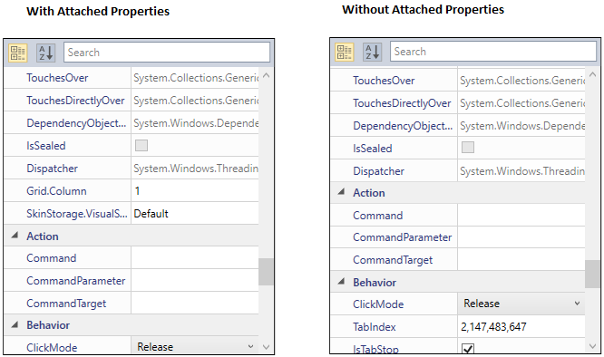

# Attached Properties in WPF PropertyGrid

The [PropertyGrid](https://www.syncfusion.com/wpf-ui-controls/propertygrid) control has support to display the attached properties of SelectedObject.

## Show or hide attached properties of SelectedObject

We can show or hide the attached properties of SelectedObject by handling the [AutoGeneratingPropertyGridItem](https://help.syncfusion.com/cr/wpf/Syncfusion.Windows.PropertyGrid.PropertyGrid.html) event with [AutoGeneratingPropertyGridItemEventArgs.Cancel](https://help.syncfusion.com/cr/wpf/Syncfusion.Windows.PropertyGrid.AutoGeneratingPropertyGridItemEventArgs.html) property. Below example shows, how to hide the attached properties using `AutoGeneratingPropertyGridItem` event.





<Grid>
    <Grid.ColumnDefinitions>
        <ColumnDefinition Width="0.6*"/>
        <ColumnDefinition Width="0.4*"/>
    </Grid.ColumnDefinitions>

    <syncfusion:PropertyGrid SelectedObject="{Binding ElementName=button}" 
                             AutoGeneratingPropertyGridItem="PropertyGrid_AutoGeneratingPropertyGridItem"/>
    <syncfusion:ButtonAdv Name="button" 
                          Label="SelectedObject" 
                          Margin="10" 
                          Height="25" 
                          Width="200" 
                          HorizontalAlignment="Center" 
                          VerticalAlignment="Center"
                          Grid.Column="1" 
                          syncfusion:SkinStorage.VisualStyle="Default" />
</Grid>





private void PropertyGrid_AutoGeneratingPropertyGridItem(object sender, AutoGeneratingPropertyGridItemEventArgs e)
{
    if (e.DisplayName == "Grid.Column" || e.DisplayName == "SkinStorage.VisualStyle")
    {
        e.Cancel = true;
    }
}





Here, `Grid.Column` and `SkinStorage.VisualStyle` are the attached properties of SelectedObject.

N> Download demo application from [GitHub](https://github.com/SyncfusionExamples/wpf-property-grid-examples/tree/master/Samples/Attached-properties).
