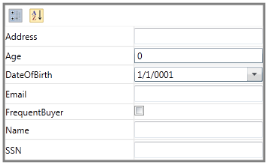

# Binding the Object in WPF PropertyGrid

This section describes how the `DotNet` object can be used to bind and display the properties in the [PropertyGrid](https://www.syncfusion.com/wpf-ui-controls/propertygrid).

## Binding with any DotNet Object

The user can display the properties of any `DotNet` object using the [SelectedObject](https://help.syncfusion.com/cr/wpf/Syncfusion.PropertyGrid.Wpf~Syncfusion.Windows.PropertyGrid.PropertyGrid~SelectedObject.html) property. When the `SelectedObject` property is bound with an object, the properties of that object are parsed and displayed in the `PropertyGrid`.




// Employee class to be explored in property grid.
public class Employee {
	public string EmployeeName { get; set; }
    public string ID { get; set; }
    public int Age { get; set; }
	public int Experiance { get; set; }
}

//Create ViewModel class with a property to be bounded with PropertyGrid.SelectedObject 
public class ViewModel {
    public object SelectedEmployee { get; set; }
    public ViewModel() {
        SelectedEmployee = new Employee() { EmployeeName = "Johnson", Age = 25, ID = "1234",Experiance =3 };
    }
}







<Window.DataContext>
    <local:ViewModel></local:ViewModel>
</Window.DataContext>
<syncfusion:PropertyGrid SelectedObject="{Binding SelectedEmployee}" Name="propertyGrid1" />




Here, The `PropertyGrid.SelectedObject` property is binded with the `SelectedEmployee` object. So, the properties of `SelectedEmployee` object is parsed and displayed in the `PropertyGrid`.

