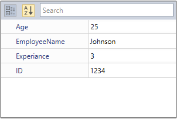
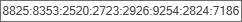

# Built-in Editor in WPF PropertyGrid

 The [PropertyGrid](https://www.syncfusion.com/wpf-controls/propertygrid) control supports several built-in editors. Based on the property type, the built-in editors automatically assigned as value editor for the properties and it allows only the valid inputs based on property type.

<table>
  <thead>
    <tr>
      <th>Property Type</th>
      <th>Default Editor</th>
      <th>Control used</th>
    </tr>
  </thead>
  <tbody>
    <tr>
      <td>int</td>
      <td>IntegerTextBoxEditor</td>
      <td>IntegerTextBox</td>
    </tr>
    <tr>
      <td>double</td>
      <td>DoubleTextBoxEditor</td>
      <td>DoubleTextBox</td>
    </tr>
    <tr>
      <td>string</td>
      <td>TextBoxEditor</td>
      <td>TextBox</td>
    </tr>
    <tr>
      <td>enum</td>
      <td>EnumComboEditor</td>
      <td>ComboBox</td>
    </tr>
    <tr>
      <td>DateTime</td>
      <td>DateTimeEditor</td>
      <td>DateTimeEdit</td>
    </tr>
    <tr>
      <td>bool</td>
      <td>CheckBoxEditor</td>
      <td>CheckBox</td>
    </tr>
    <tr>
      <td>Brush</td>
      <td>BrushSelectorEditor</td>
      <td>ColorPicker</td>
    </tr>
    <tr>
      <td>Input Mask</td>
      <td>MaskEditor</td>
      <td>SfMaskedEdit</td>
    </tr>
    <tr>
      <td>TimeSpan</td>
      <td>TimeSpanEditor</td>
      <td>TimeSpanEdit</td>
    </tr>
    <tr>
      <td>FontFamily</td>
      <td>FontComboEditor</td>
      <td>ComboBox</td>
    </tr>
  </tbody>
</table>




// Employee class to be explored in property grid.
public class Employee {
    public string EmployeeName { get; set; }
    public string ID { get; set; }
    public int Age { get; set; }
    public int Experiance { get; set; }
}

public class ViewModel {
    public object SelectedEmployee { get; set; }
    public ViewModel() {
        SelectedEmployee = new Employee() 
        {
            EmployeeName = "Johnson",
            Age = 25,
            ID = "1234",
            Experiance =3
        };
    }
}







<syncfusion:PropertyGrid SelectedObject="{Binding SelectedEmployee}"
                         Name="propertyGrid1" >
    <syncfusion:PropertyGrid.DataContext>
        <local:ViewModel></local:ViewModel>
    </syncfusion:PropertyGrid.DataContext>
</syncfusion:PropertyGrid>




PropertyGrid propertyGrid1 = new PropertyGrid();
propertyGrid1.DataContext = new ViewModel();
propertyGrid1.SetBinding(PropertyGrid.SelectedObjectProperty, new Binding("SelectedEmployee"));




 Here, `Age`, `Experience` and `ID` properties is a `int` type properties, they allow only the whole number inputs. `EmployeeName` is a string type property, so `TextBox` is assigned as a value editor and all the text will be allowed.

## Built-in mask to restrict user input

You can restrict the user to enter valid value such as alphanumeric, binary, email-Id, IPv4, product Key, positive number, and etc by using the built-in [MaskAttribute](https://help.syncfusion.com/cr/wpf/Syncfusion.Windows.PropertyGrid.MaskAttribute.html#fields). 

N> You can apply mask attribute to property of type `Object` or `string` only.

S_No | Mask Type | Example 
--- | --- | ---
1 | Alphanumeric | 
2 | Binary | 
3 | CardNumber |  
4 | EmailId | 
5 | Fraction |  
6 | HexaDecimal | 
7 | IPv4 | 
8 | IPv6 | 
9 | MobileNumber |  
10 | Number |  
11 | Octal | 
12 | PositiveNumber | 
13 | ProductKey | 




using Syncfusion.Windows.PropertyGrid;

//EmailId mask for multiple properties
[Mask(MaskAttribute.EmailId,"EmailID_1, EmailID_2")]
[Mask(MaskAttribute.CardNumber, "CardNumberMask")]
public class Masks{
    [Mask(MaskAttribute.Binary)]
    public string BinaryMask { get; set; }        
    public string CardNumberMask { get; set; }       
    public string EmailID_1 { get; set; }
    public string EmailID_2 { get; set; }

    [Mask(MaskAttribute.PositiveNumber)]
    public string PositiveNumberMask { get; set; }

    [Mask(MaskAttribute.ProductKey)]
    public string ProductKeyMask { get; set; }
}

//ViewModel.cs
public class ViewModel {
    public object BuiltInMasks { get; set; }
    public ViewModel() {
        BuiltInMasks = new Masks()
        {
            BinaryMask = "0111",
            CardNumberMask = "X984DH51837RD846362JH38",
            EmailID_1 = "johnabc@",
            EmailID_2 = "peter123@gta.co",
            PositiveNumberMask = "-39479",
            ProductKeyMask = "HTY23OPY678GR56R01G564GH"
        };
    }
}


 




<syncfusion:PropertyGrid SelectedObject="{Binding BuiltInMasks}"
                         Name="propertyGrid" >
    <syncfusion:PropertyGrid.DataContext>
        <local:ViewModel/>
    </syncfusion:PropertyGrid.DataContext>
</syncfusion:PropertyGrid>

 


N> [View Sample in GitHub](https://github.com/SyncfusionExamples/wpf-property-grid-examples/tree/master/Samples/Built-in-Mask)

## Mask attribute with custom mask to restrict user input

You can restrict the user from providing invalid input for the one or more specific property by setting your custom `Regex` based mask to the `MaskAttribute`. For example emails, phone numbers, zip codes, currency, etc.




//Setting mask option for two specific properties
[MaskAttribute("[A-Za-z0-9._%-]+@[A-Za-z0-9]+.[A-Za-z]{2,3}", "Email_1,Email_2")]
public class Person {
    public Person() {
        Name = "Carl Johnson";
        Age = 3;
        Mobile = "2054449786";
        Email_1 = "carljohnson@gta.com";
        Email_2 = "johnson@gta.c";
    }

    public string Name { get; set; }
    public string Email_1 { get; set; }
    public object Email_2 { get; set; }

    //Setting mask option for Mobile property
    [MaskAttribute(@"\(\d{3}\) \d{3} - \d{4}")]
    public string Mobile { get; set; }

    //Setting mask option for Age properties
    [MaskAttribute(@"\d{2}")]
    public object Age { get; set; }
}
      

 




<syncfusion:PropertyGrid  x:Name="propertyGrid">
    <syncfusion:PropertyGrid.SelectedObject>
        <local:Person/>
    </syncfusion:PropertyGrid.SelectedObject>
</syncfusion:PropertyGrid>

 


Here, the partial and wrong inputs are highlighted by the red color border.

N> View [Sample](https://github.com/SyncfusionExamples/wpf-property-grid-examples/tree/master/Samples/Mask_Attributes) in GitHub

## MaskEditor to restrict user input 

You can restrict the user to enter particular character or value for the one or more specific property item by using the `Regex` based mask to the custom editor's `Mask` property which is derived from the `MaskEditor`.

N> You must create the property as either `Object` or `string` type to use mask editor.

N> Please refer the [Custom Editor](https://help.syncfusion.com/wpf/propertygrid/customeditor-support) page to know more about how to set the custom editor for the property items.
   



using System.ComponentModel;
using Syncfusion.Windows.PropertyGrid;

//Custom mask editor
public class EmailEditor : MaskEditor {
    public EmailEditor() {
        Mask = "[A-Za-z0-9._%-]+@[A-Za-z0-9]+.[A-Za-z]{2,3}"
    }
}

//Custom mask editor
public class MobileNoEditor : MaskEditor {
    public MobileNoEditor() {
        Mask = @"\(\d{3}\) \d{3} - \d{4}";
    }
}

//Setting custom mask editors for the properties
[Editor("Email_1, Email_2", typeof(EmailEditor))]
[Editor("Mobile", typeof(MobileNoEditor))]
public class Person {
    public Person() {
        Name = "Carl Johnson";
        Age = 3;
        Mobile = "2054449";
        Email_1 = "carljohnson@gta.c";
        Email_2 = "johnson@gta.com";
    } 

    public string Name { get; set; }
    public string Email_1 { get; set; }
    public object Email_2 { get; set; }
    public string Mobile { get; set; }
    public object Age { get; set; }
}

 
 




<syncfusion:PropertyGrid  x:Name="propertyGrid">
    <syncfusion:PropertyGrid.SelectedObject>
        <local:Person/>
    </syncfusion:PropertyGrid.SelectedObject>
</syncfusion:PropertyGrid>

 
 

Here, the partial and wrong inputs are highlighted by the red color border.

N> View [Sample](https://github.com/SyncfusionExamples/wpf-property-grid-examples/tree/master/Samples/Mask_Editors) in GitHub

