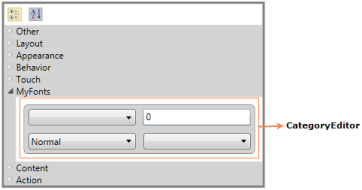

# Category Editor in WPF PropertyGrid

The [PropertyGrid](https://www.syncfusion.com/wpf-ui-controls/propertygrid) control supports several built-in editors. `CategoryEditor` support enables us to set the related properties (one or more properties) under single or multiple category based on the need. `CategoryEditor` can be applied in category view. While sorted view, default editors will be applied.

## Adding Category Editor to PropertyGrid

If we want to display some related properties under the specific category, we can do it by the `CategoryEditor`. We can add any number of `CategoryEditor`. We must add property names in the `CategoryEditor.Properties` collection which are need to be categorized in the same category. Using the `CategoryEditor.EditorTemplate`, we can create the own template for the categorized properties with its required value editors. The properties and its value editor can be placed in the `PropertyGrid` as our wish. To display the `CategoryEditor`, we need the enable the [EnableGrouping](https://help.syncfusion.com/cr/wpf/Syncfusion.Windows.PropertyGrid.PropertyGrid.html#Syncfusion_Windows_PropertyGrid_PropertyGrid_EnableGrouping) property as `true`.   

For example, the `Background`, `BorderBrush` and `Foreground` are brush type properties. They will categorized under 'A-Brushes' category. ColorEdit controls will assigned as the value editor for the above properties and located in the same place. Based on the property selection, respective `ColorEdit` control will be in the view to pick the color for that property.

a) `ColorEdit` control visibility converter




using System;
using System.Windows;
using System.Windows.Data;

public class SelectedIndexToVisibility : IValueConverter {
    public object Convert(object value, Type targetType, object parameter, System.Globalization.CultureInfo culture) {
        int index = (int)value;
        Visibility vis;
        if (index == 0 && parameter.ToString() == "Foreground") {
            vis = Visibility.Visible;
        }
        else if (index == 1 && parameter.ToString() == "Background") {
            vis = Visibility.Visible;
        }
        else if (index == 2 && parameter.ToString() == "BorderBrush") {
            vis = Visibility.Visible;
        }
        else {
            vis = Visibility.Collapsed;
        }
        return vis;
    }
    public object ConvertBack(object value, Type targetType, object parameter, System.Globalization.CultureInfo culture) {
        return null;
    }
}



 
 b) Creating the CategoryEditor for the properties:




<Window.Resources>
    <local:SelectedIndexToVisibility x:Key="VisConv"/>
</Window.Resources>
<Grid>
    <Grid.ColumnDefinitions>
        <ColumnDefinition></ColumnDefinition>
        <ColumnDefinition Width="300"></ColumnDefinition>
    </Grid.ColumnDefinitions>
    <syncfusion:PropertyGrid SelectedObject="{Binding ElementName=button}" 
                             EnableGrouping="True" Name="propertyGrid1"
                             Margin="20" Grid.Column="0"  >
        <syncfusion:PropertyGrid.CategoryEditors>
            <syncfusion:CategoryEditor Category="A-Brushes">
                <syncfusion:CategoryEditor.Properties>
                    <syncfusion:CategoryEditorProperty Name="Background"/>
                    <syncfusion:CategoryEditorProperty Name="Foreground"/>
                    <syncfusion:CategoryEditorProperty Name="BorderBrush"/>
                </syncfusion:CategoryEditor.Properties>
                <syncfusion:CategoryEditor.EditorTemplate>
                    <DataTemplate>
                        <Grid>
                            <Grid.RowDefinitions>
                                <RowDefinition />
                                <RowDefinition />
                            </Grid.RowDefinitions>
                            <ListBox BorderBrush="Transparent" x:Name="list" SelectedIndex="0">
                                <StackPanel HorizontalAlignment="Center" Orientation="Horizontal">
                                    <TextBlock Text="Foreground" Margin="5" Width="80"/>
                                    <Rectangle Fill="{Binding Path=CategoryValueProperties[Foreground].Value, Mode=TwoWay}"
                                               Stroke="Black" Height="15" Width="25" Margin="5"/>
                                </StackPanel>
                                <StackPanel HorizontalAlignment="Center" Orientation="Horizontal">
                                    <TextBlock Text="Background" Margin="5" Width="80"/>
                                    <Rectangle Fill="{Binding Path=CategoryValueProperties[Background].Value, Mode=TwoWay}"
                                               Stroke="Black" x:Name="background"  Height="15" Width="25" Margin="5" />
                                </StackPanel>
                                <StackPanel HorizontalAlignment="Center" Orientation="Horizontal">
                                    <TextBlock Text="BorderBrush" Margin="5" Width="80"/>
                                    <Rectangle Fill="{Binding Path=CategoryValueProperties[BorderBrush].Value, Mode=TwoWay}"
                                               Stroke="Black"  Height="15" Width="25" Margin="5"/>
                                </StackPanel>
                            </ListBox>

                            <syncfusion:ColorEdit Visibility="{Binding ElementName=list, Path=SelectedIndex,
                                                                       Converter={StaticResource VisConv}, ConverterParameter=Foreground}"
                                                  Brush="{Binding Path=CategoryValueProperties[Foreground].Value, Mode=TwoWay}" 
                                                  EnableToolTip="False" Grid.Row="1" IsGradientPropertyEnabled="False" />
                            <syncfusion:ColorEdit Visibility="{Binding ElementName=list, Path=SelectedIndex,
                                                                       Converter={StaticResource VisConv}, ConverterParameter=Background}"
                                                  Brush="{Binding Path=CategoryValueProperties[Background].Value, Mode=TwoWay}" 
                                                  EnableToolTip="False" Grid.Row="1" IsGradientPropertyEnabled="False"/>
                            <syncfusion:ColorEdit Visibility="{Binding ElementName=list, Path=SelectedIndex, 
                                                                       Converter={StaticResource VisConv}, ConverterParameter=BorderBrush}"
                                                  Brush="{Binding Path=CategoryValueProperties[BorderBrush].Value, Mode=TwoWay}" 
                                                  EnableToolTip="False" Grid.Row="1" IsGradientPropertyEnabled="False"/>
                        </Grid>
                    </DataTemplate>
                </syncfusion:CategoryEditor.EditorTemplate>
            </syncfusion:CategoryEditor>
        </syncfusion:PropertyGrid.CategoryEditors>
    </syncfusion:PropertyGrid>
    <StackPanel Grid.Column="1" VerticalAlignment="Center" HorizontalAlignment="Center" >
        <TextBlock Grid.Column="1" Margin="10" HorizontalAlignment="Center" 
                   TextWrapping="Wrap" VerticalAlignment="Center" Width="168">
            <Run Text="Selected Object: "/><Run FontWeight="Bold" Text="Button"/>
        </TextBlock>
        <Button Name="button" Width="200" Height="50" VerticalAlignment="Center"
                HorizontalAlignment="Center" Content="Click me"/>
    </StackPanel>
</Grid>




By Default, the properties are arranged like the key-value pairs with its value editor. Using the `CategoryEditor`, the `Background`, `Foreground` and `BorderBrush` property value editors are arranged by our wish.

Click [here](https://github.com/SyncfusionExamples/wpf-property-grid-examples/tree/master/Samples/CategoryEditor) to download the sample that showcases the `CategoryEditor` support. 
