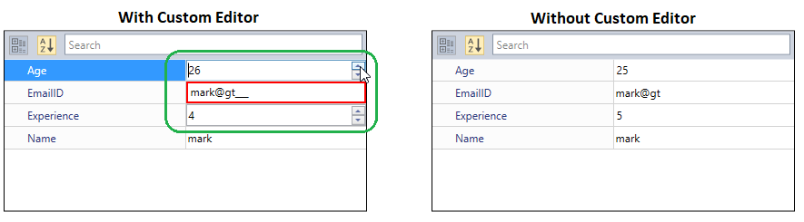
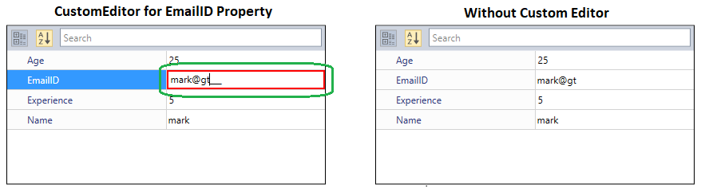
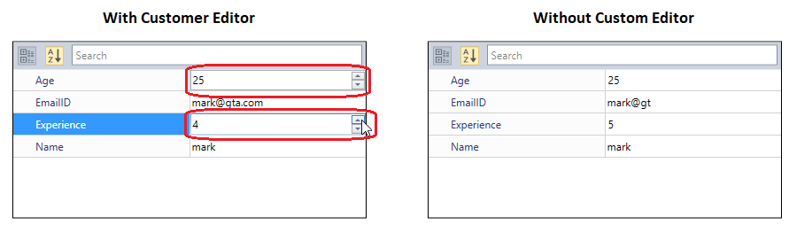

# Custom Editor in WPF PropertyGrid

The [PropertyGrid](https://help.syncfusion.com/cr/wpf/Syncfusion.Windows.PropertyGrid.PropertyGrid.html) control supports several built-in editors. Based on the property type, the built-in editors automatically assigned as value editor for the properties. You can assign own value editor(control) for the properties instead of default value editor by using the [Editor](https://docs.microsoft.com/en-us/dotnet/api/system.componentmodel.editorattribute?view=netframework-4.8) attribute or [CustomEditorCollection](https://help.syncfusion.com/cr/wpf/Syncfusion.Windows.PropertyGrid.PropertyGrid.html#Syncfusion_Windows_PropertyGrid_PropertyGrid_CustomEditorCollection).

 For example, if you creates an `EmailID` property as a string type, `TextBox` is assigned as a value editor and all the text will be allowed. If you want to accept the input that is only in the mail id format, you can assign [SfMaskedEdit](https://www.syncfusion.com/wpf-ui-controls/maskedtextbox) control with email-id mask as the value editor for the `EmailID` property. 

## Creating the Custom Editor

To create [CustomEditor](https://help.syncfusion.com/cr/wpf/Syncfusion.Windows.PropertyGrid.CustomEditor.html), we need to implement [ITypeEditor](https://help.syncfusion.com/cr/wpf/Syncfusion.Windows.PropertyGrid.ITypeEditor.html) interface. Here, `SfMaskedEdit` control is assigned with mail id mask as `EmailEditor` and `UpDown` control is assigned with min, max value as `IntegerEditor`. `EmailEditor` and `IntegerEditor` are the custom editors.




//Custom Editor for the EmailId properties.
public class EmailEditor : ITypeEditor {
    SfMaskedEdit maskededit;
    public void Attach(PropertyViewItem property, PropertyItem info) {
        if (info.CanWrite) {
            var binding = new Binding("Value")
            {
                Mode = BindingMode.TwoWay,
                Source = info,
                ValidatesOnExceptions = true,
                ValidatesOnDataErrors = true
            };
            BindingOperations.SetBinding(maskededit, SfMaskedEdit.ValueProperty, binding);
        }
        else {
            maskededit.IsEnabled = false;
            var binding = new Binding("Value")
            {
                Source = info,
                ValidatesOnExceptions = true,
                ValidatesOnDataErrors = true
            };
            BindingOperations.SetBinding(maskededit, SfMaskedEdit.ValueProperty, binding);
        }
    }
    public object Create(PropertyInfo propertyInfo) {
        maskededit = new SfMaskedEdit();
        maskededit.MaskType = MaskType.RegEx;
        maskededit.Mask = "[A-Za-z0-9._%-]+@[A-Za-z0-9]+.[A-Za-z]{2,3}";
        return maskededit;
    }
    public void Detach(PropertyViewItem property) {

    }
}

//Custom Editor for the integer type properties.
public class IntegerEditor : ITypeEditor {
    UpDown upDown;
    public void Attach(PropertyViewItem property, PropertyItem info) {
        if (info.CanWrite) {
            var binding = new Binding("Value")
            {
                Mode = BindingMode.TwoWay,
                Source = info,
                ValidatesOnExceptions = true,
                ValidatesOnDataErrors = true
            };
            BindingOperations.SetBinding(upDown, UpDown.ValueProperty, binding);
        }
        else {
            upDown.IsEnabled = false;
            var binding = new Binding("Value")
            {
                Source = info,
                ValidatesOnExceptions = true,
                ValidatesOnDataErrors = true
            };
            BindingOperations.SetBinding(upDown, UpDown.ValueProperty, binding);
        }
    }
    public object Create(PropertyInfo propertyInfo) {
        upDown = new UpDown();
        upDown.ApplyZeroColor = false;
        upDown.MinValue = 0;
        upDown.MaxValue = 100;
        upDown.NumberDecimalDigits = 0;
        return upDown;
    }
    public void Detach(PropertyViewItem property) {

    }
}




N> To assign a created custom editor to a properties, refer the [Assigning a Custom Editor](https://help.syncfusion.com/wpf/propertygrid/customeditor-support#assigning-a-custom-editor-using-editor-attribute) topic.

## Creating Custom Editor for a dynamic property.

If the [SelectedObject](https://help.syncfusion.com/cr/wpf/Syncfusion.Windows.PropertyGrid.PropertyGrid.html#Syncfusion_Windows_PropertyGrid_PropertyGrid_SelectedObject) has a property of type `dynamic`, `ExpandoObject` or `ICustomTypeDescriptor`, we can create `CustomEditor` class by inheriting [BaseTypeEditor](https://help.syncfusion.com/cr/wpf/Syncfusion.Windows.PropertyGrid.BaseTypeEditor.html). You can initialize a new instance of the custom editor using the [BaseTypeEditor.Create(PropertyDescriptor)](https://help.syncfusion.com/cr/wpf/Syncfusion.Windows.PropertyGrid.BaseTypeEditor.html#Syncfusion_Windows_PropertyGrid_BaseTypeEditor_Create_System_ComponentModel_PropertyDescriptor_) function. Below example shows, how to get the value of dynamic properties using its PropertyDescriptor and apply the value in `ComboEditor` to ComboBox objects.





//Custom Editor for the List<string> type properties.
public class ComboEditor : BaseTypeEditor
{
    ComboBox comboBox;
      
    public override void Attach(PropertyViewItem property, PropertyItem info)
    {
        var binding = new Binding("Value")
        {
            Mode = BindingMode.TwoWay,
            Source = info,
            ValidatesOnExceptions = true,
            ValidatesOnDataErrors = true
        };
        BindingOperations.SetBinding(comboBox, ComboBox.SelectedItemProperty, binding);
    }

    // Create a custom editor for a normal property
    public override object Create(PropertyInfo PropertyInfo)
    {
        throw new NotImplementedException();
    }
    
    // Create a custom editor for a dynamic property
    public override object Create(PropertyDescriptor PropertyDescriptor)
    {
        comboBox = new ComboBox();
        // Getting the values of dynamic property
        dynamic comboBoxItemsList = PropertyDescriptor.GetValue(PropertyDescriptor.Name);
        foreach (dynamic items in comboBoxItemsList)
        {
            comboBox.Items.Add(items);
        }

        comboBox.SelectedIndex = 0;
        return comboBox;
    }

    public override void Detach(PropertyViewItem property)
    {
        comboBox = null;
    }
}





N> Download demo application from [GitHub](https://github.com/SyncfusionExamples/wpf-property-grid-examples/tree/master/Samples/CustomEditor/CustomEditor-dynamic-type-selected-object).

## Assigning a Custom Editor using Editor Attribute

We can assign the `CustomEditor` to any individual property by name of the property and to multiple properties based on the property type by using the `Editor` attribute.




//CustomEditor for the specfic(EmailID) property
[Editor("EmailID", typeof(EmailEditor))]

//Custom Editor for the multiple(Tnteger type) properties
[Editor(typeof(int), typeof(IntegerEditor))]
public class Employee {
    public string EmailID { get; set; }
    public string Name { get; set; }
    public int Age { get; set; }
    public int Experience { get; set; }
}

class ViewModel {
    public object SelectedEmployee { get; set; }
    public ViewModel() {
        SelectedEmployee = new Employee()
        {
            Age = 25,
            Name = "mark",
            Experience = 5,
            EmailID = "mark@gt"
        };
    }
}







<syncfusion:PropertyGrid SelectedObject="{Binding SelectedEmployee}"
                         x:Name="propertyGrid1" >
    <syncfusion:PropertyGrid.DataContext>
        <local:ViewModel></local:ViewModel>
   </syncfusion:PropertyGrid.DataContext>
</syncfusion:PropertyGrid>




PropertyGrid propertyGrid1 = new PropertyGrid();
propertyGrid1.DataContext = new ViewModel();
propertyGrid1.SetBinding(PropertyGrid.SelectedObjectProperty, new Binding("SelectedEmployee"));




Here, `EmailID` property value editor changed from `TextBox` to  `MaskedEdit` control with email id mask. Also, we assigned the `IntegerEditor` for the integer type properties, so it applied to the `Experience` and `Age` properties. Then, the value editors for the `Experience` and `Age` property is changed from `NumericTextBox` to `Updown` control.

## Assigning a Custom Editor using Collection

We can assign the `CustomEditor` to any particular property and to multiple properties using the `CustomEditorCollection`. 

### Assigning a Custom Editor to the specific property

If we want to apply custom editor for any particular property, we need to create the `CustomEditor` instance, assign our own editor to the `CustomEditor.Editor` and add the property name to the `CustomEditor.Properties` collection. Then, add the `CustomEditor` instance to the `PropertyGrid.CustomEditorCollection`.




public class Employee {
    public string EmailID { get; set; }
    public string Name { get; set; }
    public int Age { get; set; }
    public int Experience { get; set; }
}

class ViewModel {
    public object SelectedEmployee { get; set; }
    public CustomEditorCollection customEditorCollection = new CustomEditorCollection();
    public CustomEditorCollection CustomEditorCollection
    {
        get { return customEditorCollection; }
        set { customEditorCollection = value; }
    }
    public ViewModel() {
        SelectedEmployee = new Employee() { Age = 25, Name = "mark", Experience = 5, EmailID = "mark@gt" };

        // EmailEditor added to the collection and will applied to the "EmailID" property
        CustomEditor editor1 = new CustomEditor();
        editor1.Editor = new EmailEditor();
        editor1.Properties.Add("EmailID");
        CustomEditorCollection.Add(editor1);
    }
}







<syncfusion:PropertyGrid CustomEditorCollection="{Binding CustomEditorCollection}" 
                         SelectedObject="{Binding SelectedEmployee}"
                         x:Name="propertyGrid1" >
    <syncfusion:PropertyGrid.DataContext>
        <local:ViewModel></local:ViewModel>
   </syncfusion:PropertyGrid.DataContext>
</syncfusion:PropertyGrid>




PropertyGrid propertyGrid1 = new PropertyGrid();
propertyGrid1.DataContext = new ViewModel();
propertyGrid1.SetBinding(PropertyGrid.CustomEditorCollectionProperty, new Binding("CustomEditorCollection"));
propertyGrid1.SetBinding(PropertyGrid.SelectedObjectProperty, new Binding("SelectedEmployee"));




Here, The `EmailID` is a string property, the `TextBox` is assigned as a default editor. We changed it as `SfMaskedEdit` textbox that accepts only inputs which are in the email id format.

## Assigning a Custom Editor based on the property type

If we want to apply custom editor for multiple properties which are all contains same type, we need to create the `CustomEditor` instance, assign our own editor to the `CustomEditor.Editor` and sets the `CustomEditor.HasPropertyType`  property  to `true`. Then, mention the property type to the `CustomEditor.PropertyType`.




public class Employee {
    public string EmailID { get; set; }
    public string Name { get; set; }
    public int Age { get; set; }
    public int Experience { get; set; }
}

class ViewModel {
    public object SelectedEmployee { get; set; }
    public CustomEditorCollection customEditorCollection = new CustomEditorCollection();
    public CustomEditorCollection CustomEditorCollection
    {
        get { return customEditorCollection; }
        set { customEditorCollection = value; }
    }
    public ViewModel() {
        SelectedEmployee = new Employee() { Age = 25, Name = "mark", Experience = 5, EmailID = "mark@gt" };

        // IntegerEditor added to the collection and will applied to the "int" type properties
        CustomEditor editor = new CustomEditor();
        editor.Editor = new IntegerEditor();
        editor.HasPropertyType = true;
        editor.PropertyType = typeof(int);
        CustomEditorCollection.Add(editor);
    }
}







<syncfusion:PropertyGrid CustomEditorCollection="{Binding CustomEditorCollection}" 
                         SelectedObject="{Binding SelectedEmployee}"
                         x:Name="propertyGrid1" >
    <syncfusion:PropertyGrid.DataContext>
        <local:ViewModel></local:ViewModel>
   </syncfusion:PropertyGrid.DataContext>
</syncfusion:PropertyGrid>




PropertyGrid propertyGrid1 = new PropertyGrid();
propertyGrid1.DataContext = new ViewModel();
propertyGrid1.SetBinding(PropertyGrid.CustomEditorCollectionProperty, new Binding("CustomEditorCollection"));
propertyGrid1.SetBinding(PropertyGrid.SelectedObjectProperty, new Binding("SelectedEmployee"));




Here, we assigned the `IntegerEditor` custom editor for the integer type properties, so it applied to the `Experience` and `Age` properties. Then, the value editors for the `Experience` and `Age` property is changed from `NumericTextBox` to `Updown` control.

Click [here](https://github.com/SyncfusionExamples/wpf-property-grid-examples/tree/master/Samples/CustomEditor) to download the sample that showcases the `CustomEditor` support.

## Custom editor constructor with parameters

You can invoke and pass arguments to the constructor with parameters of `CustomEditor` class in `PropertyGrid` using the `ConstructorParameter` property. By default, the value of `ConstructorParameter` is **null**. This can be achieved by following the below steps.

1. Create a custom editor for the desired property item in `PropertyGrid`. Add constructor with parameters in the custom editor class.




public class IntegerEditor : ITypeEditor
{
    UpDown upDown;

    public IntegerEditor(UpDown updown)
    {
        this.upDown = updown;
    }
    public void Attach(PropertyViewItem property, PropertyItem info)
    {
        if (info.CanWrite)
        {
            var binding = new Binding("Value")
            {
                Mode = BindingMode.TwoWay,
                Source = info,
                ValidatesOnExceptions = true,
                ValidatesOnDataErrors = true
            };
            BindingOperations.SetBinding(upDown, UpDown.ValueProperty, binding);
        }
        else
        {
            upDown.IsEnabled = false;
            var binding = new Binding("Value")
            {
                Source = info,
                ValidatesOnExceptions = true,
                ValidatesOnDataErrors = true
            };
            BindingOperations.SetBinding(upDown, UpDown.ValueProperty, binding);
        }
    }
    public object Create(PropertyInfo propertyInfo)
    {
        return upDown;
    }
    
    public void Detach(PropertyViewItem property)
    {

    }
}




2. Create `Employee` and `ViewModel` classes with required properties. Pass the required objects as object array in `ConstructorParameter` property of `CustomEditor` as shown below. 




public class Employee
{
    public string Country { get; set; }
    public int Experience { get; set; }
    public string Name { get; set; }
    public double Age { get; set; }
}

class ViewModel 
{
    public object SelectedEmployee { get; set; }

    private CustomEditorCollection customEditorCollection = new CustomEditorCollection();
    public CustomEditorCollection CustomEditorCollection
    {
        get { return customEditorCollection; }
        set { customEditorCollection = value; }
    }
    public ViewModel()
    {
        Initialization();
    }
    private void Initialization()
    {
        SelectedEmployee = new Employee() { Age = 25, Name = "mark",  Country = "United Kingdom" ,Experience = 3 };
        UpDown upDown = new UpDown()
        {
            ApplyZeroColor = false,
            MinValue = 0,
            MaxValue = 50,
            NumberDecimalDigits = 1
        };

        // Passes upDown control to IntegerEditor constructor with same parameter type.
        CustomEditor editor1 = new CustomEditor() 
        {
            EditorType = typeof(IntegerEditor), 
            ConstructorParameters = new object[] { upDown } ,
            HasPropertyType = true,
            PropertyType = typeof(double)
        };

        CustomEditorCollection.Add(editor1);

    }
}



<syncfusion:PropertyGrid CustomEditorCollection="{Binding CustomEditorCollection}" SelectedObject="{Binding SelectedEmployee}" 
                         x:Name="propertyGrid1" >
    <syncfusion:PropertyGrid.DataContext>
        <local:ViewModel></local:ViewModel>
    </syncfusion:PropertyGrid.DataContext>
</syncfusion:PropertyGrid>




Since we have assigned the custom editor for property type **double**, the custom editor will be applied for `Age` property item. You can also create custom editor and set value for ConstructorParameter property in xaml file as shown below.


<syncfusion:PropertyGrid SelectedObject="{Binding SelectedEmployee}" 
                            x:Name="propertyGrid1" >
    <syncfusion:PropertyGrid.DataContext>
        <local:ViewModel></local:ViewModel>
    </syncfusion:PropertyGrid.DataContext>
    <syncfusion:PropertyGrid.CustomEditorCollection>
            <syncfusion:CustomEditorCollection>
                <syncfusion:CustomEditor  PropertyType="{x:Type a:Double}" HasPropertyType="True" EditorType="{x:Type local:IntegerEditor}" >
                    <syncfusion:CustomEditor.ConstructorParameters>
                        <x:Array Type="{x:Type a:Object}">
                            <syncfusion:UpDown x:Name="upDown" Height="30" Width="150" NumberDecimalDigits="0" Grid.Column="1" />
                        </x:Array>
                    </syncfusion:CustomEditor.ConstructorParameters>
                </syncfusion:CustomEditor>
            </syncfusion:CustomEditorCollection>
        </syncfusion:PropertyGrid.CustomEditorCollection>
</syncfusion:PropertyGrid>




