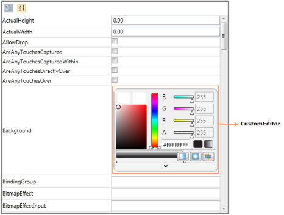
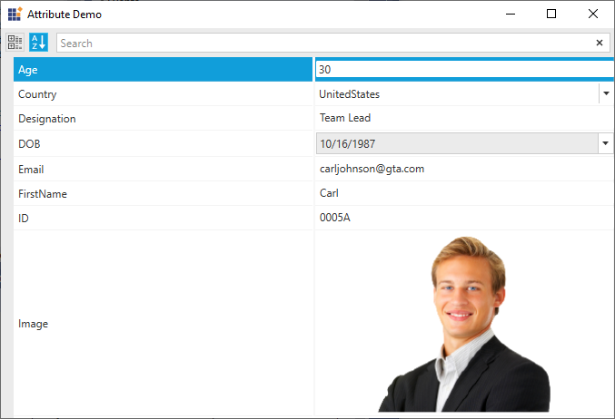

# CustomEditor Support

The PropertyGrid control supports several built-in editors, to give a good look and feel for the application (like in Expression Blend). Using CustomEditors or CategoryEditors. CustomEditor support enables you to set custom value editors for particular properties, instead of default editors.

## Adding CustomEditor through CustomEditorCollection

Using CustomEditorCollection property user can add custom editors to PropertyGrid control. To create CustomEditor user needs to implement ITypeEditor interface. In the below example for Background(Type – Brush), by default ColorPicker will be displayed as ValueEditor. By setting CustomEditor for Background, ColorEdit will be displayed as ValueEditor instead of ColorPicker.





<Grid x:Name="LayoutRoot" Background="White" HorizontalAlignment="Stretch" VerticalAlignment="Stretch">          
		                       <Button Height="25" Width="100" VerticalAlignment="Top" x:Name="Btn"/>   
	      	<syncfusion:ProGrid x:Name="propertyGrid" SelectedObject="{Binding ElementName=Btn}" Margin="50" Width="500" BorderBrush="Gray" BorderThickness="3" HorizontalAlignment="Center" VerticalAlignment="Center"/>      

</Grid>





/// 

   
/// Interaction logic for MainWindow.xaml.
    
/// 

  
public partial class MainWindow :  Window     
{
	/// 
 
	/// Initializes a new instance of the <see cref="MainWindow"/> class.         
	/// 
         
	public MainWindow()  
	{
		InitializeComponent();
		// Creating CustomEditor for Background.
		CustomEditor editor  =  new CustomEditor();
		editor.Properties.Add("Background");
		editor.Editor  =  new ColorEditEditor();
		this.propertyGrid.CustomEditorCollection.Add(editor);
	}
}
public class ColorEditEditor :  ITypeEditor 
{
	public void Attach(PropertyViewItem property,  PropertyItem info) 
	{
		if  (info.CanWrite) 
		{
			var binding  =  new Binding("Value")
			{
				Mode  =  BindingMode.TwoWay,
				Source  =  info,
				ValidatesOnExceptions  =  true,
				ValidatesOnDataErrors  =  true
			};
			BindingOperations.SetBinding(colorEdit,  ColorEdit.BrushProperty,  binding);
		} 
		else 
		{
			var binding  =  new Binding("Value") 
			{
				Mode  =  BindingMode.OneWayToSource,
				Source  =  info, < br >                     
				ValidatesOnExceptions  =  true,
				ValidatesOnDataErrors  =  true
			};
			BindingOperations.SetBinding(colorEdit,  ColorEdit.BrushProperty,  binding);
		}
	}
	public ColorEdit colorEdit;
	public object Create(System.Reflection.PropertyInfo PropertyInfo) 
	{
		colorEdit  =  new ColorEdit();
		return colorEdit;
	}
	public void Detach(PropertyViewItem property) 
	{
		throw new NotImplementedException();
	}
}





### Properties

CustomEditor Table

<table>
<tr>
<th>
Property </th><th>
Description </th><th>
Type </th><th>
Data Type </th><th>
Reference links </th></tr>
<tr>
<td>
CustomEditorCollection</td><td>
CustomEditor support enables you to set custom value editors for particular properties, instead of default editors.</td><td>
DependencyProperty</td><td>
CustomEditorCollection</td><td>
</td></tr>
</table>

#### Sample link

1. Select Start -> Programs -> Syncfusion -> Essential Studio xx.x.x.xx -> Dashboard.
2. Select   Run Locally Installed Samples in WPF Button.
3. Now expand the PropertyGrid treeview item in the Sample Browser.
4. Choose any one of the samples listed under it to launch. 

## Adding CustomEditor through EditorAttribute

User can apply a custom editor based on the property's Name or Type using [EditorAttribute](https://docs.microsoft.com/en-us/dotnet/api/system.componentmodel.editorattribute?view=netframework-4.8). The following code illustrate, how the custom ImageViewer is applied to the Image property of the Person class.





<propertyGrid:PropertyGrid x:Name="pgrid">

            <propertyGrid:PropertyGrid.SelectedObject>
                <local:Person/>                  
            </propertyGrid:PropertyGrid.SelectedObject>

        </propertyGrid:PropertyGrid>





[Editor(typeof(ImageSource), typeof(ImageViewer))]
    public class Person
    {
        public Person()
        {
            FirstName = "Carl";
            Age = 30;
            Email = "carljohnson@gta.com";
            ID = "0005A";
            DOB = new DateTime(1987, 10, 16);
            string path = System.IO.Path.GetDirectoryName(Assembly.GetEntryAssembly().Location);
            Image = new BitmapImage(new Uri(path + @"\carl.png", UriKind.RelativeOrAbsolute));
            Designation = "Team Lead";
        }

        public Country Country
        {
            get;

            set;
        }

        public string Email
        {
            get;

            set;
        }

        public string FirstName
        {
            get;

            set;
        }

        public string Designation
        {
            get;

            set;
        }

        public string ID
        {
            get;

            set;
        }

        public DateTime DOB
        {
            get;

            set;
        }

        public int Age
        {
            get;

            set;
        }

        public ImageSource Image
        {
            get;

            set;
        }
    }

public class ImageViewer : ITypeEditor
    {

        public void Attach(PropertyViewItem property, PropertyItem info)
        {

            var binding = new Binding("Value")
            {
                Mode = BindingMode.TwoWay,
                Source = info,
                ValidatesOnExceptions = true,
                ValidatesOnDataErrors = true
            };
            BindingOperations.SetBinding(image, Image.SourceProperty, binding);

        }

        Image image;
        public object Create(PropertyInfo propertyInfo)
        {
            image = new Image();
            image.Source = new BitmapImage();
            image.MaxHeight = 200;
            image.MaxWidth = 200;         
            return image;
        }

        public void Detach(PropertyViewItem property)
        {
            image.Source = null;
            image = null;
        }
    }

	



`ImageViewer` editor will be applied to `Image` property even if the name of the property is mentioned in EditorAttribute instead of its type. 