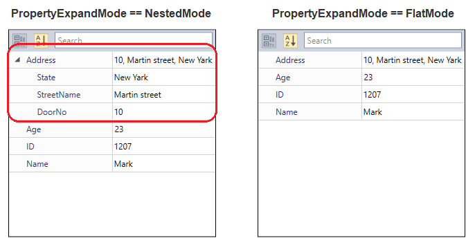
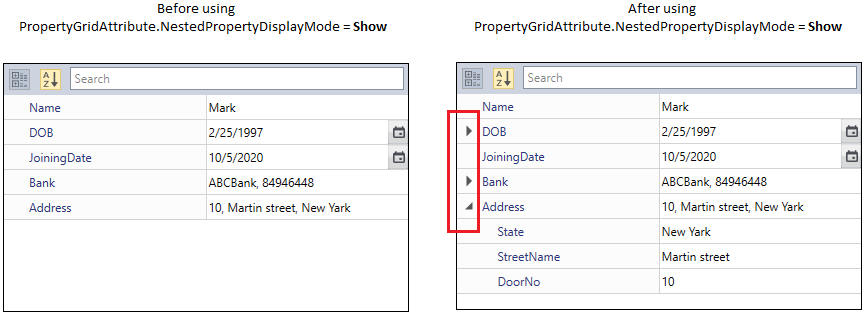
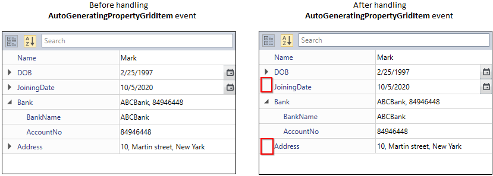

# Nested Properties in WPF PropertyGrid

The [PropertyGrid](https://www.syncfusion.com/wpf-ui-controls/propertygrid) control has support to expand instance properties of a class.

## Explore the nested properties

You can choose whether the nested properties of the [SelectedObject](https://help.syncfusion.com/cr/wpf/Syncfusion.Windows.PropertyGrid.PropertyGrid.html#Syncfusion_Windows_PropertyGrid_PropertyGrid_SelectedObject) can be expanded or not by using the [PropertyExpandMode](https://help.syncfusion.com/cr/wpf/Syncfusion.Windows.PropertyGrid.PropertyGrid.html#Syncfusion_Windows_PropertyGrid_PropertyGrid_PropertyExpandMode) property.  By default, `PropertyExpandMode` value is `FlatMode`, thus the nested properties are not shown.  If you want to display the nested properties, you can set the `PropertyExpandMode`  property as `NestedMode`.




// A Class that represents the nested properties
public class Address {
    public string State { get; set; }        
    public string StreetName { get; set; }
    public string DoorNo { get; set; }
    public override string ToString() {
        return DoorNo + ", " + StreetName + ", " + State;
    }
}

public class Employee {
    public string Name { get; set; }
    public string ID { get; set; }
    public int Age { get; set; }
    // Property contains the nested properties
    public Address Address { get; set; }
}

public class ViewModel {
    public object SelectedEmployee { get; set; }
    public PropertyExpandModes PropertyExpandMode { get; set; }
    public ViewModel() {
        SelectedEmployee = new Employee() {                
            Age = 23,
            ID = "1207",
            Name = "Mark",
            Address = new Address()
            {
                State = "New Yark",
                DoorNo = "10",
                StreetName = "Martin street"
            }
        };
        PropertyExpandMode = PropertyExpandModes.FlatMode;
    }
}







<syncfusion:PropertyGrid PropertyExpandMode="NestedMode"
                         SelectedObject="{Binding SelectedEmployee}"
                         x:Name="propertyGrid1">
    <syncfusion:PropertyGrid.DataContext>
        <local:ViewModel></local:ViewModel>
    </syncfusion:PropertyGrid.DataContext>
</syncfusion:PropertyGrid>

 


PropertyGrid propertyGrid1 = new PropertyGrid();
propertyGrid1.DataContext = new ViewModel();
propertyGrid1.SetBinding(PropertyGrid.SelectedObjectProperty, new Binding("SelectedEmployee"));
propertyGrid1.PropertyExpandMode = PropertyExpandModes.NestedMode;

 
 

Here, `Address` is a class type property in the `Employee` class. It includes the `City`, `StreetName`, and `DoorNo` properties that are shown by setting `PropertyExpandMode` property as `NestedMode`.

Click [here](https://github.com/SyncfusionExamples/wpf-property-grid-examples/tree/master/Samples/Nested_Properties) to download the sample that showcases the nested property expanding support.

## Enable or disable nested properties, for a specific property

You can enable or disable nested properties, for one or more specific property item by using the attribute and event

### Enable or disable nested properties using attribute

You can explore or hide the nested properties for any specific property item by setting the `PropertyGridAttribute.NestedPropertyDisplayMode` property value as `Show` or `None` for that specific property item. It will not affected by the [PropertyExpandMode](https://help.syncfusion.com/cr/wpf/Syncfusion.Windows.PropertyGrid.PropertyGrid.html#Syncfusion_Windows_PropertyGrid_PropertyGrid_PropertyExpandMode) property values.




public class Address {
    public string State { get; set; }
    public string StreetName { get; set; }
    public string DoorNo { get; set; }
    public override string ToString() {
        return DoorNo + ", " + StreetName + ", " + State;
    }
}

public class Bank {
    public string BankName { get; set; }
    public string AccountNo { get; set; }
    public override string ToString() {
        return BankName + ", " + AccountNo ;
    }
}

//Allow to explore nested property for the multiple property item
[PropertyGridAttribute(NestedPropertyDisplayMode = NestedPropertyDisplayMode.Show, PropertyName = "Bank, DOB")]
public class Employee {
    public string Name { get; set; }
    public DateTime DOB { get; set; }
    public DateTime JoiningDate { get; set; }
    public Bank Bank { get; set; }

    //Allow to explore nested property for the single property item
    [PropertyGridAttribute(NestedPropertyDisplayMode = NestedPropertyDisplayMode.Show)]
    public Address Address { get; set; }   

    public Employee() {
        Name = "Mark";
        DOB = new DateTime(1997, 2, 25);
        JoiningDate= new DateTime(2020, 10, 5);
        Address = new Address()
        {
            State = "New Yark",
            DoorNo = "10",
            StreetName = "Martin street"
        };
        Bank = new Bank()
        {
            AccountNo = "84946448",
            BankName = "ABCBank"
        };
    }
}







<syncfusion:PropertyGrid PropertyExpandMode="FlatMode"
                         SelectedObject="{Binding Employee}"
                         SortDirection="{x:Null}"
                         x:Name="propertyGrid1">
    <syncfusion:PropertyGrid.DataContext>
        <local:Employee></local:Employee>
    </syncfusion:PropertyGrid.DataContext>
</syncfusion:PropertyGrid>

 


PropertyGrid propertyGrid1 = new PropertyGrid();
propertyGrid1.SetBinding(PropertyGrid.SelectedObjectProperty, new Binding("Employee"));
propertyGrid1.PropertyExpandMode = PropertyExpandModes.FlatMode;
propertyGrid1.SortDirection = null;

 


Here, the `PropertyExpandMode` property value is `FlatMode`. But, Specific properties like `Bank, DOB` and `Address` property's nested properties are explored in the `PropertyGrid`.

N> View [Sample](https://github.com/SyncfusionExamples/wpf-property-grid-examples/tree/master/Samples/Attribute_NestedMode) in GitHub

### Enable or disable nested properties using event

You can explore or hide the nested properties for any specific property item without using the attributes at runtime by handling the [AutoGeneratingPropertyGridItem](https://help.syncfusion.com/cr/wpf/Syncfusion.Windows.PropertyGrid.PropertyGrid.html) event with [AutoGeneratingPropertyGridItemEventArgs.ExpandMode](https://help.syncfusion.com/cr/wpf/Syncfusion.Windows.PropertyGrid.AutoGeneratingPropertyGridItemEventArgs.html#Syncfusion_Windows_PropertyGrid_AutoGeneratingPropertyGridItemEventArgs_ExpandMode) property value as `NestedMode` or `FlatMode` for that specific property item. It will not affected by the [PropertyExpandMode](https://help.syncfusion.com/cr/wpf/Syncfusion.Windows.PropertyGrid.PropertyGrid.html#Syncfusion_Windows_PropertyGrid_PropertyGrid_PropertyExpandMode)  property values.




public class Address {
    public string State { get; set; }
    public string StreetName { get; set; }
    public string DoorNo { get; set; }
    public override string ToString() {
        return DoorNo + ", " + StreetName + ", " + State;
    }
}

public class Bank {
    public string BankName { get; set; }
    public string AccountNo { get; set; }
    public override string ToString() {
        return BankName + ", " + AccountNo ;
    }
}

public class Employee {
    public string Name { get; set; }
    public DateTime DOB { get; set; }
    public DateTime JoiningDate { get; set; }
    public Bank Bank { get; set; }
    public Address Address { get; set; }   

    public Employee() {
        Name = "Mark";
        DOB = new DateTime(1997, 2, 25);
        JoiningDate= new DateTime(2020, 10, 5);
        Address = new Address()
        {
            State = "New Yark",
            DoorNo = "10",
            StreetName = "Martin street"
        };
        Bank = new Bank()
        {
            AccountNo = "84946448",
            BankName = "ABCBank"
        };
    }
}







<syncfusion:PropertyGrid AutoGeneratingPropertyGridItem="PropertyGrid_AutoGeneratingPropertyGridItem"
                         PropertyExpandMode="NestedMode"
                         SelectedObject="{Binding Employee}"
                         SortDirection="{x:Null}"
                         x:Name="propertyGrid1">
    <syncfusion:PropertyGrid.DataContext>
        <local:Employee></local:Employee>
    </syncfusion:PropertyGrid.DataContext>
</syncfusion:PropertyGrid>

 


PropertyGrid propertyGrid1 = new PropertyGrid();
propertyGrid1.AutoGeneratingPropertyGridItem += PropertyGrid_AutoGeneratingPropertyGridItem
propertyGrid1.SetBinding(PropertyGrid.SelectedObjectProperty, new Binding("Employee"));
propertyGrid1.PropertyExpandMode = PropertyExpandModes.NestedMode;
propertyGrid1.SortDirection = null;

 


You can handle the event as follows




private void PropertyGrid_AutoGeneratingPropertyGridItem(object sender, AutoGeneratingPropertyGridItemEventArgs e) {
    if(e.DisplayName=="JoiningDate" || e.DisplayName== "Address") {
        e.ExpandMode = PropertyExpandModes.FlatMode;
    }
}




Here, the `PropertyExpandMode` property value is `NestedMode`. But, specific properties like `JoiningDate` and `Address` property's nested properties are hidden in the `PropertyGrid`.

N> View [Sample](https://github.com/SyncfusionExamples/wpf-property-grid-examples/tree/master/Samples/AutoGeneratingPropertyGridItem_NestedMode) in GitHub
