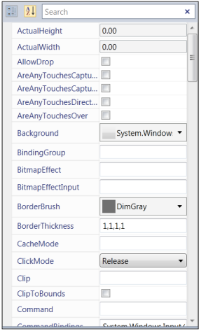

# Getting started with WPF PropertyGrid

This section explains how to create a WPF [PropertyGrid](https://www.syncfusion.com/wpf-ui-controls/propertygrid) control and its features.

## Assembly deployment

Refer to the [control dependencies](https://help.syncfusion.com/wpf/control-dependencies#propertygrid) section to get the list of assemblies or NuGet package that needs to be added as a reference to use the control in any application.

You can find more details about installing the NuGet package in a WPF application in the following link: 

[How to install nuget packages](https://help.syncfusion.com/wpf/nuget-packages)

## Adding WPF PropertyGrid via designer

You can add the [PropertyGrid](https://www.syncfusion.com/wpf-ui-controls/propertygrid) control to an application by dragging it from the toolbox to a view of the designer. The following dependent assembly will be added automatically:

* Syncfusion.PropertyGrid.Wpf
* Syncfusion.Shared.WPF
* Syncfusion.Tools.Wpf

## Adding WPF PropertyGrid via XAML

To add the `PropertyGrid` control manually in XAML, follow these steps:
1. Create a new WPF project in Visual Studio.

2. Add the  following assembly references to the project,
   * Syncfusion.PropertyGrid.Wpf
   * Syncfusion.Shared.WPF
   * Syncfusion.Tools.Wpf

 
3. Import Syncfusion WPF schema **http://schemas.syncfusion.com/wpf** and declare the `PropertyGrid` control in XAML page.




<Window x:Class="PropertyGridSample.MainWindow"
        xmlns="http://schemas.microsoft.com/winfx/2006/xaml/presentation"
        xmlns:x="http://schemas.microsoft.com/winfx/2006/xaml"
        xmlns:d="http://schemas.microsoft.com/expression/blend/2008"
        xmlns:mc="http://schemas.openxmlformats.org/markup-compatibility/2006"
        xmlns:syncfusion="http://schemas.syncfusion.com/wpf"
        mc:Ignorable="d" 
        Title="MainWindow" Height="600" Width="500">
    <Grid>
        <syncfusion:PropertyGrid  Name="propertyGrid1" Height="400" Width="300" >
        </syncfusion:PropertyGrid>
    </Grid>
</Window>




## Adding WPF PropertyGrid via C\#

To add the `PropertyGrid` control manually in C#, follow these steps:

1. Create a new WPF application via Visual Studio.

2. Add the  following assembly references to the project,
    * Syncfusion.PropertyGrid.Wpf
    * Syncfusion.Shared.WPF
    *  Syncfusion.Tools.Wpf

3. Include the required namespace.




using Syncfusion.Windows.PropertyGrid;




4. Create an instance of PropertyGrid and add it to the window.




public partial class MainWindow : Window
{
    public MainWindow()
    {
        InitializeComponent();

        // Creating an instance of PropertyGrid control

        PropertyGrid propertyGrid1 = new PropertyGrid();

        // Setting height and width to PropertyGrid

        propertyGrid1.Height = 300;
        propertyGrid1.Width = 200;

        //Adding PropertyGrid as window content

        this.Content = propertyGrid1;
    }
}




## Populating the properties

The `PropertyGrid` allows to display the searchable and editable properties of the particular object specified by the [SelectedObject](https://help.syncfusion.com/cr/wpf/Syncfusion.PropertyGrid.Wpf~Syncfusion.Windows.PropertyGrid.Property~SelectedObject.html) property.

The properties of the objects can be populated in the following ways,

### Populating the properties through XAML

The user can populate the properties of the Object using XAML




<syncfusion:PropertyGrid  Name="propertyGrid1" Height="500" Width="300" >
    <syncfusion:PropertyGrid.SelectedObject>
        <Button></Button>
    </syncfusion:PropertyGrid.SelectedObject>
</syncfusion:PropertyGrid>




In the above code snippet, the [Button](https://docs.microsoft.com/en-us/dotnet/api/system.windows.controls.button?view=netframework-4.8) is set as `SelectedObject` for the `PropertyGrid`. Thus, the `PropertyGrid` shows all the properties available in the `Button`. 

### Populating the properties through C#

The user can sets the object to the `SelectedObject` property using C# to populate the properties in the `PropertyGrid`.




PropertyGrid propertyGrid = new PropertyGrid();
pGrid.SelectedObject = new Button();




