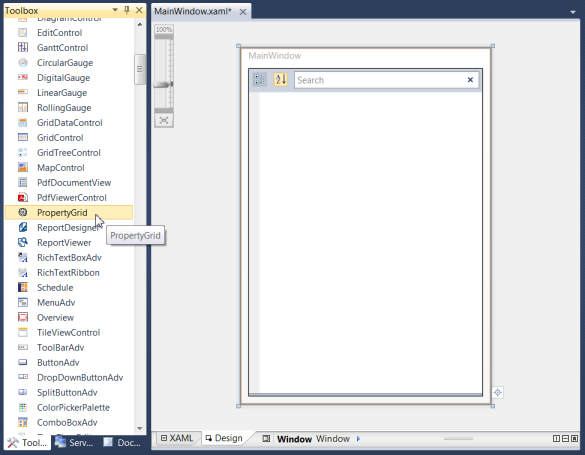
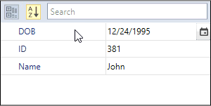

# Getting Started with WPF PropertyGrid

This section explains how to explore and edit the properties of an object using WPF [PropertyGrid](https://www.syncfusion.com/wpf-ui-controls/propertygrid) control.

## Assembly deployment

Refer to the [control dependencies](https://help.syncfusion.com/wpf/control-dependencies#propertygrid) section to get the list of assemblies or NuGet package that needs to be added as a reference to use the control in any application.

You can find more details about installing the NuGet package in a WPF application in the following link: 

[How to install nuget packages](https://help.syncfusion.com/wpf/visual-studio-integration/nuget-packages)

## Adding WPF PropertyGrid via designer

You can add the [PropertyGrid](https://www.syncfusion.com/wpf-ui-controls/propertygrid) control to an application by dragging it from the toolbox to a view of the designer. The following dependent assembly will be added automatically:

* Syncfusion.PropertyGrid.Wpf
* Syncfusion.Shared.WPF
* Syncfusion.Tools.Wpf

## Adding WPF PropertyGrid via XAML

To add the `PropertyGrid` control manually in XAML, follow these steps:
1. Create a new WPF project in Visual Studio.

2. Add the  following assembly references to the project,
   * Syncfusion.PropertyGrid.Wpf
   * Syncfusion.SfInput.WPF
   * Syncfusion.SfShared.WPF
   * Syncfusion.Shared.WPF
   * Syncfusion.Tools.Wpf
 
3. Import Syncfusion WPF schema **http://schemas.syncfusion.com/wpf** and declare the `PropertyGrid` control in XAML page.




<Window x:Class="PropertyGridSample.MainWindow"
        xmlns="http://schemas.microsoft.com/winfx/2006/xaml/presentation"
        xmlns:x="http://schemas.microsoft.com/winfx/2006/xaml"
        xmlns:d="http://schemas.microsoft.com/expression/blend/2008"
        xmlns:mc="http://schemas.openxmlformats.org/markup-compatibility/2006"
        xmlns:syncfusion="http://schemas.syncfusion.com/wpf"
        mc:Ignorable="d" 
        Title="MainWindow" Height="600" Width="500">
    <Grid>
        <syncfusion:PropertyGrid  Name="propertyGrid1" Height="400" Width="300" >
        </syncfusion:PropertyGrid>
    </Grid>
</Window>




## Adding WPF PropertyGrid via C#

To add the `PropertyGrid` control manually in C#, follow these steps:

1. Create a new WPF application via Visual Studio.

2. Add the  following assembly references to the project,
    * Syncfusion.PropertyGrid.Wpf
    * Syncfusion.Shared.WPF
    * Syncfusion.Tools.Wpf

3. Include the required namespace and create an instance of `PropertyGrid` and add it to the window.




using Syncfusion.Windows.PropertyGrid;

public partial class MainWindow : Window {
    public MainWindow() {
        InitializeComponent();

        // Creating an instance of PropertyGrid control
        PropertyGrid propertyGrid1 = new PropertyGrid();

        // Setting height and width to PropertyGrid
        propertyGrid1.Height = 300;
        propertyGrid1.Width = 200;

        //Adding PropertyGrid as window content
        this.Content = propertyGrid1;
    }
}




## Populating the properties

We can display the properties of any object using the [SelectedObject](https://help.syncfusion.com/cr/wpf/Syncfusion.Windows.PropertyGrid.Property.html#Syncfusion_Windows_PropertyGrid_Property_SelectedObject) property. When the `SelectedObject` property is bound with an object, the properties of that object are parsed and displayed in the `PropertyGrid`.




// Employee class to be explored in property grid.
public class Employee {
    public string EmployeeName { get; set; }
    public string ID { get; set; }
    public int Age { get; set; }
    public int Experiance { get; set; }
}

//Create ViewModel class with a property to be bounded with PropertyGrid.SelectedObject 
public class ViewModel {
    public object SelectedEmployee { get; set; }
    public ViewModel() {
        SelectedEmployee = new Employee() 
        {
            EmployeeName = "Johnson",
            Age = 25,
            ID = "1234",
            Experiance =3
        };
    }
}




We can populate the properties of the `SelectedObject` using XAML or C#.




<syncfusion:PropertyGrid SelectedObject="{Binding SelectedEmployee}"
                         Name="propertyGrid1" >
    <syncfusion:PropertyGrid.DataContext>
        <local:ViewModel></local:ViewModel>
    </syncfusion:PropertyGrid.DataContext>
</syncfusion:PropertyGrid>




PropertyGrid propertyGrid1 = new PropertyGrid();
propertyGrid1.DataContext = new ViewModel();
propertyGrid1.SetBinding(PropertyGrid.SelectedObjectProperty, new Binding("SelectedEmployee"));




Here, the `SelectedEmployee` object is set as `SelectedObject` for the `PropertyGrid`. Thus, the `PropertyGrid` shows all the properties available in the `SelectedEmployee` object.

## Custom Editor as value editors

The [PropertyGrid](https://www.syncfusion.com/wpf-ui-controls/propertygrid) control supports several built-in editors for edit the property values. We can assign own value editor(control) as a value editor for the properties instead of default value editors by using the [Editor](https://docs.microsoft.com/en-us/dotnet/api/system.componentmodel.editorattribute?view=netframework-4.8) attribute or [CustomEditorCollection](https://help.syncfusion.com/cr/wpf/Syncfusion.Windows.PropertyGrid.PropertyGrid.html#Syncfusion_Windows_PropertyGrid_PropertyGrid_CustomEditorCollection). 

For example, if we create an `EmailID` property as a string type, `TextBox` will assigned as a value editor and all the text will be allowed. If we want to accept the input that is only in the mail id format, we can assign [MaskEdit](https://www.syncfusion.com/wpf-ui-controls/maskedtextbox) control with mail ID mask as the value editor for the `EmailID` property. 

### Creating the Custom Editor 

To create `CustomEditor`, we need to implement `ITypeEditor` interface.




//Custom Editor with email id mask.
public class EmailEditor : ITypeEditor {
    SfMaskedEdit maskededit;
    public void Attach(PropertyViewItem property, PropertyItem info) {
        if (info.CanWrite) {
            var binding = new Binding("Value")
            {
                Mode = BindingMode.TwoWay,
                Source = info,
                ValidatesOnExceptions = true,
                ValidatesOnDataErrors = true
            };
            BindingOperations.SetBinding(maskededit, SfMaskedEdit.ValueProperty, binding);
        }
        else {
            maskededit.IsEnabled = false;
            var binding = new Binding("Value")
            {
                Source = info,
                ValidatesOnExceptions = true,
                ValidatesOnDataErrors = true
            };
            BindingOperations.SetBinding(maskededit, SfMaskedEdit.ValueProperty, binding);
        }
    }
    public object Create(PropertyInfo propertyInfo) {
        // SfMaskedEdit assigned with EmailId mask
        maskededit = new SfMaskedEdit();
        maskededit.MaskType = MaskType.RegEx;
        maskededit.Mask = "[A-Za-z0-9._%-]+@[A-Za-z0-9]+.[A-Za-z]{2,3}";
        return maskededit;
    }
    public void Detach(PropertyViewItem property) {

    }
}




### Assigning a Custom Editor for the Property

We will assign the `EmailEditor` as value editor for the `EmailID` property.




//CustomEditor for the EmailID property
[Editor("EmailID", typeof(EmailEditor))]
public class Employee : NotificationObject {
    public string EmailID { get; set; }
    public string Name { get; set; }
    public int Age { get; set; }
    public int Experience { get; set; }
}

class ViewModel {
    public object SelectedEmployee { get; set; }
    public ViewModel() {
        SelectedEmployee = new Employee()
        {
            Age = 25,
            Name = "mark",
            Experience = 5,
            EmailID = "mark@gt"
        };
    }
}







<syncfusion:PropertyGrid SelectedObject="{Binding SelectedEmployee}"
                         x:Name="propertyGrid1" >
    <syncfusion:PropertyGrid.DataContext>
        <local:ViewModel></local:ViewModel>
   </syncfusion:PropertyGrid.DataContext>
</syncfusion:PropertyGrid>




PropertyGrid propertyGrid1 = new PropertyGrid();
propertyGrid1.DataContext = new ViewModel();
propertyGrid1.SetBinding(PropertyGrid.SelectedObjectProperty, new Binding("SelectedEmployee"));




Here, The `EmailID` property is accepts only the inputs which are in the email-id format by the `EmailEditor`.

Click [here](https://github.com/SyncfusionExamples/wpf-property-grid-examples/tree/master/Samples/CustomEditor) to download the sample that showcases the `CustomEditor` support.

## Selected property item changed notification

The property item selection changed in `PropertyGrid` can be examined using [SelectedPropertyItemChanged](https://help.syncfusion.com/cr/wpf/Syncfusion.Windows.PropertyGrid.PropertyGrid.html) event. The `SelectedPropertyItemChanged` event contains the old and newly selected property item details in the `OldValue` and  `NewValue` properties.




<syncfusion:PropertyGrid SelectedPropertyItemChanged="PropertyGrid_SelectedPropertyItemChanged"
                         SelectedObject="{Binding SelectedEmployee}"
                         Name="propertyGrid1" >
    <syncfusion:PropertyGrid.DataContext>
        <local:ViewModel></local:ViewModel>
    </syncfusion:PropertyGrid.DataContext>
</syncfusion:PropertyGrid>




PropertyGrid propertyGrid = new PropertyGrid();
propertyGrid.SelectedPropertyItemChanged += PropertyGrid_SelectedPropertyItemChanged;




You can handle this event as follows,




private void PropertyGrid_SelectedPropertyItemChanged(DependencyObject d, DependencyPropertyChangedEventArgs e) {
    var oldPropertyItem = e.OldValue;
    var newPropertyItem = e.NewValue;            
}




## Disable animation on loading selected object

You can load the selected's object property items without any animation into the `PropertyGrid` by using the [DisableAnimationOnObjectSelection](https://help.syncfusion.com/cr/wpf/Syncfusion.Windows.PropertyGrid.PropertyGrid.html#Syncfusion_Windows_PropertyGrid_PropertyGrid_DisableAnimationOnObjectSelection) property value as `true`. The default value of `DisableAnimationOnObjectSelection` property is `false`.




using System;
using System.ComponentModel;
using System.ComponentModel.DataAnnotations;

public class Employee {
    [Description("Name of the employee")]
    public string Name { get; set; }
    public string ID { get; set; }
    [Description("Birth date of the employee")]
    public DateTime DOB { get; set; }
}

public class ViewModel {
    public Object SelectedEmployee { get; set; }
    public ViewModel() {
        SelectedEmployee = new Employee()
        {
            Name = "John",
            ID = "381",
            DOB = new DateTime(1995, 12, 24)
        };
    }
}







<syncfusion:PropertyGrid DisableAnimationOnObjectSelection="True"
                         SelectedObject="{Binding SelectedEmployee}"
                         x:Name="propertyGrid1">
    <syncfusion:PropertyGrid.DataContext>
        <local:ViewModel></local:ViewModel>
    </syncfusion:PropertyGrid.DataContext>
</syncfusion:PropertyGrid>




PropertyGrid propertyGrid1 = new PropertyGrid();
propertyGrid1.DisableAnimationOnObjectSelection = true;
propertyGrid1.DataContext = new ViewModel();
propertyGrid1.SetBinding(PropertyGrid.SelectedObjectProperty, new Binding("SelectedEmployee"));




N> [View Sample in GitHub](https://github.com/SyncfusionExamples/wpf-property-grid-examples/blob/master/Samples/Common)

## Tooltip support

You can get the value and description about the property item through tooltip when hover the mouse on the respective property item and its value field. If the property item not contains any description, tooltip shows the property display name. You can restrict the tooltip support by setting the [EnableToolTip](https://help.syncfusion.com/cr/wpf/Syncfusion.Windows.PropertyGrid.PropertyGrid.html#Syncfusion_Windows_PropertyGrid_PropertyGrid_EnableToolTip) property as `false`. The default value of `EnableToolTip` property is `true`.




using System;
using System.ComponentModel;
using System.ComponentModel.DataAnnotations;

public class Employee {
    [Description("Name of the employee")]
    public string Name { get; set; }
    public string ID { get; set; }
    [Description("Birth date of the employee")]
    public DateTime DOB { get; set; }
}

public class ViewModel {
    public Object SelectedEmployee { get; set; }
    public ViewModel() {
        SelectedEmployee = new Employee()
        {
            Name = "John",
            ID = "381",
            DOB = new DateTime(1995, 12, 24)
        };
    }
}







<syncfusion:PropertyGrid EnableToolTip="True"
                         SelectedObject="{Binding SelectedEmployee}"
                         x:Name="propertyGrid1">
    <syncfusion:PropertyGrid.DataContext>
        <local:ViewModel></local:ViewModel>
    </syncfusion:PropertyGrid.DataContext>
</syncfusion:PropertyGrid>




PropertyGrid propertyGrid1 = new PropertyGrid();
propertyGrid1.EnableToolTip = true;
propertyGrid1.DataContext = new ViewModel();
propertyGrid1.SetBinding(PropertyGrid.SelectedObjectProperty, new Binding("SelectedEmployee"));




N> View [Sample](https://github.com/SyncfusionExamples/wpf-property-grid-examples/tree/master/Samples/Apperance) in GitHub

## The final point to override the property items

The `PropertyGrid` control notifies the users when a property item is created and is being added in the property collection of the control by using the `AutoGeneratingPropertyGridItem` event. The 
AutoGeneratingPropertyGridItem event contains the following properties and allows us to change their value if required.
* **Cancel**  - Allows users to skip adding the current property item in the `PropertyGrid`.
* [**Category**](https://help.syncfusion.com/cr/wpf/Syncfusion.Windows.PropertyGrid.AutoGeneratingPropertyGridItemEventArgs.html#Syncfusion_Windows_PropertyGrid_AutoGeneratingPropertyGridItemEventArgs_Category) - Gets or sets the name of the category for the property item.
* [**Description**](https://help.syncfusion.com/cr/wpf/Syncfusion.Windows.PropertyGrid.AutoGeneratingPropertyGridItemEventArgs.html#Syncfusion_Windows_PropertyGrid_AutoGeneratingPropertyGridItemEventArgs_Description) - Gets or sets a description of the property item.
* [**DescriptionTemplate**](https://help.syncfusion.com/cr/wpf/Syncfusion.Windows.PropertyGrid.AutoGeneratingPropertyGridItemEventArgs.html#Syncfusion_Windows_PropertyGrid_AutoGeneratingPropertyGridItemEventArgs_DescriptionTemplate) - Gets or sets the template used to display the description of SelectedItem.
* [**DisplayName**](https://help.syncfusion.com/cr/wpf/Syncfusion.Windows.PropertyGrid.AutoGeneratingPropertyGridItemEventArgs.html#Syncfusion_Windows_PropertyGrid_AutoGeneratingPropertyGridItemEventArgs_DisplayName) - Gets or sets a display name to the property item.
* [**ExpandMode**](https://help.syncfusion.com/cr/wpf/Syncfusion.Windows.PropertyGrid.AutoGeneratingPropertyGridItemEventArgs.html#Syncfusion_Windows_PropertyGrid_AutoGeneratingPropertyGridItemEventArgs_ExpandMode) - Gets or sets whether to populate nested properties of PropertyItem or not.
* [**Order**](https://help.syncfusion.com/cr/wpf/Syncfusion.Windows.PropertyGrid.AutoGeneratingPropertyGridItemEventArgs.html#Syncfusion_Windows_PropertyGrid_AutoGeneratingPropertyGridItemEventArgs_Order) - Gets or sets a value to arrange the property item into the property collection when the value of `SortDirection` property is **null**. 
* [**OriginalSource**](https://help.syncfusion.com/cr/wpf/Syncfusion.Windows.PropertyGrid.AutoGeneratingPropertyGridItemEventArgs.html#Syncfusion_Windows_PropertyGrid_AutoGeneratingPropertyGridItemEventArgs_OriginalSource) - Gets the PropertyItem that is being added to the property collection of PropertyGrid.
* [**ReadOnly**](https://help.syncfusion.com/cr/wpf/Syncfusion.Windows.PropertyGrid.AutoGeneratingPropertyGridItemEventArgs.html#Syncfusion_Windows_PropertyGrid_AutoGeneratingPropertyGridItemEventArgs_ReadOnly) - Gets or sets a value indicating whether the property item is ready only or not.




<syncfusion:PropertyGrid SelectedObject="{Binding SelectedEmployee}"
                        AutoGeneratingPropertyGridItem="propertyGrid1_AutoGeneratingPropertyGridItem"
                        Name="propertyGrid1" >
    <syncfusion:PropertyGrid.DataContext>
        <local:ViewModel></local:ViewModel>
    </syncfusion:PropertyGrid.DataContext>
</syncfusion:PropertyGrid>




PropertyGrid propertyGrid1 = new PropertyGrid();
propertyGrid1.AutoGeneratingPropertyGridItem += propertyGrid1_AutoGeneratingPropertyGridItem;




You can handle this event as follows,




private void propertyGrid1_AutoGeneratingPropertyGridItem(object sender, Syncfusion.Windows.PropertyGrid.AutoGeneratingPropertyGridItemEventArgs e)
{
    var categoryName = e.Category;
    var description = e.Description;
    var propertyItemDisplayName = e.DisplayName;
    bool isReadOnly = e.ReadOnly;
    bool isCancel = e.Cancel;
    var itemOrder = e.Order;
    var propertyItem = e.OriginalSource;
    var descriptionTemplate = e.DescriptionTemplate;
}




You can also apply a custom editor or change an existing custom editor of the property items in `PropertyGrid` in the `AutoGeneratingPropertyGridItem` event as shown below.




private void propertyGrid1_AutoGeneratingPropertyGridItem(object sender, Syncfusion.Windows.PropertyGrid.AutoGeneratingPropertyGridItemEventArgs e)
{
    if(e.DisplayName == "Age")
    {
        PropertyItem propertyItem = e.OriginalSource as PropertyItem;
        if(propertyItem.PropertyType == typeof(long))
        {
            propertyItem.Editor = new IntegerTextBoxEditor();
        }
    }
}




## Property item value changed notification

The property item value changed in `PropertyGrid` can be examined using [ValueChanged](https://help.syncfusion.com/cr/wpf/Syncfusion.Windows.PropertyGrid.PropertyGrid.html) event. The `ValueChanged` event contains the old and newly changed property values by the `OldValue` and `NewValue` properties and `Property` contains the property item whose values is changed.




<syncfusion:PropertyGrid ValueChanged="PropertyGrid_ValueChanged"
                         SelectedObject="{Binding SelectedEmployee}"
                         Name="propertyGrid1" >
    <syncfusion:PropertyGrid.DataContext>
        <local:ViewModel></local:ViewModel>
    </syncfusion:PropertyGrid.DataContext>
</syncfusion:PropertyGrid>




PropertyGrid propertyGrid = new PropertyGrid();
propertyGrid.ValueChanged += PropertyGrid_ValueChanged;




You can handle this event as follows,




private void PropertyGrid_ValueChanged(object sender, ValueChangedEventArgs args) {
    var valueChangedPropertyItem = args.Property;
    var newValue = args.NewValue;
    var oldValue = args.OldValue;
}




Click [here](https://github.com/SyncfusionExamples/wpf-property-grid-examples/tree/master/Samples/Common) to download the sample that showcases the `PropertyGrid` overall features.

## Theme

PropertyGrid supports various built-in themes. Refer to the below links to apply themes for the PropertyGrid,

  * [Apply theme using SfSkinManager](https://help.syncfusion.com/wpf/themes/skin-manager)
	
  * [Create a custom theme using ThemeStudio](https://help.syncfusion.com/wpf/themes/theme-studio#creating-custom-theme)

