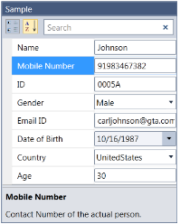
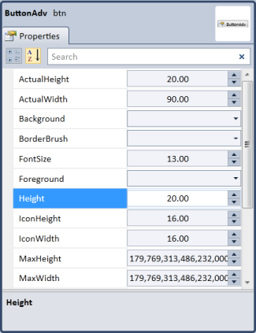

# Getting started with WPF PropertyGrid

This section explains how to create a WPF [PropertyGrid](https://www.syncfusion.com/wpf-ui-controls/propertygrid) control and its features.

## Assembly deployment

Refer to the [control dependencies](https://help.syncfusion.com/wpf/control-dependencies#propertygrid) section to get the list of assemblies or NuGet package that needs to be added as a reference to use the control in any application.

You can find more details about installing the NuGet package in a WPF application in the following link: 

[How to install nuget packages](https://help.syncfusion.com/wpf/nuget-packages)

## Adding WPF PropertyGrid via designer

You can add the [PropertyGrid](https://www.syncfusion.com/wpf-ui-controls/propertygrid) control to an application by dragging it from the toolbox to a view of the designer. The following dependent assembly will be added automatically:

* Syncfusion.PropertyGrid.Wpf
* Syncfusion.Shared.WPF
* Syncfusion.Tools.Wpf

## Adding WPF PropertyGrid via XAML

To add the `PropertyGrid` control manually in XAML, follow these steps:
1. Create a new WPF project in Visual Studio.

2. Add the  following assembly references to the project,
   * Syncfusion.PropertyGrid.Wpf
   * Syncfusion.Shared.WPF
   * Syncfusion.Tools.Wpf

 
3. Import Syncfusion WPF schema **http://schemas.syncfusion.com/wpf** and declare the `PropertyGrid` control in XAML page.




<Window x:Class="PropertyGridSample.MainWindow"
        xmlns="http://schemas.microsoft.com/winfx/2006/xaml/presentation"
        xmlns:x="http://schemas.microsoft.com/winfx/2006/xaml"
        xmlns:d="http://schemas.microsoft.com/expression/blend/2008"
        xmlns:mc="http://schemas.openxmlformats.org/markup-compatibility/2006"
        xmlns:syncfusion="http://schemas.syncfusion.com/wpf"
        mc:Ignorable="d" 
        Title="MainWindow" Height="600" Width="500">
    <Grid>
        <syncfusion:PropertyGrid  Name="propertyGrid1" Height="400" Width="300" >
        </syncfusion:PropertyGrid>
    </Grid>
</Window>




## Adding WPF PropertyGrid via C\#

To add the `PropertyGrid` control manually in C#, follow these steps:

1. Create a new WPF application via Visual Studio.

2. Add the  following assembly references to the project,
    * Syncfusion.PropertyGrid.Wpf
    * Syncfusion.Shared.WPF
    *  Syncfusion.Tools.Wpf

3. Include the required namespace.




using Syncfusion.Windows.PropertyGrid;




4. Create an instance of PropertyGrid and add it to the window.




public partial class MainWindow : Window
{
    public MainWindow()
    {
        InitializeComponent();

        // Creating an instance of PropertyGrid control

        PropertyGrid propertyGrid1 = new PropertyGrid();

        // Setting height and width to PropertyGrid

        propertyGrid1.Height = 300;
        propertyGrid1.Width = 200;

        //Adding PropertyGrid as window content

        this.Content = propertyGrid1;
    }
}




## Populating the properties

We can display the properties of any DotNet object using the [SelectedObject](https://help.syncfusion.com/cr/wpf/Syncfusion.PropertyGrid.Wpf~Syncfusion.Windows.PropertyGrid.Property~SelectedObject.html) property. When the `SelectedObject` property is bound with an object, the properties of that object are parsed and displayed in the PropertyGrid.




// Employee class to be explored in property grid.
public class Employee {
    public string EmployeeName { get; set; }
    public string ID { get; set; }
    public int Age { get; set; }
    public int Experiance { get; set; }
}

//Create ViewModel class with a property to be bounded with PropertyGrid.SelectedObject 
public class ViewModel {
    public object SelectedEmployee { get; set; }
    public ViewModel() {
        SelectedEmployee = new Employee() 
        {
            EmployeeName = "Johnson",
            Age = 25,
            ID = "1234",
            Experiance =3
        };
    }
}

The properties of the SelectedEmployee object can be populated in the following ways,

### Populating the properties using XAML

We can populate the properties of the Object using XAML




<syncfusion:PropertyGrid  Name="propertyGrid1" Height="500" Width="300" >
    <syncfusion:PropertyGrid.SelectedObject>
        <Button></Button>
    </syncfusion:PropertyGrid.SelectedObject>
</syncfusion:PropertyGrid>

<syncfusion:PropertyGrid SelectedObject="{Binding SelectedEmployee}"
                         Name="propertyGrid1" >
    <syncfusion:PropertyGrid.DataContext>
        <local:ViewModel></local:ViewModel>
    </syncfusion:PropertyGrid.DataContext>
</syncfusion:PropertyGrid>




In the above code snippet, the SelectedEmployee object is set as `SelectedObject` for the `PropertyGrid`. Thus, the `PropertyGrid` shows all the properties available in the SelectedEmployee object. 

### Populating the properties using C#

We can sets the object to the `SelectedObject` property using C# to populate the properties in the `PropertyGrid`.




PropertyGrid propertyGrid1 = new PropertyGrid();
propertyGrid1.DataContext = new ViewModel();
propertyGrid1.SelectedObject = (propertyGrid1.DataContext as ViewModel).SelectedEmployee;




### Name and Description of properties

You can edit the custom object properties using the PropertyGrid. The following example illustrates how to edit the custom object properties.

1. Create a class called Person and define the properties. 




[TypeConverter(typeof(ExpandableObjects))]
public class Person
{
	public Person()
	{            
		Name = "Johnson";
		Age = 30;
		Mobile = 91983467382;
		Email = "carljohnson@gta.com";
		ID = "0005A";
		DOB = new DateTime(1987, 10, 16);           
	}
	[CategoryAttribute("Identity")]
	[DisplayNameAttribute("Name")]
	[DescriptionAttribute("Name of the actual person.")]
	public string Name
	{
		get;
		set;
	}
	[CategoryAttribute("Identity")]
	[DisplayNameAttribute("ID")]
	[DescriptionAttribute("ID of the actual person.")]
	public string ID
	{
		get;
		set;
	}
	[CategoryAttribute("Identity")]
	[DisplayNameAttribute("Date of Birth")]
	[DescriptionAttribute("Birth date of the actual person.")]
	public DateTime DOB
	{
		get;
		set;
	}
	[CategoryAttribute("Contact Details")]
	[DisplayNameAttribute("Email ID")]
	[DescriptionAttribute("Email address of the actual person.")]
	public string Email
	{
		get;
		set;
	}
    [CategoryAttribute("Contact Details")]
	[DisplayNameAttribute("Mobile Number")]
	[DescriptionAttribute("Contact number of the actual person.")]
	public long Mobile
	{
		get;
		set;
	}
	[CategoryAttribute("Identity")]
	[DisplayNameAttribute("Age")]
	[DescriptionAttribute("Age of the actual person.")]
	public int Age
	{
		get;
		set;
	}
    [CategoryAttribute("Identity")]
	[DisplayNameAttribute("Gender")]
	[DescriptionAttribute("Gender information of the actual person.")]
	public Gender Gender
	{
		get;
		set;
	}
	[CategoryAttribute("Location")]
	[DisplayNameAttribute("Country")]
	[DescriptionAttribute("Country where the person is located.")]
	public Country Country
	{
		get;
		set;
	}       
}
public enum Country
{
	UnitedStates,
	Germany,
	Canada,
}




2. Set the SelectedObject of the property to the instance of the class Person.




PropertyGrid pGrid = new PropertyGrid();
pGrid.SelectedObject = new Person();




3. The PropertyGrid will be generated as shown in the following screenshot.

### Edit properties using custom editor

The PropertyGrid also provides custom editor support. The following example shows how to create the custom editor.

1. Define the custom editor with the ITypeEditor interface as follows:




public class UpDownEditor : ITypeEditor
{
	public void Attach(PropertyViewItem property, PropertyItem info)
	{
		if (info.CanWrite)
		{
			var binding = new Binding("Value")
			{
				Mode = BindingMode.TwoWay,
				Source = info,
				ValidatesOnExceptions = true,
				ValidatesOnDataErrors = true
			};
			BindingOperations.SetBinding(upDown, UpDown.ValueProperty, binding);
		}
		else
		{
			upDown.AllowEdit = false;
			var binding = new Binding("Value")
			{
				Source = info,
				ValidatesOnExceptions = true,
				ValidatesOnDataErrors = true
			};
			BindingOperations.SetBinding(upDown, UpDown.ValueProperty, binding);
		}
	}
    UpDown upDown;
	public object Create(PropertyInfo propertyInfo)
	{
		upDown = new UpDown()
		{
			ApplyZeroColor = false
		};
		if (propertyInfo.Name == "FontSize" || propertyInfo.Name == "MinWidth" || propertyInfo.Name == "MinHeight" || propertyInfo.Name == "MaxHeight" || propertyInfo.Name == "MaxWidth" ||
		propertyInfo.Name == "Height" || propertyInfo.Name == "Width" || propertyInfo.Name == "ActualWidth" || propertyInfo.Name == "ActualHeight")
		{
			upDown.MinValue = 0;
		}
		if (propertyInfo.Name == "Opacity")
		{
			upDown.MinValue = 0.0;
			upDown.MaxValue = 1.0;
			upDown.Step = 0.1;
		}
		return upDown;
	}
	public void Detach(PropertyViewItem property)
	{
		throw new NotImplementedException();
	}
}




The UpDownEditor given in the above code snippet is used to edit the double values. Since the UpDown control has features like scroll buttons to increase the value, it makes it easier to edit the property values of type double. 

2. Create an instance of Customer Editor with this UpDownEditor as follows:




CustomEditor upDownEditor = new CustomEditor() 
{ 
	HasPropertyType = true, 			
	PropertyType = typeof(double), 
	Editor = new UpDownEditor() 
};




3. Add this custom editor instance to the CustomEditorCollection property of the PropertyGrid as follows:



 
pgridInstance.CustomEditorCollection.Add(brusheditor); 




The PropertyGrid displays the UpDownEditor as shown in the following screenshot for the double type values.

## Visual styles

The PropertyGrid control supports the following built-in visual styles:

* Office2007Blue
* Office2007Black
* Office2007Silver
* Office2010Blue
* Office2010Black
* Office2010Silver
* Blend
* Metro
* Transparent

The visual style can be applied in XAML as follows:




<syncfusion:PropertyGrid
syncfusion:SkinStorage.VisualStyle="Office2010Blue" />   




The PropertyGrid control gets the Office2010Blue look.

The visual styles can be applied in C# as follows:




SkinStorage.SetVisualStyle(propertyGridInstance, "Office2010Blue");




## Structure of the PropertyGrid control

* Button panel—Shows the GroupButton and SortButton to help the user at run time.
* GroupButton—Groups the properties based on Category attribute of the property.
* SortButton—Displays the properties in sorting order in PropertyGrid.
* PropertyGrid—Lists all the properties.

Click [here](https://github.com/SyncfusionExamples/wpf-property-grid-examples/tree/master/Samples/PropertyGrid-Common) to download the sample that showcases the `PropertyGrid` features.