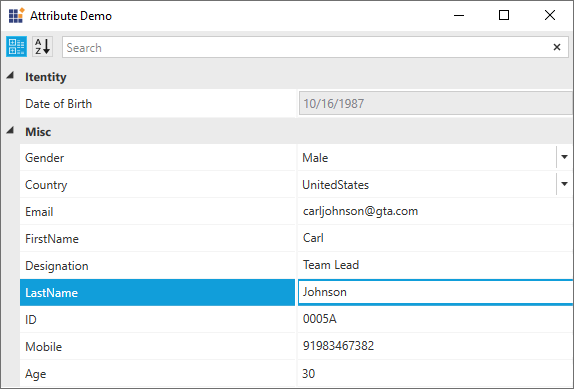

# Grouping the Properties

Users can combine the properties and create multiple groups according to their needs. [EnableGrouping](https://help.syncfusion.com/cr/wpf/Syncfusion.PropertyGrid.Wpf~Syncfusion.Windows.PropertyGrid.PropertyGrid~EnableGrouping.html) property decides whether the properties can be grouped or sorted. If the `SortButton` is `clicked`, the property `EnableGrouping` will be `false` and it will be `true` when `GroupButton` is `clicked`.The default value of the `EnableGrouping` property i `false`. If the `EnableGrouping` property is `true`, `PropertyGrid` can groups the property items based on Category Attribute or Display Attribute's GroupName field of the property. 

## Grouping through Category Attribute

Properties in the `PropertyGrid` will be grouped based on the name specified in the [CategoryAttribute](https://docs.microsoft.com/en-us/dotnet/api/system.componentmodel.categoryattribute?view=netframework-4.8). If the property item doesn't have any category name, that property will be grouped under `Misc` category. In following example, `Name` and `DOB` properties is grouped under `Misc` category and `ID` property is grouped under `Identity` category.




//Model.cs

using System;

using System.ComponentModel;

public class Model

{
    
    [Category("Identity")]
    public string ID
    {
        get;

        set;
    }

    [Category()]
    public string Name
    {
        get;

        set;
    }

    public DateTime DOB
    {
        get;

        set;
    }
}

      

 




//ViewModel.cs

public class ViewModel

{
    
    private Object items = null;
   
    public Object Items
    {
        get
        {
            return items;
        }
        set
        {
            items = value;
        }
    }

    public ViewModel()
    {
        Items = new Model() { Name = "John", DOB = new DateTime(2000, 01, 08), ID = "SF001" };
    }

}

 
 




<Window x:Class="PropertyGrid_WPF.MainWindow"
        xmlns="http://schemas.microsoft.com/winfx/2006/xaml/presentation"
        xmlns:x="http://schemas.microsoft.com/winfx/2006/xaml"
        xmlns:d="http://schemas.microsoft.com/expression/blend/2008"
        xmlns:mc="http://schemas.openxmlformats.org/markup-compatibility/2006"
        xmlns:local="clr-namespace:PropertyGrid_WPF"
        xmlns:syncfusion="http://schemas.syncfusion.com/wpf"
        mc:Ignorable="d" WindowStartupLocation="CenterScreen"
        Title="MainWindow" Height="572" Width="800">
    <Window.DataContext>
        <local:ViewModel></local:ViewModel>
    </Window.DataContext>
    <Grid x:Name="LayoutRoot" Background="White" HorizontalAlignment="Stretch" VerticalAlignment="Stretch">
        <syncfusion:PropertyGrid x:Name="propertyGrid1" Width="350" Height="220" SelectedObject="{Binding Items}" 
                                 EnableGrouping="True">
        </syncfusion:PropertyGrid>
    </Grid>
</Window>

 
 

### Grouping through Display Attribute’s GroupName field

Properties in the `PropertyGrid` will be grouped based on the value specified in the [GroupName] field of [Display] Attribute. If the property item doesn't have any Display Attribute’s GroupName field, that property will be grouped under `Misc` category. In following example, `Name` and `ID` properties is grouped under `Identity` category.




//Model.cs

using System;

using System.ComponentModel.DataAnnotations;

public class Model

{
    
    [Display(GroupName = "Identity")]
    public string ID
    {
        get;

        set;
    }

    [Display(GroupName = "Identity")]
    public string Name
    {
        get;

        set;
    }

    public DateTime DOB
    {
        get;

        set;
    }
}

      

 




//ViewModel.cs

public class ViewModel

{
    
    private Object items = null;
   
    public Object Items
    {
        get
        {
            return items;
        }
        set
        {
            items = value;
        }
    }

    public ViewModel()
    {
        Items = new Model() { Name = "John", DOB = new DateTime(2000, 01, 08), ID = "SF001" };
    }

}

 
 




<Window x:Class="PropertyGrid_WPF.MainWindow"
        xmlns="http://schemas.microsoft.com/winfx/2006/xaml/presentation"
        xmlns:x="http://schemas.microsoft.com/winfx/2006/xaml"
        xmlns:d="http://schemas.microsoft.com/expression/blend/2008"
        xmlns:mc="http://schemas.openxmlformats.org/markup-compatibility/2006"
        xmlns:local="clr-namespace:PropertyGrid_WPF"
        xmlns:syncfusion="http://schemas.syncfusion.com/wpf"
        mc:Ignorable="d" WindowStartupLocation="CenterScreen"
        Title="MainWindow" Height="572" Width="800">
    <Window.DataContext>
        <local:ViewModel></local:ViewModel>
    </Window.DataContext>
    <Grid x:Name="LayoutRoot" Background="White" HorizontalAlignment="Stretch" VerticalAlignment="Stretch">
        <syncfusion:PropertyGrid x:Name="propertyGrid1" Width="350" Height="220" SelectedObject="{Binding Items}" 
                                 EnableGrouping="True">
        </syncfusion:PropertyGrid>
    </Grid>
</Window>

 
 

## Expand or Collapse Category group

Category can be collapsed or expanded by clicking the expander which is near to category name  and it can be collapsed or expanded programmatically by using [CollapseCategory](https://help.syncfusion.com/cr/wpf/Syncfusion.PropertyGrid.Wpf~Syncfusion.Windows.PropertyGrid.PropertyGrid~CollapseCategory.html) and [ExpandCategory](https://help.syncfusion.com/cr/wpf/Syncfusion.PropertyGrid.Wpf~Syncfusion.Windows.PropertyGrid.PropertyGrid~ExpandCategory.html) methods in the `PropertyGrid`. These methods will accept category name as argument.

## Grouping and sorting through SortDirection

Values of `SortDirection` property is `Ascending`, `Descending` and `None`. Details about the property functionality is available here,

### Ascending and Descending 

Property items of property grid will be sorted in Ascending or Descending order based on `Name` of the property, not by `DisplayName` of the property item. If the property items are grouped, the grouped items will be sorted based on Category name of the items.

### Custom Order

If the `SortDirection` is null and the properties doesn't have any custom order then the properties will be arranged based on the order they were added in the property items collection of PropertyGrid. Otherwise, the properties will be arranged based on the order specified in each property of the DisplayAttribute.

#### Display attribute with Order

The property items of PropertyGrid will be ordered based on the value specified in the [Order](https://docs.microsoft.com/en-us/dotnet/api/system.componentmodel.dataannotations.displayattribute.order?view=netframework-4.8) field of Display attribute. If more than one property has same `Order` value, then the properties with distinct numbers will be added first then the duplicate order properties will be added. Also, if any of the property doesn't have order, that properties will be arranged based on the order they were added in the property items collection of PropertyGrid. 





[Display(Order = 4)]
        public Gender Gender
        {
            get;

            set;
        }

        [Display(Order = 7)]
        public Country Country
        {
            get;

            set;
        }

        [Display(Order = 6)]
        public string Email
        {
            get;

            set;
        }

        [Display(Order = 0)]
        public string FirstName
        {
            get;

            set;
        }

        public string Designation
        {
            get;

            set;
        }
        
        [Display(Order = 1)]
        public string LastName
        {
            get;

            set;
        }

        public string ID
        {
            get;

            set;
        }

        [Display(Order = 4)]
        public DateTime DOB
        {
            get;

            set;
        }

        [Display(Order = 5)]
        public long Mobile
        {
            get;

            set;
        }

        [Display(Order = 2)]
        public int Age
        {
            get;

            set;
        }

        public ImageSource Image
        {
            get;

            set;
        }
        
  

 

Here the property `DOB` and `Gender` has same order but the property `Gender` property is added prior than `DOB`. So the Gender property will be arranged in 4th place, and the `DOB` is arranged after `Country` property. And the other non-specified order properties are arranged based on the order they were added to the collection.

  

Refer to this [`sample`](https://github.com/SyncfusionExamples/sorting-the-property-items-of-wpf-propertygrid) to know how the property items are ordered based on SortDirection property.

### Properties

Grouping and Sorting Table

<table>
<tr>
<th>
Property </th><th>
Description </th><th>
Type </th><th>
Data Type </th><th>
Reference links </th></tr>
<tr>
<td>
EnableGrouping</td><td>
Groups between the group mode and the sort mode.</td><td>
DependencyProperty</td><td>
Bool</td><td>
</td></tr>
<tr>
<td>
SortDirection</td><td>
Gets or sets the SortDirection for the PropertyGrid control.</td><td>
DependencyProperty</td><td>
Nullable ListSortDirection</td><td>
</td></tr>
</table>

#### Sample link

1. Select Start -> Programs -> Syncfusion -> Essential Studio xx.x.x.xx -> Dashboard.
2. Select   Run Locally Installed Samples in WPF Button.
3. Now expand the PropertyGrid treeview item in the Sample Browser.
4. Choose any one of the samples listed under it to launch. 

## Toggling Category group

Category can be collapsed or expanded by clicking the expander which is near to category name. Or using [CollapseCategory](https://help.syncfusion.com/cr/wpf/Syncfusion.PropertyGrid.Wpf~Syncfusion.Windows.PropertyGrid.PropertyGrid~CollapseCategory.html) and [ExpandCategory](https://help.syncfusion.com/cr/wpf/Syncfusion.PropertyGrid.Wpf~Syncfusion.Windows.PropertyGrid.PropertyGrid~ExpandCategory.html) methods, category groups can be collapsed or expanded programmatically. These methods will accept category name as argument.





      this.pgrid.CollapseCategory("Itentity");

  







      this.pgrid.ExpandCategory("Itentity");

  



