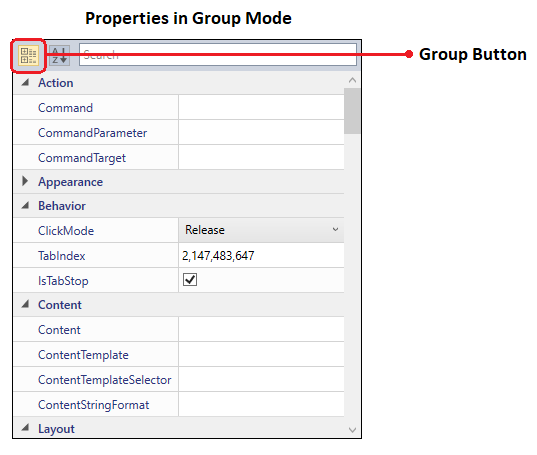
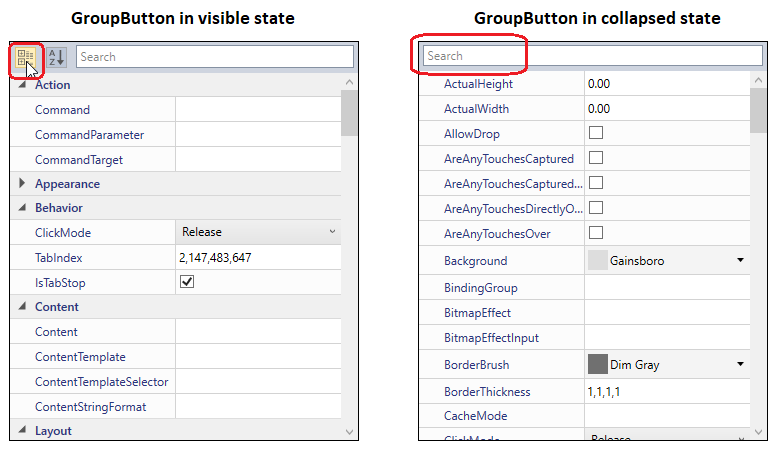

# Grouping in WPF PropertyGrid

We can combine the properties and club them into expandable groups according to our needs by  `Category` attribute and `Display.GroupName` field. By default, the grouped properties are displayed in sorted view. If we want to display the property in grouped view, we can set the [EnableGrouping](https://help.syncfusion.com/cr/wpf/Syncfusion.Windows.PropertyGrid.PropertyGrid.html#Syncfusion_Windows_PropertyGrid_PropertyGrid_EnableGrouping) property to `true`. 

## Grouping using attributes

Properties in the [PropertyGrid](https://www.syncfusion.com/wpf-ui-controls/propertygrid) will be grouped based on the name specified in the [Category](https://docs.microsoft.com/en-us/dotnet/api/system.componentmodel.categoryattribute?view=netframework-4.8) attribute and `GroupName` field of the `Display` attribute. If the property item doesn't have any category name, that property will be grouped under `Misc` category.




using System;
using System.ComponentModel;

public class Employee {
    [Category("Basic Info")]
    public string ID { get; set; }
    [Display(GroupName = "Basic Info")]
    public string Name { get; set; }   
    [Display(GroupName = "Additional Info")]
    public int  Experience { get; set; }     
    [Category()]
    public int Age { get; set; }
    public DateTime DOB { get; set; }
}

public class ViewModel {
    public Object SelectedEmployee { get; set; }
    public ViewModel() {
        SelectedEmployee = new Employee()
        {
            DOB = new DateTime(1995, 01, 31),
            Name = "Johnson",                
            Experience = 5,
            ID = "895",
            Age = 25,
        };
    }
}

 
 




<syncfusion:PropertyGrid SelectedObject="{Binding SelectedEmployee}"  EnableGrouping="True"          
                         x:Name="propertyGrid1">
    <syncfusion:PropertyGrid.DataContext>
        <local:ViewModel></local:ViewModel>
    </syncfusion:PropertyGrid.DataContext>
</syncfusion:PropertyGrid>




PropertyGrid propertyGrid1 = new PropertyGrid();
propertyGrid1.DataContext = new ViewModel();
propertyGrid1.SetBinding(PropertyGrid.SelectedObjectProperty, new Binding("SelectedEmployee"));
propertyGrid1.EnableGrouping = true;

 
 

Here, `ID`, `Name` properties are grouped under the 'Basic Info' category and `Experience` property is grouped under 'Additional Info' category by using `Category` attribute or `Display.GroupName` field.
The `Age` and `DOB` properties do not contain any group name, so they are grouped under the `Misc` category.

N> If we use both the `Category` attribute and `GroupName` field of the `Display` attribute, the `Category` attribute will have higher priority.

## Grouping the Properties at runtime

We can group the properties in the `PropertyGrid` without using the attributes at runtime by handling the [AutoGeneratingPropertyGridItem](https://help.syncfusion.com/cr/wpf/Syncfusion.Windows.PropertyGrid.PropertyGrid.html) event with [AutoGeneratingPropertyGridItemEventArgs.Category](https://help.syncfusion.com/cr/wpf/Syncfusion.Windows.PropertyGrid.AutoGeneratingPropertyGridItemEventArgs.html#Syncfusion_Windows_PropertyGrid_AutoGeneratingPropertyGridItemEventArgs_Category) property. Based on the value of `Category` property, the properties are grouped.




using System;
using System.ComponentModel;
using System.ComponentModel.DataAnnotations;

public class Employee {
    public string Name { get; set; }
    public string ID { get; set; }
    public DateTime DOB { get; set; }
    public int Experience { get; set; }
}

public class ViewModel {
    public object SelectedEmployee { get; set; }

    public ViewModel() {
        SelectedEmployee = new Employee()
        {
            Name = "John",
            ID = "381",
            DOB = new DateTime(1995, 12, 24),
            Experience = 5;
        };
    }
}

 
 




<syncfusion:PropertyGrid AutoGeneratingPropertyGridItem="PropertyGrid1_AutoGeneratingPropertyGridItem"
                         EnableGrouping = "True"
                         SelectedObject="{Binding SelectedEmployee}"
                         x:Name="propertyGrid1">
    <syncfusion:PropertyGrid.DataContext>
        <local:ViewModel></local:ViewModel>
    </syncfusion:PropertyGrid.DataContext>
</syncfusion:PropertyGrid>

 


PropertyGrid propertyGrid1 = new PropertyGrid();
propertyGrid1.DataContext = new ViewModel();
propertyGrid1.SetBinding(PropertyGrid.SelectedObjectProperty, new Binding("SelectedEmployee"));
propertyGrid1.AutoGeneratingPropertyGridItem += PropertyGrid1_AutoGeneratingPropertyGridItem;
propertyGrid1.EnableGrouping= true;

 
 




private void PropertyGrid1_AutoGeneratingPropertyGridItem(object sender, AutoGeneratingPropertyGridItemEventArgs e) {
    //Experience and DOB properties grouped under 'Additional Info' category.
    if (e.DisplayName == "Experience") {
        e.Category = "Additional Info";
    }
    else if (e.DisplayName == "DOB") {
        e.Category = "Additional Info";
    }
    //Name and ID properties grouped under 'Basic Info' category.
    else if (e.DisplayName == "Name") {
        e.Category = "Basic Info";
    }
    else if (e.DisplayName == "ID") {
        e.Category = "Basic Info";
    }
}

 
 

Here, the `DOB` and `Experience` properties are grouped under the `Additional Info` category and `Name` and `ID` properties are grouped under the `Basic Info` category

Click [here](https://github.com/SyncfusionExamples/wpf-property-grid-examples/tree/master/Samples/AutoGeneratingPropertyGridItem%20event) to download the sample that showcases the property grouping support using `AutoGeneratingPropertyGridItem` event.

## Expand or Collapse Category group

We can expand or collapse the grouped properties programmatically by using [ExpandCategory](https://help.syncfusion.com/cr/wpf/Syncfusion.Windows.PropertyGrid.PropertyGrid.html#Syncfusion_Windows_PropertyGrid_PropertyGrid_ExpandCategory_System_String_) and [CollapseCategory](https://help.syncfusion.com/cr/wpf/Syncfusion.Windows.PropertyGrid.PropertyGrid.html#Syncfusion_Windows_PropertyGrid_PropertyGrid_CollapseCategory_System_String_) methods in the `PropertyGrid`. These methods will accept group name as argument.

### Expand Category group 

`ExpandCategory` method will expand the specified category if it is in collapsed view.




//Expand the Identity category group
PropertyGrid propertyGrid = new PropertyGrid();
propertyGrid1.EnableGrouping= true;
propertyGrid1.ExpandCategory("Identity");

 
 

### Collapse Category group 

`CollapseCategory` method will collapse the specified category if it is in expand view.




//Collapse the Identity category group
PropertyGrid propertyGrid = new PropertyGrid();
propertyGrid1.EnableGrouping= true;
propertyGrid1.CollapseCategory("Identity");

 
 

## Show or Hide the Group Button

We can change the view of the properties from sorted view to grouped view by the `GroupButton`. We can show or hide the group button by using the [ButtonPanelVisibility](https://help.syncfusion.com/cr/wpf/Syncfusion.Windows.PropertyGrid.PropertyGrid.html#Syncfusion_Windows_PropertyGrid_PropertyGrid_ButtonPanelVisibility) property. If we want to hide the `GroupButton`, set the `ButtonPanelVisibility` property as `Collapsed`. The Default value of the `ButtonPanelVisibility` property is `Visible`.




<syncfusion:PropertyGrid x:Name="propertyGrid1" Width="350" Height="400"
                         ButtonPanelVisibility="Collapsed">
    <syncfusion:PropertyGrid.SelectedObject>
        <Button></Button>
    </syncfusion:PropertyGrid.SelectedObject>
</syncfusion:PropertyGrid>




PropertyGrid propertyGrid = new PropertyGrid();
propertyGrid.Width = 350;
propertyGrid.Height = 400;propertyGrid.SelectedObject = new Button();
propertyGrid1.ButtonPanelVisibility = Visibility.Collapsed;




Click [here](https://github.com/SyncfusionExamples/wpf-property-grid-examples/tree/master/Samples/Grouping-Sorting-Ordering) to download the sample that showcases the property grouping support.
