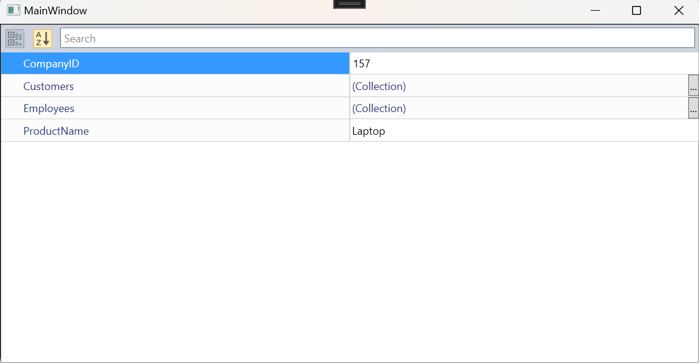
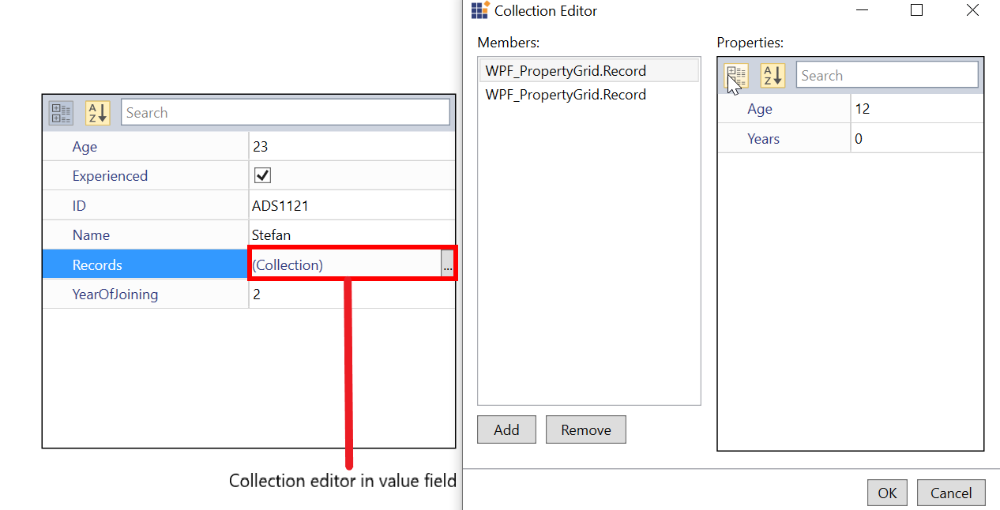

# Keyboard Navigation in WPF PropertyGrid

In this section, we will see available keyboard shortcuts and how to override the default navigation.

## Keyboard Navigation between property items

The following table explains how the navigation performed between properties,

<table>
<th> S.No </th>
<th> Key </th>
<th> Description </th>
<tr>
<td>1</td>
<td>Up</td>
<td>Selection will be moved from current property to previous property.</td>
</tr>
<tr>
<td>2</td>
<td>Down</td>
<td>Selection will be moved from current property to next property.</td>
</tr>
<tr>
<td>3</td>
<td>Home</td>
<td>Selection will be moved from current property to first property of the PropertyGrid.</td>
</tr>
<tr>
<td>4</td>
<td>End</td>
<td>Selection will be moved from current property to last property of the PropertyGrid.</td>
</tr>
<tr>
<td>5</td>
<td>Left</td>
<td>Selection will be moved from current property to previous property. When the property {{'**EnableGrouping**'| markdownify }} is 'true' and the Header of the Category group is selected, and the group is expanded, then the Category group will be collapsed, and collapsed category group header remains selected.</td>
</tr>
<tr>
<td>6</td>
<td>Right</td>
<td>Selection will be moved from current property to next property. When the property {{'**EnableGrouping**'| markdownify }} is true and the Header of the Category group is selected and the group is not expanded, then the Category group will be expanded, and expanded category group header remains selected.</td>
</tr>
<tr>
<td>7</td>
<td>Tab</td>
<td>When the PropertyName field is focused then the focus will be moved to value field and for next {{'**Tab**'| markdownify }} key press, focus will move to next property Name field from current property Value field.
  
 

 
 
</td>
</tr>
<tr>
<td>8</td>
<td>Shift + Tab</td>
<td>Selection will move from current Property item to previous property item. It also allows to edit the value in the editor field on other key presses.
  
 

 
 
</td>
</tr>
<tr>
<td>8</td>
<td>Esc</td>
<td>If the property’s value field is focused, then the focus has been moved to property’s name field.</td>
</tr>
<tr>
<td>9</td>
<td>Enter</td>
<td>If the property’s value field containing the `Collection Editor` is focused, then {{'**CollectionEditor**'| markdownify }} dialog will be opened.</td>
</tr>
</table>

## Handling focus of the editors

By default, `PropertyGrid` will handle the keyboard navigation, so pressing keydown(Up and Down) will move the focus to next/previous editor from current editor. For all built-in editors, moving focus to next editor will be handled by `PropertyGrid`. For custom editors, property navigation (focus) will not happen if custom editor handles up or down key. To override keyboard navigation for custom editors, override [ShouldPropertyGridTryToHandleKeyDown](https://help.syncfusion.com/cr/wpf/Syncfusion.Windows.PropertyGrid.BaseTypeEditor.html#Syncfusion_Windows_PropertyGrid_BaseTypeEditor_ShouldPropertyGridTryToHandleKeyDown_System_Windows_Input_Key_) method from `BaseTypeEditor`.

For example, if you use `ComboBox` as custom editor, up and down key will be handled by it. So, property navigation will not happen. You can override `ShouldPropertyGridTryToHandleKeyDown` and return `true`, to allow property grid control to handle the key down events. When it returns `false`, the editor will handles the key down event.




//Custom combobox editor
public class ComboBoxEditor : BaseTypeEditor {
    ComboBox enumCombo;
    public override void Attach(PropertyViewItem property, PropertyItem info) {
        var binding = base.CreatePropertyInfoBinding(info, enumCombo);
        BindingOperations.SetBinding(enumCombo, ComboBox.SelectedItemProperty, binding);
    }

    public override object Create(PropertyInfo PropertyInfo) {
        return this.CreateEditor(PropertyInfo.PropertyType);
    }

    public override object Create(PropertyDescriptor PropertyDescriptor) {
        return this.CreateEditor(PropertyDescriptor.PropertyType);
    }

    public override void Detach(PropertyViewItem property) {
        if (enumCombo != null) {
            BindingOperations.ClearAllBindings(enumCombo);
            BindingOperations.ClearBinding(enumCombo, ComboBox.SelectedItemProperty);
        }
        enumCombo.ItemsSource = null;
        enumCombo.Items.Clear();
        enumCombo = null;
    }

    public override bool ShouldPropertyGridTryToHandleKeyDown(Key key) {
        if (key == Key.Up || key == Key.Down) {
            return false;
        }

        return true;
    }

    /// 

    /// Creates and initializes a new instance of the ComboBox editor.
    /// 

    /// <param name="propertyType">The property type</param>
    /// <returns>The EnumComboEditor</returns>
    private ComboBox CreateEditor(Type propertyType)
    {
        enumCombo = new ComboBox() {
            ItemsSource = EnumHelper.GetValues(propertyType),
            BorderThickness = new Thickness(0)
        };
        return enumCombo;
    }
}







//Person.cs
[Editor("Gender", typeof(ComboBoxEditor))]
public class Person {
    public Person() {
        FirstName = "Carl";
        LastName = "Johnson";
        Age = 30;
        Mobile = 91983467382;
        Email = "carljohnson@gta.com";
        ID = "0005A";
        DOB = new DateTime(1987, 10, 16);
        Gender = Gender.Male;
    }
    public Gender Gender { get; set; }
    public string Email { get; set; }
    public string FirstName { get; set; }
    public string LastName { get; set; }
    public string ID { get; set; }
    public DateTime DOB { get; set; }
    public long Mobile { get; set; }
    public int Age { get; set; }
}

public enum Gender {
    Male,
    Female
}


 



<syncfusion:PropertyGrid DefaultPropertyPath="Age"
                         SelectedPropertyItem="{Binding SelectedPropertyItem, Mode=TwoWay}">
    <syncfusion:PropertyGrid.SelectedObject>
        <local:Person />
    </syncfusion:PropertyGrid.SelectedObject>
</syncfusion:PropertyGrid>


 

N> View [Sample](https://github.com/SyncfusionExamples/wpf-property-grid-examples/tree/master/Samples/CustomEditor/How-to-prevent-moving-focus-to-next-editor-propertygrid) in GitHub.

