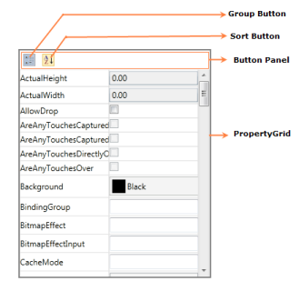

# WPF PropertyGrid Overview

The [PropertyGrid](https://www.syncfusion.com/wpf-ui-controls/propertygrid) control provides an interface for browsing and editing an object's properties with Blendability support, custom editors, category editors, sorting and grouping supports. The WPF `PropertyGrid` control provides similar features to the Windows Forms `PropertyGrid` control.

## Control structure

## Features

* Binding with any objects — Denotes the object that properties displayed in the `PropertyGrid`.
* Custom Editor — `CustomEditor` support enables you to set custom value editors for particular properties, instead of default editors.
* Category Editor — `CategoryEditor` support allows you to set the related properties (one or more properties) to be categorized.
* Grouping — `PropertyGrid` groups the properties based on the property's `Category` attribute.
* Sorting — `PropertyGrid` supports both `ascending` and `descending` order sorting.
* Skin - `PropertyGrid` provides a variety of skin themes.
* Blendability — `PropertyGrid` control can be easily customized in a blend.
* Code sharing — Provides code sharing with `Silverlight`.