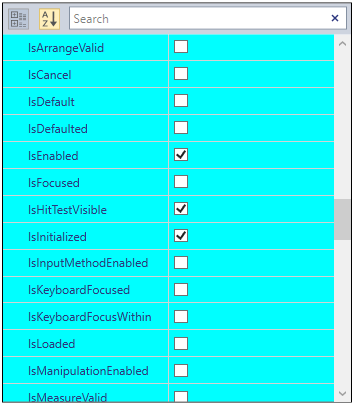
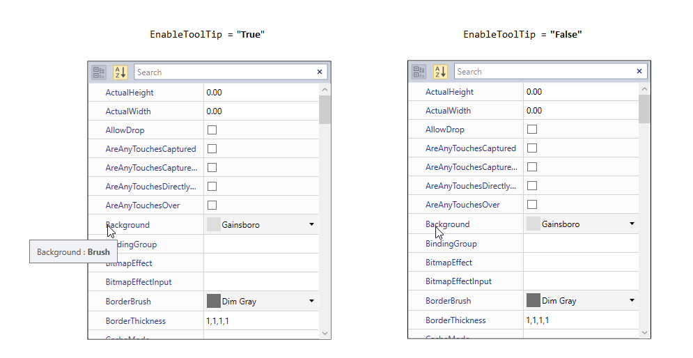

# Appearance in WPF PropertyGrid

This section deals with the appearance of [PropertyGrid](https://www.syncfusion.com/wpf-ui-controls/propertygrid) control and contains the following topics.

## Setting the Foreground

The User can change the foreground color for properties of `PropertyGrid's` [SelectedObject](https://help.syncfusion.com/cr/wpf/Syncfusion.PropertyGrid.Wpf~Syncfusion.Windows.PropertyGrid.PropertyGrid~SelectedObject.html) by setting the `Foreground` property. The default color value of `Foreground` property is `Blue`.




<syncfusion:PropertyGrid x:Name="propertyGrid" Width="350" Height="400"
                         Foreground="Red">
            <syncfusion:PropertyGrid.SelectedObject>
                <Button></Button>
            </syncfusion:PropertyGrid.SelectedObject>
</syncfusion:PropertyGrid>




PropertyGrid propertyGrid = new PropertyGrid();
propertyGrid.Width = 350;
propertyGrid.Height = 400;
propertyGrid.SelectedObject = new Button();
propertyGrid.Foreground = Brushes.Red;




## Setting the Background

The Users can change the background color for the properties of `PropertyGrid's` `SelectedObject` by setting the [ViewBackgroundColor](https://help.syncfusion.com/cr/wpf/Syncfusion.PropertyGrid.Wpf~Syncfusion.Windows.PropertyGrid.PropertyGrid~ViewBackgroundColor.html) property. The default color value of `ViewBackgroundColor` is `White`.




<syncfusion:PropertyGrid x:Name="propertyGrid" Width="350" Height="400"
                         ViewBackgroundColor="Cyan">
            <syncfusion:PropertyGrid.SelectedObject>
                <Button></Button>
            </syncfusion:PropertyGrid.SelectedObject>
</syncfusion:PropertyGrid>




PropertyGrid propertyGrid = new PropertyGrid();
propertyGrid.Width = 350;
propertyGrid.Height = 400;
propertyGrid.SelectedObject = new Button();
propertyGrid.ViewBackgroundColor = Brushes.Cyan;




### Group Header's foreground and background

You can change the foreground and background of the Category Header by setting the [LineColor](https://help.syncfusion.com/cr/wpf/Syncfusion.PropertyGrid.Wpf~Syncfusion.Windows.PropertyGrid.PropertyGrid~LineColor.html) property and [CategoryForeground](https://help.syncfusion.com/cr/wpf/Syncfusion.PropertyGrid.Wpf~Syncfusion.Windows.PropertyGrid.PropertyGrid~CategoryForeground.html) property. The `LineColor` and `CategoryForeground` values applied to the foreground and background of the Category Header only on grouping state.




<syncfusion:PropertyGrid x:Name="propertyGrid"  Width="350" 
                         LineColor="Cyan" CategoryForeground="Red">
    <syncfusion:PropertyGrid.SelectedObject>
        <Button></Button>
    </syncfusion:PropertyGrid.SelectedObject>
</syncfusion:PropertyGrid>




PropertyGrid propertyGrid = new PropertyGrid();
propertyGrid.Width = 350;
propertyGrid.Height = 400;
propertyGrid.SelectedObject = new Button();
propertyGrid.LineColor = Brushes.Cyan;
propertyGrid.CategoryForeground = Brushes.Red;




## Setting ToolTip

ToolTips are used to show the information about the segment, when you mouse over on the segment. You can show or hide the tooltip for the properties in the `PropertyGrid` by handling [EnableToolTip](https://help.syncfusion.com/cr/wpf/Syncfusion.PropertyGrid.Wpf~Syncfusion.Windows.PropertyGrid.PropertyGrid~EnableToolTip.html) Property. The default value of `EnableToolTip` property is `true`.




<syncfusion:PropertyGrid x:Name="propertyGrid"  Width="350"
                         EnableToolTip="False">
    <syncfusion:PropertyGrid.SelectedObject>
        <Button></Button>
    </syncfusion:PropertyGrid.SelectedObject>
</syncfusion:PropertyGrid>




PropertyGrid propertyGrid = new PropertyGrid();
propertyGrid.Width = 350;
propertyGrid.Height = 400;
propertyGrid.SelectedObject = new Button();
propertyGrid.EnableToolTip = false;




## Theme

The appearance of the `PropertyGrid` control can be customized by using the [SfSkinManager.SetVisualStyle](https://help.syncfusion.com/cr/cref_files/wpf/Syncfusion.SfSkinmanager.Wpf~Syncfusion.SfSkinmanager.SfSkinmanager~SetVisualStyle.html) method. The following are the various built-in visual styles for `PropertyGrid` control.

* Blend
* Default
* Lime
* Metro
* Office2010Black
* Office2010Blue
* Office2010Silver
* Office2013DarkGray
* Office2013LightGray
* Office2013White
* Office2016Colorful
* Office2016DarkGray
* Office2016White
* Office365
* Saffron
* SystemTheme
* VisualStudio2013
* VisualStudio2015

For example, the `Blend` style applied to the `PropertyGrid` as shown in the following example code:




// Namespace for the SfSkinManager.

using Syncfusion.SfSkinManager;







PropertyGrid propertyGrid = new PropertyGrid();
propertyGrid.Width = 350;
propertyGrid.Height = 400;
propertyGrid.SelectedObject = new Button();
SfSkinManager.SetVisualStyle(propertyGrid, VisualStyles.Blend);




