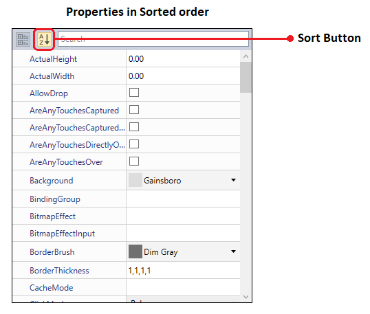
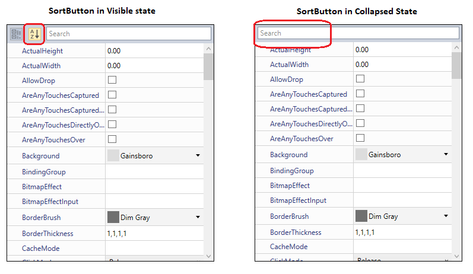

# Sorting in WPF PropertyGrid

You can sort the properties according to your needs. You can change the sorting order of the properties by [SortDirection](https://help.syncfusion.com/cr/wpf/Syncfusion.Windows.PropertyGrid.PropertyGrid.html#Syncfusion_Windows_PropertyGrid_PropertyGrid_SortDirection) property. Values of `SortDirection` property is `Ascending`, `Descending` and `Null`. Based on the `SortDirection` property,  the property item's nested properties also sorted. The Default value of the `SortDirection` property is `Ascending` order.

## Sorting the Properties

Properties in the [PropertyGrid](https://www.syncfusion.com/wpf-ui-controls/propertygrid) are sorted by using the `SortDirection` property. They sorted based only on the name of the property, not by the display name of the property. If the properties are in the grouped view, then the groups are sorted based on the group name either `Ascending` or `Descending` order. 




using System;
using System.ComponentModel;
public class ViewModel {
    public Object SelectedEmployee { get; set; }
    public ViewModel() {
        SelectedEmployee = new Employee();
    }
}

public class Employee
{
    [Category("Identity")]
    public string Name { get; set; }
    [Category("Contact Details")]
    public string Email { get; set; }
    [Category("Account Details")]
    public string Bank { get; set; }     
    [Category("Identity")]
    public string ID { get; set; }
    [Category("Account Details")]
    public string AccountNumber { get; set; }
}
        

 




<syncfusion:PropertyGrid SelectedObject="{Binding SelectedEmployee}"   
                         SortDirection="Ascending"
                         x:Name="propertyGrid1">
    <syncfusion:PropertyGrid.DataContext>
        <local:ViewModel></local:ViewModel>
    </syncfusion:PropertyGrid.DataContext>
</syncfusion:PropertyGrid>

 


PropertyGrid propertyGrid1 = new PropertyGrid();
propertyGrid1.DataContext = new ViewModel();
propertyGrid1.SetBinding(PropertyGrid.SelectedObjectProperty, new Binding("SelectedEmployee"));
propertyGrid1.SortDirection = ListSortDirection.Ascending;

 
 

**SortDirection= Ascending**

**SortDirection= Descending**

## Disable the Sorting

We can disable the sorting by setting the `SortDirection` property as `null`. When sorting is disabled, the properties are arranged based on the value of the `Order` attributes or on
 the order they added into the [SelectedObject](https://help.syncfusion.com/cr/wpf/Syncfusion.Windows.PropertyGrid.PropertyItem.html#Syncfusion_Windows_PropertyGrid_PropertyItem_SelectedObject).
 



using System;
using System.ComponentModel;

public class Employee {
    [Category("Identity")]
    public String Gender { get; set; }
    [Category("Address")]
    public String Country { get; set; }
    [Category("Contact Details")]
    public string Email { get; set; }
    [Category("Identity")]
    public string FirstName { get; set; }
    public string Designation { get; set; }
    [Category("Identity")]
    public string LastName { get; set; }
    public string ID { get; set; }
    public DateTime DOB { get; set; }
    [Category("Contact Details")]
    public string Mobile { get; set; }
    public int Age { get; set; }
}

public class ViewModel {
    public Object SelectedEmployee { get; set; }
    public ViewModel() {
        SelectedEmployee = new Employee() 
        { 
            FirstName = "Carl",
            LastName = "johnson", 
            Age = 30,
            Country = "United States", 
            Designation = "Team Lead",
            DOB = new DateTime(2000, 12, 01),
            Email = "carljanson@gta.com", 
            Gender = "Male", 
            ID = "SF001", 
            Mobile = "1234567890"
        };
    }
}

 





<syncfusion:PropertyGrid SelectedObject="{Binding SelectedEmployee}"
                         SortDirection="{x:Null}" x:Name="propertyGrid1" >
    <syncfusion:PropertyGrid.DataContext>
        <local:ViewModel></local:ViewModel>
    </syncfusion:PropertyGrid.DataContext>
</syncfusion:PropertyGrid>

 


PropertyGrid propertyGrid1 = new PropertyGrid();
propertyGrid1.DataContext = new ViewModel();
propertyGrid1.SetBinding(PropertyGrid.SelectedObjectProperty, new Binding("SelectedEmployee"));
propertyGrid1.SortDirection = null;

 
 

Here, the properties are arranged from the `Gender` property and end with `Age` property by the order in which they were added to the class. 

## Show or Hide the Sort Button

We can change the view of the properties from grouped view to sort view by the `SortButton`. We can show or hide the sort button by using the [ButtonPanelVisibility](https://help.syncfusion.com/cr/wpf/Syncfusion.Windows.PropertyGrid.PropertyGrid.html#Syncfusion_Windows_PropertyGrid_PropertyGrid_ButtonPanelVisibility) property. If we want to hide the `SortButton`, set the `ButtonPanelVisibility` property as `Collapsed`. The Default value of the `ButtonPanelVisibility` property is `Visible`.




<syncfusion:PropertyGrid x:Name="propertyGrid1" Width="350" Height="400"
                         ButtonPanelVisibility="Collapsed">
    <syncfusion:PropertyGrid.SelectedObject>
        <Button></Button>
    </syncfusion:PropertyGrid.SelectedObject>
</syncfusion:PropertyGrid>




PropertyGrid propertyGrid = new PropertyGrid();
propertyGrid.Width = 350;
propertyGrid.Height = 400;
propertyGrid.SelectedObject = new Button();
propertyGrid1.ButtonPanelVisibility = Visibility.Collapsed;




Click [here](https://github.com/SyncfusionExamples/wpf-property-grid-examples/tree/master/Samples/Grouping-Sorting-Ordering) to download the sample that showcases the property sorting support using the attributes.
