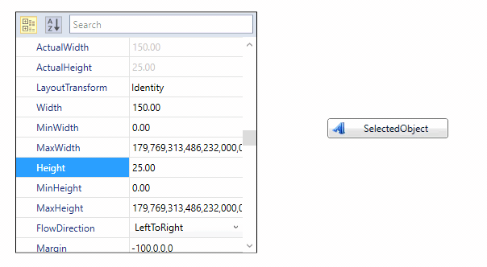
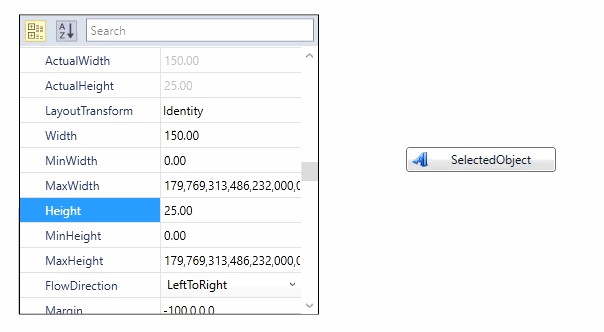

# Update value on lost focus in PropertyGrid

We can update the value of property item either immediately when the editor property changes or during the editor's lost focus using [UpdateSourceMode](https://help.syncfusion.com/cr/wpf/Syncfusion.Windows.PropertyGrid.PropertyGrid.html#Syncfusion_Windows_PropertyGrid_PropertyGrid_UpdateSourceMode) property of PropertyGrid. Values of `UpdateSourceMode` are `Immediately`, `ReturnOrLostFocus`. The default value is `Immediately`.

## Binding modes 

 If the property `UpdateSourceMode` is `Immediately`, value of property item will be updated immediately when the editor property changes. Also, if the property `UpdateSourceMode` is `ReturnOrLostFocus`, value of property item will be updated only when editor lost its focus or when enter key is pressed.





<Grid>
    <Grid.ColumnDefinitions>
        <ColumnDefinition Width="0.6*"/>
        <ColumnDefinition Width="0.4*"/>
    </Grid.ColumnDefinitions>

    <syncfusion:PropertyGrid Margin="10" 
                             x:Name="propertyGrid"
                             UpdateSourceMode="ReturnOrLostFocus" 
                             SelectedObject="{Binding ElementName=button}" />
    
    <syncfusion:ButtonAdv  Name="button" 
                           Margin="10" 
                           Height="25" 
                           Width="200" 
                           Label="SelectedObject"
                           HorizontalAlignment="Center" 
                           VerticalAlignment="Center"
                           Grid.Column="1" 
                           syncfusion:SkinStorage.VisualStyle="Default" />
</Grid>





propertyGrid.UpdateSourceMode = UpdateSourceMode.ReturnOrLostFocus;





The SelectedObject value changes immediately when the target element property changes, as shown below:

The SelectedObject value changes only when the target element lost its focus or when enter key is pressed, as shown below.

