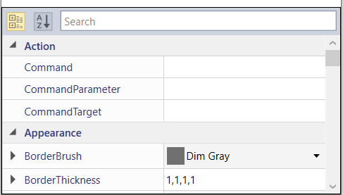

# Virtualization in WPF PropertyGrid

You can reduce the loading time of `PropertyGrid` items regardless of items count by UI Virtualization support which is enabled by default in `PropertyGrid`. It allows the users to load large sets of data without affecting loading or scrolling performance.




PropertyGrid propertyGrid = new PropertyGrid();
propertyGrid.IsVirtualizing = true;
propertyGrid.EnableGrouping = true;
propertyGrid.PropertyExpandMode = PropertyExpandModes.NestedMode;
propertyGrid.SelectedObject = new Button();




<syncfusion:PropertyGrid x:Name="propertyGrid" IsVirtualizing="True" PropertyExpandMode="NestedMode" EnableGrouping="True">
    <syncfusion:PropertyGrid.SelectedObject>
        <Button />
    </syncfusion:PropertyGrid.SelectedObject>
</syncfusion:PropertyGrid>




N> When Virtualization is enabled, you can only load a set of items in view at a time.  
