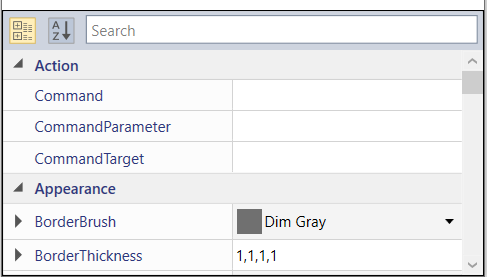

# Virtualization in WPF PropertyGrid

UI virtualization improves the performance of the WPF PropertyGrid by loading and rendering only the property items that are within the viewport. This allows the `PropertyGrid` control to load faster, and virtualization is enabled by default.




PropertyGrid propertyGrid = new PropertyGrid();
propertyGrid.IsVirtualizing = true;
propertyGrid.EnableGrouping = true;
propertyGrid.PropertyExpandMode = PropertyExpandModes.NestedMode;
propertyGrid.SelectedObject = new Button();




<syncfusion:PropertyGrid x:Name="propertyGrid" IsVirtualizing="True" PropertyExpandMode="NestedMode" EnableGrouping="True">
    <syncfusion:PropertyGrid.SelectedObject>
        <Button />
    </syncfusion:PropertyGrid.SelectedObject>
</syncfusion:PropertyGrid>




N> When Virtualization is enabled, only properties that are in viewport will be in loaded state.  
